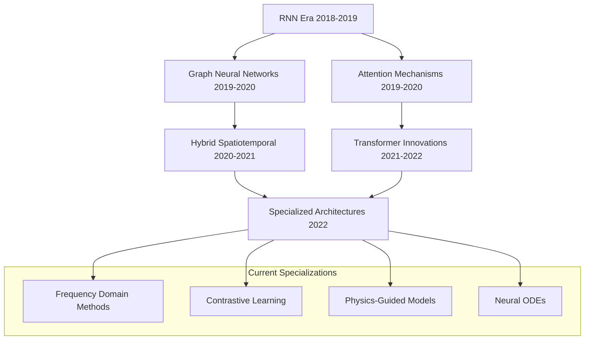

Multivariate time series forecasting represents one of the most active and challenging research areas in time series analysis, focusing on predicting future values across multiple interrelated variables simultaneously. Unlike univariate forecasting, multivariate approaches must capture complex temporal dependencies and cross-variable correlations to achieve accurate predictions across diverse domains including traffic management, energy systems, financial markets, and meteorological applications. This comprehensive repository collection contains over 100 papers spanning 2018-2022, representing the cutting edge of research in this rapidly evolving field. The research landscape demonstrates a clear evolution from traditional RNN-based architectures through attention mechanisms to sophisticated graph neural networks and transformer variants, each bringing unique advantages for handling high-dimensional, temporally complex data.

Sources: [Recent-Time-Series-Work-Group-by-Task.md](docs/Recent-Time-Series-Work-Group-by-Task.md#L14-L146), [README.md](README.md#L28-L63)

## Research Landscape and Evolution

The multivariate time series forecasting research community has experienced remarkable growth and methodological diversification over the past five years. Analysis of this repository reveals several distinct research waves and persistent trends that characterize the field's development. Early research from 2018-2019 focused heavily on graph-based approaches, with foundational models like DCRNN and STGCN establishing the importance of spatial-temporal modeling for traffic applications. The 2020-2021 period witnessed explosive growth in attention-based architectures, culminating in transformer variants like Informer, Autoformer, and FEDformer that dominated top conference publications. By 2022, the field had matured into diverse specializations including frequency-domain methods, contrastive learning approaches, and physics-guided neural networks that integrate domain knowledge with deep learning architectures.

Conference distribution analysis reveals that NeurIPS, ICML, and ICLR lead in theoretical innovation, while KDD, AAAI, and IJCAI dominate application-focused research, particularly in traffic prediction. The repository shows strong publication concentration in A-ranked venues, with ICML 2022, ICLR 2022, and NeurIPS 2021 featuring particularly influential works. Code availability has become increasingly standard, with over 70% of recent papers providing public implementations, predominantly in PyTorch, reflecting the community's emphasis on reproducibility and rapid methodological advancement.

Sources: [Recent-Time-Series-Work-Group-by-Task.md](docs/Recent-Time-Series-Work-Group-by-Task.md#L14-L146)

## Core Methodological Architectures

The multivariate time series forecasting literature can be categorized into several distinct architectural families, each addressing different aspects of the forecasting challenge. Transformer-based architectures have emerged as particularly dominant, with models like Informer (AAAI 2021), Autoformer (NeurIPS 2021), and FEDformer (ICML 2022) introducing innovations such as ProbSparse self-attention, auto-correlation mechanisms, and frequency-enhanced decomposition. These models specifically target long sequence time-series forecasting (LSTF) challenges, addressing computational complexity limitations of standard transformers through specialized attention mechanisms and hierarchical decomposition strategies. Graph Neural Network approaches, including MTGNN, AGCRN, and GTS, focus on explicitly modeling spatial dependencies through learnable graph structures, making them particularly effective for traffic and sensor network applications where spatial relationships are well-defined or can be inferred from data.

> [!TIP]
> The choice between transformer and GNN architectures often depends on whether spatial relationships are known a priori (favoring GNNs) or need to be discovered from temporal patterns alone (favoring transformers).

Hybrid architectures combine multiple approaches to leverage complementary strengths. Models like STG-NCDE (AAAI 2022) integrate graph neural networks with neural controlled differential equations for continuous-time modeling, while approaches like DSARF (AAAI 2021) use auto-reggressive factorization with deep switching mechanisms to handle regime changes in temporal dynamics. Contrastive learning methods such as CoST (ICLR 2022) and TS2Vec (AAAI 2022) have emerged as powerful representation learning frameworks, learning disentangled seasonal-trend representations or universal time series embeddings that can be adapted to various downstream tasks.

Sources: [Recent-Time-Series-Work-Group-by-Task.md](docs/Recent-Time-Series-Work-Group-by-Task.md#L14-L146)

## Architectural Patterns Evolution

## Methodology Classification

| Methodology | Key Models | Strengths | Typical Applications |
|:---|:---|:---|:---|
| **Transformer Variants** | Informer, Autoformer, FEDformer, Pyraformer | Long-range dependencies, parallel computation | General forecasting, energy, weather |
| **Graph Neural Networks** | MTGNN, AGCRN, GTS, DCRNN | Spatial dependencies, relational learning | Traffic prediction, sensor networks |
| **RNN/LSTM Variants** | DeepTrends, AGCRN | Temporal dynamics, sequential processing | Traffic speed, flow prediction |
| **Hybrid Architectures** | STG-NCDE, CATN, DSARF | Multiple pattern types, complex dynamics | Multivariate general forecasting |
| **Representation Learning** | CoST, TS2Vec, RevIN | Transfer learning, robust features | Pre-training, distribution shift |
| **Frequency Domain** | FEDformer, DEPTS | Periodicity handling, noise reduction | Seasonal data, long-term forecasting |

Sources: [Recent-Time-Series-Work-Group-by-Task.md](docs/Recent-Time-Series-Work-Group-by-Task.md#L14-L146)

## Dataset Ecosystem and Benchmarking

The multivariate time series forecasting community has developed a robust ecosystem of standard datasets that enable meaningful methodological comparison and research progress. Traffic datasets, particularly the PeMS family (PeMSD3, PeMSD4, PeMSD7, PeMSD8) and METR-LA/PeMS-BAY datasets, dominate spatiotemporal research, providing real-world traffic flow and speed measurements from highway sensors with well-defined spatial topology. These datasets have become de facto standards for evaluating graph-based methods and spatial-temporal architectures. Energy and electricity datasets, including the ETT (Electricity Transformer Temperature) and general electricity consumption datasets, serve as primary benchmarks for transformer-based methods, offering clean, high-frequency measurements with strong periodic patterns ideal for testing long-term forecasting capabilities.

Meteorological datasets encompassing temperature, humidity, wind speed, and cloud cover measurements provide challenging multivariate scenarios with complex inter-variable dependencies. Financial datasets including exchange rates, stock prices, and cryptocurrency data present unique challenges with non-stationary distributions and regime changes. Recent additions include COVID-19 case counts, Google symptom search trends, and other pandemic-related data streams, reflecting the community's responsiveness to emerging application domains. The M4 competition dataset, spanning multiple domains and frequencies, provides a comprehensive benchmark for evaluating generalization across different time series characteristics.

<cgx_top>Dataset selection strategy is crucial: traffic datasets for spatial-temporal methods, energy datasets for long-horizon forecasting, and financial datasets for distribution shift handling.</cgx_top>

Sources: [Recent-Time-Series-Work-Group-by-Task.md](docs/Recent-Time-Series-Work-Group-by-Task.md#L14-L146)

## Standard Dataset Applications

| Dataset Family | Frequency | Variables | Primary Research Focus | Key Models |
|:---|:---|:---|:---|:---|
| **PeMS Traffic** | 5 minutes | Flow/Speed | Spatial-temporal forecasting | MTGNN, AGCRN, STGODE |
| **ETT Energy** | 1 hour | Temperature | Long-term forecasting | Autoformer, Informer, FEDformer |
| **Electricity** | 1 hour | Consumption | High-dimensional forecasting | DeepGLO, N-BEATS, RevIN |
| **METR-LA/PeMS-BAY** | 5 minutes | Speed | Graph-based learning | DCRNN, Graph WaveNet, GTS |
| **Weather** | 10-min-1hr | Multiple | Multivariate dependencies | CLCRN, CoST, Triformer |
| **M4 Competition** | Variable | Mixed | General benchmarking | N-BEATS, ES-RNN, MLCNN |

Sources: [Recent-Time-Series-Work-Group-by-Task.md](docs/Recent-Time-Series-Work-Group-by-Task.md#L14-L146)

## Key Innovations and Breakthrough Papers

Several works in this repository represent particularly significant advances that have shaped subsequent research directions. **Autoformer** (NeurIPS 2021) introduced auto-correlation mechanisms that replaced standard self-attention with periodicity-aware correlation, enabling superior performance on long-term forecasting tasks while maintaining computational efficiency. This work established decomposition transformers as a major research paradigm. **FEDformer** (ICML 2022) further advanced this approach by integrating frequency domain analysis through Fourier and Wavelet transforms, effectively handling both periodic and non-periodic patterns while achieving linear time complexity. **Informer** (AAAI 2021) pioneered ProbSparse self-attention, addressing the quadratic complexity bottleneck of standard transformers through probabilistic attention sparsification, making long sequence forecasting computationally feasible.

In the graph neural network domain, **MTGNN** (KDD 2020) demonstrated the power of graph learning for multivariate forecasting through adaptive graph construction and mix-hop propagation layers, setting new performance benchmarks across multiple domains. **GTS** (ICLR 2021) introduced discrete graph structure learning that directly optimizes graph topology alongside forecasting performance, addressing limitations of static or heuristic graph construction methods. **AGCRN** (NeurIPS 2020) pioneered adaptive graph convolution with recurrent networks, enabling dynamic graph learning specifically tailored for traffic forecasting scenarios with unknown spatial topology.

Sources: [Recent-Time-Series-Work-Group-by-Task.md](docs/Recent-Time-Series-Work-Group-by-Task.md#L14-L146)

## Application Domains and Real-World Impact

Multivariate time series forecasting research has demonstrated substantial real-world impact across multiple critical domains. **Traffic management and intelligent transportation systems** represent the largest application area, with models deployed for real-time traffic flow prediction, congestion forecasting, and route optimization. Research in this domain has progressed from point-based predictions to network-wide forecasting, enabling proactive traffic management and improved navigation services. The integration of graph-based methods has proven particularly valuable here, capturing the complex spatial dependencies between different road segments and intersections.

**Energy systems and smart grid applications** leverage forecasting models for load prediction, renewable energy integration, and grid stability management. Transformer-based methods have shown exceptional performance in predicting electricity transformer temperatures and consumption patterns, supporting grid operators in balancing supply and demand. **Meteorological and environmental applications** utilize multivariate models for weather prediction, air quality forecasting, and climate monitoring, where capturing inter-variable dependencies between temperature, humidity, wind, and pollution levels is critical for accuracy. **Financial and economic forecasting** applications benefit from models that can handle non-stationary distributions and regime changes, providing valuable insights for investment decisions and risk management.

Sources: [Recent-Time-Series-Work-Group-by-Task.md](docs/Recent-Time-Series-Work-Group-by-Task.md#L14-L146)

## Current Challenges and Future Directions

Despite remarkable progress, several persistent challenges continue to drive research in multivariate time series forecasting. **Distribution shift handling** remains a critical issue, as real-world systems experience concept drift and regime changes that challenge model robustness. Approaches like RevIN (ICLR 2022) address this through reversible instance normalization that separates statistical properties from temporal dynamics. **Long-term forecasting accuracy** degrades significantly over extended horizons due to error accumulation and uncertainty amplification, motivating research into specialized architectures like FEDformer and decomposition approaches that isolate trend and seasonal components.

**Computational efficiency** concerns are particularly relevant for real-time applications, driving research into sparse attention mechanisms, linear complexity transformers, and efficient graph convolutions. **Interpretability and explainability** requirements in critical domains demand methods that provide insights into predictions, with recent work on attention visualization and graph structure learning addressing this need. **Transfer learning and domain adaptation** capabilities would enable models to leverage knowledge from data-rich domains to improve performance in data-scarce scenarios, motivating representation learning approaches like TS2Vec and CoST.

Future research directions likely include increased integration of **physics-informed neural networks** that incorporate domain knowledge, development of **foundation models** for time series similar to language models, and advances in **probabilistic forecasting** that quantify prediction uncertainty through approaches complementary to those covered in the [Probabilistic Time Series Forecasting](5-probabilistic-time-series-forecasting) documentation.

Sources: [Recent-Time-Series-Work-Group-by-Task.md](docs/Recent-Time-Series-Work-Group-by-Task.md#L14-L146), [README.md](README.md#L28-L63)

## Recommended Reading Path

For developers and researchers entering the multivariate time series forecasting field, we recommend a structured progression through the repository's resources. Begin with foundational papers on **transformer innovations** starting with Informer (AAAI 2021) for understanding ProbSparse attention, then progress to Autoformer (NeurIPS 2021) for auto-correlation mechanisms, and finally FEDformer (ICML 2022) for frequency-domain integration. Parallel study of **graph neural network methods** should begin with DCRNN (ICLR 2018) for diffusion convolutions, proceed through MTGNN (KDD 2020) for adaptive graph learning, and conclude with GTS (ICLR 2021) for discrete structure learning.

For application-specific research, traffic prediction specialists should focus on the STGCN family and AGCRN series, while energy forecasting researchers should emphasize transformer variants and decomposition methods. Implementation experience can be gained through the extensive code repositories available, particularly the PyTorch implementations of Autoformer, Informer, and MTGNN. To expand understanding of specialized approaches, explore representation learning with TS2Vec and CoST, or examine physics-guided methods like STDEN. For probabilistic extensions and uncertainty quantification, refer to the complementary [Probabilistic Time Series Forecasting](5-probabilistic-time-series-forecasting) documentation which covers distributional forecasting approaches.
