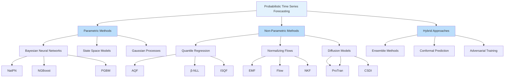

Probabilistic Time Series Forecasting represents a fundamental shift from traditional point predictions to distributional forecasting, providing comprehensive uncertainty quantification essential for critical decision-making scenarios. This approach moves beyond single-value estimates to generate full predictive distributions, enabling risk-aware planning in domains ranging from healthcare and finance to energy management and transportation systems. Unlike deterministic forecasting methods that provide only expected values, probabilistic models capture the complete spectrum of possible futures, quantifying confidence intervals, tail risks, and scenario probabilities. This documentation page consolidates cutting-edge research on probabilistic time series forecasting methods, offering intermediate developers a comprehensive resource for understanding state-of-the-art techniques, their applications, and available implementations.

Sources: [Recent-Time-Series-Work-Group-by-Task.md](/docs/Recent-Time-Series-Work-Group-by-Task.md#L146-L190)

## Core Concepts and Methodological Approaches

Probabilistic forecasting methodologies encompass diverse theoretical frameworks and computational approaches, each addressing uncertainty quantification from different perspectives. The modern landscape includes autoregressive quantile flows, Bayesian neural networks, diffusion models, and normalizing flow techniques, among others. These methods can be broadly categorized into parametric and non-parametric approaches, with the former assuming specific distribution families and the latter learning flexible distributions directly from data. A critical distinction exists between distribution-free methods that estimate quantiles directly and full-distribution approaches that model complete probability densities. The research community has made significant advances in addressing key challenges such as quantile crossing, temporal consistency, and computational scalability for multivariate time series with complex dependencies.

The fundamental paradigm shift toward probabilistic forecasting acknowledges that point predictions alone are insufficient for real-world decision-making under uncertainty. Modern methods explicitly model multiple sources of uncertainty including aleatoric uncertainty inherent in the data-generating process and epistemic uncertainty arising from model limitations. Recent research has particularly focused on developing methods that maintain temporal coherence while capturing complex correlation structures across multiple time series dimensions and forecast horizons. This evolution has been driven by applications where quantifying uncertainty is as important as achieving high accuracy in point estimates, such as in medical prognosis, financial risk management, and energy grid operations.

Sources: [Recent-Time-Series-Work-Group-by-Task.md](/docs/Recent-Time-Series-Work-Group-by-Task.md#L146-L190)

## Architectural Overview of Probabilistic Forecasting Approaches

The architectural landscape of probabilistic time series forecasting reveals a rich ecosystem of methodological approaches, each with distinct advantages and application scenarios. Understanding this architecture is essential for selecting appropriate methods for specific use cases and identifying opportunities for hybrid approaches that combine strengths across different paradigms.

This architectural classification organizes approaches based on their fundamental assumptions about data distribution and uncertainty representation. Parametric methods assume specific distribution families and typically offer computational efficiency with well-understood theoretical properties. Non-parametric methods provide greater flexibility at the cost of increased computational complexity and potentially less interpretable uncertainty quantification. Hybrid approaches combine strengths from multiple paradigms to address specific challenges such as maintaining temporal consistency, capturing complex dependencies, or ensuring calibration across different forecast horizons.

> [!TIP]
> Normalizing flow models (e.g., EMF, Flow, NKF) represent one of the most promising recent developments, offering the ability to model complex, multimodal distributions while maintaining tractable likelihood computation and efficient sampling. These methods learn invertible transformations that map simple base distributions to complex target distributions, combining the flexibility of non-parametric approaches with the computational benefits of parametric models.

Sources: [Recent-Time-Series-Work-Group-by-Task.md](/docs/Recent-Time-Series-Work-Group-by-Task.md#L150-L184)

## Key Models and Comparative Analysis

The repository catalogues 39 significant papers on probabilistic time series forecasting spanning top-tier conferences from 2019-2022. These models represent diverse methodological innovations and application domains, providing intermediate developers with a comprehensive toolkit for addressing real-world forecasting challenges.

### Transformer-Based Probabilistic Methods

Transformer architectures have been successfully adapted for probabilistic forecasting, with notable contributions including **ProTran** (Probabilistic Transformer), which extends attention mechanisms to capture uncertainty in temporal dependencies across multiple variables. This model demonstrates particular strength in scenarios requiring complex dependency modeling between multiple time series while maintaining computational efficiency. The **AST** (Adversarial Sparse Transformer) combines sparse attention patterns with adversarial training to improve uncertainty calibration and robustness to distribution shifts. These models excel in applications involving complex inter-variable relationships such as traffic networks, energy systems, and financial markets.

### Normalizing Flow Approaches

Normalizing flows have emerged as powerful tools for flexible distribution modeling, with several standout implementations documented in the repository. **EMF** (Embedded-model flows) bridges the gap between model-free deep learning and explicit probabilistic modeling, offering a principled approach to uncertainty quantification. The **Flow** model for multivariate probabilistic forecasting leverages conditioned normalizing flows to capture complex joint distributions across multiple time series dimensions. **NKF** (Normalizing Kalman Filters) extends classical state space models with normalizing flows, providing a theoretically grounded approach that combines the strengths of both paradigms. These methods are particularly valuable in scenarios requiring accurate modeling of complex, non-Gaussian distributions.

### Quantile-Based Methods

Quantile regression approaches provide distribution-free forecasting with direct control over prediction intervals at desired confidence levels. **AQF** (Autoregressive Quantile Flows) combines the flexibility of quantile estimation with flow-based models, addressing the challenge of maintaining temporal coherence across quantiles. **ISQF** (Learning Quantile Function without Quantile Crossing) specifically addresses the quantile crossing problem, ensuring monotonicity and consistency across different confidence levels. **β-NLL** researches pitfalls in heteroscedastic uncertainty estimation, providing methodological insights that improve the reliability of quantile-based approaches. These methods are particularly valuable in applications where specific quantiles are operationally relevant, such as inventory management and financial risk assessment.

> [!TIP]
> Diffusion models like **TimeGrad** represent the cutting edge of probabilistic forecasting, leveraging denoising diffusion probabilistic models to generate samples from complex predictive distributions. These methods have shown particular success in multivariate scenarios where capturing complex dependencies is crucial, though they typically require significant computational resources during both training and inference.

Sources: [Recent-Time-Series-Work-Group-by-Task.md](/docs/Recent-Time-Series-Work-Group-by-Task.md#L150-L184)

## Application Domains and Benchmarks

Probabilistic forecasting methods demonstrate remarkable versatility across diverse application domains, each presenting unique challenges and requirements for uncertainty quantification. The repository documents applications spanning energy systems, transportation networks, healthcare, finance, and environmental monitoring, providing intermediate developers with concrete examples of method selection and adaptation for specific use cases.

### Energy and Electricity Forecasting

Energy systems represent one of the most active application areas for probabilistic forecasting, with multiple papers addressing electricity load, wind power, and solar generation forecasting. The **PrEF** model applies Copula-Augmented State Space Models specifically to electricity forecasting, demonstrating how domain-specific dependencies can be effectively modeled. **Robust** and **MQF** models have been validated on electricity datasets from M4 competition benchmarks, showing robustness to distribution shifts and seasonal patterns. These applications are particularly critical for grid operations where uncertainty quantification directly impacts reserve capacity planning, renewable integration, and pricing decisions in electricity markets.

### Transportation and Traffic Prediction

Transportation networks provide rich testbeds for probabilistic forecasting methods due to their complex spatio-temporal dependencies and high societal impact. **AGCGRU** combines RNN architectures with particle flow for probabilistic spatio-temporal forecasting in traffic scenarios, capturing both temporal dynamics and spatial correlations. **TimeGrad** has been applied to traffic prediction, demonstrating its ability to handle complex multivariate distributions in urban mobility scenarios. These applications are essential for intelligent transportation systems, route optimization, and congestion management where uncertainty estimates enable more robust planning and risk-aware decision making.

### Healthcare and Epidemiological Modeling

Healthcare applications represent some of the most critical use cases for probabilistic forecasting, where uncertainty quantification directly impacts patient outcomes and public health policy. **CF-RNN** applies conformal prediction for time series forecasting, providing statistically rigorous confidence guarantees for epidemic forecasting. **EPIFNP** focuses on neural non-parametric uncertainty quantification specifically for epidemic forecasting, addressing the unique challenges of disease spread prediction. **TPF** (Temporal Probabilistic Profiles) has been developed for sepsis prediction in ICU environments, demonstrating how probabilistic methods can be adapted for high-stakes medical decision support. These applications highlight the importance of well-calibrated uncertainty estimates in scenarios where underestimating risk can have severe consequences.

Sources: [Recent-Time-Series-Work-Group-by-Task.md](/docs/Recent-Time-Series-Work-Group-by-Task.md#L150-L190)

## Model Selection and Implementation Guidelines

Selecting appropriate probabilistic forecasting methods requires careful consideration of application requirements, data characteristics, and computational constraints. The following comparison table provides intermediate developers with a structured framework for method selection based on key dimensions.

### Model Comparison Framework

| Model | Type | Complexity | Multivariate Support | Computational Cost | Best For |
|-------|------|------------|---------------------|-------------------|----------|
| **AQF** | Quantile Flow | Medium | Limited | Medium | Autoregressive dependencies, quantile-specific accuracy |
| **EMF** | Normalizing Flow | High | Excellent | High | Complex non-Gaussian distributions, flexible modeling |
| **NatPN** | Bayesian Neural | High | Good | High | Exponential family distributions, deep Bayesian methods |
| **β-NLL** | Quantile Regression | Low | Limited | Low | Heteroscedastic uncertainty, calibration challenges |
| **TimeGrad** | Diffusion Model | Very High | Excellent | Very High | Complex multivariate dependencies, sampling quality priority |
| **NGBoost** | Gradient Boosting | Medium | Good | Medium | Tabular data, interpretability, gradient boosting preference |
| **ISQF** | Quantile Regression | Medium | Medium | Medium | Distribution-free forecasting, quantile consistency |
| **ProTran** | Transformer | High | Excellent | Medium-High | Long-range dependencies, attention-based modeling |
| **STRIP** | Shape-Based | Medium | Good | Medium | Shape preservation, temporal diversity |
| **NKF** | Hybrid | High | Excellent | High | State space structure with flow flexibility |

### Implementation Considerations

When implementing probabilistic forecasting methods, several practical considerations significantly impact both performance and usability. For transformer-based methods like **ProTran**, attention mechanisms must be carefully designed to handle long sequences efficiently, potentially incorporating sparse attention or low-rank approximations. Normalizing flow implementations require careful attention to numerical stability during invertible transformations, with proper initialization and regularization strategies to prevent gradient explosion or vanishing. Diffusion models like **TimeGrad** require substantial computational resources for both training and sampling, making them less suitable for real-time applications unless carefully optimized.

> [!TIP]
> Calibration is a critical but often overlooked aspect of probabilistic forecasting implementation. Models that achieve high accuracy on point metrics may produce poorly calibrated uncertainty estimates, leading to overconfident predictions. Regular evaluation using proper scoring rules (CRPS, Winkler score) and calibration diagnostics (reliability diagrams, PIT histograms) is essential for ensuring that probabilistic forecasts provide meaningful uncertainty quantification.

Sources: [Recent-Time-Series-Work-Group-by-Task.md](/docs/Recent-Time-Series-Work-Group-by-Task.md#L150-L184)

## Conference and Research Landscape

The quality and impact of probabilistic forecasting research is evident in the prestigious venues where these works are published. Understanding this landscape helps intermediate developers identify high-impact research directions and credible methodological developments.

### Conference Rankings and Research Quality

The repository establishes a clear conference ranking based on average paper quality: **NIPS > ICML > ICLR > KDD > AAAI > IJCAI > WWW > CIKM > ICDM > WSDM**. Notably, **AISTAT** holds CCF-C ranking but maintains top quality in computational mathematics, particularly for probabilistic problems. This ranking reflects the mathematical rigor and methodological innovation required for effective probabilistic forecasting research. The prevalence of probabilistic forecasting papers in NeurIPS, ICML, and ICLR indicates the strong theoretical foundations underlying these methods and the importance of novel probabilistic modeling techniques in advancing the field.

### Recent Trends and Emerging Directions

Several clear trends emerge from the 2019-2022 research landscape. There's increasing focus on multivariate probabilistic forecasting, acknowledging the importance of modeling dependencies between multiple time series dimensions. Diffusion models have gained significant traction as a powerful approach for complex distribution modeling, particularly in multivariate scenarios. Normalizing flows continue to evolve, with novel architectures addressing specific challenges like temporal coherence and computational efficiency. There's also growing emphasis on robust probabilistic forecasting that maintains performance under distribution shift, reflecting the practical importance of uncertainty calibration in real-world deployment scenarios.

The intersection of probabilistic forecasting with other emerging paradigms represents an active frontier. Conformal prediction provides statistically rigorous uncertainty guarantees that complement deep learning approaches. Meta-learning for probabilistic forecasting enables rapid adaptation to new domains with limited data. The integration of graph neural networks with probabilistic methods captures complex dependency structures in spatio-temporal data, particularly relevant for transportation and energy applications.

Sources: [Recent-Time-Series-Work-Group-by-Task.md](/docs/Recent-Time-Series-Work-Group-by-Task.md#L5-L12), [Conferences.md](/docs/Conferences.md#L1-L9)

## Repository Structure and Navigation

The Time-Series Works-Conferences repository is structured to facilitate systematic exploration of probabilistic forecasting research and related methodologies. The main documentation is organized around tasks and methodologies, with probabilistic forecasting representing one of several core task categories. For intermediate developers seeking comprehensive understanding, a logical reading progression would begin with [Overview](1-overview) and [Quick Start](2-quick-start) guides, then progress through the Deep Dive sections beginning with [Multivariate Time Series Forecasting](4-multivariate-time-series-forecasting) as a foundation before specializing in probabilistic approaches.

The repository maintains comprehensive paper collections organized by both task and methodology, with cross-references that help researchers identify relevant work across categories. The probabilistic forecasting section specifically catalogues 39 papers with detailed information about datasets, models, publications, and code availability. For developers interested in implementation, many entries include links to open-source code repositories, primarily in PyTorch but also including TensorFlow, MXNet, and Keras implementations. The methodology sections ([Transformer-based Models](15-transformer-based-models), [Graph Neural Networks for Time Series](16-graph-neural-networks-for-time-series), [LLM-Empowered Time Series Models](17-llm-empowered-time-series-models), [Foundation Models for Time Series](18-foundation-models-for-time-series)) provide additional context for understanding how probabilistic methods integrate with broader architectural trends.

Sources: [docs/README.md](/docs/README.md#L1-L25), [Recent-Time-Series-Work-Group-by-Task.md](/docs/Recent-Time-Series-Work-Group-by-Task.md#L146-L191)

## Next Steps and Further Exploration

For intermediate developers seeking to deepen their understanding of probabilistic time series forecasting, several structured learning paths present themselves. After mastering the concepts presented here, developers should explore related task categories to understand how probabilistic methods apply across different application domains. [Time Series Imputation](6-time-series-imputation) shares methodological similarities with probabilistic forecasting, particularly regarding uncertainty quantification in incomplete data scenarios. [Time Series Anomaly Detection](7-time-series-anomaly-detection) demonstrates how probabilistic methods can be adapted for detecting statistically significant deviations from expected patterns.

Methodologically oriented developers should investigate how probabilistic principles integrate with architectural paradigms explored in [Transformer-based Models](15-transformer-based-models) and [Graph Neural Networks for Time Series](16-graph-neural-networks-for-time-series). The emerging frontier of [Foundation Models for Time Series](18-foundation-models-for-time-series) likely incorporates probabilistic forecasting as a core capability, representing an important direction for continued research. For practical applications, the specialized sections on [Traffic Flow and Speed Prediction](9-traffic-flow-and-speed-prediction), [Demand Prediction](10-demand-prediction), and [Stock and Financial Prediction](12-stock-and-financial-prediction) demonstrate domain-specific adaptations of probabilistic methods.

Conference resources including [Conference Rankings and CCF Standards](19-conference-rankings-and-ccf-standards) and [Top Conference Paper Collections (NeurIPS, ICML, ICLR)](21-top-conference-paper-collections-neurips-icml-iclr) provide avenues for staying current with cutting-edge research developments. The combination of comprehensive paper cataloging, implementation resources, and methodological organization makes this repository an essential resource for intermediate developers seeking to advance their expertise in probabilistic time series forecasting.
