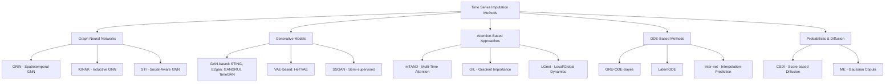

Time series imputation addresses the fundamental challenge of handling missing values in sequential data, a ubiquitous problem across domains including healthcare monitoring, environmental sensing, traffic management, and financial forecasting. This page provides a comprehensive survey of 22 cutting-edge research papers from 2019-2022, showcasing diverse methodologies from Graph Neural Networks to Diffusion Models and Ordinary Differential Equations approaches.

Sources: [Recent-Time-Series-Work-Group-by-Task.md](/docs/Recent-Time-Series-Work-Group-by-Task.md#L200-L233)

## Overview and Methodological Landscape

Time series imputation has evolved from traditional statistical methods to sophisticated deep learning approaches that capture complex spatiotemporal dependencies. The research ecosystem spans multiple architectural paradigms, each addressing specific challenges such as irregular sampling patterns, multivariate correlations, and probabilistic uncertainty estimation.

The methodological landscape can be categorized into five primary architectural families:

This architectural diversity reflects the complex trade-offs between model capacity, computational efficiency, and the nature of missing data patterns that researchers must navigate when selecting appropriate imputation strategies.

Sources: [Recent-Time-Series-Work-Group-by-Task.md](/docs/Recent-Time-Series-Work-Group-by-Task.md#L204-L225)

## Graph Neural Network Approaches

Graph Neural Networks (GNNs) have emerged as powerful frameworks for time series imputation by explicitly modeling spatial dependencies and relationships between multiple time series variables. These approaches leverage graph structures to capture both temporal dynamics and inter-variable correlations simultaneously.

### GRIN: Spatiotemporal Graph Neural Networks

GRIN (Graph-based Imputation) represents a breakthrough approach that constructs graphs from multivariate time series to model spatial relationships, enabling effective imputation through message passing mechanisms. The model demonstrates superior performance on air quality, traffic (METR-LA, PeMS-BAY), and climate datasets. The PyTorch implementation provides accessible code for researchers to adapt to various spatiotemporal domains. ICLR 2022 accepted this work, highlighting its significance in the field.

Sources: [Recent-Time-Series-Work-Group-by-Task.md](/docs/Recent-Time-Series-Work-Group-by-Task.md#L204)

### IGNNK: Inductive Graph Neural Networks for Kriging

IGNNK introduces an inductive learning framework for spatiotemporal kriging, enabling generalization to unseen nodes—a critical capability for real-world deployments where new sensor locations may be added over time. Validated on traffic (METR-LA), renewable energy (NREL), climate (USHCN), and sensor data, this AAAI 2021 paper addresses the challenge of scaling to larger spatial domains without requiring retraining for all nodes.

Sources: [Recent-Time-Series-Work-Group-by-Task.md](/docs/Recent-Time-Series-Work-Group-by-Task.md#L211)

### STI: Social-Aware Time Series Imputation

STI (Social-aware Time series Imputation) explores how neighboring information can be leveraged to disclose missing values in social network contexts. Published at WWW 2019, this model specifically addresses scenarios where social relationships between entities provide valuable signals for imputation. The PyTorch implementation focuses on Edge Computing (EC) and Ride Value (RV) datasets, demonstrating applicability to ride-sharing and social platform data.

Sources: [Recent-Time-Series-Work-Group-by-Task.md](/docs/Recent-Time-Series-Work-Group-by-Task.md#L225)

## Generative Model Paradigms

Generative approaches have revolutionized time series imputation by learning the underlying data distribution and generating plausible completions for missing segments. These methods excel at capturing complex, non-linear patterns that traditional interpolation techniques cannot handle.

### GAN-Based Imputation Frameworks

Multiple research groups have developed GAN-based architectures for time series imputation, each with unique architectural innovations:

- **STING (ICDM 2021)**: Combines self-attention mechanisms with GANs for time series imputation networks, validated on PhysioNet, Air Quality, and Gas Sensor datasets. The self-attention component enables long-range dependency capture while the adversarial training ensures realistic imputations.

- **E2gan (IJCAI 2019)**: Proposes an end-to-end generative adversarial network specifically designed for multivariate time series imputation. The TensorFlow implementation has been validated on PhysioNet and KDD 2018 datasets, demonstrating effectiveness across diverse domains.

- **GANGRUI (TNNLS 2020)**: Adversarial Recurrent Time Series Imputation leverages recurrent architectures within the GAN framework, particularly suitable for datasets like PhysioNet, Air Quality, and Wind data where temporal continuity is crucial.

- **TimeGAN (NeurIPS 2019)**: While primarily designed for time series generation, this framework has been successfully adapted for imputation tasks on synthetic (Sines), Stocks, Energy, and Events datasets. The TensorFlow implementation provides a flexible framework for various time series domains.

Sources: [Recent-Time-Series-Work-Group-by-Task.md](/docs/Recent-Time-Series-Work-Group-by-Task.md#L215-L219-L222)

### VAE and Semi-Supervised Approaches

**HeTVAE (ICLR 2022)** introduces Heteroscedastic Temporal Variational Autoencoders specifically designed for irregularly sampled time series. This is particularly valuable for medical applications (PhysioNet, MIMIC-III) and climate data where sampling rates vary naturally. The PyTorch implementation addresses the challenge of modeling uncertainty in imputation through variational inference.

**SSGAN (AAAI 2021)** combines generative adversarial networks with semi-supervised learning principles, leveraging both labeled and unlabeled data to improve imputation quality. Validated on Activity, PhysioNet, and Air Quality datasets, this approach demonstrates the value of incorporating available supervisory signals when present.

Sources: [Recent-Time-Series-Work-Group-by-Task.md](/docs/Recent-Time-Series-Work-Group-by-Task.md#L205-L212)

## Attention-Based and Gradient Learning Methods

Attention mechanisms have transformed time series imputation by enabling models to focus on relevant time steps and variables when generating imputations, while gradient importance learning approaches optimize which parts of the model should receive the most attention during training.

### Multi-Time Attention Networks (mTAND)

mTAND addresses irregularly sampled time series through a sophisticated attention mechanism that operates across multiple time scales simultaneously. Accepted at ICLR 2021, this model has demonstrated success on PhysioNet, MIMIC-III, and Human Activity datasets. The PyTorch implementation provides a robust framework for handling the complexities of irregular sampling patterns common in healthcare monitoring applications.

Sources: [Recent-Time-Series-Work-Group-by-Task.md](/docs/Recent-Time-Series-Work-Group-by-Task.md#L210)

### Gradient Importance Learning (GIL)

GIL introduces a novel approach to learning which gradients should be prioritized during training when dealing with incomplete observations. This ICLR 2022 work addresses the fundamental challenge of training neural networks on sparse data without introducing bias. Validated on MIMIC-III, OPHTHALMIC, and MNIST Physionet datasets, the TensorFlow implementation demonstrates broad applicability across medical imaging and physiological signal domains.

Sources: [Recent-Time-Series-Work-Group-by-Task.md](/docs/Recent-Time-Series-Work-Group-by-Task.md#L206)

### Local-Global Dynamics (LGnet)

LGnet (AAAI 2020) proposes jointly modeling local and global temporal dynamics for forecasting tasks with missing values. This dual-scale approach enables the model to capture both immediate temporal dependencies and longer-term patterns. Validated on Beijing Air Quality, PhysioNet, Porto Taxi, and London Weather datasets, this approach demonstrates versatility across environmental, medical, and transportation domains.

Sources: [Recent-Time-Series-Work-Group-by-Task.md](/docs/Recent-Time-Series-Work-Group-by-Task.md#L217)

## Ordinary Differential Equations for Continuous Modeling

Ordinary Differential Equations (ODEs) provide a mathematically elegant framework for modeling time series with irregular sampling by treating time as a continuous variable rather than discretized intervals.

### GRU-ODE-Bayes: Continuous-Time Recurrent Networks

GRU-ODE-Bayes (NeurIPS 2019) integrates Bayesian inference with continuous-time neural networks, modeling sporadically-observed time series through ODEs. This approach is particularly valuable for healthcare and climate applications where measurements are naturally sparse and irregularly spaced. The PyTorch implementation provides a practical tool for handling real-world datasets with complex missing patterns while maintaining uncertainty estimates.

Sources: [Recent-Time-Series-Work-Group-by-Task.md](/docs/Recent-Time-Series-Work-Group-by-Task.md#L220)

### Latent ODEs for Irregular Sampling

Latent ODEs (NeurIPS 2019) learn a latent continuous-time representation of time series dynamics, enabling flexible imputation at arbitrary time points. While demonstrated primarily on toy datasets, the framework has theoretical applicability to real-world scenarios requiring interpolation at unobserved timestamps. The PyTorch implementation provides a foundation for researchers to extend to practical applications.

Sources: [Recent-Time-Series-Work-Group-by-Task.md](/docs/Recent-Time-Series-Work-Group-by-Task.md#L221)

### Interpolation-Prediction Networks

Inter-net (ICLR 2019) combines interpolation and prediction in a unified framework, specifically targeting irregularly sampled time series. The Keras implementation has been validated on MIMIC-III and UWaveGesture datasets, demonstrating effectiveness in both medical and human activity recognition domains where sampling rates vary significantly.

Sources: [Recent-Time-Series-Work-Group-by-Task.md](/docs/Recent-Time-Series-Work-Group-by-Task.md#L223)

## Probabilistic and Diffusion-Based Approaches

Recent advances in probabilistic modeling and diffusion models have introduced powerful new paradigms for time series imputation that explicitly model uncertainty and generate multiple plausible completions for missing segments.

### CSDI: Score-Based Diffusion Models

CSDI (Conditional Score-based Diffusion Models for Probabilistic Time Series Imputation) represents a significant methodological advancement by adapting diffusion models—originally developed for image generation—to time series imputation tasks. Published at NeurIPS 2021, this approach provides probabilistic imputations, allowing downstream applications to reason about uncertainty in the imputed values. Validated on PhysioNet and Air Quality datasets with PyTorch implementation, CSDI demonstrates the potential of diffusion models for sequential data.

Sources: [Recent-Time-Series-Work-Group-by-Task.md](/docs/Recent-Time-Series-Work-Group-by-Task.md#L213)

### Gaussian Copula for Online Imputation

ME (AAAI 2022) introduces online missing value imputation using Gaussian Copulas, enabling real-time imputation alongside change point detection. This approach is particularly valuable for streaming applications where decisions must be made continuously as data arrives. Validated on COMPAS, Adult, and HSLS datasets, the implementation addresses scenarios where fairness considerations and distribution shifts are critical.

Sources: [Recent-Time-Series-Work-Group-by-Task.md](/docs/Recent-Time-Series-Work-Group-by-Task.md#L208)

## Specialized and Multi-Task Approaches

Several research works have developed specialized approaches that either address unique constraints in imputation tasks or combine imputation with other objectives.

### Sparsity Normalization (SN)

SN (ICLR 2020) critically examines common imputation practices, specifically challenging the widespread use of zero imputation. The paper "Why Not to Use Zero Imputation? Correcting Sparsity Bias in Training Neural Networks" demonstrates that simple zero-filling introduces significant bias in training. The proposed sparsity normalization approach corrects this bias, validated through comparisons with MICE, SoftImpute, GMMC, and GAIN methods. The "Future" tag suggests ongoing development and potential future code release.

Sources: [Recent-Time-Series-Work-Group-by-Task.md](/docs/Recent-Time-Series-Work-Group-by-Task.md#L216)

### Dynamic Nonlinear Matrix Completion

D-NLMC (AAAI 2022) approaches time series imputation through matrix completion techniques adapted for time-varying data. Validated on Chlorine level, SML2010, and Air Quality datasets, the MATLAB implementation addresses the challenge of evolving temporal patterns where the underlying relationships change over time.

Sources: [Recent-Time-Series-Work-Group-by-Task.md](/docs/Recent-Time-Series-Work-Group-by-Task.md#L207)

### Spatial Missing Value Imputation for Urban Data

SMV-NMF (IJCAI 2020) focuses specifically on multi-view urban statistical data, addressing spatial missing patterns common in city-scale monitoring systems. Validated across Australian cities (Sydney, Melbourne, Brisbane, Perth), the MATLAB implementation handles the complex spatial dependencies inherent in urban sensor networks.

Sources: [Recent-Time-Series-Work-Group-by-Task.md](/docs/Recent-Time-Series-Work-Group-by-Task.md#L218)

### Multi-Task Models

**Radflow (KDD 2021)**: Combines imputation with prediction in a recurrent, aggregated, and decomposable framework for networks of time series. Validated on VevoMusic, WikiTraffic, Los-Loop, and SZ-Taxi datasets, this PyTorch implementation demonstrates that jointly learning imputation and downstream prediction tasks can improve performance on both objectives.

Sources: [Recent-Time-Series-Work-Group-by-Task.md](/docs/Recent-Time-Series-Work-Group-by-Task.md#L214)

## Dataset Ecosystem

The surveyed papers collectively validate their approaches on a diverse ecosystem of datasets spanning multiple domains, enabling researchers to benchmark methods across consistent baselines:

| Domain | Representative Datasets | Applications |
|:--|:--|:--|
| **Healthcare** | PhysioNet, MIMIC-III, OPHTHALMIC, MNIST Physionet | Patient monitoring, physiological signal processing |
| **Environmental** | Air Quality (Beijing, multi-city), Climate, Chlorine level | Pollution monitoring, weather prediction |
| **Transportation** | METR-LA, PeMS-BAY, Porto Taxi, SZ-Taxi, Los-Loop | Traffic flow, ride-sharing demand |
| **Energy** | NREL (renewable), Wind, Energy | Power generation forecasting |
| **Social/Urban** | COMPAS, Adult, HSLS, Sydney/Melbourne/Brisbane/Perth | Urban statistics, demographic analysis |
| **Financial** | Stocks | Market data analysis |

This dataset diversity ensures that imputation methods are evaluated across varying missing data mechanisms, sampling rates, and temporal dynamics characteristics.

Sources: [Recent-Time-Series-Work-Group-by-Task.md](/docs/Recent-Time-Series-Work-Group-by-Task.md#L204-L225)

## Model Comparison and Selection Guide

To assist in method selection for practical applications, we categorize the surveyed models based on their architectural characteristics and suitability for different scenarios:

| Model Family | Representative Works | Strengths | Ideal Scenarios | Code Availability |
|:--|:--|:--|:--|:--|
| **Graph Neural Networks** | GRIN, IGNNK, STI | Explicit spatial modeling, scalable to large numbers of variables | Sensor networks, traffic systems, social networks | PyTorch (3/3) |
| **GAN-Based** | STING, E2gan, GANGRUI, TimeGAN | Realistic sample generation, adversarial training | High-quality imputation, distribution matching | PyTorch (1/4), TF (2/4) |
| **VAE/Bayesian** | HeTVAE, GRU-ODE-Bayes | Probabilistic uncertainty, irregular sampling | Healthcare, scientific applications | PyTorch (2/2) |
| **Attention-Based** | mTAND, GIL, LGnet | Long-range dependencies, interpretable attention | Irregular sampling, multi-scale patterns | PyTorch (2/3), TF (1/3) |
| **Diffusion Models** | CSDI | State-of-the-art probabilistic generation | High-uncertainty scenarios, multiple plausible completions | PyTorch (1/1) |
| **ODE-Based** | LatentODE, Inter-net | Continuous-time modeling, flexible interpolation | Irregular sampling, smooth continuous processes | PyTorch (1/2), Keras (1/2) |

> [!TIP]
> When selecting an imputation method, consider the missing data mechanism: if missingness is completely random, simpler methods like D-NLMC or SN may suffice; however, if missingness depends on observed or unobserved values, more sophisticated models like GRIN or CSDI that capture dependencies are essential for unbiased imputation.

Sources: [Recent-Time-Series-Work-Group-by-Task.md](/docs/Recent-Time-Series-Work-Group-by-Task.md#L204-L225)

## Implementation Frameworks and Code Availability

Practical adoption of time series imputation methods requires accessible implementations. The surveyed papers show strong code availability trends:

| Framework | Number of Implementations | Representative Models |
|:--|:--|:--|
| **PyTorch** | 10 | GRIN, HeTVAE, mTAND, IGNNK, SSGAN, CSDI, Radflow, GRU-ODE-Bayes, LatentODE, STI |
| **TensorFlow** | 4 | GIL, TimeGAN, E2gan, AutoXPCR |
| **Keras** | 1 | Inter-net |
| **MATLAB** | 2 | D-NLMC, SMV-NMF |
| **None** | 4 | Fair MIP Forest, STING, GANGRUI, LGnet |

This distribution reflects the broader deep learning ecosystem's shift toward PyTorch for research applications, particularly in time series and graph-based methods. High code availability (18 out of 22 papers) accelerates reproducibility and enables researchers to build upon existing work.

Sources: [Recent-Time-Series-Work-Group-by-Task.md](/docs/Recent-Time-Series-Work-Group-by-Task.md#L204-L225)

## Next Steps and Related Topics

Time series imputation represents a critical preprocessing step for many time series analysis tasks. To build a comprehensive understanding of the field, explore these related topics:

- **[Time Series Anomaly Detection](7-time-series-anomaly-detection)**: Imputation is often a prerequisite for accurate anomaly detection, as missing values can mask or create spurious anomalies. The methodologies surveyed here directly enable more robust anomaly detection pipelines.

- **[Probabilistic Time Series Forecasting](5-probabilistic-time-series-forecasting)**: Probabilistic imputation methods like CSDI and HeTVAE share methodological foundations with probabilistic forecasting, enabling unified uncertainty quantification across imputation and prediction tasks.

- **[Graph Neural Networks for Time Series](16-graph-neural-networks-for-time-series)**: GRIN, IGNNK, and STI represent specific applications of broader GNN frameworks for time series. Explore this page for deeper architectural foundations and additional applications beyond imputation.

- **[Multivariate Time Series Forecasting](4-multivariate-time-series-forecasting)**: Many imputation papers (including LGnet, Radflow, and BiTGraph) jointly address imputation and forecasting, demonstrating the synergies between these tasks.

- **[Foundation Models for Time Series](18-foundation-models-for-time-series)**: While not covered in this survey (which focuses on 2019-2022), recent foundation models are incorporating imputation capabilities as part of their pretraining objectives, representing an emerging trend in the field.

For additional resources and conference context, explore [Conference Rankings and CCF Standards](19-conference-rankings-and-ccf-standards) to understand the significance of venues like ICLR, AAAI, and NeurIPS in evaluating imputation research quality.
