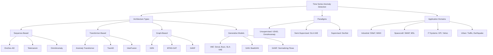

Time Series Anomaly Detection identifies patterns or data points that deviate significantly from normal behavior in temporal data sequences. This task is critical in domains such as industrial monitoring, cybersecurity, healthcare, and financial systems, where early detection of anomalies can prevent catastrophic failures, security breaches, or financial losses. The repository catalogues 30 significant papers in this domain, spanning from 2017 to 2022, showcasing the evolution from traditional LSTM-based approaches to advanced Transformer architectures and graph neural networks.

Sources: [Recent-Time-Series-Work-Group-by-Task.md](docs/Recent-Time-Series-Work-Group-by-Task.md#L234-L274)

## Core Architectural Evolution

The progression of anomaly detection models reveals a clear trajectory from sequence-based approaches to attention mechanisms and graph-based representations. The earliest models like EncDec-AD and Donut leveraged LSTM encoder-decoder structures and Variational Auto-Encoders, respectively, establishing the foundation for deep learning-based anomaly detection. These models primarily relied on reconstruction errors to identify anomalies, treating time series prediction as a proxy for normality assessment.

The field then advanced with more sophisticated probabilistic modeling approaches. DAGMM (Deep Autoencoding Gaussian Mixture Model) combined autoencoders with Gaussian mixture models in 2018, introducing a dual-network architecture that jointly optimized reconstruction and density estimation. OmniAnomaly (2019) further refined this approach using stochastic recurrent neural networks, providing a robust framework for multivariate time series anomaly detection through probabilistic modeling of temporal dependencies.

Sources: [Recent-Time-Series-Work-Group-by-Task.md](docs/Recent-Time-Series-Work-Group-by-Task.md#L257-L266)

## Transformer-Based Approaches

The integration of Transformer architectures marked a significant paradigm shift in anomaly detection research. Anomaly Transformer introduces association discrepancy as the core metric, leveraging self-attention mechanisms to capture long-range dependencies and identify subtle deviations from normal patterns. This model operates on the premise that anomalous points exhibit different association patterns with their surrounding context compared to normal data points.

TranAD extends the Transformer approach specifically for multivariate time series data, employing deep transformer networks that can process multiple simultaneous data streams. This architecture is particularly effective for detecting anomalies in complex systems where interdependencies between different metrics or sensors are crucial for accurate anomaly identification. The model's ability to attend to multiple temporal scales and cross-dimensional relationships provides superior performance on datasets like SMD, SMAP, and MSL.

> [!TIP]
> Transformer-based models for anomaly detection often employ association discrepancy as the core metric, measuring the difference between self-attention patterns of normal versus anomalous windows. This approach captures complex temporal dependencies that traditional reconstruction-based methods may miss.

Sources: [Recent-Time-Series-Work-Group-by-Task.md](docs/Recent-Time-Series-Work-Group-by-Task.md#L238-L245)

## Graph Neural Network Integration

The recognition that many time series originate from interconnected systems led to the development of graph-based anomaly detection approaches. GDN (Graph Neural Network-Based Anomaly Detection) explicitly models the relationships between different time series variables, treating them as nodes in a graph where edges represent potential dependencies or correlations. This architecture is particularly powerful for industrial monitoring scenarios where sensors measure related physical processes.

MTAD-GAT (Multivariate Time-Series Anomaly Detection via Graph Attention Network) combines Graph Attention Networks with temporal convolutional networks, creating a dual-stream architecture that processes both temporal and spatial dependencies. The model employs a sliding window approach with reconstruction and prediction heads, using both for final anomaly scoring. This hybrid approach enables detection of anomalies that manifest either as temporal irregularities or as disruptions in the expected relationships between variables.

Sources: [Recent-Time-Series-Work-Group-by-Task.md](docs/Recent-Time-Series-Work-Group-by-Task.md#L250-L256)

## Unsupervised and Semi-Supervised Methods

Given the scarcity of labeled anomaly data in real-world scenarios, unsupervised and semi-supervised approaches dominate the field. USAD (UnSupervised Anomaly Detection on Multivariate Time Series) employs an adversarial training framework where one encoder tries to reconstruct input while another attempts to make the reconstruction fail for anomalous inputs. This game-theoretic approach enables effective anomaly detection without requiring labeled examples.

SLA-VAE represents a semi-supervised approach designed for online systems, combining Variational Auto-Encoders with active learning mechanisms to improve detection accuracy over time. The framework allows for human-in-the-loop refinement, making it particularly suitable for operational environments where domain experts can provide feedback on detected anomalies.

Buzz extends the VAE approach specifically for intricate KPI (Key Performance Indicator) data using adversarial training, addressing the challenge of detecting subtle anomalies in web application monitoring where patterns are complex and exhibit strong seasonality.

Sources: [Recent-Time-Series-Work-Group-by-Task.md](docs/Recent-Time-Series-Work-Group-by-Task.md#L243-L244), [Recent-Time-Series-Work-Group-by-Task.md](docs/Recent-Time-Series-Work-Group-by-Task.md#L253-L264)

## Methodology Architecture Overview

Sources: [Recent-Time-Series-Work-Group-by-Task.md](docs/Recent-Time-Series-Work-Group-by-Task.md#L234-L274)

## Benchmark Datasets

The field employs several standard benchmark datasets that facilitate comparison across different methods. Industrial datasets like SWaT (Secure Water Treatment) and WADI (Water Distribution) capture complex multivariate time series from cyber-physical systems, providing realistic scenarios for testing anomaly detection algorithms. These datasets are particularly valuable as they contain labeled anomalies resulting from cyberattacks.

Spacecraft monitoring datasets from NASA (SMAP - Soil Moisture Active Passive and MSL - Mars Science Laboratory) offer high-dimensional multivariate data with subtle anomalies that are challenging to detect. Server Machine Dataset (SMD) provides comprehensive multivariate metrics from server clusters, making it suitable for evaluating IT infrastructure anomaly detection.

For KPI monitoring, datasets from Yahoo and Microsoft provide real-world metrics from web applications, while NAB (Numenta Anomaly Benchmark) offers labeled time series across multiple domains. The diversity of these datasets ensures that models are evaluated across different anomaly types, including point anomalies, contextual anomalies, and collective anomalies.

Sources: [Recent-Time-Series-Work-Group-by-Task.md](docs/Recent-Time-Series-Work-Group-by-Task.md#L238-L273)

## Key Model Comparison

| Model | Architecture | Key Innovation | Year | Primary Datasets | Code Availability |
|-------|-------------|----------------|------|------------------|-------------------|
| Anomaly Transformer | Transformer | Association discrepancy metric | 2022 | SMD, PSM, MSL, SMAP, SWaT | [Pytorch](https://github.com/spencerbraun/anomaly_transformer) |
| GANF | Normalizing Flows + GNN | Graph-augmented density estimation | 2022 | PMU-B, PMU-C, SWaT, METR-LA | [Pytorch](https://github.com/EnyanDai/GANF) |
| TranAD | Deep Transformer | Dual-encoder architecture | 2022 | NAB, UCR, SMAP, MSL, SWaT | [Pytorch](https://github.com/imperial-qore/TranAD) |
| InterFusion | Hierarchical Embeddings | Inter-metric temporal fusion | 2021 | SWaT, WADI, SMD, ASD | [TF](http://github.com/InterFusion/InterFusion) |
| GDN | Graph Neural Network | Learnable graph structure | 2021 | SWaT, WADI | [Pytorch](https://github.com/d-ailin/GDN) |
| USAD | Adversarial Autoencoder | Unsupervised dual-encoder | 2020 | SWaT, WADI, SMD, SMAP, MSL | [Pytorch](https://github.com/manigalati/usad) |
| MTAD-GAT | GAT + TCN | Spatial-temporal attention | 2020 | SMAP, MSL, TSA | [TF](https://github.com/mangushev/mtad-gat) |
| OmniAnomaly | Stochastic RNN | Probabilistic modeling | 2019 | SMAP, MSL, SMD | [TF](https://github.com/NetManAIOps/OmniAnomaly) |
| MSCRED | Deep CNN | Multi-scale convolutional | 2019 | Power plant | [TF](https://github.com/7fantasysz/MSCRED) |
| Donut | VAE + Bayesian | Seasonal KPI adaptation | 2018 | KPIs | [TF](https://github.com/NetManAIOps/donut) |

Sources: [Recent-Time-Series-Work-Group-by-Task.md](docs/Recent-Time-Series-Work-Group-by-Task.md#L238-L268)

## Specialized Applications

Beyond general anomaly detection, the field has developed specialized approaches for specific domains. CrowdQuake applies deep learning to earthquake detection using low-cost sensor networks, demonstrating how anomaly detection techniques can address critical societal challenges. This system leverages networked sensors across geographical regions to identify seismic events through pattern recognition.

For urban anomaly detection, CHAT employs cross-interaction hierarchical attention networks to predict anomalies in city dynamics, while DST-MFN uses deep spatio-temporal multiple domain fusion networks. These approaches integrate heterogeneous data sources including weather, traffic, and Point of Interest (POI) information to detect anomalies in urban systems that may indicate traffic incidents, public safety issues, or infrastructure failures.

Cyber-physical systems benefit from specialized approaches like NSIBF (Neural System Identification and Bayesian Filtering), which combines neural system identification with Bayesian filtering for precise anomaly detection in industrial control systems. This approach is particularly valuable for systems where physical dynamics are well-understood but subject to complex, non-linear anomalies.

Sources: [Recent-Time-Series-Work-Group-by-Task.md](docs/Recent-Time-Series-Work-Group-by-Task.md#L249-L255)

## Technical Implementation Insights

> [!TIP]
> When implementing time series anomaly detection models, pay careful attention to window size selection and threshold determination. The sliding window approach used by most models (including MTAD-GAT, TranAD, and InterFusion) requires balancing temporal context length against computational efficiency. Many models employ dynamic thresholding strategies rather than fixed thresholds to adapt to varying normality conditions.

The choice of loss function significantly impacts model performance. Reconstruction-based approaches (VAE, autoencoders) typically use mean squared error or similar metrics, while adversarial approaches (GAN, USAD) employ discriminator-based loss functions. Contrastive learning approaches, such as those using internal contrastive learning for tabular data, leverage distance-based metrics in latent space to separate normal from anomalous patterns.

Real-time deployment considerations have driven the development of streaming-capable approaches like MemStream (Memory-Based Streaming Anomaly Detection). These models maintain memory buffers of normal patterns and can process data incrementally, making them suitable for online monitoring scenarios where low latency is critical.

Sources: [Recent-Time-Series-Work-Group-by-Task.md](docs/Recent-Time-Series-Work-Group-by-Task.md#L240-L244)

## Evaluation and Methodology

Rigorous evaluation of anomaly detection models requires careful consideration of metrics and benchmarking practices. PA (Towards a Rigorous Evaluation of Time-Series Anomaly Detection) emphasizes the importance of proper dataset splitting, threshold selection methods, and appropriate metrics like precision, recall, and F1-score. The field commonly uses point-adjusted metrics to account for the temporal nature of anomalies.

FDRC (Online false discovery rate control) introduces statistical rigor through false discovery rate control specifically designed for time series anomaly detection. This approach helps balance the trade-off between false positives and false negatives, which is particularly important in applications where false alarms can be costly or disruptive.

For reproducibility, many authors provide code implementations across multiple frameworks. Pytorch implementations are increasingly common in recent work (Anomaly Transformer, GDN, USAD), while earlier models more frequently used TensorFlow (Donut, OmniAnomaly, MTAD-GAT). This trend reflects the broader shift in the deep learning community and provides practitioners with more accessible starting points for research and development.

Sources: [Recent-Time-Series-Work-Group-by-Task.md](docs/Recent-Time-Series-Work-Group-by-Task.md#L242-L247)

## Next Steps

For developers seeking to implement time series anomaly detection systems, the following progression is recommended:

1. **Start with foundational understanding**: Review [Multivariate Time Series Forecasting](4-multivariate-time-series-forecasting) to understand temporal dependencies and model architectures that transfer to anomaly detection

2. **Explore Transformer architectures**: The [Transformer-based Models](15-transformer-based-models) page provides deeper insights into attention mechanisms that power modern anomaly detection approaches

3. **Understand graph-based approaches**: [Graph Neural Networks for Time Series](16-graph-neural-networks-for-time-series) details the GNN architectures used in models like GDN and MTAD-GAT

4. **Review methodology abbreviations**: Consult [Methodology Abbreviations Guide](14-methodology-abbreviations-guide) for decoding model names and architectural patterns

5. **Identify relevant conferences**: The [Conference Rankings and CCF Standards](19-conference-rankings-and-ccf-standards) page helps identify venues publishing cutting-edge anomaly detection research
