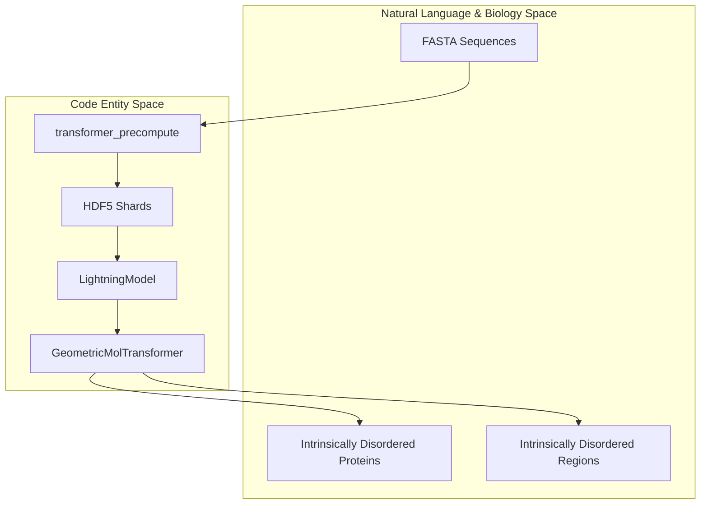
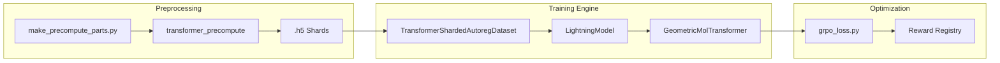

# IDiom Overview

Relevant source files

The following files were used as context for generating this wiki page:

- [.gitignore](.gitignore)
- [README.md](README.md)
- [pyproject.toml](pyproject.toml)

IDiom is a 122M parameter autoregressive transformer designed for the generative design of intrinsically disordered proteins (IDPs) and intrinsically disordered regions (IDRs) [README.md:1-3](). Trained on 37M IDRs from the AlphaFold Database, the system supports both unprompted generation and conditional generation using a Fill-In-the-Middle (FIM) approach [README.md:3-4]().

## System Lifecycle

The IDiom system operates through a three-stage lifecycle, transitioning from large-scale data ingestion to specialized sequence optimization.

### 1. Pre-training
The model is trained on the `AFDB_IDR_90_FIM` dataset using an autoregressive objective. During this stage, the model learns the "grammar" of disordered protein sequences and the structural context of flanking regions [README.md:26-27]().
*   **Key Component:** `transformer_train` [pyproject.toml:42-42]()
*   **Child Page:** [Pre-training](#4)

### 2. Inference
Pre-trained checkpoints are used to generate novel sequences. IDiom supports generating entirely new IDPs or filling in IDRs within existing protein scaffolds by extracting N-terminal and C-terminal contexts [README.md:115-121]().
*   **Key Component:** `transformer_infer` [pyproject.toml:43-43]()
*   **Child Page:** [Inference and Sequence Generation](#5)

### 3. RL Post-training
The model can be further refined using Group Relative Policy Optimization (GRPO) to maximize specific reward functions, such as sequence entropy or subcellular localization scores from the ProtGPS model [README.md:19-23]().
*   **Key Component:** `grpo_loss.py` [src/idiom/nn/transformer/grpo_loss.py:1-10]()
*   **Child Page:** [RL Post-training with GRPO](#6)

**Sources:** [README.md:1-27](), [pyproject.toml:40-47]()

## Core Architecture and Data Flow

IDiom bridges the gap between raw biological sequence data (FASTA) and high-dimensional neural representations through a structured pipeline.

### From FASTA to Code Entities
The following diagram illustrates how biological data is mapped to specific code modules and data structures within the IDiom repository.

**Data to Code Mapping**

**Sources:** [README.md:84-109](), [pyproject.toml:40-47]()

### System Data Flow
Data flows from raw residues to tokenized shards, which are then consumed by the transformer architecture.

**IDiom Pipeline Flow**

**Sources:** [README.md:89-103](), [pyproject.toml:40-47]()

## Subsystem Relationships

IDiom is organized into several functional blocks that interact through the `idiom` Python package:

| Subsystem | Primary Role | Key Classes/Scripts |
| :--- | :--- | :--- |
| **NN Architecture** | Defines the transformer layers and structural embeddings. | `GeometricMolTransformer`, `TransformerStack` |
| **Data Pipeline** | Converts FASTA files into HDF5 shards for efficient streaming. | `transformer_precompute`, `TransformerShardedAutoregDataset` |
| **Inference** | Handles autoregressive sampling and FIM prompting. | `transformer_infer`, `sampling.py` |
| **RL/Rewards** | Implements GRPO and connects to localization predictors. | `grpo_loss.py`, `ProtGPS` |

For details on setting up these subsystems, see [Getting Started: Installation and Environment Setup](#1.1).
For a conceptual deep dive into the data transformations, see [System Architecture and Data Flow](#1.2).

**Sources:** [README.md:89-103](), [pyproject.toml:40-47]()

---