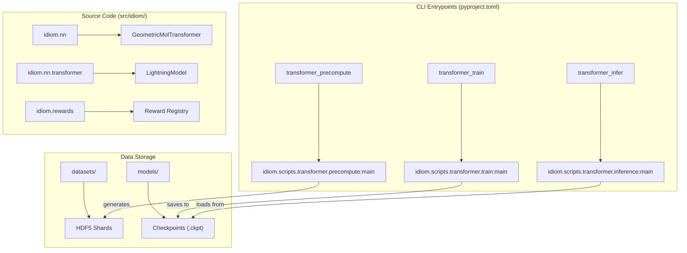
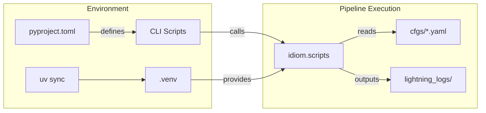

# Getting Started: Installation and Environment Setup

<details>
<summary>Relevant source files</summary>

The following files were used as context for generating this wiki page:

- [.gitignore](.gitignore)
- [.pre-commit-config.yaml](.pre-commit-config.yaml)
- [.python-version](.python-version)
- [datasets/.gitkeep](datasets/.gitkeep)
- [models/.gitkeep](models/.gitkeep)
- [pyproject.toml](pyproject.toml)
- [uv.lock](uv.lock)

</details>


This page provides a technical guide for setting up the IDiom development environment. It covers dependency management using `uv`, the structure of the project configuration, and the organization of the codebase.

## Environment Management with uv

The IDiom project uses [uv](https://github.com/astral-sh/uv) for extremely fast Python package management and deterministic environment resolution. The project requires Python version `3.10` or higher, as specified in the project metadata [pyproject.toml:10-10]().

### 1. Prerequisites
Ensure `uv` is installed on your system. If not, you can install it via:
```bash
curl -LsSf https://astral-sh.uv.io/install.sh | sh
```

### 2. Virtual Environment Setup
To create a synchronized virtual environment and install all dependencies (including the `dev` group containing `ruff`), run:
```bash
uv sync
```
This command reads the `uv.lock` file to ensure a reproducible environment [uv.lock:1-15]() and creates a `.venv` directory [ .gitignore:140-140]().

### 3. Activating the Environment
Activate the environment in your shell:
```bash
source .venv/bin/activate
```

### 4. Pre-commit Hooks
The project uses `pre-commit` to enforce code quality via `ruff` and to ensure the `uv.lock` file is always up to date [ .pre-commit-config.yaml:1-13](). Initialize them with:
```bash
pre-commit install
```

## Project Structure and Directory Layout

The IDiom repository is organized into specific directories to separate models, data, and execution logic.

| Directory | Purpose |
| :--- | :--- |
| `src/idiom/` | Core library code containing neural network definitions (`nn/`), utilities (`utils/`), and reward functions (`rewards/`). |
| `src/idiom/scripts/` | Implementation logic for the CLI entrypoints. |
| `models/` | Storage for model weights and checkpoints (ignored by git except for `.gitkeep`) [models/.gitkeep:1-1](), [ .gitignore:213-214](). |
| `datasets/` | Local storage for raw FASTA files and processed HDF5 shards [datasets/.gitkeep:1-1](), [ .gitignore:227-228](). |
| `entrypoints/` | Contains bash scripts (e.g., `pretrain.bash`, `generate_idps.bash`) that orchestrate SLURM jobs and CLI calls. |
| `cfgs/` | Hydra configuration files for training, inference, and precomputation. |

### System Mapping: Components to Code Entities

The following diagram bridges the logical subsystems of IDiom to their specific locations in the source tree.

**IDiom Component Map**

**Sources:** [pyproject.toml:40-47](), [ .gitignore:213-228]()

## CLI Entrypoints and pyproject.toml

The `pyproject.toml` file defines several console scripts that serve as the primary interface for the IDiom pipeline. These are mapped to specific Python functions within the `idiom` package.

### Available Scripts
*   **`transformer_precompute`**: Converts FASTA sequences into HDF5 shards ready for training [pyproject.toml:41-41]().
*   **`transformer_train`**: Main training entrypoint for both autoregressive pre-training and GRPO RL post-training [pyproject.toml:42-42]().
*   **`transformer_infer`**: Handles sequence generation and inference from trained checkpoints [pyproject.toml:43-43]().
*   **`make_infer_prompt`**: Prepares prompts for conditional generation [pyproject.toml:44-44]().
*   **`make_rl_dataset`**: Generates the dataset files required for RL post-training [pyproject.toml:45-45]().
*   **`make_precompute_parts`**: Utility for splitting large FASTA files into manageable parts for parallel precomputation [pyproject.toml:46-46]().

### Dependencies
Key dependencies defined in `project.dependencies` [pyproject.toml:11-28]() include:
*   `torch` (2.4.0) and `lightning` (2.6.0): Core deep learning and orchestration.
*   `hydra-core`: Configuration management.
*   `biopython`: Biological sequence handling.
*   `einops`: Tensor manipulations.
*   `h5py`: High-performance data storage for shards.

## Data Flow: Environment to Execution

The following diagram illustrates how the environment setup translates into the execution of the training pipeline.

**Execution Data Flow**

**Sources:** [pyproject.toml:1-47](), [ .gitignore:140-146](), [ .gitignore:216-217]()

## Installation Summary Checklist
1.  **Clone the repository.**
2.  **Install uv**: `curl -LsSf https://astral-sh.uv.io/install.sh | sh`.
3.  **Sync environment**: `uv sync`.
4.  **Activate environment**: `source .venv/bin/activate`.
5.  **Install hooks**: `pre-commit install`.
6.  **Verify CLI**: Run `transformer_train --help` to ensure the entrypoints are correctly mapped.

**Sources:** [pyproject.toml:1-47](), [uv.lock:1-24](), [ .pre-commit-config.yaml:1-13](), [ .gitignore:1-230]()

---