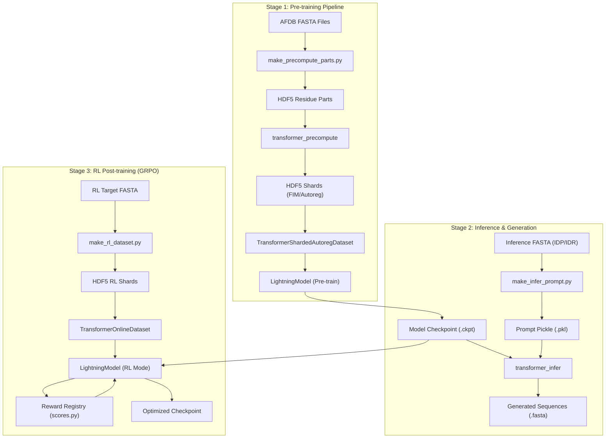
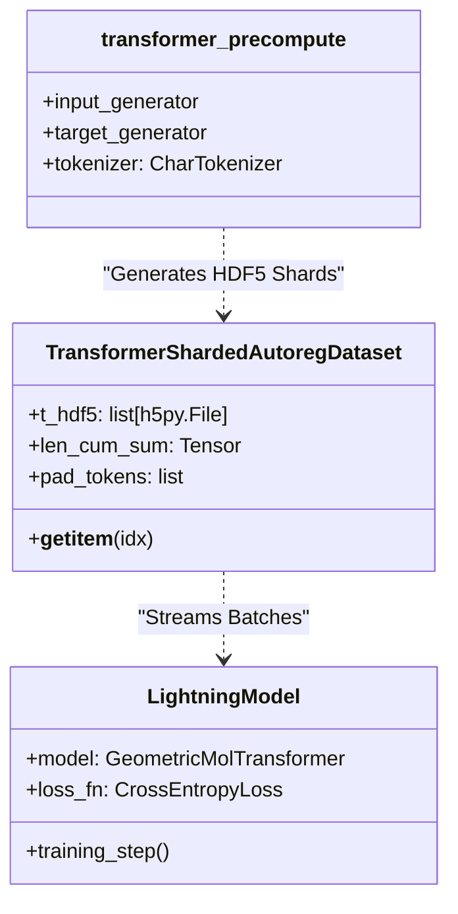
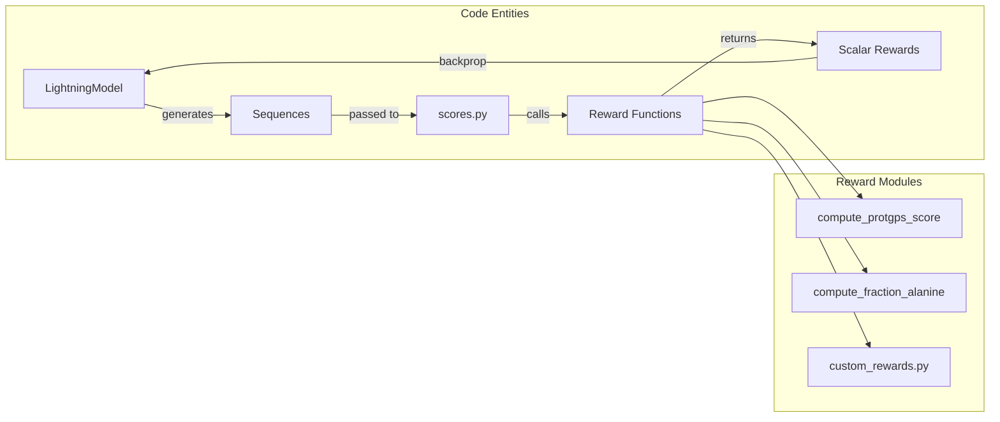

# System Architecture and Data Flow

Relevant source files

The following files were used as context for generating this wiki page:

- [README.md](README.md)
- [entrypoints/precompute/combined_precompute.bash](entrypoints/precompute/combined_precompute.bash)
- [pyproject.toml](pyproject.toml)
- [src/idiom/nn/transformer/dataset.py](src/idiom/nn/transformer/dataset.py)

This page provides a conceptual and technical overview of how data flows through the IDiom system across its three primary stages: pre-training, inference, and reinforcement learning (RL) post-training. It introduces the core concepts of Fill-In-the-Middle (FIM) transformations, sharded data management, and the transition from raw biological sequences to optimized neural representations.

## High-Level Lifecycle

The IDiom system is designed around an autoregressive transformer architecture that processes protein sequences as discrete tokens. The lifecycle transitions from large-scale unsupervised learning on disordered regions to targeted generation and refinement.

### Data Flow Diagram: FASTA to Post-Training

The following diagram illustrates the end-to-end flow of data from raw FASTA files through the various processing stages and into the model.

**Diagram: IDiom End-to-End Data Pipeline**

**Sources:** [README.md:89-109](), [pyproject.toml:41-46](), [entrypoints/precompute/combined_precompute.bash:22-51](), [src/idiom/nn/transformer/dataset.py:87-95]()

---

## Core Concepts and Data Structures

### 1. Tokenization and Alphabets
IDiom uses a `CharTokenizer` to map amino acid characters to integer IDs. Beyond standard residues, the system uses specific sentinel tokens for the Fill-In-the-Middle (FIM) task:
*   **IDP (Intrinsically Disordered Protein):** Sequences generated without external context.
*   **IDR (Intrinsically Disordered Region):** Regions generated within a structured flanking context.
*   **Sentinels:** Markers used to denote the start of a prefix, the start of a suffix, and the beginning of the generated region (often represented as '1', '2', '3' in precomputation).

### 2. Fill-In-the-Middle (FIM)
To support conditioned IDR generation, the pre-training data is transformed using FIM. A sequence is split into a prefix, a middle (the IDR), and a suffix. The model is trained to predict the middle given the prefix and suffix, formatted as:
`<PRE> [Prefix] <SUF> [Suffix] <MID> [Middle]`

### 3. Sharding and Streaming
Because the training dataset (e.g., AFDB_IDR_90_FIM) is massive (up to 186 GB), IDiom employs a sharded HDF5 strategy.
*   **`make_precompute_parts.py`**: Splits raw data into manageable chunks [pyproject.toml:46]().
*   **`TransformerShardedAutoregDataset`**: A `torch.utils.data.Dataset` implementation that maintains a list of HDF5 pointers (`t_hdf5`) and maps global indices to specific shards using a cumulative sum of lengths (`len_cum_sum`) [src/idiom/nn/transformer/dataset.py:95-123]().

---

## Pre-training Architecture

The pre-training stage focuses on autoregressive objective minimization. The data is prepared via `transformer_precompute` which generates `src_tokens` and `tgt_tokens` [src/idiom/nn/transformer/dataset.py:7-18]().

**Diagram: Pre-training Data Entities**

**Sources:** [pyproject.toml:41-42](), [src/idiom/nn/transformer/dataset.py:87-130](), [entrypoints/precompute/combined_precompute.bash:43-51]()

---

## Inference and Generation Flow

Inference is handled by `transformer_infer`, which supports both unprompted IDP generation and prompted IDR generation.

1.  **Prompt Preparation**: `make_infer_prompt.py` takes a FASTA file where headers contain metadata (e.g., `_IDR_119-242`) and extracts the flanking sequences [README.md:143-155]().
2.  **Sampling**: The model uses an autoregressive sampling engine (top-k, top-p) to generate tokens one by one until a stop token or max length is reached.
3.  **Output**: Results are saved as FASTA files (`generated_idrs.fasta`) and raw pickle files (`tst_autoregressive.pkl`) [README.md:132-137]().

---

## RL Post-training (GRPO)

Reinforcement Learning via Group Relative Policy Optimization (GRPO) allows the model to be fine-tuned for specific properties (e.g., localization scores via ProtGPS).

*   **Online Dataset**: Unlike pre-training, RL uses `TransformerOnlineDataset` which often loads data into memory for rapid access during the GRPO loop [src/idiom/nn/transformer/dataset.py:56-62]().
*   **Reward Computation**: The `LightningModel` in RL mode generates a group of sequences, sends them to the `Reward Registry`, and computes the GRPO loss based on the relative advantage of sequences within the group.

**Diagram: RL Reward Data Flow**

**Sources:** [README.md:19-23](), [src/idiom/nn/transformer/dataset.py:56-78](), [pyproject.toml:45]()

---

## Technical Implementation Details

### HDF5 Metadata Validation
To ensure data integrity across hundreds of shards, `TransformerShardedAutoregDataset` performs a `_metadata_check`. It verifies that every shard uses identical control tokens (TOK_PAD, TOK_START, etc.) and source/target sizes [src/idiom/nn/transformer/dataset.py:151-180]().

### Collation
The system uses specialized collate functions to handle variable-length sequences:
*   **`transformer_sharded_autoreg_collate_fn`**: Handles `structural_tokens`, `src_tokens`, and `tgt_tokens`, applying `pad_sequence` with specific residue and structural padding values [src/idiom/nn/transformer/dataset.py:7-44]().

**Sources:** [src/idiom/nn/transformer/dataset.py:7-44, 151-180]()

---