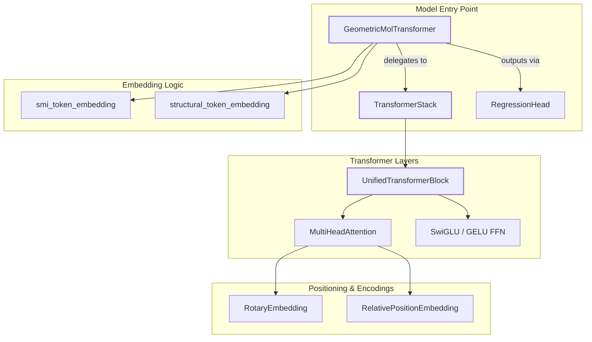
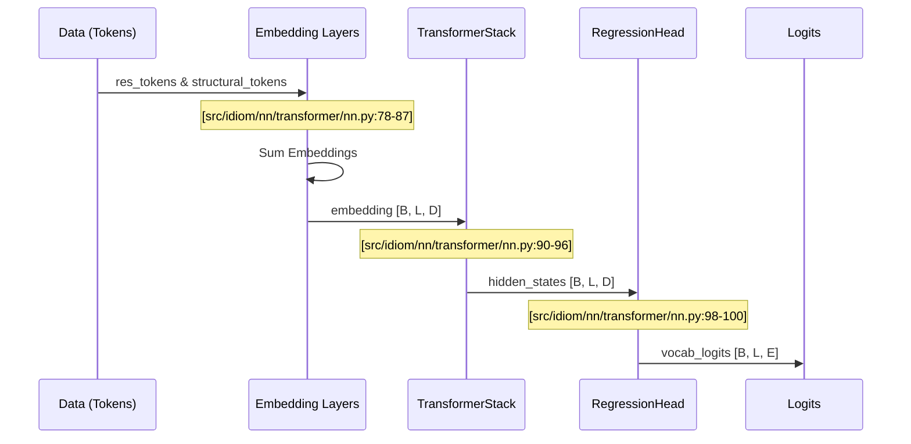

# Core Neural Network Architecture

Relevant source files

The following files were used as context for generating this wiki page:

- [src/idiom/nn/__init__.py](src/idiom/nn/__init__.py)
- [src/idiom/nn/layers/__init__.py](src/idiom/nn/layers/__init__.py)
- [src/idiom/nn/transformer/nn.py](src/idiom/nn/transformer/nn.py)

The `idiom.nn` package provides the neural network components for modeling intrinsically disordered proteins (IDPs) and regions (IDRs). The architecture is centered around a custom Transformer variant designed for protein sequence generation and structural understanding.

## Architecture Overview

The IDiom architecture is a decoder-only Transformer designed to handle residue sequences and structural tokens. The primary entry point for the model is the `GeometricMolTransformer` [src/idiom/nn/transformer/nn.py:5-103](), which orchestrates the embedding layers, the transformer stack, and the final output head.

### Natural Language to Code Entity Mapping

The following diagram illustrates how the conceptual components of the protein transformer map to specific classes and files within the `idiom` codebase.

**Sources:** [src/idiom/nn/transformer/nn.py:5-103](), [src/idiom/nn/layers/__init__.py:1-5]()

---

## Key Components

### GeometricMolTransformer
The `GeometricMolTransformer` is the top-level `nn.Module`. It handles the summation of residue and structural embeddings before passing them through the transformer stack [src/idiom/nn/transformer/nn.py:88-96](). It is designed to be flexible, supporting models that use only residue tokens, only structural tokens, or both [src/idiom/nn/transformer/nn.py:32-37]().

For details, see [GeometricMolTransformer Model](#2.1).

### Transformer Stack and Blocks
The core computation occurs within the `TransformerStack` [src/idiom/nn/layers/transformer_stack.py](), which consists of a series of `UnifiedTransformerBlock` instances [src/idiom/nn/layers/blocks.py:1](). These blocks implement modern transformer improvements, including advanced activation functions and flexible attention masking.

For details, see [Transformer Layers: Blocks, Attention, and Positional Encoding](#2.2).

### Multi-Head Attention (MHA)
The `MultiHeadAttention` module [src/idiom/nn/layers/mha.py:2]() supports multiple masking modes essential for IDiom's training:
*   **Causal Masking:** For standard autoregressive generation.
*   **Packed Sequence Masking:** For efficient training on variable-length protein sequences.
*   **Transfusion Masking:** Supporting the Fill-In-the-Middle (FIM) training objective.

For details, see [Transformer Layers: Blocks, Attention, and Positional Encoding](#2.2).

### Training Orchestration
The models are wrapped in a `LightningModel` [src/idiom/nn/transformer/module.py](), which leverages PyTorch Lightning for distributed training. This wrapper handles the logic for different training modes, such as standard autoregressive pre-training and Group Relative Policy Optimization (GRPO) for reinforcement learning.

For details, see [LightningModel: Training Orchestration and Loss Functions](#2.3).

---

## Data Flow within the Architecture

The following diagram shows how a sequence of tokens (residues) flows through the system to produce logits.

**Sources:** [src/idiom/nn/transformer/nn.py:61-103]()

---

## Related Sub-Pages

*   **[GeometricMolTransformer Model](#2.1)**: Detailed documentation of token embeddings (residue and structural), the forward pass, and the `RegressionHead`.
*   **[Transformer Layers: Blocks, Attention, and Positional Encoding](#2.2)**: Deep dive into `UnifiedTransformerBlock`, `MultiHeadAttention`, `RotaryEmbedding`, and `RelativePositionEmbedding`.
*   **[LightningModel: Training Orchestration and Loss Functions](#2.3)**: Documentation on the `LightningModel` wrapper, training modes (autoregressive vs. GRPO), and loss modules.

**Sources:** [src/idiom/nn/layers/__init__.py:1-5](), [src/idiom/nn/transformer/nn.py:5-103]()

---