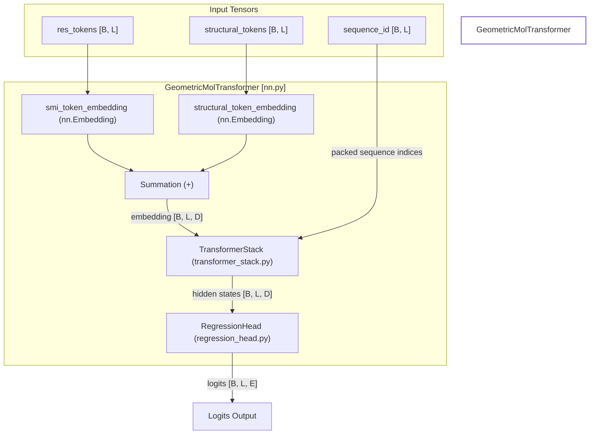
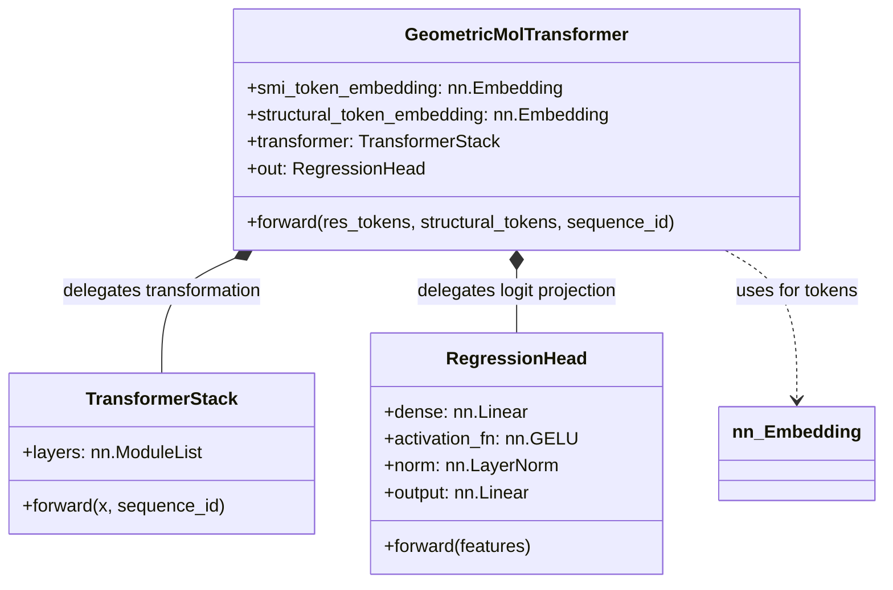

# GeometricMolTransformer Model

Relevant source files

The following files were used as context for generating this wiki page:

- [src/idiom/nn/layers/regression_head.py](src/idiom/nn/layers/regression_head.py)
- [src/idiom/nn/transformer/__init__.py](src/idiom/nn/transformer/__init__.py)
- [src/idiom/nn/transformer/nn.py](src/idiom/nn/transformer/nn.py)

The `GeometricMolTransformer` is the central neural network architecture in the IDiom system. It is designed to process molecular sequences—specifically protein residues and structural tokens—using a transformer-based backbone to predict the next token in a sequence or to compute logits for reinforcement learning.

The model is defined in `src/idiom/nn/transformer/nn.py` and serves as a wrapper that orchestrates token embeddings, a transformer stack, and a regression head for output generation.

## Model Architecture Overview

The `GeometricMolTransformer` architecture follows a standard embedding-transformer-head pattern but is specialized for dual-token inputs (residue and structural).

### Data Flow and Component Interaction

The diagram below illustrates how data flows from input tokens through the internal components of the `GeometricMolTransformer`.

**Diagram: GeometricMolTransformer Internal Data Flow**

**Sources:** [src/idiom/nn/transformer/nn.py:61-102](), [src/idiom/nn/transformer/nn.py:39-59]()

---

## Token Embeddings

The model supports two parallel embedding layers. During the forward pass, if both are present, their outputs are summed to form the final input representation for the transformer stack.

1.  **Residue Tokens (`smi_token_embedding`)**: Handles standard amino acid or SMILES-based tokens. It uses `token_info["input"]["TOK"]["TOK_PAD"]` as the padding index [src/idiom/nn/transformer/nn.py:39-44]().
2.  **Structural Tokens (`structural_token_embedding`)**: Designed to handle tokens derived from a VQVAE (Vector Quantized Variational Autoencoder) representing 3D structural information. It uses `token_info["input"]["STRUCT"]["STRUCT_PAD"]` as the padding index [src/idiom/nn/transformer/nn.py:47-52]().

At least one of these embedding types must be present in the `token_info` dictionary passed during initialization [src/idiom/nn/transformer/nn.py:35-37]().

**Sources:** [src/idiom/nn/transformer/nn.py:32-54](), [src/idiom/nn/transformer/nn.py:78-88]()

---

## Transformer Stack Delegation

The core processing is delegated to the `TransformerStack` class. The `GeometricMolTransformer` passes the summed embeddings and the `sequence_id` (used for handling packed sequences or specific positional encodings) to this stack.

*   **Input**: `embedding` (shape: `[batch_size, seq_len, dim_model]`) and `sequence_id`.
*   **Output**: A tensor of hidden states of the same shape as the input.

**Sources:** [src/idiom/nn/transformer/nn.py:55-57](), [src/idiom/nn/transformer/nn.py:90-96]()

---

## Regression Head

The final layer of the model is a `RegressionHead`, which maps the transformer's hidden states back to the vocabulary size (logits).

**Implementation Details (`RegressionHead`):**
The head consists of a linear projection, a non-linear activation, layer normalization, and a final output projection.

| Layer | Operation | Input Dim | Output Dim |
| :--- | :--- | :--- | :--- |
| Dense | `nn.Linear` | `d_model` | `d_model` |
| Activation | `nn.GELU` | `d_model` | `d_model` |
| Norm | `nn.LayerNorm` | `d_model` | `d_model` |
| Output | `nn.Linear` | `d_model` | `total_tokens` |

**Sources:** [src/idiom/nn/layers/regression_head.py:4-17](), [src/idiom/nn/transformer/nn.py:58-59]()

---

## Forward Pass Implementation

The `forward` method coordinates the transformation from discrete token IDs to continuous logit distributions.

**Code Logic Mapping:**
1.  **Embedding Lookup**: Tokens are converted to vectors via `smi_token_embedding` and `structural_token_embedding` [src/idiom/nn/transformer/nn.py:78-87]().
2.  **Feature Fusion**: The embeddings are summed: `embedding = res_token_embedding + structural_token_embedding` [src/idiom/nn/transformer/nn.py:88]().
3.  **Transformer Processing**: The `TransformerStack` processes the fused embeddings [src/idiom/nn/transformer/nn.py:90-96]().
4.  **Logit Generation**: The `RegressionHead` (aliased as `self.out`) transforms hidden states to vocabulary logits [src/idiom/nn/transformer/nn.py:98-102]().

**Diagram: Class Relationships and Code Entities**

**Sources:** [src/idiom/nn/transformer/nn.py:5-59](), [src/idiom/nn/layers/regression_head.py:4-10]()

---