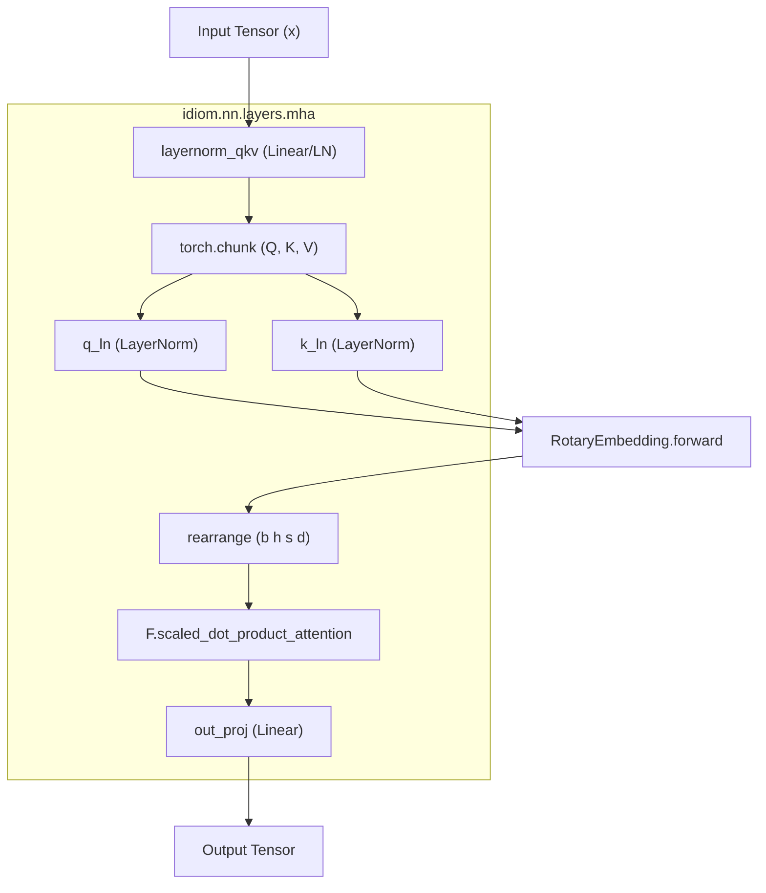
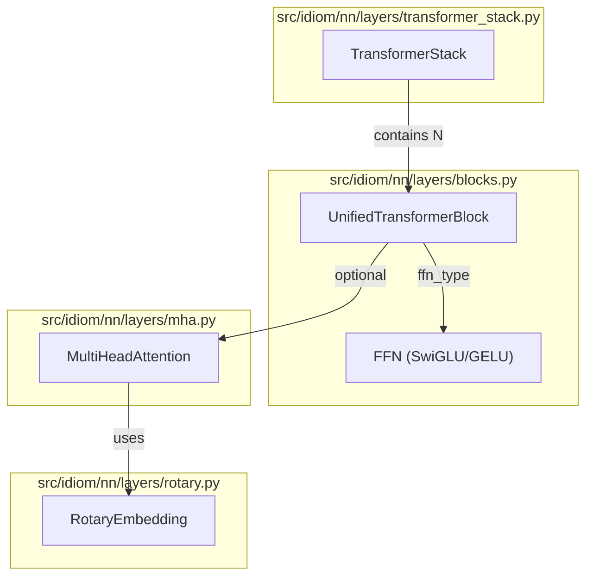

# Transformer Layers: Blocks, Attention, and Positional Encoding

Relevant source files

The following files were used as context for generating this wiki page:

- [src/idiom/nn/layers/blocks.py](src/idiom/nn/layers/blocks.py)
- [src/idiom/nn/layers/mha.py](src/idiom/nn/layers/mha.py)
- [src/idiom/nn/layers/rotary.py](src/idiom/nn/layers/rotary.py)
- [src/idiom/nn/layers/rpe.py](src/idiom/nn/layers/rpe.py)
- [src/idiom/nn/layers/transformer_stack.py](src/idiom/nn/layers/transformer_stack.py)

This page provides a deep dive into the architectural components of the IDiom transformer model. The system utilizes a modular stack of transformer blocks, incorporating advanced attention mechanisms, rotary positional embeddings, and optimized feed-forward network variants.

## TransformerStack and Unified Blocks

The core of the model is the `TransformerStack`, which orchestrates a sequence of transformer layers. Each layer is implemented as a `UnifiedTransformerBlock`, providing a flexible interface for both standard multi-head attention and potential geometric attention variants.

### TransformerStack
The `TransformerStack` [src/idiom/nn/layers/transformer_stack.py:7-21]() manages a `nn.ModuleList` of blocks. It supports configurable normalization (LayerNorm or Identity) and scales residual connections based on the depth of the stack.

*   **Initialization**: It determines which layers use Multi-Head Attention (MHA) via `mha_layer_indices` [src/idiom/nn/layers/transformer_stack.py:27-43]().
*   **Forward Pass**: Iteratively processes the input tensor `x` through each block, passing along `sequence_id` for masking [src/idiom/nn/layers/transformer_stack.py:77-81](). It returns both the post-norm output and the pre-norm embedding [src/idiom/nn/layers/transformer_stack.py:82]().

### UnifiedTransformerBlock
The `UnifiedTransformerBlock` [src/idiom/nn/layers/blocks.py:47-61]() implements the standard transformer layer logic with pre-layer normalization.

*   **Residual Scaling**: Residual connections are divided by a `scaling_factor` [src/idiom/nn/layers/blocks.py:108-111](), typically derived from the number of layers to maintain variance stability.
*   **FFN Selection**: Supports either `swiglu` or `gelu` feed-forward variants [src/idiom/nn/layers/blocks.py:78-81]().

**Sources:** [src/idiom/nn/layers/transformer_stack.py](), [src/idiom/nn/layers/blocks.py]()

---

## Multi-Head Attention (MHA)

The `MultiHeadAttention` class [src/idiom/nn/layers/mha.py:9-43]() is the primary mechanism for sequence modeling. It supports multiple masking modes and optional Query-Key (QK) normalization.

### Masking Modes
The implementation supports three distinct attention behaviors via `mask_mode` [src/idiom/nn/layers/mha.py:28-43]():

| Mode | Description | Application |
| :--- | :--- | :--- |
| `causal` | Autoregressive lower triangular mask. | Pre-training and Inference |
| `packed_seq` | Bidirectional attention within sequences sharing the same ID. | Bidirectional modeling |
| `transfusion` | Causal for tokens, all-to-all for structure indices. | Mixed modality modeling |

### QK Normalization and Rotary Embeddings
To improve training stability, the module can apply `LayerNorm` to the Query and Key tensors independently [src/idiom/nn/layers/mha.py:67-73](). Positional information is injected via `RotaryEmbedding` [src/idiom/nn/layers/mha.py:74](), which is applied to the Q and K tensors before the scaled dot-product calculation [src/idiom/nn/layers/mha.py:147-155]().

### Data Flow: MHA Logic
The following diagram maps the logical flow of the `MultiHeadAttention.forward` method to the internal components.

**MHA Internal Data Flow**

**Sources:** [src/idiom/nn/layers/mha.py](), [src/idiom/nn/layers/rotary.py]()

---

## Positional Encoding

IDiom uses two primary forms of positional encoding: Rotary Positional Embeddings (RoPE) for global sequence context and Relative Position Embeddings (RPE) for local residue relationships.

### Rotary Embedding (RoPE)
The `RotaryEmbedding` class [src/idiom/nn/layers/rotary.py:37]() implements GPT-NeoX style rotations. It caches cosine and sine frequencies to optimize computation [src/idiom/nn/layers/rotary.py:93-128]().
*   **Interleaved Mode**: Supports GPT-J style interleaved rotations [src/idiom/nn/layers/rotary.py:44]().
*   **Precision**: Offers `pos_idx_in_fp32` to prevent rounding errors in long sequences when training in lower precision [src/idiom/nn/layers/rotary.py:108-118]().

### Relative Position Embedding (RPE)
The `RelativePositionEmbedding` [src/idiom/nn/layers/rpe.py:5-10]() provides a learnable bias based on the distance between residues.
*   **Binned Distance**: Distances are clamped into a fixed number of `bins` [src/idiom/nn/layers/rpe.py:29]().
*   **Logic**: Calculates `diff = key_residue_index - query_residue_index` and maps the result to an embedding index [src/idiom/nn/layers/rpe.py:28-31]().

**Sources:** [src/idiom/nn/layers/rotary.py](), [src/idiom/nn/layers/rpe.py]()

---

## Feed-Forward Network (FFN) Variants

The architecture supports two FFN types, both utilizing pre-LayerNorm.

### SwiGLU
The default `swiglu` FFN [src/idiom/nn/layers/blocks.py:26-34]() uses the Gated Linear Unit variant with the SiLU (Swish) activation function.
*   **Correction Function**: `swiglu_correction_fn` ensures the hidden dimension is a multiple of 256 for hardware efficiency [src/idiom/nn/layers/blocks.py:6-8]().
*   **Logic**: The input is split into two halves; the first is activated by SiLU and multiplied by the second [src/idiom/nn/layers/blocks.py:21-23]().

### GELU
A standard `gelu` FFN [src/idiom/nn/layers/blocks.py:37-44]() is also available, using the Gaussian Error Linear Unit activation.

**Sources:** [src/idiom/nn/layers/blocks.py]()

---

## Architectural Mapping

This diagram bridges the conceptual layers to the specific Python classes and files.

**Code Entity Mapping**

**Sources:** [src/idiom/nn/layers/transformer_stack.py](), [src/idiom/nn/layers/blocks.py](), [src/idiom/nn/layers/mha.py](), [src/idiom/nn/layers/rotary.py]()

---