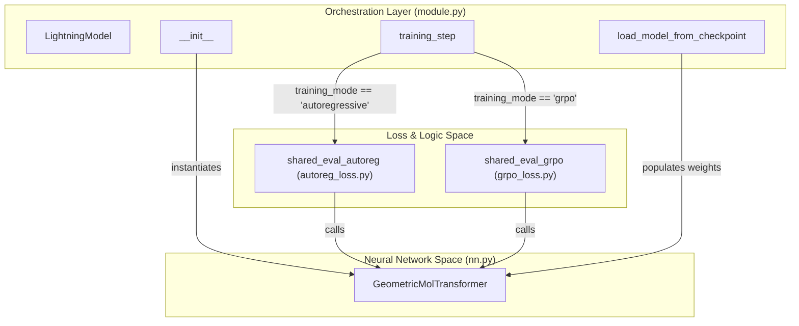
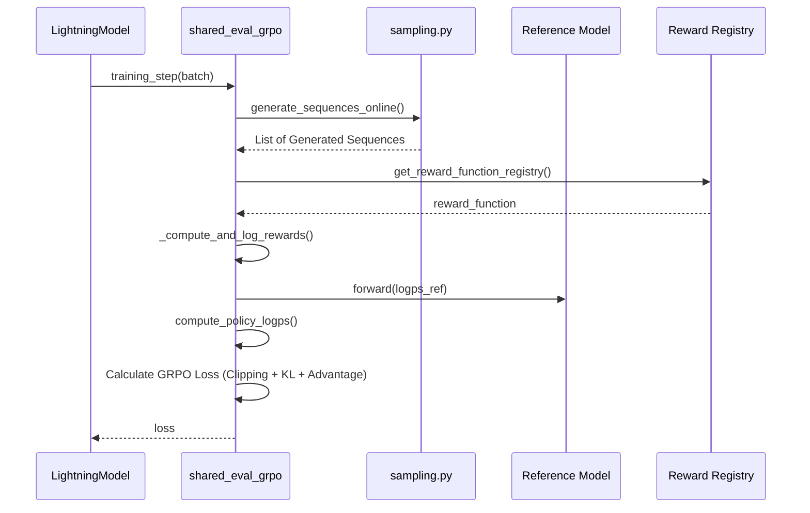

# LightningModel: Training Orchestration and Loss Functions

Relevant source files

The following files were used as context for generating this wiki page:

- [src/idiom/nn/transformer/losses/autoreg_loss.py](src/idiom/nn/transformer/losses/autoreg_loss.py)
- [src/idiom/nn/transformer/losses/grpo_loss.py](src/idiom/nn/transformer/losses/grpo_loss.py)
- [src/idiom/nn/transformer/module.py](src/idiom/nn/transformer/module.py)

The `LightningModel` class serves as the central orchestrator for the IDiom system, wrapping the `GeometricMolTransformer` in a PyTorch Lightning interface. It handles the transition between standard autoregressive pre-training and Group Relative Policy Optimization (GRPO) for reinforcement learning post-training.

## Implementation Overview

The `LightningModel` is defined in `src/idiom/nn/transformer/module.py` [src/idiom/nn/transformer/module.py:13-14](). It manages the lifecycle of the underlying transformer model(s), configures optimizers, and delegates the training logic to specific loss modules based on the `training_mode` hyperparameter [src/idiom/nn/transformer/module.py:19-24]().

### Model Roles and Entities
The following diagram maps the logical components of the training orchestration to their specific code entities.

**Training Orchestration Mapping**

Sources: [src/idiom/nn/transformer/module.py:13-31](), [src/idiom/nn/transformer/module.py:168-175](), [src/idiom/nn/transformer/losses/autoreg_loss.py:1-18](), [src/idiom/nn/transformer/losses/grpo_loss.py:10-141]()

---

## Training Modes

The system supports two distinct training modes, which dictate how the model is instantiated and how gradients are calculated.

### 1. Autoregressive Mode
Used for initial pre-training on protein sequences.
*   **Model Structure**: Instantiates a single `GeometricMolTransformer` [src/idiom/nn/transformer/module.py:30]().
*   **Loss Function**: Uses standard `nn.CrossEntropyLoss` [src/idiom/nn/transformer/module.py:113-121]().
*   **Data Flow**: The `shared_eval_autoreg` function receives a batch containing structure tokens, input tokens, and targets. It performs a forward pass and computes the mean loss across the sequence [src/idiom/nn/transformer/losses/autoreg_loss.py:19-30]().

### 2. GRPO Mode (Reinforcement Learning)
Used for post-training to optimize specific biological properties (e.g., localization, composition).
*   **Model Structure**: Instantiates two models: `self.model` (the policy being trained) and `self.reference_model` (a frozen copy used to calculate KL divergence) [src/idiom/nn/transformer/module.py:28-31]().
*   **Reference Model Handling**: The reference model is set to `.eval()` mode, and `requires_grad` is set to `False` for all its parameters to prevent updates [src/idiom/nn/transformer/module.py:149-158]().
*   **Sampling**: In GRPO mode, a `TokenSampler` is initialized to enable online sequence generation during the training step [src/idiom/nn/transformer/module.py:44-53]().

Sources: [src/idiom/nn/transformer/module.py:19-55](), [src/idiom/nn/transformer/losses/autoreg_loss.py:19-30](), [src/idiom/nn/transformer/losses/grpo_loss.py:10-30]()

---

## Loss Modules and Data Flow

The `training_step` in `LightningModel` acts as a dispatcher [src/idiom/nn/transformer/module.py:168-175]().

### Autoregressive Loss (`autoreg_loss.py`)
This module implements the standard next-token prediction loss. It expects a batch from the `TransformerShardedAutoregDataset` [src/idiom/nn/transformer/losses/autoreg_loss.py:6-12]().
1.  **Forward Pass**: Passes `src`, `struct`, and `seq_id` to the model [src/idiom/nn/transformer/losses/autoreg_loss.py:20-22]().
2.  **Permutation**: Permutes the output tensor to shape `(B, C, L)` to satisfy `CrossEntropyLoss` requirements [src/idiom/nn/transformer/losses/autoreg_loss.py:23-25]().
3.  **Masking**: The loss function is initialized with `ignore_index` set to the padding token [src/idiom/nn/transformer/module.py:119-120]().

### GRPO Loss (`grpo_loss.py`)
This module implements Group Relative Policy Optimization. It is significantly more complex as it involves online generation and reward computation.

**GRPO Data Flow and Reward Integration**

Sources: [src/idiom/nn/transformer/losses/grpo_loss.py:142-173](), [src/idiom/nn/transformer/utils/sampling.py:7-8](), [src/idiom/nn/transformer/utils/misc.py:6-7]()

#### GRPO Configuration
The `_initialize_grpo_config` function parses the `lightning_model_args` from the Hydra configuration [src/idiom/nn/transformer/losses/grpo_loss.py:10-15](). Key parameters include:
*   `group_size`: Number of sequences generated per prompt for advantage normalization [src/idiom/nn/transformer/losses/grpo_loss.py:17-19]().
*   `beta_kl`: Weight for the KL divergence penalty against the reference model [src/idiom/nn/transformer/losses/grpo_loss.py:28-30]().
*   `reward_function_name`: The specific reward (e.g., `compute_protgps_score`) to optimize [src/idiom/nn/transformer/losses/grpo_loss.py:58-60]().

---

## Model Loading and Checkpoints

The `load_model_from_checkpoint` method handles weight initialization [src/idiom/nn/transformer/module.py:128]().
*   **CPU Loading**: Checkpoints are first loaded to the CPU to avoid GPU memory conflicts in DDP (Distributed Data Parallel) environments [src/idiom/nn/transformer/module.py:130-132]().
*   **Key Mapping**: The function strips the `model.` prefix from checkpoint keys to ensure compatibility between the saved `state_dict` and the internal model structure [src/idiom/nn/transformer/module.py:135-136]().
*   **Dual Loading**: In GRPO mode, the same weights are loaded into both the active `model` and the `reference_model` [src/idiom/nn/transformer/module.py:146-148]().

Sources: [src/idiom/nn/transformer/module.py:128-161]()

---

## Optimizer and Scheduler Configuration

The `configure_optimizers` method sets up the training dynamics [src/idiom/nn/transformer/module.py:186]().
*   **Optimizer**: Defaults to `AdamW` [src/idiom/nn/transformer/module.py:192]().
*   **Scheduler**: Uses `LinearWarmupCosineAnnealingLR` from `pl_bolts` [src/idiom/nn/transformer/module.py:202-211]().
*   **Parameter Filtering**: It ensures that only parameters with `requires_grad=True` are passed to the optimizer, which is critical in GRPO mode where the reference model is frozen [src/idiom/nn/transformer/module.py:190-191]().

Sources: [src/idiom/nn/transformer/module.py:186-218]()

---