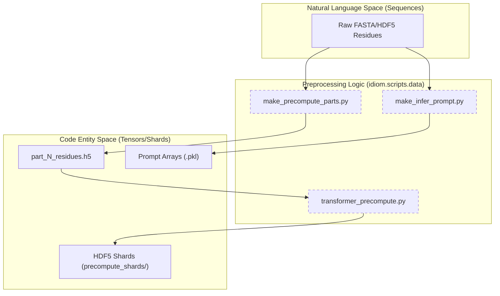
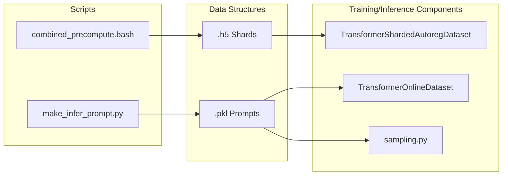

# Data Pipeline and Preprocessing

Relevant source files

The following files were used as context for generating this wiki page:

- [entrypoints/precompute/combined_precompute.bash](entrypoints/precompute/combined_precompute.bash)
- [src/idiom/scripts/data/__init__.py](src/idiom/scripts/data/__init__.py)

The **IDiom** data pipeline is designed to transform raw protein sequence data (typically FASTA or HDF5 residue strings) into highly optimized HDF5 shards suitable for large-scale autoregressive pre-training and reinforcement learning (RL). This pipeline handles tokenization, Fill-In-the-Middle (FIM) transformations, and the generation of input/target pairs for the transformer architecture.

## Overview of the Data Flow

The transformation process follows a structured path from raw biological sequences to model-ready numerical tensors:

1.  **Partitioning**: Large datasets are split into smaller parts to enable parallel processing across SLURM clusters.
2.  **Precomputation**: Each part is tokenized using a `CharTokenizer` and processed into input/target sequences.
3.  **Sharding**: The resulting data is stored in HDF5 shards, which allow for efficient streaming during training without loading the entire dataset into memory.
4.  **Prompt Creation**: For inference and RL, specific "prompts" are generated to guide the model toward generating either full Intrinsically Disordered Proteins (IDPs) or filling in Intrinsically Disordered Regions (IDRs).

### Pipeline Architecture and Code Mapping

The following diagram maps the logical data flow to the specific scripts and classes responsible for each stage.

**Data Transformation Pipeline**

**Sources:** [entrypoints/precompute/combined_precompute.bash:22-51](), [src/idiom/scripts/data/make_precompute_parts.py:1-40](), [src/idiom/scripts/data/transformer_precompute.py:1-60]()

---

## [Precomputation: FASTA to HDF5 Shards](#3.1)

The precomputation stage is the primary bottleneck for large datasets like `AFDB_IDR_90_FIM_512.h5`. To handle this, IDiom uses a distributed approach orchestrated by `combined_precompute.bash`.

*   **Partitioning**: `make_precompute_parts.py` splits the input residues into `NUM_PARTS` (e.g., 500) to allow parallel SLURM array jobs.
*   **Tokenization**: The `CharTokenizer` converts amino acid characters into integers based on a fixed alphabet.
*   **FIM Transformation**: Sequences are prepared for Fill-In-the-Middle training, allowing the model to learn context from both upstream and downstream residues.
*   **Input/Target Generation**: `input_generators.py` and `target_generators.py` create the shifted sequences required for autoregressive learning, applying `<START>` and `<STOP>` tokens where appropriate.

For details on the FIM logic and HDF5 structure, see [Precomputation: FASTA to HDF5 Shards](#3.1).

**Sources:** [entrypoints/precompute/combined_precompute.bash:29-51](), [src/idiom/nn/transformer/utils/tokenizer.py:1-50]()

---

## [Datasets and Collation](#3.2)

Once data is sharded, it is consumed by the training loop via specialized `PyTorch Dataset` classes defined in `dataset.py`.

| Class | Purpose | Usage |
| :--- | :--- | :--- |
| `TransformerShardedAutoregDataset` | Streams multiple HDF5 shards for large-scale pre-training. | Stage 1: Pre-training |
| `TransformerOnlineDataset` | Handles smaller, in-memory datasets or specific prompts for RL. | Stage 3: RL Post-training |

These datasets use specific collate functions, such as `transformer_sharded_autoreg_collate_fn`, to handle padding and sequence alignment within a batch. The pipeline also includes utilities like `aggregate_tokens_hdf5` to validate metadata across shards.

For details on streaming and collation, see [Datasets and Collation](#3.2).

**Sources:** [src/idiom/nn/transformer/dataset.py:1-100](), [src/idiom/utils/token.py:1-30]()

---

## [Inference Prompt Generation](#3.3)

Inference and RL require specific starting points (prompts). Unlike pre-training, which uses randomized shards, these scripts create deterministic input arrays.

*   **IDP Prompts**: Generated using `make_infer_prompt.py`, often using sentinel sequences (e.g., `'132'`) to signal the start of a de novo protein generation.
*   **IDR FIM Prompts**: Created by `make_rl_dataset.py`, these extract flanking regions from known proteins to prompt the model to "fill in" a missing disordered region.

The output of these scripts is typically a `.pkl` file containing tokenized arrays that are loaded directly by the `InferenceModel`.

For details on prompt formatting and sentinel tokens, see [Inference Prompt Generation](#3.3).

**Sources:** [src/idiom/scripts/data/make_infer_prompt.py:1-50](), [src/idiom/scripts/data/make_rl_dataset.py:1-50]()

---

### System Integration Map

The following diagram illustrates how the preprocessing scripts interact with the core data structures used by the training and inference engines.

**Data Pipeline Entity Relationship**

**Sources:** [src/idiom/nn/transformer/dataset.py:20-80](), [src/idiom/nn/transformer/utils/sampling.py:1-40](), [entrypoints/precompute/combined_precompute.bash:43-51]()

---