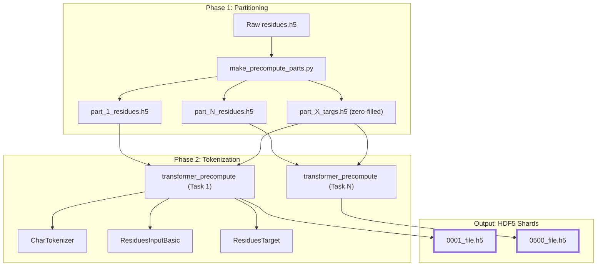
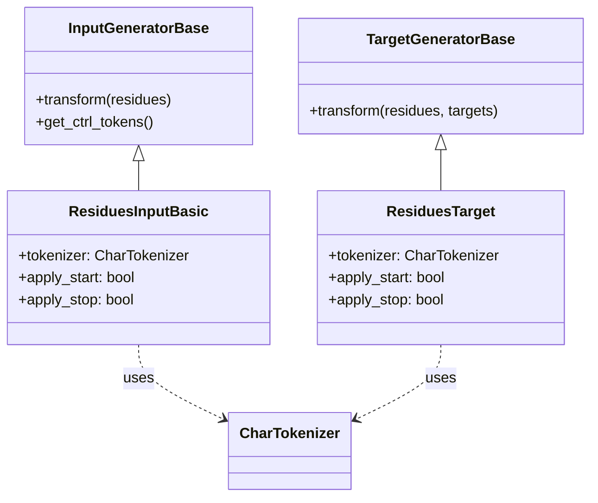

# Precomputation: FASTA to HDF5 Shards

Relevant source files

The following files were used as context for generating this wiki page:

- [entrypoints/precompute/combined_precompute.bash](entrypoints/precompute/combined_precompute.bash)
- [src/idiom/nn/transformer/generators/input_generators.py](src/idiom/nn/transformer/generators/input_generators.py)
- [src/idiom/nn/transformer/generators/target_generators.py](src/idiom/nn/transformer/generators/target_generators.py)
- [src/idiom/nn/transformer/utils/tokenizer.py](src/idiom/nn/transformer/utils/tokenizer.py)
- [src/idiom/scripts/cfgs/precompute.yaml](src/idiom/scripts/cfgs/precompute.yaml)
- [src/idiom/scripts/cfgs/precompute/residues.yaml](src/idiom/scripts/cfgs/precompute/residues.yaml)
- [src/idiom/scripts/data/make_precompute_parts.py](src/idiom/scripts/data/make_precompute_parts.py)
- [src/idiom/scripts/transformer/precompute.py](src/idiom/scripts/transformer/precompute.py)

The precomputation pipeline transforms raw protein residue sequences (typically from FASTA files converted to initial HDF5 format) into tokenized, padded, and sharded HDF5 files ready for high-throughput autoregressive training. This stage handles character-level tokenization, alphabet determination, and the generation of input/target pairs suitable for Fill-In-the-Middle (FIM) or standard causal modeling.

## Pipeline Overview

The pipeline is orchestrated via a combined script that manages two primary phases: partitioning the raw data and then tokenizing those partitions in parallel.

### Data Flow: FASTA to Shards

The following diagram illustrates the transformation from raw residue data to the final training shards.

**Precomputation Data Flow**

Sources: [entrypoints/precompute/combined_precompute.bash:22-51](), [src/idiom/scripts/data/make_precompute_parts.py:3-12]()

## Core Components

### 1. Partitioning: `make_precompute_parts.py`
To enable massive parallelism across SLURM clusters, the source residue file is first split into $N$ parts. 
- **`split_parts`**: Randomly partitions the `residues` dataset into multiple HDF5 files using `numpy.random.default_rng` for reproducibility [src/idiom/scripts/data/make_precompute_parts.py:101-151]().
- **`make_targs`**: Generates matching `_targs.h5` files containing zero-filled arrays. These act as placeholders for the `target_generator` during the tokenization phase [src/idiom/scripts/data/make_precompute_parts.py:69-92]().

### 2. Tokenization Entrypoint: `transformer_precompute`
This script (`src/idiom/scripts/transformer/precompute.py`) is the primary worker. It loads a specific part file and processes it into a final training shard.

- **Alphabet Determination**: If no alphabet is provided, `determine_alphabet` scans the residues in the shard to find all unique characters using the `CharTokenizer` [src/idiom/scripts/transformer/precompute.py:15-32]().
- **Parallel Processing**: It uses `run_process_parallel` to apply generators to the data using a `multiprocessing.Pool` [src/idiom/scripts/transformer/precompute.py:34-74]().

### 3. Tokenization Logic: `CharTokenizer`
The system uses a simple character-level tokenizer (`CharTokenizer`) which treats every amino acid or sentinel character as a distinct token [src/idiom/nn/transformer/utils/tokenizer.py:1-11]().

Sources: [src/idiom/scripts/transformer/precompute.py:91-101](), [src/idiom/nn/transformer/utils/tokenizer.py:9-10]()

## Generators and FIM Transformation

The transformation of strings into training-ready tensors is handled by "Generators". These classes define how start/stop tokens are applied and how sequences are padded.

### Input and Target Generators

| Class | Purpose | Key Behavior |
| :--- | :--- | :--- |
| `ResiduesInputBasic` | Generates model inputs. | Prepends `TOK_START` (if `apply_start=True`), tokenizes residues, and pads to `max_len` [src/idiom/nn/transformer/generators/input_generators.py:53-128](). |
| `ResiduesTarget` | Generates training targets. | Appends `TOK_STOP` (if `apply_stop=True`), tokenizes, and pads. Usually offset from input by 1 position [src/idiom/nn/transformer/generators/target_generators.py:57-127](). |

**Code Entity Relationship: Generators**

Sources: [src/idiom/nn/transformer/generators/input_generators.py:53-106](), [src/idiom/nn/transformer/generators/target_generators.py:57-111]()

### Control Tokens
The generators reserve specific indices at the end of the alphabet for control:
- **`pad`**: `len(alphabet)`
- **`start`**: `len(alphabet) + 1`
- **`stop`**: `len(alphabet) + 2`
- **`mask`**: `len(alphabet) + 3`

Sources: [src/idiom/nn/transformer/generators/input_generators.py:102-105](), [src/idiom/nn/transformer/generators/target_generators.py:100-103]()

## HDF5 Shard Format

The output of the precompute pipeline is a set of HDF5 files (shards) containing several datasets and metadata groups. This structure is required by the `TransformerShardedAutoregDataset`.

### Dataset Structure
- `res_tokens`: (N, SeqLen) array of input tokens [src/idiom/scripts/transformer/precompute.py:166]().
- `targets`: (N, SeqLen) array of target tokens [src/idiom/scripts/transformer/precompute.py:167]().
- `sequence_id`: A binary mask (1 for residues, 0 for padding) [src/idiom/scripts/transformer/precompute.py:170]().
- `structural_tokens`: Placeholder for structural embeddings, typically filled with `TOK_PAD` in residue-only mode [src/idiom/scripts/transformer/precompute.py:161-163, 171]().
- `alphabet`: The sorted list of characters used for tokenization [src/idiom/scripts/transformer/precompute.py:169]().

### Metadata Groups
- `input_metadata`: Contains `source_size`, `max_seq_len`, and a `ctrl_tokens` subgroup [src/idiom/scripts/transformer/precompute.py:173-178]().
- `target_metadata`: Contains `target_size`, `max_seq_len`, and a `ctrl_tokens` subgroup [src/idiom/scripts/transformer/precompute.py:180-183]().

Sources: [src/idiom/scripts/transformer/precompute.py:165-183]()

## Execution: `combined_precompute.bash`

The entrypoint script uses a SLURM array to orchestrate the pipeline.

1. **Task 1 Initialization**: The first task in the array runs `make_precompute_parts` to create the partition files and the `precompute_shards/` directory [entrypoints/precompute/combined_precompute.bash:29-34]().
2. **Synchronization**: All other tasks wait until the directory is created [entrypoints/precompute/combined_precompute.bash:37-39]().
3. **Parallel Precomputation**: Each task runs `transformer_precompute` on its assigned part (e.g., `part_12_residues.h5`) to produce a final shard (e.g., `0012_file.h5`) [entrypoints/precompute/combined_precompute.bash:43-51]().

Sources: [entrypoints/precompute/combined_precompute.bash:9-51]()

---