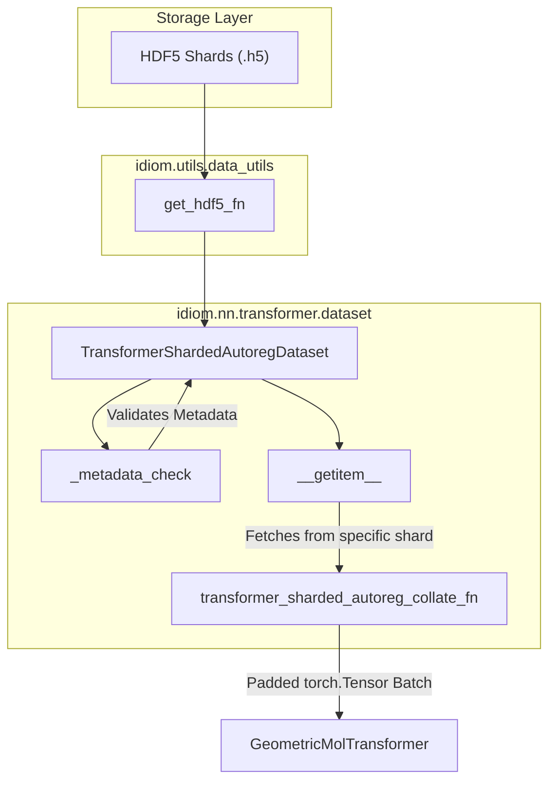

# Datasets and Collation

Relevant source files

The following files were used as context for generating this wiki page:

- [src/idiom/nn/transformer/dataset.py](src/idiom/nn/transformer/dataset.py)
- [src/idiom/scripts/cfgs/data/transformer.yaml](src/idiom/scripts/cfgs/data/transformer.yaml)
- [src/idiom/utils/data_utils.py](src/idiom/utils/data_utils.py)
- [src/idiom/utils/token.py](src/idiom/utils/token.py)

This page documents the data loading infrastructure for the IDiom project. The system utilizes two primary `Dataset` classes designed for different stages of the model lifecycle: a sharded streaming dataset for large-scale autoregressive pre-training and an online dataset for Reinforcement Learning (RL) post-training.

## Data Flow Overview

The data flow bridges the gap between HDF5 storage and the `GeometricMolTransformer`. Metadata validation ensures that tokens remain consistent across multiple shards.

### Natural Language Space to Code Entity Space: Data Loading

This diagram maps high-level data concepts to the specific classes and functions responsible for handling them.

| Concept | Code Entity | File |
| :--- | :--- | :--- |
| **HDF5 Shard Management** | `get_hdf5_fn` | [src/idiom/utils/data_utils.py:9-29]() |
| **Pre-training Streamer** | `TransformerShardedAutoregDataset` | [src/idiom/nn/transformer/dataset.py:87-130]() |
| **RL Training Data** | `TransformerOnlineDataset` | [src/idiom/nn/transformer/dataset.py:56-85]() |
| **Token Consolidation** | `aggregate_tokens_hdf5` | [src/idiom/utils/token.py:1-63]() |
| **Batch Formatting** | `transformer_sharded_autoreg_collate_fn` | [src/idiom/nn/transformer/dataset.py:7-44]() |

### Implementation Flow: Shard to Batch

**Sources:** [src/idiom/nn/transformer/dataset.py:87-187](), [src/idiom/utils/data_utils.py:9-29]()

---

## TransformerShardedAutoregDataset

The `TransformerShardedAutoregDataset` is the workhorse for pre-training. It is designed to handle datasets split across multiple HDF5 files (shards) without loading the entire corpus into memory.

### Key Features
- **Lazy Loading**: It maintains a list of `h5py` pointers and only opens them when requested via `open_hdf5` [src/idiom/nn/transformer/dataset.py:182-183]().
- **Metadata Validation**: During initialization, it calls `_metadata_check` to ensure all shards share identical control tokens (padding, start, stop, etc.) [src/idiom/nn/transformer/dataset.py:101-151]().
- **Global Indexing**: It calculates a cumulative sum of shard lengths (`len_cum_sum`) to map a global index to a specific shard and local index [src/idiom/nn/transformer/dataset.py:121-123]().

### Metadata Structure
The dataset expects HDF5 files to contain `input_metadata` and `target_metadata` groups. The utility `_unpack_metadata` extracts control tokens and vocabulary sizes to ensure consistency across the training run [src/idiom/nn/transformer/dataset.py:135-149]().

**Sources:** [src/idiom/nn/transformer/dataset.py:87-200]()

---

## TransformerOnlineDataset

Used primarily for RL post-training (e.g., GRPO), the `TransformerOnlineDataset` handles prompts and masks generated for online sequence optimization.

- **Data Loading**: Can load data entirely into memory or keep it on disk via `data_in_memory` flag [src/idiom/nn/transformer/dataset.py:62]().
- **Structure**: It specifically looks for `tokens` and `masks` datasets within the provided HDF5 file [src/idiom/nn/transformer/dataset.py:71-72]().

**Sources:** [src/idiom/nn/transformer/dataset.py:56-85]()

---

## Collate Functions

Collate functions transform lists of samples from the `Dataset` into unified tensors for the model.

### transformer_sharded_autoreg_collate_fn
This function handles the complex padding requirements of the autoregressive pipeline:
1. **Unzipping**: Separates `structural_tokens`, `src_tokens`, `src_key_pad_mask`, `tgt_tokens`, and `tgt_key_pad_mask` [src/idiom/nn/transformer/dataset.py:10-18]().
2. **Padding**: Uses `torch.nn.utils.rnn.pad_sequence`. It applies different padding values for residues (`res_pad_token`) and structural tokens (`struct_pad_token`) [src/idiom/nn/transformer/dataset.py:24-34]().
3. **Masking**: Padding masks are filled with `True` for padded positions [src/idiom/nn/transformer/dataset.py:29-33]().

### transformer_online_collate_fn
A simpler implementation for RL that uses `torch.stack` on fixed-size tokens and masks [src/idiom/nn/transformer/dataset.py:47-53]().

**Sources:** [src/idiom/nn/transformer/dataset.py:7-53]()

---

## Utility Functions

### aggregate_tokens_hdf5
Located in `src/idiom/utils/token.py`, this function aggregates all token-related information from an HDF5 pointer into a single dictionary.

- **Token Mapping**: Extracts `TOK` and `STRUCT` control tokens [src/idiom/utils/token.py:8-17]().
- **Vocabulary Size**: Determines `TOK_MAX_SIZE` and `STRUCT_MAX_SIZE` based on the highest token index found in metadata [src/idiom/utils/token.py:21-29]().
- **Alphabet**: Retrieves the residue alphabet used during tokenization [src/idiom/utils/token.py:59-60]().

### get_hdf5_fn
A factory function that returns a closure for opening HDF5 files. It can handle either a single `.h5` file or a directory containing multiple shards [src/idiom/utils/data_utils.py:9-29]().

### split_data_subsets
Splits a dataset into training, validation, and test sets. It supports either a pre-defined numpy file containing indices or a random split based on provided fractions [src/idiom/utils/data_utils.py:32-68]().

**Sources:** [src/idiom/utils/token.py:1-63](), [src/idiom/utils/data_utils.py:9-68]()

---

## Configuration Reference

The data pipeline is configured via Hydra. Default values are defined in `src/idiom/scripts/cfgs/data/transformer.yaml`.

| Parameter | Default | Description |
| :--- | :--- | :--- |
| `dataset` | `TransformerShardedAutoregDataset` | The dataset class to instantiate [src/idiom/scripts/cfgs/data/transformer.yaml:10](). |
| `collate_fn` | `transformer_sharded_autoreg_collate_fn` | The collate function for the DataLoader [src/idiom/scripts/cfgs/data/transformer.yaml:11](). |
| `batch_size` | `256` | Number of sequences per batch [src/idiom/scripts/cfgs/data/transformer.yaml:8](). |
| `num_workers` | `4` | Number of subprocesses for data loading [src/idiom/scripts/cfgs/data/transformer.yaml:9](). |
| `data_in_memory` | `False` | Whether to load shards into RAM [src/idiom/scripts/cfgs/data/transformer.yaml:12](). |

**Sources:** [src/idiom/scripts/cfgs/data/transformer.yaml:1-13]()

---