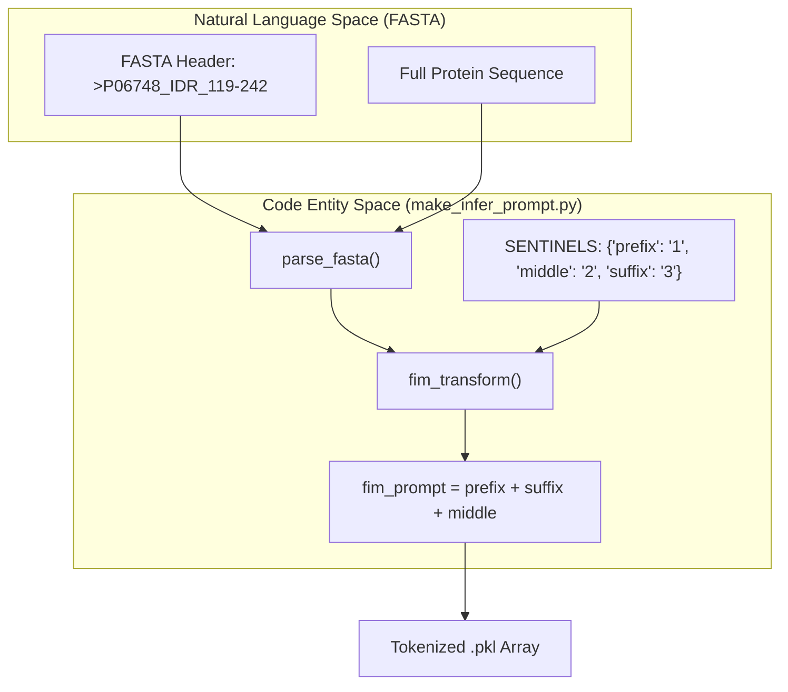
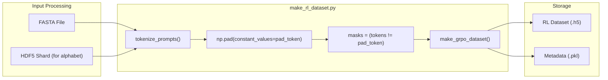

# Inference Prompt Generation

Relevant source files

The following files were used as context for generating this wiki page:

- [entrypoints/generate/scripts/example_sequence.fasta](entrypoints/generate/scripts/example_sequence.fasta)
- [entrypoints/generate/scripts/example_sequences.fasta](entrypoints/generate/scripts/example_sequences.fasta)
- [src/idiom/scripts/data/make_infer_prompt.py](src/idiom/scripts/data/make_infer_prompt.py)
- [src/idiom/scripts/data/make_rl_dataset.py](src/idiom/scripts/data/make_rl_dataset.py)

The inference pipeline in IDiom relies on structured prompts to guide the `GeometricMolTransformer` during sequence generation. These prompts are derived from FASTA files or synthetic sentinel sequences and are transformed into tokenized arrays. The two primary scripts responsible for this are `make_infer_prompt.py` for standard inference and `make_rl_dataset.py` for reinforcement learning (RL) post-training.

## Overview of Prompt Types

The system supports two distinct generation modes, each requiring a specific prompt structure:

1.  **IDP (Intrinsically Disordered Protein) Generation**: Unprompted generation of entire sequences. The prompt is a fixed sentinel sequence `132`, where `1` is the prefix sentinel, `3` is the suffix sentinel, and `2` is the middle sentinel [src/idiom/scripts/data/make_infer_prompt.py:18-18]().
2.  **IDR (Intrinsically Disordered Region) Generation**: Fill-In-the-Middle (FIM) generation where a specific region is generated within a provided protein context [src/idiom/scripts/data/make_infer_prompt.py:53-57]().

### Prompt Structure Diagram
The following diagram illustrates how raw protein data is transformed into the internal FIM prompt format used by the model.

**FIM Transformation Logic**

Sources: [src/idiom/scripts/data/make_infer_prompt.py:18-18](), [src/idiom/scripts/data/make_infer_prompt.py:53-57](), [src/idiom/scripts/data/make_infer_prompt.py:60-75]().

---

## Inference Prompt Creation (`make_infer_prompt.py`)

The `make_infer_prompt.py` script serves as the CLI entrypoint for generating prompts for the `transformer_infer` pipeline. It processes input FASTA files and outputs two files: a `.pkl` file containing tokenized integer arrays and a metadata `.pkl` file containing the original strings [src/idiom/scripts/data/make_infer_prompt.py:37-51]().

### Subcommands and Logic

| Subcommand | Input | Output Prompt | Description |
| :--- | :--- | :--- | :--- |
| `idp` | `--num_duplicates` | `132` | Creates a batch of identical sentinel-only prompts for generating new IDPs from scratch [src/idiom/scripts/data/make_infer_prompt.py:78-88](). |
| `idr` | FASTA file | `<prefix>3<suffix>2` | Extracts context from a FASTA sequence based on header indices (e.g., `_IDR_119-242`) and constructs a FIM prompt [src/idiom/scripts/data/make_infer_prompt.py:90-139](). |

### FIM Transformation
The function `fim_transform` implements the logic for rearranging a sequence into the Fill-In-the-Middle format [src/idiom/scripts/data/make_infer_prompt.py:53-57]():
1.  **Prefix**: Residues before the target IDR.
2.  **Middle**: The target IDR residues (to be predicted).
3.  **Suffix**: Residues after the target IDR.
4.  **Result**: `SENTINEL_PREFIX + prefix + SENTINEL_SUFFIX + suffix + SENTINEL_MIDDLE + middle`.

For inference, the `fim_prompt` is truncated at the `SENTINEL_MIDDLE` token, allowing the model to autoregressively complete the "middle" portion [src/idiom/scripts/data/make_infer_prompt.py:118-119]().

Sources: [src/idiom/scripts/data/make_infer_prompt.py:18-18](), [src/idiom/scripts/data/make_infer_prompt.py:53-57](), [src/idiom/scripts/data/make_infer_prompt.py:78-139]().

---

## RL Dataset Generation (`make_rl_dataset.py`)

Reinforcement Learning via GRPO requires a more structured dataset than standard inference. The `make_rl_dataset.py` script extends the prompt generation logic to create HDF5 datasets compatible with `TransformerOnlineDataset` [src/idiom/scripts/data/make_rl_dataset.py:45-51]().

### Data Flow for RL Training
The RL pipeline requires padded token arrays and attention masks to handle batching during the generation phase of the GRPO loop.

**RL Dataset Preparation Flow**

Sources: [src/idiom/scripts/data/make_rl_dataset.py:27-54](), [src/idiom/scripts/data/make_rl_dataset.py:124-141]().

### Key Differences from Inference Prompts
While `make_infer_prompt.py` outputs variable-length sequences in a pickle list, `make_rl_dataset.py` performs the following additional steps:
*   **Padding**: All prompts are padded to the length of the longest prompt in the batch using the `TOK_PAD` value retrieved from the shard metadata [src/idiom/scripts/data/make_rl_dataset.py:32-41]().
*   **Masking**: Generates a binary mask dataset (`1` for real tokens, `0` for padding) [src/idiom/scripts/data/make_rl_dataset.py:42-42]().
*   **Metadata Copying**: Copies the `alphabet` and `input_metadata` groups from a reference precomputed HDF5 shard to ensure tokenization consistency during training [src/idiom/scripts/data/make_rl_dataset.py:50-51]().

Sources: [src/idiom/scripts/data/make_rl_dataset.py:27-54]().

---

## Implementation Details

### Tokenization
Both scripts use the `CharTokenizer` [src/idiom/nn/transformer/utils/tokenizer.py]() and a reference `alphabet` loaded from an existing HDF5 shard [src/idiom/scripts/data/make_infer_prompt.py:21-25](). This ensures that the integer indices used in the prompts exactly match those used during the model's pre-training phase.

### FASTA Parsing Requirements
For IDR (prompted) generation, the FASTA headers must follow a specific format: `>Accession_IDR_Start-End`. The script parses these indices to slice the sequence correctly [src/idiom/scripts/data/make_infer_prompt.py:98-112]().
*   **Example Header**: `>P06748_IDR_119-242` [entrypoints/generate/scripts/example_sequence.fasta:1-1]()
*   The indices are 1-indexed (standard FASTA/UniProt convention) and are converted to 0-indexed internally [src/idiom/scripts/data/make_infer_prompt.py:114-115]().

### Output Files
| File Extension | Content | Usage |
| :--- | :--- | :--- |
| `_array.pkl` | List of `np.int32` arrays | Loaded by `transformer_infer` to seed generation. |
| `_metadata.pkl` | Dictionary with `prompts` and `metadata_list` | Used to map generated sequences back to their source proteins/headers. |
| `_dataset.h5` | HDF5 with `tokens`, `masks`, and `alphabet` | Loaded by `TransformerOnlineDataset` for GRPO training. |

Sources: [src/idiom/scripts/data/make_infer_prompt.py:27-34](), [src/idiom/scripts/data/make_infer_prompt.py:37-51](), [src/idiom/scripts/data/make_rl_dataset.py:44-54]().

---