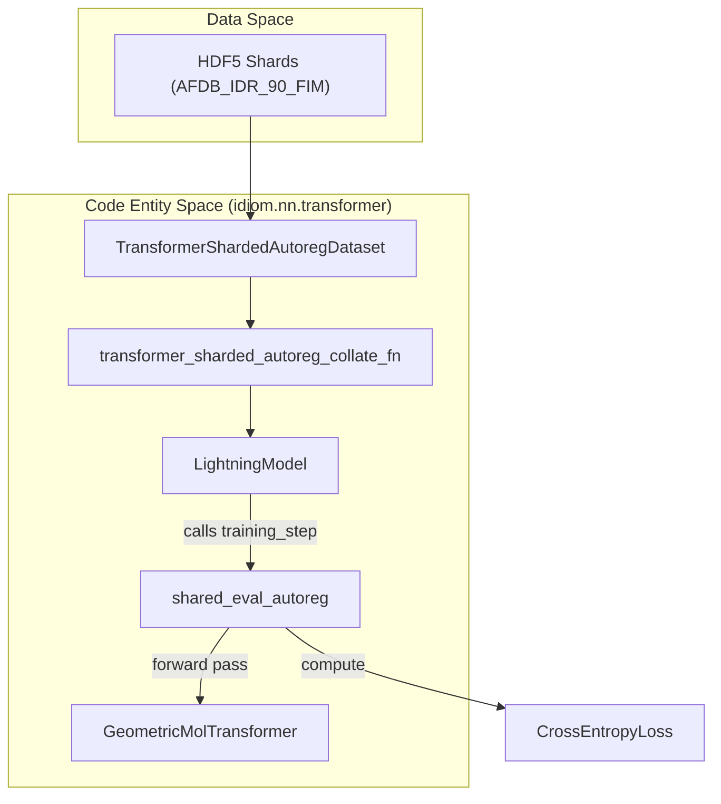
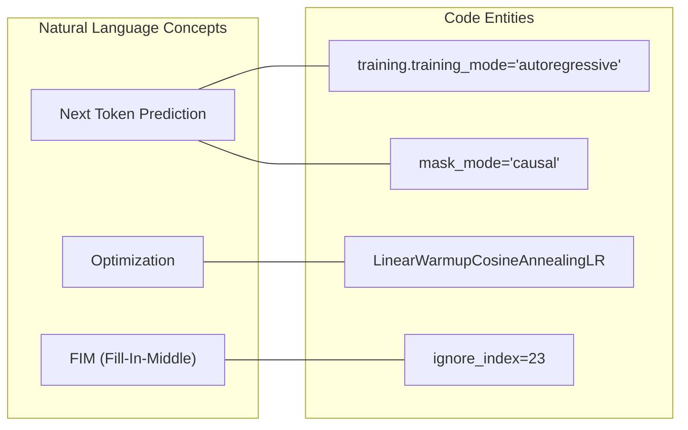

# Pre-training

Relevant source files

The following files were used as context for generating this wiki page:

- [entrypoints/train/pre-train/pretrain.bash](entrypoints/train/pre-train/pretrain.bash)
- [entrypoints/train/pre-train/pretrain_small.bash](entrypoints/train/pre-train/pretrain_small.bash)

The pre-training stage is the first phase of the IDiom lifecycle, where the `GeometricMolTransformer` is trained to learn the statistical distribution of intrinsically disordered regions (IDRs). Using a large-scale dataset derived from the AlphaFold Protein Structure Database (AFDB), the model is trained via an autoregressive objective with Fill-In-the-Middle (FIM) capabilities. This stage establishes the foundational sequence-to-sequence understanding required for subsequent zero-shot generation or Reinforcement Learning (RL) fine-tuning.

### Pre-training Overview and Data Flow

Pre-training utilizes sharded HDF5 datasets to stream protein sequences through a causal transformer. The primary entrypoint is the `transformer_train` CLI, which orchestrates the training loop using PyTorch Lightning.

| Component | Description |
| :--- | :--- |
| **Dataset** | `AFDB_IDR_90_FIM`: A dataset of IDRs clustered at 90% identity, transformed into FIM format [entrypoints/train/pre-train/pretrain.bash:29-29](). |
| **Model** | `GeometricMolTransformer` configured with 12 layers and a model dimension of 896 [entrypoints/train/pre-train/pretrain.bash:48-52](). |
| **Objective** | Autoregressive next-token prediction with `CrossEntropyLoss` [entrypoints/train/pre-train/pretrain.bash:65-65](). |
| **Optimizer** | `AdamW` with a `LinearWarmupCosineAnnealingLR` schedule [entrypoints/train/pre-train/pretrain.bash:56-56](). |

**Data Flow: From Shards to Loss**
The following diagram illustrates how the pre-training pipeline connects data entities to the training loop.

"Pre-training Data Flow"

Sources: [entrypoints/train/pre-train/pretrain.bash:35-52](), [entrypoints/train/pre-train/pretrain.bash:65-69]()

---

### Pre-training Entrypoints and Configuration

The pre-training process is managed through SLURM-ready bash scripts that define the environment, hardware allocation, and Hydra configuration overrides.

*   **Standard Pre-training**: `pretrain.bash` is configured for high-performance clusters, requesting 8 GPUs and 128 CPUs [entrypoints/train/pre-train/pretrain.bash:4-5]().
*   **Small-scale Pre-training**: `pretrain_small.bash` provides a configuration for debugging or smaller datasets using 2 GPUs [entrypoints/train/pre-train/pretrain_small.bash:4-4]().

These scripts invoke `transformer_train`, which utilizes Hydra to compose the model architecture (e.g., `n_layers=12`, `num_heads=14`) and training parameters (e.g., `max_steps=250000`) [entrypoints/train/pre-train/pretrain.bash:50-67]().

For details on resource requests, SLURM setup, and the specific Hydra YAML structure, see **[Pre-training Entrypoints and Configuration (#4.1)]**.

Sources: [entrypoints/train/pre-train/pretrain.bash:1-72](), [entrypoints/train/pre-train/pretrain_small.bash:1-76]()

---

### Autoregressive Training Loop

The training logic is encapsulated within the `LightningModel` class, which implements the autoregressive objective. During each `training_step`, the model processes input sequences where a specific `ignore_index` (typically 23 for the IDiom alphabet) is used to mask non-target tokens in the loss calculation [entrypoints/train/pre-train/pretrain.bash:69-69]().

**System Logic: Natural Language to Code**
The bridge between the conceptual training objective and the implementation in `idiom`.

"Autoregressive Logic Bridge"

Sources: [entrypoints/train/pre-train/pretrain.bash:49-65](), [entrypoints/train/pre-train/pretrain.bash:69-74]()

Key features of the loop include:
*   **Mixed-Precision Training**: Leveraged via PyTorch Lightning for efficiency.
*   **Checkpointing**: Strategy for saving the `best_model` based on validation performance and `restart_checkpoint` every 1000 steps [entrypoints/train/pre-train/pretrain.bash:60-63]().
*   **Validation**: Periodic evaluation controlled by `val_check_interval` to monitor perplexity and loss [entrypoints/train/pre-train/pretrain.bash:68-68]().

For a deep dive into the loss functions, gradient accumulation, and the `shared_eval_autoreg` method, see **[Autoregressive Training Loop (#4.2)]**.

Sources: [entrypoints/train/pre-train/pretrain.bash:44-68]()

---