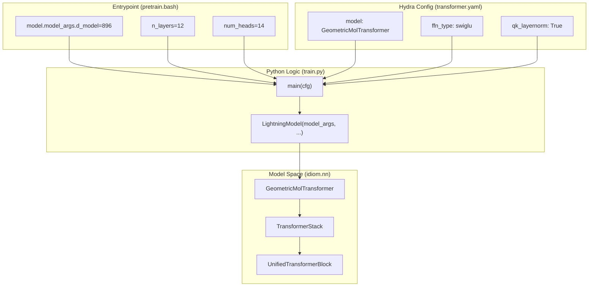
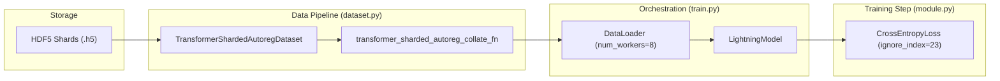

# Pre-training Entrypoints and Configuration

Relevant source files

The following files were used as context for generating this wiki page:

- [entrypoints/train/pre-train/pretrain.bash](entrypoints/train/pre-train/pretrain.bash)
- [entrypoints/train/pre-train/pretrain_small.bash](entrypoints/train/pre-train/pretrain_small.bash)
- [src/idiom/scripts/cfgs/model/transformer.yaml](src/idiom/scripts/cfgs/model/transformer.yaml)
- [src/idiom/scripts/cfgs/training.yaml](src/idiom/scripts/cfgs/training.yaml)
- [src/idiom/scripts/cfgs/training/transformer.yaml](src/idiom/scripts/cfgs/training/transformer.yaml)
- [src/idiom/scripts/transformer/train.py](src/idiom/scripts/transformer/train.py)

The pre-training stage of IDiom establishes the foundational language model for Intrinsically Disordered Regions (IDRs) and Intrinsically Disordered Proteins (IDPs). This process utilizes a large-scale dataset of sequences processed via Fill-In-the-Middle (FIM) transformations to enable both autoregressive generation and contextual infilling.

## Entrypoint Scripts and SLURM Configuration

IDiom provides two primary bash scripts for initiating pre-training on high-performance computing (HPC) clusters using the SLURM workload manager. These scripts handle environment activation, resource allocation, and the execution of the `transformer_train` CLI tool.

### Resource Requests
The pre-training process is computationally intensive, requiring significant GPU resources and memory.

| Parameter | `pretrain.bash` | `pretrain_small.bash` |
| :--- | :--- | :--- |
| **GPUs** | 8 (typically A100/H100) | 2 |
| **CPUs per Task** | 16 | 16 |
| **Memory per CPU** | 16GB | 16GB |
| **Time Limit** | 7 days | 7 days |

### Environment Setup
Both scripts follow a standardized initialization sequence:
1.  Identify the repository root and script directory [entrypoints/train/pre-train/pretrain.bash:18-19]().
2.  Activate the virtual environment located at `${REPO_ROOT}/.venv/bin/activate` [entrypoints/train/pre-train/pretrain.bash:23]().
3.  Set `PYTHONUNBUFFERED=1` to ensure real-time logging to SLURM output files [entrypoints/train/pre-train/pretrain.bash:26]().
4.  Define the path to the precomputed HDF5 shards (e.g., `AFDB_IDR_90_FIM_512_parts`) [entrypoints/train/pre-train/pretrain.bash:29]().

**Sources:** [entrypoints/train/pre-train/pretrain.bash:1-30](), [entrypoints/train/pre-train/pretrain_small.bash:1-34]()

---

## Model Architecture Parameters

The pre-training scripts override the default Hydra configuration to define a specific transformer architecture optimized for protein sequence modeling.

### Core Architecture (GeometricMolTransformer)
The model is instantiated as a `GeometricMolTransformer` [entrypoints/train/pre-train/pretrain.bash:48](). The standard configuration used in IDiom pre-training includes:

*   **Layers**: 12 Transformer blocks [entrypoints/train/pre-train/pretrain.bash:50]().
*   **Model Dimension ($d_{model}$)**: 896 [entrypoints/train/pre-train/pretrain.bash:52]().
*   **Attention Heads**: 14 heads [entrypoints/train/pre-train/pretrain.bash:53]().
*   **Feed-Forward Network (FFN)**: SwiGLU activation with an expansion ratio of 2.666 (8/3) [src/idiom/scripts/cfgs/model/transformer.yaml:16-18]().
*   **Normalization**: LayerNorm with Query-Key (QK) Layernorm enabled in the attention mechanism [src/idiom/scripts/cfgs/model/transformer.yaml:13-17]().
*   **Mask Mode**: `causal`, ensuring the model only attends to previous tokens during pre-training [entrypoints/train/pre-train/pretrain.bash:49]().

### Configuration Flow: CLI to Model
The following diagram illustrates how parameters from the entrypoint scripts propagate through the Hydra configuration into the model initialization.

**Architecture Parameter Propagation**

**Sources:** [entrypoints/train/pre-train/pretrain.bash:47-57](), [src/idiom/scripts/cfgs/model/transformer.yaml:1-18](), [src/idiom/scripts/transformer/train.py:100-102]()

---

## Training Schedule and Optimizer

IDiom uses the `AdamW` optimizer paired with a `LinearWarmupCosineAnnealingLR` schedule to stabilize training over hundreds of thousands of steps.

### Hyperparameters
*   **Base Learning Rate**: $4.0 \times 10^{-4}$ [entrypoints/train/pre-train/pretrain.bash:55]().
*   **Minimum Learning Rate ($\eta_{min}$)**: $4.0 \times 10^{-5}$ [entrypoints/train/pre-train/pretrain.bash:59]().
*   **Warmup Period**: 3,000 steps [entrypoints/train/pre-train/pretrain.bash:57]().
*   **Maximum Steps**: 250,000 steps [entrypoints/train/pre-train/pretrain.bash:67]().
*   **Precision**: `16-mixed` (FP16 mixed precision) is the default in the training config [src/idiom/scripts/cfgs/training/transformer.yaml:35]().

### Loss Function
Pre-training uses `CrossEntropyLoss` with a specific `ignore_index` of **23** [entrypoints/train/pre-train/pretrain.bash:69](). This index corresponds to padding or specific non-amino acid tokens in the FIM alphabet that should not contribute to the gradient.

**Sources:** [entrypoints/train/pre-train/pretrain.bash:54-74](), [src/idiom/scripts/cfgs/training/transformer.yaml:5-12]()

---

## Data Loading and Checkpointing

### Sharded Data Loading
Because the AFDB dataset is too large to fit in memory, IDiom utilizes `TransformerShardedAutoregDataset` [entrypoints/train/pre-train/pretrain.bash:35](). 
*   **Streaming**: Data is streamed from HDF5 shards using `data_in_memory=False` [entrypoints/train/pre-train/pretrain.bash:45]().
*   **Collation**: The `transformer_sharded_autoreg_collate_fn` handles batching of the sharded sequences [entrypoints/train/pre-train/pretrain.bash:36]().
*   **Splits**: The data is split into 99% training, 0.5% validation, and 0.5% test [entrypoints/train/pre-train/pretrain.bash:39-41]().

### Checkpointing Strategy
The `train.py` script configures two distinct `ModelCheckpoint` callbacks from PyTorch Lightning:

1.  **Best Model**: Monitors `validation/loss` and saves the top-1 model with the filename `best_model_{step}` [entrypoints/train/pre-train/pretrain.bash:60](), [src/idiom/scripts/cfgs/training/transformer.yaml:24-28]().
2.  **Restart Checkpoint**: Saves every 1,000 training steps to a file named `restart_checkpoint` to allow for recovery from hardware failures or preemption [entrypoints/train/pre-train/pretrain.bash:61-64]().

**Data Flow: Shards to Training Step**

**Sources:** [src/idiom/scripts/transformer/train.py:33-81](), [src/idiom/scripts/transformer/train.py:86-94](), [entrypoints/train/pre-train/pretrain.bash:35-46]()

---

## Hydra Configuration Structure

The system uses Hydra to compose configurations from the `cfgs/` directory.

*   **`training.yaml`**: The primary entrypoint config that defines global arguments like `seed` and `savedir` [src/idiom/scripts/cfgs/training.yaml:13-18]().
*   **`data/transformer.yaml`**: Defines dataset classes and dataloader parameters.
*   **`model/transformer.yaml`**: Contains the `GeometricMolTransformer` hyperparameters [src/idiom/scripts/cfgs/model/transformer.yaml:1-18]().
*   **`training/transformer.yaml`**: Contains the PyTorch Lightning `Trainer` arguments, including `max_steps`, `devices`, and `val_check_interval` [src/idiom/scripts/cfgs/training/transformer.yaml:29-41]().

CLI overrides in the bash scripts use the Hydra syntax (e.g., `++` to add new keys or `key=value` to override existing ones) to customize the run without modifying the YAML files directly [entrypoints/train/pre-train/pretrain.bash:34-72]().

**Sources:** [src/idiom/scripts/cfgs/training.yaml:1-5](), [src/idiom/scripts/cfgs/training/transformer.yaml:1-51](), [src/idiom/scripts/transformer/train.py:20-24]()

---