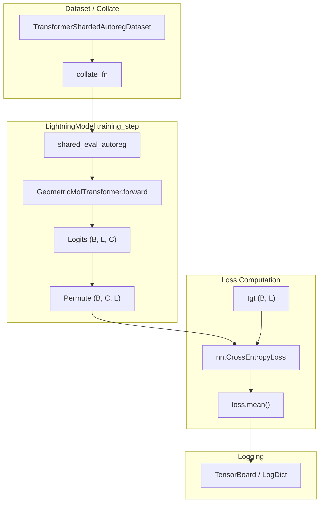
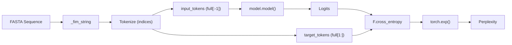

# Autoregressive Training Loop

Relevant source files

The following files were used as context for generating this wiki page:

- [src/idiom/nn/transformer/losses/autoreg_loss.py](src/idiom/nn/transformer/losses/autoreg_loss.py)
- [src/idiom/nn/transformer/module.py](src/idiom/nn/transformer/module.py)
- [src/idiom/nn/transformer/utils/calculate_perplexity.py](src/idiom/nn/transformer/utils/calculate_perplexity.py)
- [src/idiom/nn/transformer/utils/perplexity.py](src/idiom/nn/transformer/utils/perplexity.py)

The autoregressive training loop is the primary mechanism for pre-training the **GeometricMolTransformer** on protein sequences. In this mode, the model is trained to predict the next token in a sequence given the preceding context, utilizing the Fill-In-the-Middle (FIM) transformation to handle intrinsically disordered regions (IDRs) and flanking sequences.

## Orchestration and Loss Calculation

The training process is managed by the `LightningModel` class, which wraps the transformer architecture in a PyTorch Lightning module [src/idiom/nn/transformer/module.py:13-14](). When the `training_mode` is set to `"autoregressive"`, the model utilizes standard cross-entropy loss to optimize sequence prediction [src/idiom/nn/transformer/module.py:112-113]().

### The `shared_eval_autoreg` Function
The core logic for a single training step is encapsulated in `shared_eval_autoreg`. This function handles the forward pass and loss computation for both training and validation phases [src/idiom/nn/transformer/losses/autoreg_loss.py:1-18]().

1.  **Input Unpacking**: The batch is unpacked into structural tokens, source tokens, padding masks, target tokens, and sequence identifiers [src/idiom/nn/transformer/losses/autoreg_loss.py:19]().
2.  **Forward Pass**: The `GeometricMolTransformer` (accessed via `lightning_module.model`) processes the input [src/idiom/nn/transformer/losses/autoreg_loss.py:20-22]().
3.  **Logit Permutation**: Output logits are permuted from shape `(B, L, C)` to `(B, C, L)` to satisfy the requirements of `torch.nn.CrossEntropyLoss` [src/idiom/nn/transformer/losses/autoreg_loss.py:23-25]().
4.  **Loss Computation**: The loss is calculated against the `tgt` tensor and averaged across the batch [src/idiom/nn/transformer/losses/autoreg_loss.py:26-27]().

**Sources:** [src/idiom/nn/transformer/module.py:13-121](), [src/idiom/nn/transformer/losses/autoreg_loss.py:1-30]()

## Implementation Details

### Cross-Entropy and Padding
The training loop utilizes `nn.CrossEntropyLoss` with a specific `ignore_index` set to the padding token (`TOK_PAD`) [src/idiom/nn/transformer/module.py:113-120](). This ensures that the model is not penalized for predictions made on padding tokens, which are appended to sequences to form uniform batches.

### Data Flow and Tensors
The following diagram illustrates the transformation of data from the dataset through the `LightningModel` during an autoregressive training step.

**Diagram: Autoregressive Step Data Flow**

**Sources:** [src/idiom/nn/transformer/losses/autoreg_loss.py:19-30](), [src/idiom/nn/transformer/module.py:112-121]()

## Perplexity and Evaluation

Beyond the raw loss value, the model's performance is often evaluated using **Perplexity (PPL)**. Perplexity is calculated as the exponential of the cross-entropy loss [src/idiom/nn/transformer/utils/perplexity.py:112-117]().

The system distinguishes between two types of perplexity during evaluation:
*   **IDR-only Perplexity**: Calculated only on the tokens following the '2' (FIM IDR) sentinel [src/idiom/nn/transformer/utils/perplexity.py:111-117]().
*   **Full-sequence Perplexity**: Calculated across the entire FIM-formatted string [src/idiom/nn/transformer/utils/perplexity.py:120-125]().

### Evaluation Workflow
The evaluation utilities perform a manual forward pass without gradient tracking to score FASTA datasets [src/idiom/nn/transformer/utils/calculate_perplexity.py:81-83]().

**Diagram: Perplexity Calculation Logic**

**Sources:** [src/idiom/nn/transformer/utils/perplexity.py:65-127](), [src/idiom/nn/transformer/utils/calculate_perplexity.py:102-126]()

## Logging and Precision

*   **TensorBoard Logging**: Metrics are logged using `lightning_module.log_dict` with `sync_dist=True` to ensure consistency across multiple GPUs in distributed training [src/idiom/nn/transformer/losses/autoreg_loss.py:28-29]().
*   **Gradient Accumulation and Precision**: These are handled via the Hydra configuration and the PyTorch Lightning `Trainer`. Typical pre-training uses 16-bit mixed precision (`precision: 16-mixed`) to optimize memory usage and throughput.
*   **Gradient Norm**: The `LightningModel` captures the gradient norm for monitoring training stability [src/idiom/nn/transformer/module.py:5]().

**Sources:** [src/idiom/nn/transformer/losses/autoreg_loss.py:29](), [src/idiom/nn/transformer/module.py:5]()

---