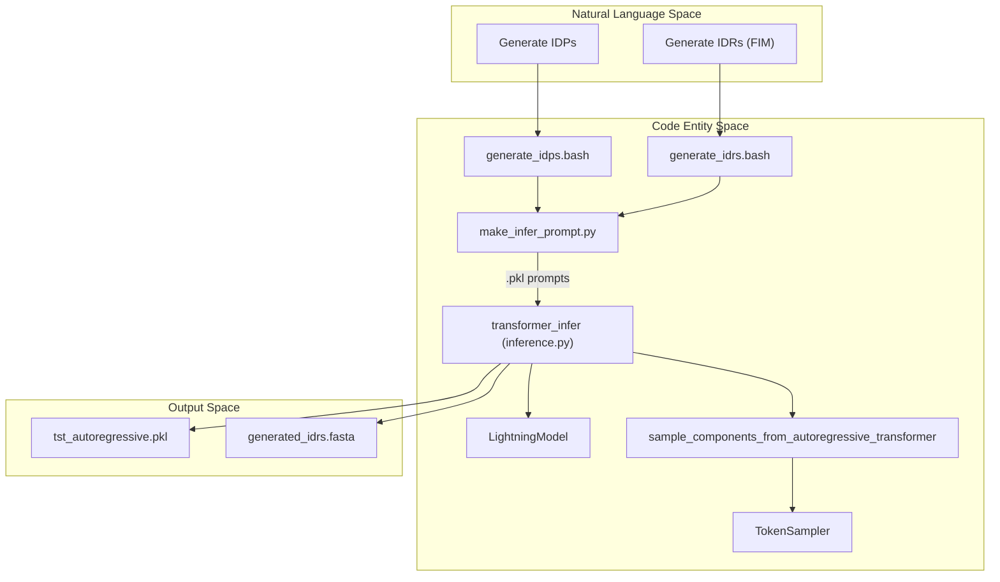
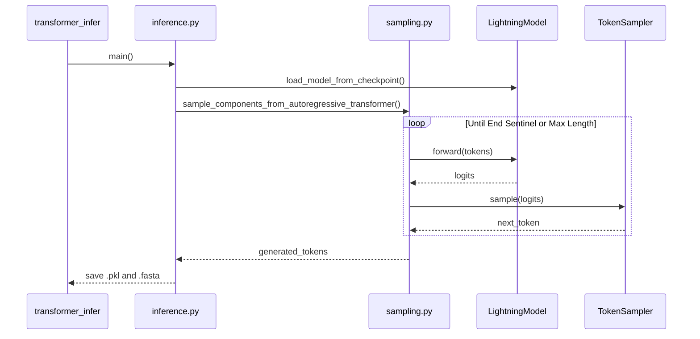

# Inference and Sequence Generation

Relevant source files

The following files were used as context for generating this wiki page:

- [entrypoints/generate/scripts/generate_idps.bash](entrypoints/generate/scripts/generate_idps.bash)
- [entrypoints/generate/scripts/generate_idrs.bash](entrypoints/generate/scripts/generate_idrs.bash)
- [src/idiom/scripts/transformer/inference.py](src/idiom/scripts/transformer/inference.py)

The inference pipeline in IDiom is designed to leverage trained `GeometricMolTransformer` checkpoints for the autoregressive generation of Intrinsically Disordered Proteins (IDPs) and Intrinsically Disordered Regions (IDRs). The system supports both unprompted generation (creating novel IDPs from scratch) and prompted generation (using Fill-In-the-Middle/FIM to generate IDRs within a provided protein scaffold).

The pipeline utilizes a multi-GPU sampling engine that handles batching and rejection sampling based on sequence length constraints.

### High-Level Inference Flow

The following diagram illustrates the transition from high-level generation requests to the execution of code entities within the inference pipeline.

**Inference Architecture and Data Flow**

Sources: [entrypoints/generate/scripts/generate_idps.bash:21-102](), [entrypoints/generate/scripts/generate_idrs.bash:17-99](), [src/idiom/scripts/transformer/inference.py:52-110]()

---

## Generation Entrypoints

IDiom provides several Bash entrypoints for sequence generation, typically executed via SLURM. These scripts orchestrate the creation of prompts and the invocation of the `transformer_infer` CLI.

*   **Unprompted Generation**: `generate_idps.bash` creates start-sentinel prompts and generates full-length IDP sequences.
*   **Prompted Generation (FIM)**: `generate_idrs.bash` takes an input FASTA, identifies regions for replacement, and uses the FIM (Fill-In-the-Middle) capability to generate IDRs.
*   **Length-Controlled Generation**: `generate_idps_length.bash` and `generate_idrs_length.bash` utilize a rejection sampling loop to ensure generated sequences fall within a specific residue count range.

For details on CLI arguments and SLURM configuration, see [Generation Entrypoints: IDPs and IDRs](#5.1).

**Sources:** [entrypoints/generate/scripts/generate_idps.bash:1-104](), [entrypoints/generate/scripts/generate_idrs.bash:1-101]()

---

## Autoregressive Sampling Engine

The core of the inference pipeline is the sampling engine located in `src/idiom/nn/transformer/utils/sampling.py`. This engine manages the iterative process of token prediction and selection.

### Core Sampling Logic
1.  **Model Loading**: The `LightningModel` class loads the weights from a `.ckpt` file [src/idiom/scripts/transformer/inference.py:52-56]().
2.  **Dispatch**: `sample_components_from_autoregressive_transformer` handles batched multi-GPU execution [src/idiom/scripts/transformer/inference.py:102-110]().
3.  **Token Selection**: The `TokenSampler` class implements strategies such as `top-k`, `top-p` (nucleus sampling), and standard temperature-based sampling [src/idiom/scripts/transformer/inference.py:59-59]().
4.  **Rejection Loop**: For length-constrained generation, `run_inference_on_gpu_length_filtered` continues generating sequences until the requested number of valid-length sequences is reached [src/idiom/scripts/transformer/inference.py:130-151]().

**Sampling Sequence Diagram**

Sources: [src/idiom/scripts/transformer/inference.py:52-115](), [src/idiom/nn/transformer/utils/sampling.py:1-20]()

For a deep dive into the sampling functions and token selection strategies, see [Autoregressive Sampling Engine](#5.2).

---

## Inference Configuration

Inference is controlled via Hydra configuration files (typically `inference.yaml`). Key parameters include:
*   `checkpoint_path`: Path to the trained model [entrypoints/generate/scripts/generate_idps.bash:92]().
*   `sampler_args`: Configuration for `method`, `temperature`, and `sample_val` [entrypoints/generate/scripts/generate_idps.bash:98-100]().
*   `addn_args`: Includes `use_input_residues` (to toggle FIM/Prompting) and `residues_path` for the prompt `.pkl` file [entrypoints/generate/scripts/generate_idps.bash:101-102]().

**Sources:** [entrypoints/generate/scripts/generate_idps.bash:91-102](), [src/idiom/scripts/transformer/inference.py:24-40]()

---