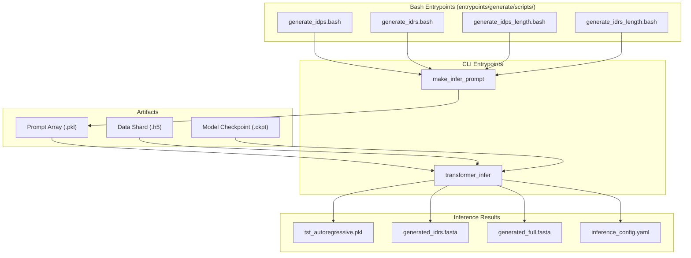
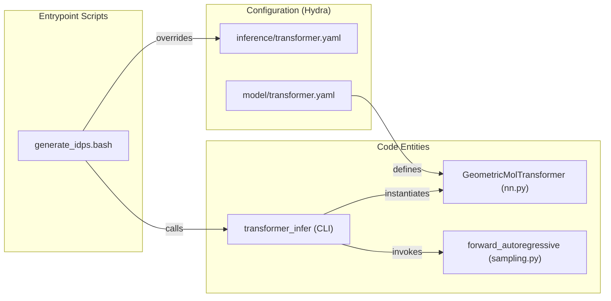

# Generation Entrypoints: IDPs and IDRs

Relevant source files

The following files were used as context for generating this wiki page:

- [entrypoints/generate/scripts/generate_idps.bash](entrypoints/generate/scripts/generate_idps.bash)
- [entrypoints/generate/scripts/generate_idps_length.bash](entrypoints/generate/scripts/generate_idps_length.bash)
- [entrypoints/generate/scripts/generate_idrs.bash](entrypoints/generate/scripts/generate_idrs.bash)
- [entrypoints/generate/scripts/generate_idrs_length.bash](entrypoints/generate/scripts/generate_idrs_length.bash)
- [src/idiom/scripts/cfgs/inference.yaml](src/idiom/scripts/cfgs/inference.yaml)
- [src/idiom/scripts/cfgs/inference/transformer.yaml](src/idiom/scripts/cfgs/inference/transformer.yaml)

This page documents the primary entrypoints for sequence generation in IDiom. It covers the four bash scripts used to generate unprompted Intrinsically Disordered Proteins (IDPs) and prompted Intrinsically Disordered Regions (IDRs), including variants for length-controlled generation. These scripts orchestrate the transition from prompt creation to transformer inference.

## Generation Workflow Overview

Generation follows a two-step process:
1.  **Prompt Generation**: The `make_infer_prompt` CLI utility creates `.pkl` files containing tokenized starting sequences (sentinels or flanking residues).
2.  **Transformer Inference**: The `transformer_infer` CLI utility loads a model checkpoint and performs autoregressive sampling based on those prompts.

### Data Flow Diagram

The following diagram illustrates the relationship between the bash entrypoints, the CLI tools, and the resulting file artifacts.

**Generation Data Flow**

**Sources:** [entrypoints/generate/scripts/generate_idps.bash:38-102](), [entrypoints/generate/scripts/generate_idrs.bash:34-99]()

---

## IDP Generation (Unprompted)

Unprompted generation creates entirely new IDP sequences. In the context of IDiom, this is achieved by providing a prompt consisting of the `132` sentinel sequence, which signals the start of a disordered region in the Fill-In-the-Middle (FIM) scheme.

### generate_idps.bash
This script generates a specified number of IDPs using a pretrained base model.

*   **Step 1**: Calls `make_infer_prompt` with the `idp` positional argument to create a prompt array [entrypoints/generate/scripts/generate_idps.bash:43-47]().
*   **Step 2**: Executes `transformer_infer` using the generated prompt [entrypoints/generate/scripts/generate_idps.bash:62-102]().
*   **Key Parameter**: `NUM_DUPLICATES` determines the total number of sequences to generate [entrypoints/generate/scripts/generate_idps.bash:25]().

### generate_idps_length.bash
A variant that adds length constraints. It uses Hydra overrides to specify a target length and tolerance.
*   **Logic**: Generation repeats until `NUM_DUPLICATES` valid sequences are collected within the range `[SEQ_LENGTH - SEQ_LENGTH_RANGE, SEQ_LENGTH + SEQ_LENGTH_RANGE]` [entrypoints/generate/scripts/generate_idps_length.bash:23-29]().
*   **Overrides**: Adds `++inference.addn_args.seq_length` and `++inference.addn_args.seq_length_range` to the `transformer_infer` command [entrypoints/generate/scripts/generate_idps_length.bash:110-111]().

**Sources:** [entrypoints/generate/scripts/generate_idps.bash:1-104](), [entrypoints/generate/scripts/generate_idps_length.bash:1-113]()

---

## IDR Generation (Prompted)

Prompted generation takes an existing protein sequence (via FASTA) and replaces a specific region (or generates a region between two structured domains) using FIM.

### generate_idrs.bash
This script is used to redesign or "in-fill" specific regions.

*   **Input**: Requires a FASTA file (e.g., `./example_sequences.fasta`) [entrypoints/generate/scripts/generate_idrs.bash:43]().
*   **Step 1**: `make_infer_prompt` processes the FASTA and a reference HDF5 shard to create FIM-encoded prompts [entrypoints/generate/scripts/generate_idrs.bash:38-44]().
*   **Step 2**: `transformer_infer` uses these prompts to sample residues that fit the provided context [entrypoints/generate/scripts/generate_idrs.bash:59-99]().

### generate_idrs_length.bash
Similar to the IDP variant, this enforces length constraints on the generated IDR segment while maintaining the structured flanking sequences from the input FASTA [entrypoints/generate/scripts/generate_idrs_length.bash:17-25]().

**Sources:** [entrypoints/generate/scripts/generate_idrs.bash:1-101](), [entrypoints/generate/scripts/generate_idrs_length.bash:1-111]()

---

## Configuration and SLURM Setup

The generation scripts are designed for high-performance computing environments using the SLURM workload manager.

### SLURM Configuration
The default scripts request:
*   **GPUs**: 4 GPUs per job (`--gpus=4`) [entrypoints/generate/scripts/generate_idps.bash:4]().
*   **Time**: 1 day limit (`--time=1-00:00:00`) [entrypoints/generate/scripts/generate_idps.bash:3]().
*   **Multi-GPU**: Multi-GPU inference is enabled via `inference.use_multi_gpu=True` [entrypoints/generate/scripts/generate_idps.bash:96]().

### Transformer Inference Arguments
The scripts provide a comprehensive set of Hydra overrides to ensure the model architecture and sampling parameters match the training configuration:

| Parameter | Value / Role |
| :--- | :--- |
| `model.model` | `GeometricMolTransformer` [entrypoints/generate/scripts/generate_idps.bash:64]() |
| `inference.batch_size` | Number of sequences per GPU batch (default 100) [entrypoints/generate/scripts/generate_idps.bash:95]() |
| `inference.sampler_args.method` | `full` (sampling from the full distribution) [entrypoints/generate/scripts/generate_idps.bash:98]() |
| `inference.sampler_args.temperature` | Controls randomness (default 1.0) [entrypoints/generate/scripts/generate_idps.bash:100]() |
| `inference.checkpoint_path` | Path to the `.ckpt` file to load [entrypoints/generate/scripts/generate_idps.bash:92]() |

**Sources:** [entrypoints/generate/scripts/generate_idps.bash:62-102](), [src/idiom/scripts/cfgs/inference/transformer.yaml:1-16]()

---

## Code Entity Association

This diagram bridges the bash script commands to the underlying Python classes and configuration files.

**Entity Mapping: Scripts to Code**

**Sources:** [src/idiom/scripts/cfgs/inference.yaml:1-6](), [src/idiom/scripts/cfgs/inference/transformer.yaml:1-16](), [entrypoints/generate/scripts/generate_idps.bash:62-64]()

---

## Output Files

The inference process populates the directory specified in `inference.savedir` [entrypoints/generate/scripts/generate_idps.bash:93]() with the following files:

1.  **`tst_autoregressive.pkl`**: A pickle file containing the raw generated token IDs and metadata.
2.  **`generated_idrs.fasta`**: A FASTA file containing only the generated disordered regions.
3.  **`generated_full.fasta`**: A FASTA file containing the full protein sequences (including structured flanks if prompted).
4.  **`inference_config.yaml`**: A dump of the Hydra configuration used for the run, ensuring reproducibility.

**Sources:** [entrypoints/generate/scripts/generate_idps.bash:58-59](), [src/idiom/scripts/cfgs/inference/transformer.yaml:2]()

---