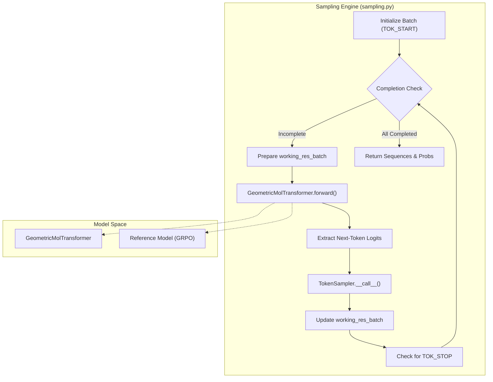
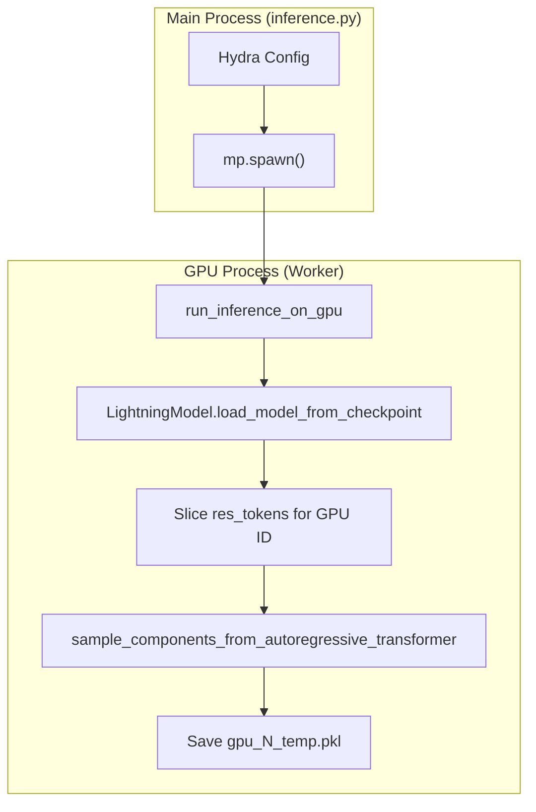

# Autoregressive Sampling Engine

Relevant source files

The following files were used as context for generating this wiki page:

- [src/idiom/nn/transformer/utils/misc.py](src/idiom/nn/transformer/utils/misc.py)
- [src/idiom/nn/transformer/utils/sampling.py](src/idiom/nn/transformer/utils/sampling.py)
- [src/idiom/scripts/transformer/inference.py](src/idiom/scripts/transformer/inference.py)
- [src/idiom/utils/sampler.py](src/idiom/utils/sampler.py)

The Autoregressive Sampling Engine is the core component responsible for generating protein sequences from the `GeometricMolTransformer`. It supports unprompted generation (creating new IDPs from scratch), prompted generation (filling in IDRs using Fill-In-the-Middle/FIM), and online generation for Reinforcement Learning (GRPO). The engine manages batched multi-GPU execution, temperature-scaled sampling strategies, and length-filtered rejection sampling.

## Core Sampling Logic

The sampling logic is primarily implemented in `src/idiom/nn/transformer/utils/sampling.py`. It uses an iterative loop where the model predicts the next token based on the previous context until a stop sentinel is reached or a length limit is exceeded.

### Key Functions

*   **`forward_autoregressive`**: Handles unprompted generation. It initializes sequences with a `TOK_START` token and iteratively appends sampled residues [src/idiom/nn/transformer/utils/sampling.py:203-348]().
*   **`forward_autoregressive_prompted`**: Handles FIM-based generation. It takes a list of tensors (the prompts) and continues generation from the end of the provided sequence [src/idiom/nn/transformer/utils/sampling.py:9-164]().
*   **`sample_components_from_autoregressive_transformer`**: A high-level wrapper that dispatches to either the prompted or unprompted function based on the `use_input_residues` flag and manages batching [src/idiom/nn/transformer/utils/sampling.py:167-200]().
*   **`generate_sequences_online`**: Specialized version used during GRPO training to generate sequence groups for advantage calculation [src/idiom/nn/transformer/utils/sampling.py:351-460]().

### Sampling Data Flow

The following diagram illustrates how the sampling engine interacts with the transformer model and the sampler to produce sequences.

**Sampling Iteration Loop**

Sources: [src/idiom/nn/transformer/utils/sampling.py:68-148](), [src/idiom/nn/transformer/utils/sampling.py:397-446]()

## Token Selection with TokenSampler

The `TokenSampler` class provides a unified interface for different stochastic sampling strategies. It processes the raw logits from the transformer's last layer.

| Method | Description | Implementation |
| :--- | :--- | :--- |
| `top_k` | Samples from the $k$ most probable tokens, redistributing mass among them. | `_get_top_k_sample_batched` |
| `top_p` | Nucleus sampling; samples from the smallest set of tokens whose cumulative probability exceeds $p$. | `_get_top_p_sample` |
| `full` | Samples from the entire vocabulary distribution. | `_get_full_sample` |

The sampler also applies a `temperature` parameter to the logits before the softmax operation to control the "sharpness" of the distribution [src/idiom/utils/sampler.py:131-133]().

Sources: [src/idiom/utils/sampler.py:9-145]()

## Length-Filtered Rejection Sampling

In `inference.py`, the system implements a rejection sampling loop to ensure generated sequences meet specific length constraints (e.g., generating an IDR of exactly $100 \pm 10$ residues).

### Implementation Details
The function `run_inference_on_gpu_length_filtered` continues to generate batches until a target number of valid sequences is reached [src/idiom/scripts/transformer/inference.py:146-151]().

1.  **Generation**: A batch of sequences is generated using `sample_components_from_autoregressive_transformer` [src/idiom/scripts/transformer/inference.py:215-224]().
2.  **Validation**: Each sequence is checked against the `seq_length` and `seq_length_range` parameters.
3.  **Accumulation**: Only sequences within the valid range are saved to `valid_tokens` [src/idiom/scripts/transformer/inference.py:236-253]().
4.  **Termination**: The loop exits once `len(valid_tokens) >= num_seqs_needed`.

Sources: [src/idiom/scripts/transformer/inference.py:130-264]()

## Multi-GPU Dispatch

For large-scale inference, the system uses `torch.multiprocessing` to spawn independent processes across available GPUs.

**Inference Dispatch Architecture**

Sources: [src/idiom/scripts/transformer/inference.py:24-117](), [src/idiom/scripts/transformer/inference.py:448-500]()

## Online Generation for GRPO

During RL training, the sampling engine is used to generate groups of sequences for the same prompt to compute relative advantages.

*   **Group Generation**: `generate_sequences_online` creates `group_size` sequences for every prompt in the RL batch [src/idiom/nn/transformer/utils/sampling.py:351-355]().
*   **Log Probability Tracking**: It returns both the tokens and the `selected_probs` (the probability assigned to the token that was actually sampled), which are necessary for the PPO-style policy loss calculation [src/idiom/nn/transformer/utils/sampling.py:455-460]().
*   **Reference Model**: During "ERA online" (GRPO) mode, it can use a `reference_model` to generate sequences while the primary model is being updated [src/idiom/nn/transformer/utils/sampling.py:397-402]().

Sources: [src/idiom/nn/transformer/utils/sampling.py:351-460](), [src/idiom/nn/transformer/utils/misc.py:5-25]()

---