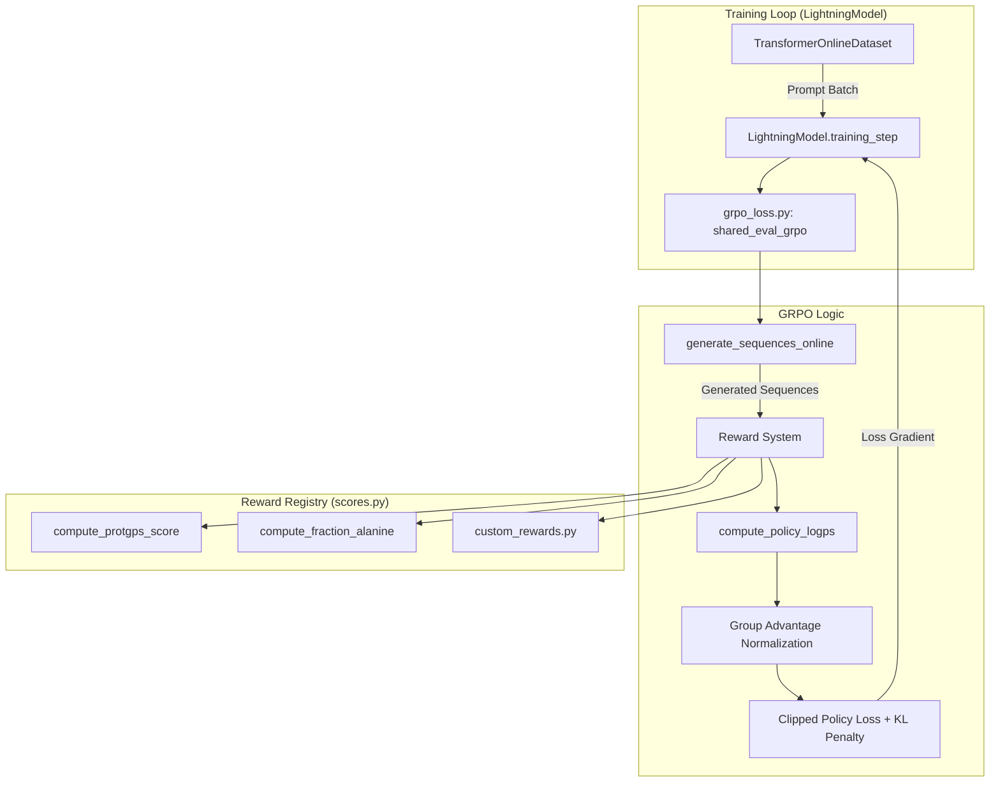

# RL Post-training with GRPO

<details>
<summary>Relevant source files</summary>

The following files were used as context for generating this wiki page:

- [entrypoints/train/post-train/train_rl_idp_protgps.bash](entrypoints/train/post-train/train_rl_idp_protgps.bash)
- [entrypoints/train/post-train/train_rl_idr_protgps.bash](entrypoints/train/post-train/train_rl_idr_protgps.bash)
- [src/idiom/nn/transformer/losses/grpo_loss.py](src/idiom/nn/transformer/losses/grpo_loss.py)

</details>


The **IDiom** framework supports reinforcement learning (RL) post-training to align the generative model with specific biological or structural objectives. Unlike standard autoregressive pre-training, which minimizes cross-entropy on existing sequences, RL post-training allows the model to explore the sequence space and receive feedback from external reward models or custom scoring functions.

The primary algorithm implemented is **Group Relative Policy Optimization (GRPO)**, which is particularly effective for sequence generation as it avoids the need for a separate value-function critic by using group-relative advantage estimation.

### Post-training Workflow

The post-training lifecycle follows a three-step process:
1.  **Dataset Preparation**: Generating prompts (IDP or IDR) using `make_rl_dataset` to define the starting conditions for RL episodes.
2.  **Online Generation**: During the training loop, the model generates multiple completions (a "group") for each prompt.
3.  **Reward & Optimization**: Each completion is scored, advantages are calculated relative to the group mean, and the policy is updated using a clipped PPO-style objective with a KL-divergence penalty to prevent catastrophic forgetting.

### System Architecture: RL Data Flow

The following diagram illustrates how the `LightningModel` coordinates with the GRPO loss and the reward system during a training step.

**RL Post-training Data Flow**

Sources: [src/idiom/nn/transformer/losses/grpo_loss.py:10-96](), [src/idiom/nn/transformer/module.py:250-280]() (implied by `training_mode`), [entrypoints/train/post-train/train_rl_idp_protgps.bash:88-148]()

### GRPO Algorithm Implementation
The implementation in `grpo_loss.py` focuses on stability and efficiency. Key features include:
*   **Group Advantage**: For every prompt, the model generates `group_size` sequences. The advantage for each sequence is its reward minus the mean reward of the group, normalized by the group standard deviation [src/idiom/nn/transformer/losses/grpo_loss.py:270-295]().
*   **KL Divergence**: A `beta_kl` penalty is applied to ensure the RL-tuned policy does not deviate too far from the original pre-trained "reference" model [src/idiom/nn/transformer/losses/grpo_loss.py:28-30]().
*   **Sequence Generation**: Uses `generate_sequences_online` from the sampling utilities to perform batched autoregressive decoding during the training step [src/idiom/nn/transformer/losses/grpo_loss.py:7-7]().

For a detailed breakdown of the mathematical implementation and the loss function, see **[GRPO Algorithm Implementation](#6.1)**.

### Reward Shaping and Registry
IDiom features a flexible reward system managed via a registry. This allows users to target specific protein properties:
*   **ProtGPS**: Integration with the ProtGPS model to optimize for localization in specific cellular compartments (e.g., stress granules, nucleoli) [entrypoints/train/post-train/train_rl_idp_protgps.bash:62-77]().
*   **Custom Rewards**: Users can define arbitrary functions in `custom_rewards.py` to optimize for features like charge density, hydrophobicity, or specific amino acid fractions [src/idiom/nn/transformer/losses/grpo_loss.py:83-95]().
*   **Multi-Objective Shaping**: Built-in support for "shaping" rewards using quadratic penalties for sequence length and Shannon entropy to maintain structural diversity [src/idiom/nn/transformer/losses/grpo_loss.py:47-55](), [src/idiom/nn/transformer/losses/grpo_loss.py:71-81]().

For details on available rewards and adding custom scorers, see **[Reward Functions and the Reward Registry](#6.2)**.

### Target Use Cases
The framework is optimized for two primary biological design tasks:

| Use Case | Description | Entrypoint Script |
| :--- | :--- | :--- |
| **IDP Localization** | Designing full Intrinsically Disordered Proteins (IDPs) that localize to specific condensates. | `train_rl_idp_protgps.bash` |
| **IDR Engineering** | Designing Intrinsically Disordered Regions (IDRs) to insert into existing folded protein scaffolds. | `train_rl_idr_protgps.bash` |

### Code Entity Map: RL Post-training

This diagram maps the high-level RL concepts to specific files and functions within the `idiom` codebase.

**RL Code Entity Map**
```mermaid
graph LR
    subgraph "Dataset & Entry"
        "make_rl_dataset" --> "TransformerOnlineDataset"
        "train_rl_*.bash" --> "transformer_train"
    end

    subgraph "Optimization (grpo_loss.py)"
        "shared_eval_grpo" --> "compute_policy_logps"
        "shared_eval_grpo" --> "generate_sequences_online"
    end

    subgraph "Scoring (scores.py)"
        "get_reward_function_registry" --> "compute_protgps_score"
        "get_reward_function_registry" --> "compute_fraction_alanine"
        "get_reward_function_registry" --> "custom_rewards.py"
    end

    "transformer_train" --> "shared_eval_grpo"
```
Sources: [src/idiom/nn/transformer/losses/grpo_loss.py:1-96](), [entrypoints/train/post-train/train_rl_idp_protgps.bash:35-38](), [entrypoints/train/post-train/train_rl_idp_protgps.bash:88-91]()

### Related Pages
*   **[GRPO Algorithm Implementation](#6.1)**: Deep dive into the `grpo_loss.py` implementation.
*   **[Reward Functions and the Reward Registry](#6.2)**: How to use and extend the scoring system.
*   **[ProtGPS Reward Model](#6.3)**: Details on the ESM2-based localization predictor.
*   **[RL Post-training Entrypoints](#6.4)**: Guide to running the provided bash scripts and configuring hyperparameters.

---