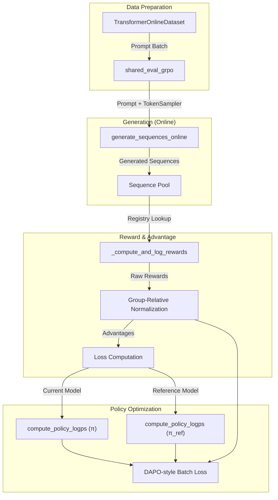

# GRPO Algorithm Implementation

Relevant source files

The following files were used as context for generating this wiki page:

- [src/idiom/nn/transformer/losses/grpo_loss.py](src/idiom/nn/transformer/losses/grpo_loss.py)
- [src/idiom/nn/transformer/module.py](src/idiom/nn/transformer/module.py)
- [src/idiom/nn/transformer/utils/misc.py](src/idiom/nn/transformer/utils/misc.py)

The Group Relative Policy Optimization (GRPO) implementation in IDiom facilitates reinforcement learning post-training without the need for a separate critic model. It achieves this by normalizing rewards across a group of sequences generated from the same prompt, using the group mean as a baseline for advantage estimation.

## GRPO Training Loop Overview

The GRPO training process is orchestrated within `LightningModel` when the `training_mode` is set to `"grpo"` [src/idiom/nn/transformer/module.py:27-28](). The core logic resides in `shared_eval_grpo` [src/idiom/nn/transformer/losses/grpo_loss.py:302](), which manages the transition from prompt sampling to sequence generation, reward computation, and loss aggregation.

### Initialization and Configuration
Upon the first call to the GRPO loss module, `_initialize_grpo_config` is executed to map hyperparameters from the Hydra configuration to the `LightningModule` [src/idiom/nn/transformer/losses/grpo_loss.py:10-15](). Key parameters include:
*   `group_size`: Number of sequences generated per prompt (default: 4) [src/idiom/nn/transformer/losses/grpo_loss.py:17-19]().
*   `beta_kl`: Weight for the Kullback–Leibler (KL) divergence penalty against the reference model [src/idiom/nn/transformer/losses/grpo_loss.py:28-30]().
*   `epsilon_clip`: The clipping range for the PPO-style objective [src/idiom/nn/transformer/losses/grpo_loss.py:20-22]().

### Data Flow: Prompt to Loss
The following diagram illustrates the transformation of input prompts into a scalar loss value through the GRPO pipeline.

**GRPO Data Flow Architecture**

Sources: [src/idiom/nn/transformer/losses/grpo_loss.py:302-315](), [src/idiom/nn/transformer/utils/sampling.py:228](), [src/idiom/nn/transformer/utils/misc.py:5-25]()

## Sequence Generation and Reward Computation

During the training step, the system uses `generate_sequences_online` to produce `group_size` completions for every prompt in the batch [src/idiom/nn/transformer/losses/grpo_loss.py:315-321]().

### Reward Processing
Rewards are calculated via `_compute_and_log_rewards`, which retrieves the configured function from the reward registry [src/idiom/nn/transformer/losses/grpo_loss.py:142-160]().
1.  **Raw Reward**: Calculated using functions like `compute_protgps_score` or `compute_fraction_alanine` [src/idiom/nn/transformer/losses/grpo_loss.py:161-173]().
2.  **Shaping**: Optional quadratic shaping or additive penalties for length and entropy [src/idiom/nn/transformer/losses/grpo_loss.py:190-210]().
3.  **Advantage Normalization**: For each prompt group, the rewards $R$ are normalized to produce advantages $A$:
    $$A_i = \frac{R_i - \text{mean}(R)}{\text{std}(R) + \epsilon}$$
    This step removes the need for a value-function baseline [src/idiom/nn/transformer/losses/grpo_loss.py:408-417]().

Sources: [src/idiom/nn/transformer/losses/grpo_loss.py:142-210](), [src/idiom/nn/transformer/losses/grpo_loss.py:408-417]()

## Loss Function Implementation

The loss is computed in `_compute_grpo_loss`, which implements a clipped surrogate objective with a KL penalty [src/idiom/nn/transformer/losses/grpo_loss.py:382]().

### Policy Log-Probabilities
The function `compute_policy_logps` calculates the log-probabilities of the generated tokens under both the active policy and the frozen reference model [src/idiom/utils/misc.py:5-25]().
*   It performs a forward pass through the `GeometricMolTransformer` [src/idiom/nn/transformer/utils/misc.py:17-18]().
*   It gathers the log-probabilities for the specific tokens that were sampled [src/idiom/nn/transformer/utils/misc.py:21-23]().

### PPO-Style Clipping and KL Penalty
The implementation follows the Direct Alignment Policy Optimization (DAPO) style for aggregating token-level losses [src/idiom/nn/transformer/losses/grpo_loss.py:438-460]():
1.  **Probability Ratio**: $r_t(\theta) = \exp(\log \pi_\theta(a_t|s_t) - \log \pi_{old}(a_t|s_t))$.
2.  **Clipped Objective**: $\min(r_t(\theta) \cdot A, \text{clip}(r_t(\theta), 1-\epsilon, 1+\epsilon) \cdot A)$.
3.  **KL Divergence**: A token-wise KL penalty is calculated as:
    $$\text{kl} = \frac{\pi_{ref}}{\pi_\theta} - \log\left(\frac{\pi_{ref}}{\pi_\theta}\right) - 1$$
    This penalty is scaled by `beta_kl` and subtracted from the surrogate objective [src/idiom/nn/transformer/losses/grpo_loss.py:455-465]().

**GRPO Logic Components**
| Component | Function/Variable | File |
| :--- | :--- | :--- |
| **Generation** | `generate_sequences_online` | [src/idiom/nn/transformer/utils/sampling.py:228]() |
| **Log-Probs** | `compute_policy_logps` | [src/idiom/nn/transformer/utils/misc.py:5]() |
| **Reward Registry** | `get_reward_function_registry` | [src/idiom/nn/transformer/scores.py:414]() |
| **Normalization** | `normalize_advantage` flag | [src/idiom/nn/transformer/losses/grpo_loss.py:45]() |
| **Loss Loop** | `_compute_grpo_loss` | [src/idiom/nn/transformer/losses/grpo_loss.py:382]() |

Sources: [src/idiom/nn/transformer/losses/grpo_loss.py:382-470](), [src/idiom/nn/transformer/utils/misc.py:5-25]()

## Sequence Validity and Diagnostics
The GRPO implementation includes robust logging to monitor the RL process:
*   **Percent Identity**: `_compute_and_log_percent_identity` calculates the diversity of generated sequences within the batch to detect mode collapse [src/idiom/nn/transformer/losses/grpo_loss.py:99-120]().
*   **Invalid Sequences**: Sequences containing invalid characters (e.g., non-amino acid tokens) are assigned a reward of 0 and logged via `num_invalid_sequences` [src/idiom/nn/transformer/losses/grpo_loss.py:230-245]().
*   **Component Rewards**: If using multi-objective rewards (e.g., ProtGPS + Length + Entropy), each component is logged separately to TensorBoard [src/idiom/nn/transformer/losses/grpo_loss.py:260-290]().

Sources: [src/idiom/nn/transformer/losses/grpo_loss.py:99-140](), [src/idiom/nn/transformer/losses/grpo_loss.py:230-290]()

---