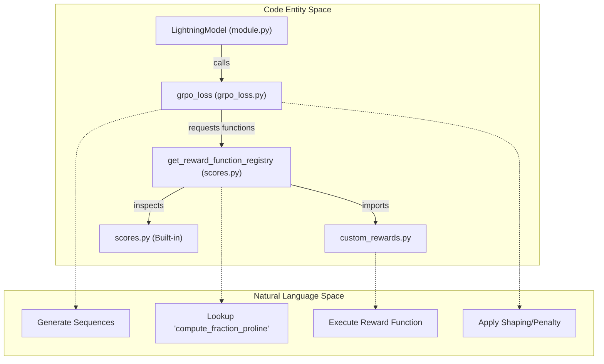
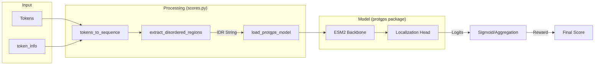

# Reward Functions and the Reward Registry

<details>
<summary>Relevant source files</summary>

The following files were used as context for generating this wiki page:

- [rewards/custom_rewards/custom_rewards.py](rewards/custom_rewards/custom_rewards.py)
- [src/idiom/nn/transformer/scores.py](src/idiom/nn/transformer/scores.py)

</details>


The reward system in IDiom provides the objective signals necessary for Reinforcement Learning (RL) post-training using the GRPO algorithm. It consists of a dynamic registry that loads both built-in and user-defined functions to evaluate generated protein sequences. The system supports complex multi-objective rewards, quadratic shaping to target specific property values, and validity filtering for amino acid sequences.

## Reward Function Registry and Dynamic Loading

The reward system is centered around a dynamic loading mechanism in `src/idiom/nn/transformer/scores.py`. This allows the trainer to specify reward functions by name in the configuration, which are then resolved at runtime.

### Dynamic Loader: `get_reward_function_registry()`
The `get_reward_function_registry()` function [src/idiom/nn/transformer/scores.py:270-305]() performs the following:
1.  **Built-in Discovery**: Scans `scores.py` for any function starting with the `compute_` prefix.
2.  **Custom Discovery**: Imports the `rewards/custom_rewards/custom_rewards.py` module [rewards/custom_rewards/custom_rewards.py:1-33]() and registers all functions therein that follow the `compute_` naming convention.
3.  **Namespace Resolution**: Returns a dictionary mapping function names (e.g., `"fraction_alanine"`) to their callable implementations.

### Reward Execution Flow
The following diagram illustrates how the `LightningModel` interacts with the registry during a GRPO training step to evaluate a batch of generated sequences.

**Sequence Evaluation and Reward Mapping**

Sources: [src/idiom/nn/transformer/scores.py:270-305](), [rewards/custom_rewards/custom_rewards.py:1-33](), [src/idiom/nn/transformer/grpo_loss.py:10-50]()

---

## Built-in Reward Functions

IDiom includes several built-in reward functions in `scores.py` for common protein engineering tasks.

| Function Name | Description | Implementation Detail |
| :--- | :--- | :--- |
| `compute_fraction_alanine` | Calculates the percentage of 'A' residues in the sequence. | [src/idiom/nn/transformer/scores.py:36-57]() |
| `compute_protgps_score` | Predicts localization probability to specific organelles. | [src/idiom/nn/transformer/scores.py:114-189]() |
| `compute_length_reward` | Returns the raw length of the generated sequence. | [src/idiom/nn/transformer/scores.py:246-253]() |
| `compute_entropy_reward` | Calculates Shannon entropy of the amino acid distribution. | [src/idiom/nn/transformer/scores.py:256-267]() |
| `compute_sequence_entropy` | Alias for `compute_entropy_reward`. | [src/idiom/nn/transformer/scores.py:256-267]() |

### Sequence Validity and Character Checking
Before reward computation, the system often validates sequences using `valid_sequence_characters(sequence)` [src/idiom/nn/transformer/scores.py:236-243](). This ensures the generated string only contains standard amino acid characters and does not include FIM sentinels (`1`, `2`, `3`) or padding tokens in the middle of the sequence.

Sources: [src/idiom/nn/transformer/scores.py:36-267]()

---

## Custom Rewards Interface

Users can extend the reward system by modifying `rewards/custom_rewards/custom_rewards.py`. All custom functions must adhere to a specific signature to be compatible with the registry.

### The `compute_` Convention
A valid reward function must:
1.  Start with the prefix `compute_`.
2.  Accept three arguments: `tokens` (torch.Tensor), `token_info` (dict), and `device` (torch.device).
3.  Return a `torch.tensor` (scalar) on the specified `device`.

**Example: Proline Fraction Reward**
The system provides `compute_fraction_proline` as a template:
[rewards/custom_rewards/custom_rewards.py:10-32]()
```python
def compute_fraction_proline(tokens, token_info, device):
    # 1. Convert tokens to string
    generated_fim_sequence = tokens_to_sequence(tokens, token_info)
    # 2. Extract specific region (e.g., IDR marked by '2')
    disordered_region, _, _ = extract_disordered_regions(generated_fim_sequence)
    # 3. Calculate metric
    proline_count = disordered_region.upper().count("P")
    fraction = proline_count / len(disordered_region)
    return torch.tensor(fraction, device=device)
```

Sources: [rewards/custom_rewards/custom_rewards.py:1-33](), [src/idiom/utils/misc.py:1-50]()

---

## Reward Shaping and Optimization

Raw reward values are rarely used directly for RL gradients. IDiom applies shaping to transform raw metrics into optimization targets.

### Quadratic Reward Shaping
The `apply_quadratic_reward_shaping(raw_reward, target_value, sigma)` function [src/idiom/nn/transformer/scores.py:217-233]() is used to target a specific value rather than simply maximizing a metric. It uses a Gaussian-like penalty:
$$Reward = \exp\left(-\frac{(raw\_reward - target\_value)^2}{2\sigma^2}\right)$$

This forces the model to generate sequences within a specific range (e.g., exactly 20% Alanine) rather than maximizing the property indefinitely.

### ProtGPS Integration
The `compute_protgps_score` function [src/idiom/nn/transformer/scores.py:114-189]() integrates a pre-trained ESM2-based localization model. It supports 12 compartment classes, including `p-body`, `stress_granule`, and `nucleolus` [src/idiom/nn/transformer/scores.py:20-33]().

**ProtGPS Reward Flow**


Sources: [src/idiom/nn/transformer/scores.py:20-33](), [src/idiom/nn/transformer/scores.py:114-189](), [src/idiom/nn/transformer/scores.py:217-233]()

---