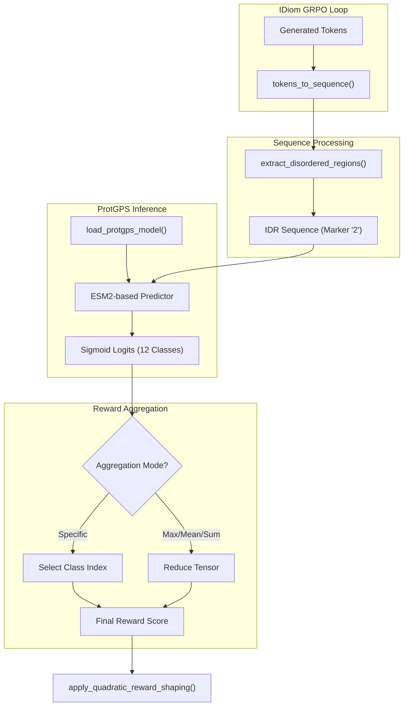
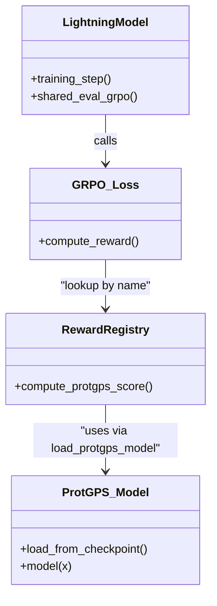

# ProtGPS Reward Model

<details>
<summary>Relevant source files</summary>

The following files were used as context for generating this wiki page:

- [entrypoints/train/post-train/train_rl_idp_protgps.bash](entrypoints/train/post-train/train_rl_idp_protgps.bash)
- [entrypoints/train/post-train/train_rl_idr_protgps.bash](entrypoints/train/post-train/train_rl_idr_protgps.bash)
- [src/idiom/nn/transformer/scores.py](src/idiom/nn/transformer/scores.py)

</details>


The **ProtGPS Reward Model** is a reinforcement learning reward function integrated into the IDiom system to guide the generation of Intrinsically Disordered Proteins (IDPs) and Regions (IDRs) toward specific cellular localization properties. It leverages the ProtGPS model (Kilgore et al., 2024), which is an ESM2-based predictor for protein condensate localization.

## Overview of ProtGPS Integration

ProtGPS is used within the Group Relative Policy Optimization (GRPO) framework to assign a scalar reward to generated sequences based on their predicted probability of localizing to one of 12 distinct biomolecular condensates. The integration handles model caching, sequence parsing (extracting the generated IDR from FIM sentinels), and score aggregation.

### Key Components
*   **Localization Prediction**: Predicts probabilities for 12 compartment classes using an ESM2 backbone.
*   **Sequence Parsing**: Automatically extracts the disordered region (marked by the `2` sentinel) from the generated sequence before scoring.
*   **Aggregation Modes**: Supports targeting specific compartments or optimizing for general "condensate-forming" potential via max/mean/sum operations.

### Data Flow and Architecture

The following diagram illustrates how a generated token sequence is transformed into a ProtGPS reward score during RL training.

**Diagram: ProtGPS Reward Calculation Pipeline**

Sources: `[src/idiom/nn/transformer/scores.py:114-188]()`, `[src/idiom/nn/transformer/scores.py:191-214]()`

## Implementation Details

### Model Loading and Caching
The function `load_protgps_model` manages the initialization of the ProtGPS model. To minimize overhead during training, the model is cached in global variables (`_PROTGPS_MODEL` and `_PROTGPS_DEVICE`) after the first load.

*   **Model Source**: The model expects a directory structure containing the ESM2 weights and the ProtGPS checkpoint (specifically `32bf44b16a4e770a674896b81dfb3729epoch=26.ckpt`).
*   **Path Management**: The code dynamically adds the `rewards/protgps` subdirectory to `sys.path` to access the underlying ProtGPS library utilities.

Sources: `[src/idiom/nn/transformer/scores.py:12-19]()`, `[src/idiom/nn/transformer/scores.py:59-111]()`

### Compartment Classes
ProtGPS predicts localization for the following 12 `COMPARTMENT_CLASSES`:
1.  `nuclear_speckle`
2.  `p-body`
3.  `pml-bdoy` (sic)
4.  `post_synaptic_density`
5.  `stress_granule`
6.  `chromosome`
7.  `nucleolus`
8.  `nuclear_pore_complex`
9.  `cajal_body`
10. `rna_granule`
11. `cell_junction`
12. `transcriptional`

Sources: `[src/idiom/nn/transformer/scores.py:20-33]()`

### Score Computation and Aggregation
The `compute_protgps_score` function is the primary entry point for the reward registry. It performs the following steps:
1.  **Token Conversion**: Converts generated tokens back to amino acids using `tokens_to_sequence`.
2.  **IDR Extraction**: Uses `extract_disordered_regions` to isolate the sequence between the `2` and `3` FIM sentinels.
3.  **Inference**: Passes the IDR sequence through the ProtGPS ESM2 model.
4.  **Aggregation**:
    *   **Max/Mean/Sum**: Reduces the 12-dimensional output vector to a scalar.
    *   **Specific Compartment**: If `aggregation` matches a class name (e.g., "stress_granule"), it returns the probability for that specific class.

Sources: `[src/idiom/nn/transformer/scores.py:114-188]()`

## Configuration in RL Training

The ProtGPS reward is enabled via Hydra configuration overrides in the RL entrypoints.

| Parameter | Description |
| :--- | :--- |
| `reward_function_name` | Set to `compute_protgps_score`. |
| `protgps_target_compartment` | The default compartment if aggregation is not specified. |
| `protgps_aggregation` | The aggregation strategy (e.g., "max" or a specific compartment name). |
| `protgps_parent_dir` | Path to the directory containing ESM2 and ProtGPS weights. |

### Example CLI Configuration
In `train_rl_idp_protgps.bash`, the reward is configured as follows:
```bash
++training.lightning_model_args.reward_function_name=compute_protgps_score
++training.lightning_model_args.protgps_target_compartment=${COMPARTMENT}
++training.lightning_model_args.protgps_aggregation=${COMPARTMENT}
++training.lightning_model_args.protgps_parent_dir=${PROTGPS_PARENT_DIR}
```
Sources: `[entrypoints/train/post-train/train_rl_idp_protgps.bash:136-139]()`, `[entrypoints/train/post-train/train_rl_idr_protgps.bash:137-140]()`

## Code Structure and Entity Mapping

The ProtGPS integration bridges the `idiom` training logic with the external `protgps` prediction package.

**Diagram: System Entity Mapping**

Sources: `[src/idiom/nn/transformer/scores.py:59-111]()`, `[entrypoints/train/post-train/train_rl_idp_protgps.bash:136-139]()`

### Subpackage Structure
The ProtGPS logic is distributed across two main locations:
1.  **`src/idiom/nn/transformer/scores.py`**: Contains the wrapper functions `compute_protgps_score` and `load_protgps_model` that interface with the IDiom training loop.
2.  **`rewards/protgps/`**: A subpackage containing the original ProtGPS source code (e.g., `protgps.utils.loading`) required to instantiate the model architecture and ESM2 layers.

Sources: `[src/idiom/nn/transformer/scores.py:18-19]()`, `[src/idiom/nn/transformer/scores.py:76-80]()`

---