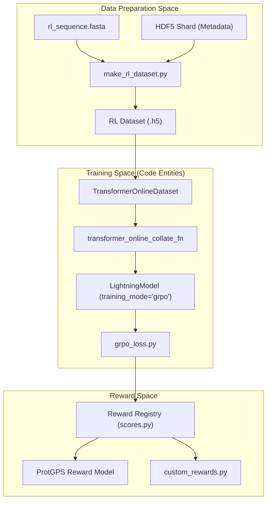
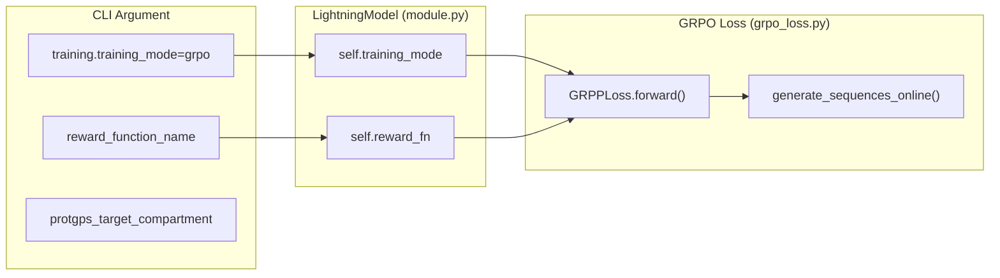

# RL Post-training Entrypoints

Relevant source files

The following files were used as context for generating this wiki page:

- [entrypoints/train/post-train/rl_sequence.fasta](entrypoints/train/post-train/rl_sequence.fasta)
- [entrypoints/train/post-train/train_rl_idp_custom.bash](entrypoints/train/post-train/train_rl_idp_custom.bash)
- [entrypoints/train/post-train/train_rl_idp_protgps.bash](entrypoints/train/post-train/train_rl_idp_protgps.bash)
- [entrypoints/train/post-train/train_rl_idr_custom.bash](entrypoints/train/post-train/train_rl_idr_custom.bash)
- [entrypoints/train/post-train/train_rl_idr_protgps.bash](entrypoints/train/post-train/train_rl_idr_protgps.bash)
- [src/idiom/scripts/data/make_rl_dataset.py](src/idiom/scripts/data/make_rl_dataset.py)

Reinforcement Learning (RL) post-training in IDiom utilizes the **Group Relative Policy Optimization (GRPO)** algorithm to fine-tune pre-trained models toward specific biological or structural objectives. This stage follows a two-step workflow: first, generating a specialized RL dataset from prompts, and second, executing the training loop using the `TransformerOnlineDataset`.

## Overview of RL Entrypoints

The codebase provides four primary bash scripts located in `entrypoints/train/post-train/`. These scripts automate the transition from a pre-trained checkpoint to an RL-tuned model by combining dataset preparation and training orchestration.

| Script | Generation Target | Reward Type |
| :--- | :--- | :--- |
| `train_rl_idp_protgps.bash` | Unprompted IDPs | ProtGPS (Localization) |
| `train_rl_idr_protgps.bash` | Prompted IDRs (FIM) | ProtGPS (Localization) |
| `train_rl_idp_custom.bash` | Unprompted IDPs | Custom (e.g., Proline fraction) |
| `train_rl_idr_custom.bash` | Prompted IDRs (FIM) | Custom (e.g., Proline fraction) |

### System Data Flow: Dataset to GRPO

The following diagram illustrates how the entrypoints bridge the gap between raw sequence data and the RL training loop.

**RL Post-training Data Flow**

Sources: [entrypoints/train/post-train/train_rl_idp_protgps.bash:17-40](), [src/idiom/scripts/data/make_rl_dataset.py:27-55](), [entrypoints/train/post-train/train_rl_idp_protgps.bash:88-105]()

---

## Dataset Preparation: `make_rl_dataset`

The `make_rl_dataset` CLI tool is the first step in any RL pipeline. It prepares a static set of prompts that the model will use to "roll out" (generate) sequences during the online training phase.

### Subcommands and Logic
1.  **`idp`**: Generates a dataset of generic IDP prompts. It uses the sentinel string `"132"` (representing `<FIM_PREFIX><FIM_MIDDLE><FIM_SUFFIX>`) to signal the model to start generating a sequence from scratch [src/idiom/scripts/data/make_rl_dataset.py:57-80]().
2.  **`idr`**: Generates a dataset for specific Intrinsically Disordered Regions (IDRs). It parses a FASTA file (e.g., `rl_sequence.fasta`), extracts the IDR based on header coordinates (e.g., `_IDR_119-242`), and creates a Fill-In-the-Middle (FIM) prompt [src/idiom/scripts/data/make_rl_dataset.py:83-141]().

The tool produces an HDF5 file containing:
*   `tokens`: Padded prompt token IDs [src/idiom/scripts/data/make_rl_dataset.py:48-48]().
*   `masks`: Binary masks indicating non-padding tokens [src/idiom/scripts/data/make_rl_dataset.py:49-49]().
*   `alphabet` and `input_metadata`: Copied from a reference shard to ensure tokenization consistency [src/idiom/scripts/data/make_rl_dataset.py:50-51]().

Sources: [src/idiom/scripts/data/make_rl_dataset.py:1-206](), [entrypoints/train/post-train/rl_sequence.fasta:1-4]()

---

## The RL Training Loop

Once the dataset is created, the bash scripts invoke `transformer_train` with `training.training_mode=grpo` [entrypoints/train/post-train/train_rl_idp_protgps.bash:104-104]().

### Online Dataset and Collation
Unlike pre-training, which uses a streaming dataset, RL uses `TransformerOnlineDataset` [entrypoints/train/post-train/train_rl_idp_protgps.bash:90-90](). This dataset loads the prompts from the HDF5 file created in Step 1. The `transformer_online_collate_fn` is used to batch these prompts for the GPU [entrypoints/train/post-train/train_rl_idp_protgps.bash:91-91]().

### Key GRPO Hyperparameters
The entrypoints configure several critical parameters for the GRPO algorithm:

*   **`group_size`**: The number of sequences generated per prompt to calculate relative advantage. Typically set to `8` [entrypoints/train/post-train/train_rl_idp_protgps.bash:60-60](), [entrypoints/train/post-train/train_rl_idp_protgps.bash:129-129]().
*   **`epsilon_clip`**: The PPO-style clipping parameter for the policy update, usually `0.2` [entrypoints/train/post-train/train_rl_idp_protgps.bash:130-130]().
*   **`beta_kl`**: The penalty weight for the Kullback–Leibler (KL) divergence between the current policy and the reference (initial) model to prevent catastrophic forgetting. Usually `2e-2` [entrypoints/train/post-train/train_rl_idp_protgps.bash:50-50](), [entrypoints/train/post-train/train_rl_idp_protgps.bash:132-132]().
*   **`mu_grpo`**: A weighting factor for the GRPO loss component, set to `1` [entrypoints/train/post-train/train_rl_idp_protgps.bash:131-131]().

Sources: [entrypoints/train/post-train/train_rl_idp_protgps.bash:48-60](), [entrypoints/train/post-train/train_rl_idp_protgps.bash:125-132]()

---

## Reward Shaping and Configuration

Reward shaping is used to guide the model toward sequences that are not only high-scoring but also biologically plausible (e.g., correct length and complexity).

### Shaping Flags
The entrypoints expose several flags to modify the raw reward:
*   **`use_target_length`**: Applies a penalty if the generated sequence deviates from `target_length` (e.g., 100 residues) [entrypoints/train/post-train/train_rl_idp_protgps.bash:141-144]().
*   **`use_target_entropy`**: Applies a penalty if the sequence complexity (Shannon entropy of amino acid distribution) deviates from `target_entropy` (e.g., 2.7) [entrypoints/train/post-train/train_rl_idp_protgps.bash:145-148]().
*   **`reward_target_value`**: The baseline value the model aims to exceed [entrypoints/train/post-train/train_rl_idp_protgps.bash:134-134]().

### Reward Models
1.  **ProtGPS**: Used in `train_rl_idp_protgps.bash`. It targets specific cellular compartments like `stress_granule` or `nucleolus` [entrypoints/train/post-train/train_rl_idp_protgps.bash:62-78]().
2.  **Custom**: Used in `train_rl_idp_custom.bash`. It allows users to point to `rewards/custom_rewards/custom_rewards.py` and specify functions like `compute_fraction_proline` [entrypoints/train/post-train/train_rl_idp_custom.bash:46-47](), [entrypoints/train/post-train/train_rl_idp_custom.bash:122-122]().

**RL Configuration to Code Entity Mapping**

Sources: [entrypoints/train/post-train/train_rl_idp_protgps.bash:104-148](), [entrypoints/train/post-train/train_rl_idp_custom.bash:119-131]()

---

## Execution Examples

### Running a ProtGPS Job
To optimize an IDP for localization to the nucleolus:
1.  Modify `train_rl_idr_protgps.bash` to set `COMPARTMENT="nucleolus"` [entrypoints/train/post-train/train_rl_idr_protgps.bash:70-78]().
2.  Ensure `rl_sequence.fasta` contains the context sequence for the IDR [entrypoints/train/post-train/train_rl_idr_protgps.bash:37-37]().
3.  Submit via SLURM: `sbatch entrypoints/train/post-train/train_rl_idr_protgps.bash`.

### Running a Custom Reward Job
To optimize an IDP for high proline content:
1.  Set `PYTHONPATH` to include the custom rewards directory [entrypoints/train/post-train/train_rl_idp_custom.bash:69-69]().
2.  Set `reward_function_name=compute_fraction_proline` [entrypoints/train/post-train/train_rl_idp_custom.bash:122-122]().
3.  Run: `bash entrypoints/train/post-train/train_rl_idp_custom.bash`.

Sources: [entrypoints/train/post-train/train_rl_idp_protgps.bash:1-148](), [entrypoints/train/post-train/train_rl_idp_custom.bash:1-131]()

---