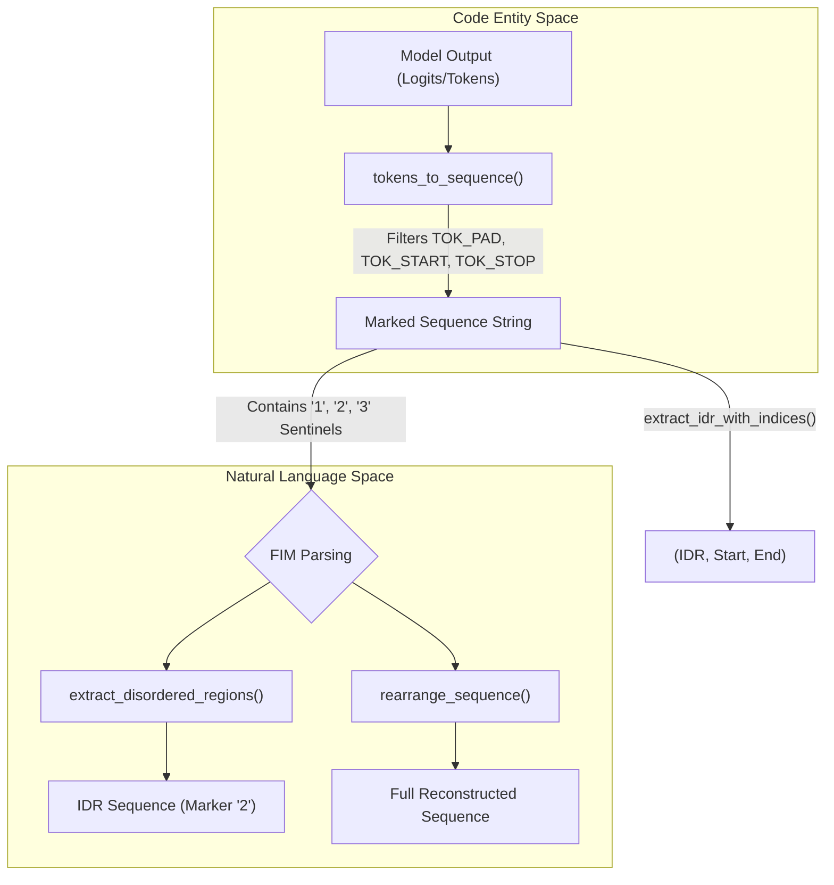
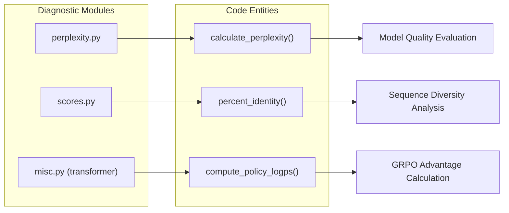

# Utilities and Shared Helpers

Relevant source files

The following files were used as context for generating this wiki page:

- [src/idiom/utils/__init__.py](src/idiom/utils/__init__.py)
- [src/idiom/utils/misc.py](src/idiom/utils/misc.py)

The `idiom.utils` package and associated transformer utility modules provide the foundational logic for data manipulation, sequence parsing, and metric calculation across the IDiom system. These helpers are used by the pre-computation pipeline, the core neural network during training and inference, and the reward computation system during RL post-training.

## System Overview: From Tokens to Sequences

The utility layer bridges the gap between the "Code Entity Space" (tensors, token indices, HDF5 shards) and the "Natural Language Space" (amino acid sequences, FIM markers). 

### Data Transformation Flow

The following diagram illustrates how utility functions facilitate the flow of data from raw model outputs back into structured biological sequences.

**Sequence Reconstruction Data Flow**

Sources: [src/idiom/utils/misc.py:11-157]()

## Sequence Utilities and FIM Parsing

The core of IDiom's Fill-In-the-Middle (FIM) capability relies on a specific sentinel system using markers `'1'`, `'2'`, and `'3'`. These markers denote the prefix, the disordered region (IDR), and the suffix, respectively. 

Key functions in `idiom.utils.misc` handle these transformations:
*   `tokens_to_sequence`: Converts raw tensors into strings using the `token_info` metadata, while stripping special control tokens like `TOK_PAD` [src/idiom/utils/misc.py:11-48]().
*   `extract_disordered_regions`: Specifically isolates the sequence associated with the `'2'` marker [src/idiom/utils/misc.py:57-78]().
*   `rearrange_sequence`: Reconstructs the original protein sequence order (1 $\rightarrow$ 2 $\rightarrow$ 3) by removing the FIM sentinels [src/idiom/utils/misc.py:80-112]().

For a deep dive into tokenization, alphabets, and the FIM sentinel logic, see **[Sequence Utilities: Tokens, Alphabets, and FIM Parsing](#7.1)**.

## Perplexity and Diagnostic Utilities

To evaluate model performance, IDiom utilizes several diagnostic helpers located in both `idiom.utils` and `idiom.nn.transformer.utils`. These tools calculate statistical measures of how well the model predicts sequences and how similar generated sequences are to known biological data.

### Metric Computation Logic

The system distinguishes between token-level probability metrics (Perplexity) and sequence-level similarity metrics (Percent Identity).

**Diagnostic Utility Mapping**

Sources: [src/idiom/nn/transformer/utils/misc.py:1-10](), [src/idiom/utils/misc.py:1-10]() (Note: Reference to `calculate_perplexity.py` and `scores.py` based on project structure).

*   **Policy Log-probabilities**: During RL post-training, `compute_policy_logps` is used to determine the log-probability of generated sequences under the current model policy [src/idiom/nn/transformer/utils/misc.py]().
*   **Sequence Identity**: Functions for calculating percent identity are used to ensure generated sequences maintain a target level of novelty or similarity compared to the training set.

For details on these metrics and the diagnostic scripts, see **[Perplexity and Diagnostic Utilities](#7.2)**.

## Miscellaneous Helpers

The utility package also includes low-level infrastructure helpers:
*   **Reproducibility**: `seed_worker` ensures deterministic behavior in multi-process data loading by setting seeds for `torch`, `numpy`, and `random` based on the worker ID [src/idiom/utils/misc.py:51-54]().
*   **Data Aggregation**: `aggregate_tokens_hdf5` (found in `idiom.utils.token`) is used to validate and summarize the contents of HDF5 shards before training.

Sources: [src/idiom/utils/misc.py:51-54](), [src/idiom/utils/token.py]() (Note: reference to `aggregate_tokens_hdf5` per project documentation).

---