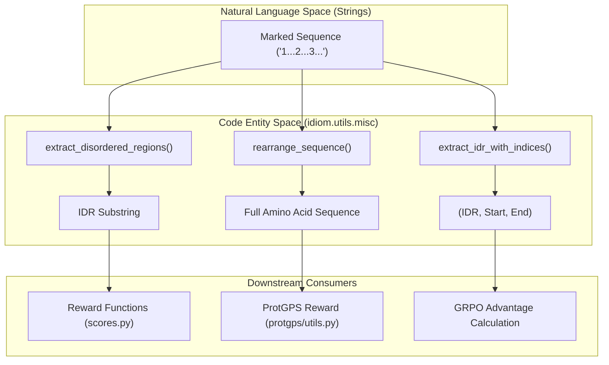
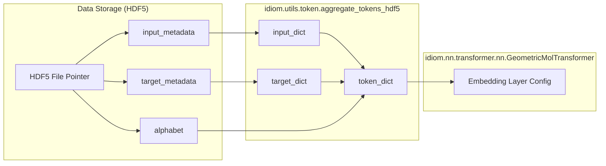

# Sequence Utilities: Tokens, Alphabets, and FIM Parsing

Relevant source files

The following files were used as context for generating this wiki page:

- [src/idiom/nn/transformer/utils/tokenizer.py](src/idiom/nn/transformer/utils/tokenizer.py)
- [src/idiom/utils/data_utils.py](src/idiom/utils/data_utils.py)
- [src/idiom/utils/misc.py](src/idiom/utils/misc.py)
- [src/idiom/utils/token.py](src/idiom/utils/token.py)

This page documents the utility functions and classes used for sequence manipulation, tokenization, and metadata management within the IDiom system. It covers the conversion between numerical tensors and amino acid sequences, the handling of Fill-In-the-Middle (FIM) sentinel markers, and the structure of token metadata stored in HDF5 datasets.

## Tokenization and Alphabet Management

The IDiom system uses a character-level tokenization strategy for protein sequences. The primary class for this is `CharTokenizer`, which decomposes strings into individual character lists.

### CharTokenizer
The `CharTokenizer` class provides a simple interface for character-level decomposition.
*   **Implementation**: It implements a `tokenize` method that returns a list of characters from a given text string [src/idiom/nn/transformer/utils/tokenizer.py:1-11]().

### Alphabet and Token Information
Token information is typically passed around as a `token_info` dictionary. This dictionary contains the `alphabet` (mapping indices to amino acids) and special control tokens (e.g., PAD, START, STOP).

The function `tokens_to_sequence` converts a tensor of token indices back into a human-readable amino acid string [src/idiom/utils/misc.py:11-48]().
*   **Filtering**: It automatically filters out `TOK_PAD`, `TOK_START`, and `TOK_STOP` tokens [src/idiom/utils/misc.py:29-31]().
*   **Decoding**: It handles both string and byte-encoded alphabets stored in the `token_info` dictionary [src/idiom/utils/misc.py:38-41]().

Sources: [src/idiom/nn/transformer/utils/tokenizer.py:1-11](), [src/idiom/utils/misc.py:11-48]()

## Fill-In-the-Middle (FIM) Sentinel System

IDiom utilizes a Fill-In-the-Middle (FIM) strategy to generate Intrinsically Disordered Regions (IDRs) within the context of structured flanking regions. This is facilitated by three sentinel markers:

| Marker | Description |
| :--- | :--- |
| `'1'` | **Prefix**: The sequence preceding the IDR. |
| `'2'` | **Middle (IDR)**: The disordered region being targeted or generated. |
| `'3'` | **Suffix**: The sequence following the IDR. |

### FIM Parsing Utilities
The following utilities in `idiom.utils.misc` are used to manipulate sequences containing these markers:

1.  **`extract_disordered_regions(sequence)`**: Iterates through a marked sequence and returns only the substring associated with the `'2'` marker [src/idiom/utils/misc.py:57-78]().
2.  **`rearrange_sequence(sequence)`**: Removes the `'1'`, `'2'`, and `'3'` markers and concatenates the parts in order to reconstruct the full protein sequence [src/idiom/utils/misc.py:80-112]().
3.  **`extract_idr_with_indices(sequence)`**: Returns the IDR sequence along with its start and end indices relative to the rearranged (unmarked) sequence [src/idiom/utils/misc.py:115-157]().

### Sequence Processing Flow
The following diagram illustrates how raw marked sequences are transformed into structured data entities used by the model and reward functions.

**Sequence Transformation Flow**

Sources: [src/idiom/utils/misc.py:57-157]()

## HDF5 Metadata and Token Aggregation

When training on large-scale datasets, token metadata is stored within HDF5 files. The `aggregate_tokens_hdf5` function is responsible for parsing this metadata into a consistent `token_info` dictionary [src/idiom/utils/token.py:1-63]().

### Token Dictionary Structure
The resulting dictionary is structured as follows:
*   **`input` / `target`**: Nested dictionaries containing `TOK` (residue tokens) and `STRUCT` (structural tokens) [src/idiom/utils/token.py:8-58]().
*   **`ctrl_tokens`**: Specific indices for control characters like `TOK_PAD` or `TOK_START` [src/idiom/utils/token.py:9-17]().
*   **`alphabet`**: The list of amino acids corresponding to the token indices [src/idiom/utils/token.py:59-60]().
*   **`TOTAL`**: The maximum vocabulary size across input and target streams [src/idiom/utils/token.py:62]().

**Metadata Extraction Logic**

Sources: [src/idiom/utils/token.py:1-63]()

## Miscellaneous Helpers

### Data Splitting
The `split_data_subsets` function in `idiom.utils.data_utils` manages the division of datasets into training, validation, and testing sets [src/idiom/utils/data_utils.py:32-68]().
*   If a `.npy` file containing indices is provided via the `splits` argument, it uses those specific indices [src/idiom/utils/data_utils.py:47-59]().
*   Otherwise, it performs a `random_split` based on provided fractions [src/idiom/utils/data_utils.py:61-68]().

### Reproducibility
The `seed_worker` function is used by PyTorch DataLoaders to ensure that NumPy and Python random seeds are correctly set for each worker process based on the initial torch seed [src/idiom/utils/misc.py:51-54]().

Sources: [src/idiom/utils/data_utils.py:32-68](), [src/idiom/utils/misc.py:51-54]()

---