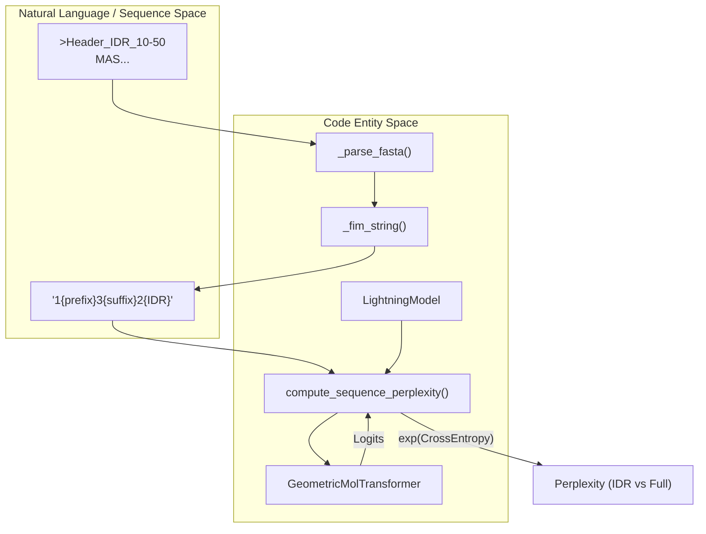
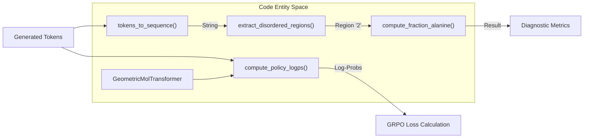

# Perplexity and Diagnostic Utilities

Relevant source files

The following files were used as context for generating this wiki page:

- [src/idiom/nn/transformer/scores.py](src/idiom/nn/transformer/scores.py)
- [src/idiom/nn/transformer/utils/calculate_perplexity.py](src/idiom/nn/transformer/utils/calculate_perplexity.py)
- [src/idiom/nn/transformer/utils/misc.py](src/idiom/nn/transformer/utils/misc.py)
- [src/idiom/nn/transformer/utils/perplexity.py](src/idiom/nn/transformer/utils/perplexity.py)

This page documents the diagnostic tools used to evaluate IDiom model performance and sequence properties. These utilities include perplexity calculation for assessing model fit on specific datasets, percent identity metrics for sequence similarity, and log-probability computation for policy evaluation.

## Perplexity Calculation

Perplexity serves as a primary metric for evaluating how well the pre-trained `GeometricMolTransformer` predicts Intrinsically Disordered Regions (IDRs). The system supports calculating both **IDR-only perplexity** (perplexity of tokens following the `2` sentinel) and **Full-sequence perplexity** (including prefix and suffix context).

### Perplexity Data Flow
The perplexity pipeline transforms raw FASTA sequences into the Fill-In-the-Middle (FIM) format used during training to ensure evaluation parity.

1.  **Token Info Loading**: Alphabet and special tokens (`TOK_START`, `TOK_STOP`, `TOK_PAD`) are loaded from a precomputed HDF5 shard [src/idiom/nn/transformer/utils/perplexity.py:8-30]().
2.  **FIM Transformation**: Sequences are converted into the `1{prefix}3{suffix}2{IDR}` format [src/idiom/nn/transformer/utils/perplexity.py:50-62]().
3.  **Forward Pass**: The `LightningModel` performs a single forward pass on the FIM string [src/idiom/nn/transformer/utils/perplexity.py:108-109]().
4.  **Cross-Entropy Calculation**: Perplexity is derived from the exponential of the cross-entropy loss over specific token ranges [src/idiom/nn/transformer/utils/perplexity.py:112-125]().

### Perplexity System Components

| Component | Responsibility |
| :--- | :--- |
| `calculate_perplexity.py` | CLI entrypoint for batch processing multiple FASTA datasets (e.g., DisProt, AFDB, CATH) [src/idiom/nn/transformer/utils/calculate_perplexity.py:48-130](). |
| `compute_perplexity_from_fasta` | High-level function that samples sequences, parses IDR bounds from headers, and aggregates results [src/idiom/nn/transformer/utils/perplexity.py:130-211](). |
| `compute_sequence_perplexity` | Core logic for mapping a FIM string to token indices and calculating $e^{Loss}$ [src/idiom/nn/transformer/utils/perplexity.py:65-127](). |
| `_fim_string` | Helper to construct the FIM-formatted string and track the IDR start index [src/idiom/nn/transformer/utils/perplexity.py:50-62](). |

**Sources:** [src/idiom/nn/transformer/utils/calculate_perplexity.py:1-130](), [src/idiom/nn/transformer/utils/perplexity.py:1-211]()

## Diagnostic Utility Architecture

The diagnostic utilities bridge the gap between the raw token space and biological metrics.

### Perplexity Evaluation Flow

**Sources:** [src/idiom/nn/transformer/utils/perplexity.py:33-211](), [src/idiom/nn/transformer/module.py:1-100]()

## Policy and Sequence Metrics

Beyond perplexity, IDiom provides utilities for Reinforcement Learning (RL) diagnostics and sequence identity comparisons.

### Policy Log-Probabilities
During GRPO (Group Relative Policy Optimization), the system must calculate the log-probabilities of generated sequences under the current policy.

The function `compute_policy_logps` [src/idiom/nn/transformer/utils/misc.py:5-25]() performs the following:
1.  Passes `tokens`, `structure`, and `masks` through the `GeometricMolTransformer` [src/idiom/nn/transformer/utils/misc.py:18]().
2.  Applies `log_softmax` to the resulting logits [src/idiom/nn/transformer/utils/misc.py:20]().
3.  Uses `torch.gather` to extract the log-probabilities corresponding to the actual tokens provided, shifted by one to account for the autoregressive nature (the start token has no log-probability) [src/idiom/nn/transformer/utils/misc.py:21-23]().

### Percent Identity and Similarity
The `scores.py` module contains utilities for comparing generated sequences against reference datasets.

*   **Percent Identity**: Calculated using `Bio.pairwise2` for sequence alignment [src/idiom/nn/transformer/scores.py:9]().
*   **Fraction Alanine**: A diagnostic metric used to monitor sequence composition via `compute_fraction_alanine` [src/idiom/nn/transformer/scores.py:36-56]().
*   **IDR Extraction**: The utility `extract_disordered_regions` parses sequences containing '1', '2', or '3' sentinels to isolate the IDR (region '2') for downstream scoring by models like ProtGPS [src/idiom/nn/transformer/scores.py:191-214]().

### Sequence Diagnostic Logic

**Sources:** [src/idiom/nn/transformer/scores.py:36-56](), [src/idiom/nn/transformer/scores.py:191-214](), [src/idiom/nn/transformer/utils/misc.py:5-25]()

## ProtGPS Integration Diagnostics

The `compute_protgps_score` function acts as a diagnostic wrapper for the ProtGPS localization model. It handles:
1.  **IDR Extraction**: Isolating the disordered region from the full FIM sequence [src/idiom/nn/transformer/scores.py:151]().
2.  **Model Loading**: Loading the ESM2-based ProtGPS model into a global cache to avoid redundant I/O [src/idiom/nn/transformer/scores.py:59-111]().
3.  **Aggregation**: Computing scores across 12 compartment classes (e.g., "p-body", "stress_granule") using `max`, `mean`, or `sum` modes [src/idiom/nn/transformer/scores.py:168-188]().

**Sources:** [src/idiom/nn/transformer/scores.py:114-188]()

---