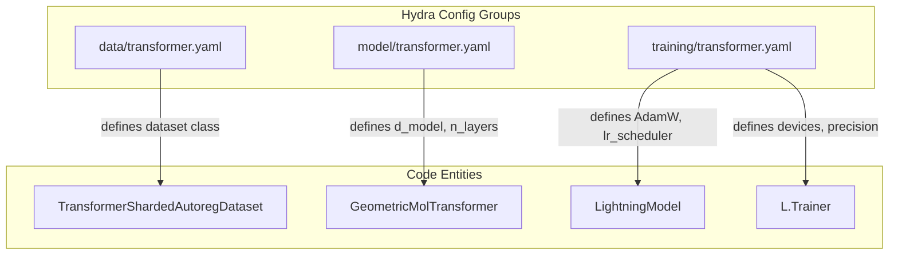
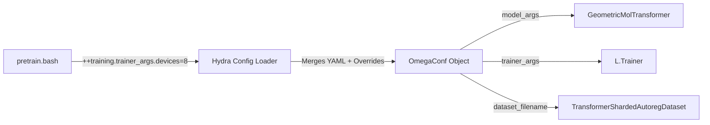

# Configuration System (Hydra)

<details>
<summary>Relevant source files</summary>

The following files were used as context for generating this wiki page:

- [src/idiom/scripts/cfgs/__init__.py](src/idiom/scripts/cfgs/__init__.py)
- [src/idiom/scripts/cfgs/data/transformer.yaml](src/idiom/scripts/cfgs/data/transformer.yaml)
- [src/idiom/scripts/cfgs/inference.yaml](src/idiom/scripts/cfgs/inference.yaml)
- [src/idiom/scripts/cfgs/inference/transformer.yaml](src/idiom/scripts/cfgs/inference/transformer.yaml)
- [src/idiom/scripts/cfgs/model/transformer.yaml](src/idiom/scripts/cfgs/model/transformer.yaml)
- [src/idiom/scripts/cfgs/precompute.yaml](src/idiom/scripts/cfgs/precompute.yaml)
- [src/idiom/scripts/cfgs/precompute/__init__.py](src/idiom/scripts/cfgs/precompute/__init__.py)
- [src/idiom/scripts/cfgs/precompute/residues.yaml](src/idiom/scripts/cfgs/precompute/residues.yaml)
- [src/idiom/scripts/cfgs/training.yaml](src/idiom/scripts/cfgs/training.yaml)
- [src/idiom/scripts/cfgs/training/transformer.yaml](src/idiom/scripts/cfgs/training/transformer.yaml)

</details>


The IDiom codebase utilizes [Hydra](https://hydra.cc/) to manage complex, hierarchical configurations for training, inference, and data precomputation. This system allows for modularity by composing YAML files from various sub-directories and provides a flexible mechanism for CLI overrides.

## Configuration Directory Layout

The configuration files are organized within `src/idiom/scripts/cfgs/`. The structure separates global entrypoints from component-specific configurations.

| Directory / File | Description |
|:---|:---|
| `training.yaml` | Main entrypoint for pre-training and RL post-training [src/idiom/scripts/cfgs/training.yaml:1-18](). |
| `inference.yaml` | Main entrypoint for sequence generation [src/idiom/scripts/cfgs/inference.yaml:1-19](). |
| `precompute.yaml` | Main entrypoint for FASTA-to-HDF5 processing [src/idiom/scripts/cfgs/precompute.yaml:1-11](). |
| `data/` | Configuration for datasets, dataloaders, and collate functions [src/idiom/scripts/cfgs/data/transformer.yaml:1-13](). |
| `model/` | Architecture hyperparameters for the `GeometricMolTransformer` [src/idiom/scripts/cfgs/model/transformer.yaml:1-18](). |
| `training/` | Optimization, scheduling, and PyTorch Lightning trainer settings [src/idiom/scripts/cfgs/training/transformer.yaml:1-51](). |
| `inference/` | Sampling methods, batch sizes, and checkpoint paths [src/idiom/scripts/cfgs/inference/transformer.yaml:1-16](). |

**Sources:**
- [src/idiom/scripts/cfgs/training.yaml:1-18]()
- [src/idiom/scripts/cfgs/inference.yaml:1-19]()
- [src/idiom/scripts/cfgs/data/transformer.yaml:1-13]()
- [src/idiom/scripts/cfgs/model/transformer.yaml:1-18]()
- [src/idiom/scripts/cfgs/training/transformer.yaml:1-51]()

---

## Configuration Composition

Hydra uses a "Defaults List" to compose a single configuration object from multiple files. For example, `training.yaml` aggregates settings for the model, data, and training loop.

### Composition Logic for Training
The `training.yaml` file defines the hierarchy:
```yaml
defaults:
  - data: transformer
  - model: transformer
  - training: transformer
  - _self_
```
[src/idiom/scripts/cfgs/training.yaml:1-5]()

### Mapping System Names to Config Entities
The following diagram illustrates how the Hydra configuration groups map to the internal Python classes and execution logic.

**Configuration to Code Mapping**


**Sources:**
- [src/idiom/scripts/cfgs/training.yaml:1-5]()
- [src/idiom/scripts/cfgs/data/transformer.yaml:10-11]()
- [src/idiom/scripts/cfgs/model/transformer.yaml:1-8]()
- [src/idiom/scripts/cfgs/training/transformer.yaml:5-35]()

---

## CLI Overrides and Bash Entrypoints

The IDiom system relies heavily on CLI overrides to modify configurations without changing YAML files. This is primarily seen in the `.bash` entrypoints (e.g., `pretrain.bash`, `generate_idps.bash`).

### Override Syntax
- **Standard Override:** `python script.py model.model_args.d_model=512`
- **Addition Override (`++`):** Used to add new keys or force-overwrite nested dictionaries.
- **Global Arguments:** Arguments under `global_args` are often used to set paths and seeds across the entire session [src/idiom/scripts/cfgs/training.yaml:13-17]().

### Workflow Diagram: CLI to Execution
This diagram shows how a Bash script command propagates through Hydra into the instantiated Python objects.

**Command Propagation Flow**


**Sources:**
- [src/idiom/scripts/cfgs/training.yaml:13-17]()
- [src/idiom/scripts/cfgs/training/transformer.yaml:29-35]()

---

## Sub-Configuration Details

### Training Configuration
Focuses on the orchestration of the training loop, including the `AdamW` optimizer, `LinearWarmupCosineAnnealingLR` scheduler, and checkpointing intervals [src/idiom/scripts/cfgs/training/transformer.yaml:5-28]().
For details, see [Training Configuration Reference](#8.1).

### Inference Configuration
Focuses on generation parameters such as `unmasking_mode`, `sampler_args` (temperature, top-p), and whether to use multi-GPU dispatching [src/idiom/scripts/cfgs/inference/transformer.yaml:3-16]().
For details, see [Inference Configuration Reference](#8.2).

### Model Configuration
Defines the transformer architecture, including `d_model` (default 896), `n_layers` (default 12), and `mha_args` (14 heads) [src/idiom/scripts/cfgs/model/transformer.yaml:5-12]().

### Data and Precompute Configuration
Handles the file paths for HDF5 shards and the specific `input_generator` and `target_generator` logic used during the tokenization process [src/idiom/scripts/cfgs/precompute/residues.yaml:3-11]().

**Sources:**
- [src/idiom/scripts/cfgs/training/transformer.yaml:5-28]()
- [src/idiom/scripts/cfgs/inference/transformer.yaml:3-16]()
- [src/idiom/scripts/cfgs/model/transformer.yaml:5-12]()
- [src/idiom/scripts/cfgs/precompute/residues.yaml:3-11]()

---