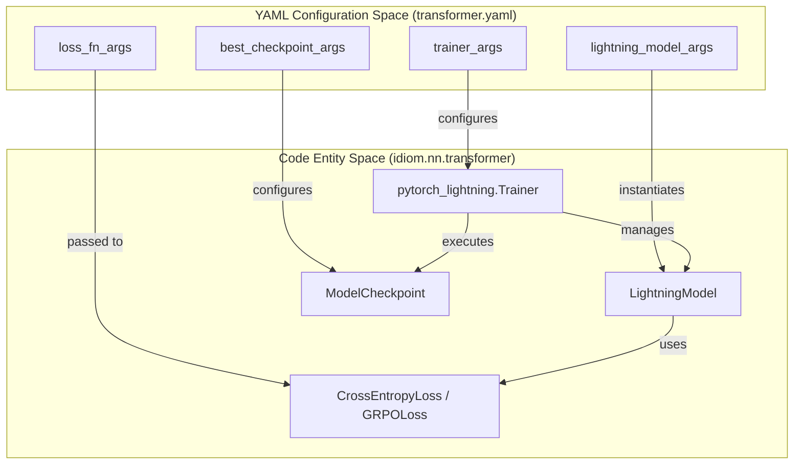
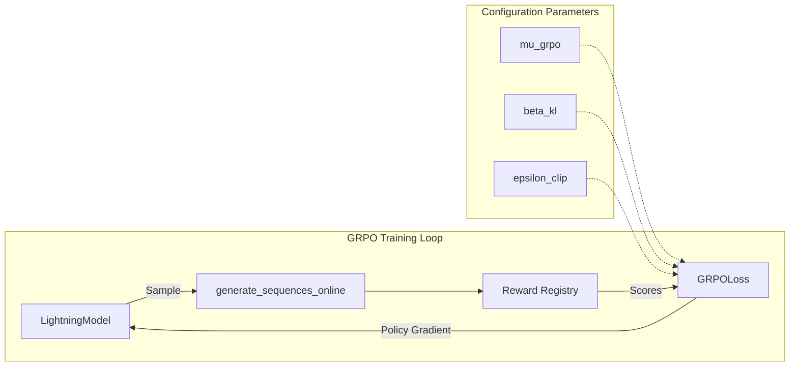

# Training Configuration Reference

Relevant source files

The following files were used as context for generating this wiki page:

- [src/idiom/scripts/cfgs/training.yaml](src/idiom/scripts/cfgs/training.yaml)
- [src/idiom/scripts/cfgs/training/transformer.yaml](src/idiom/scripts/cfgs/training/transformer.yaml)

This page provides a technical reference for the training configuration system used in IDiom. Training is managed via **Hydra** [src/idiom/scripts/cfgs/training.yaml:1-5](), which composes configurations for the data pipeline, model architecture, and the PyTorch Lightning trainer.

The primary configuration for training execution is defined in `src/idiom/scripts/cfgs/training/transformer.yaml`. This file governs the optimization strategy, learning rate scheduling, hardware utilization, and checkpointing logic for both standard autoregressive pre-training and Group Relative Policy Optimization (GRPO) post-training.

## System Configuration Mapping

The following diagram bridges the high-level configuration parameters defined in YAML files to the specific PyTorch Lightning and IDiom classes that implement them.

**Configuration to Implementation Mapping**

Sources: [src/idiom/scripts/cfgs/training/transformer.yaml:4-51](), [src/idiom/scripts/cfgs/training.yaml:1-5]()

## Optimizer and Scheduler Configuration

IDiom uses the **AdamW** optimizer paired with a **LinearWarmupCosineAnnealingLR** scheduler to manage the learning rate across long pre-training runs (typically 250,000 steps).

### Optimizer: AdamW
The optimizer is configured within `lightning_model_args`.
*   **Class**: `AdamW` [src/idiom/scripts/cfgs/training/transformer.yaml:5]()
*   **Base Learning Rate**: Defaulted to `4.0e-4` [src/idiom/scripts/cfgs/training/transformer.yaml:7]().

### Scheduler: LinearWarmupCosineAnnealingLR
The scheduler handles the initial warmup phase to stabilize training and the subsequent cosine decay to a minimum learning rate.
*   **Warmup Steps**: Configured via `warmup_epochs` (though interpreted as steps in the `interval: "step"` mode) [src/idiom/scripts/cfgs/training/transformer.yaml:10-14]().
*   **Minimum LR**: `eta_min` defines the floor for the cosine decay, typically `4.0e-5` [src/idiom/scripts/cfgs/training/transformer.yaml:12]().
*   **Monitoring**: The scheduler monitors `validation/loss` to determine epoch-level adjustments if required [src/idiom/scripts/cfgs/training/transformer.yaml:13]().

Sources: [src/idiom/scripts/cfgs/training/transformer.yaml:4-18]()

## Trainer Arguments (`trainer_args`)

The `trainer_args` block directly maps to the `pytorch_lightning.Trainer` constructor. It defines the hardware environment and the execution constraints of the training loop.

| Parameter | Default Value | Description |
| :--- | :--- | :--- |
| `accelerator` | `"cuda"` | Utilizes NVIDIA GPUs for training [src/idiom/scripts/cfgs/training/transformer.yaml:30](). |
| `devices` | `8` | Number of GPUs to use per node [src/idiom/scripts/cfgs/training/transformer.yaml:31](). |
| `precision` | `16-mixed` | Enables Mixed Precision (FP16) training for memory efficiency [src/idiom/scripts/cfgs/training/transformer.yaml:35](). |
| `max_steps` | `250000` | The total number of training steps before termination [src/idiom/scripts/cfgs/training/transformer.yaml:33](). |
| `val_check_interval` | `25000` | Frequency (in steps) of running the validation loop [src/idiom/scripts/cfgs/training/transformer.yaml:40](). |
| `accumulate_grad_batches` | `1` | Number of batches to accumulate before performing an optimizer step [src/idiom/scripts/cfgs/training/transformer.yaml:41](). |

Sources: [src/idiom/scripts/cfgs/training/transformer.yaml:29-41]()

## Checkpointing Strategy

IDiom employs a dual checkpointing strategy to ensure both recovery from hardware failure and retention of the best performing model.

1.  **Best Checkpoint (`best_checkpoint_args`)**:
    *   **Monitor**: Tracks `validation/loss` [src/idiom/scripts/cfgs/training/transformer.yaml:26]().
    *   **Mode**: `min` (saves when validation loss decreases) [src/idiom/scripts/cfgs/training/transformer.yaml:27]().
    *   **Filename**: `best_model_{step}` [src/idiom/scripts/cfgs/training/transformer.yaml:25]().

2.  **Restart Checkpoint (`every_epoch_checkpoint_args`)**:
    *   **Frequency**: Configured to save every `1000` training steps [src/idiom/scripts/cfgs/training/transformer.yaml:22]().
    *   **Purpose**: Used for resuming training after preemption or failure via `resume_training_path` [src/idiom/scripts/cfgs/training/transformer.yaml:1]().

Sources: [src/idiom/scripts/cfgs/training/transformer.yaml:19-28]()

## Loss Function and GRPO Arguments

The configuration for the loss calculation varies significantly between `autoregressive` (pre-training) and `grpo` (RL post-training) modes.

### Autoregressive Loss
*   **Function**: `CrossEntropyLoss` [src/idiom/scripts/cfgs/training/transformer.yaml:49]().
*   **Ignore Index**: Set to `23`, which corresponds to the padding token in the `CharTokenizer` alphabet, ensuring padding does not contribute to gradient calculation [src/idiom/scripts/cfgs/training/transformer.yaml:51]().

### GRPO-Specific Configuration
When `training_mode` is set to `grpo` [src/idiom/scripts/cfgs/training/transformer.yaml:2](), the system utilizes `lightning_model_args` to configure the RL environment.

**GRPO Data and Loss Flow**

Key GRPO parameters (often passed via CLI overrides) include:
*   **Group Size (`mu_grpo`)**: The number of sequences generated per prompt to calculate relative advantage.
*   **KL Penalty (`beta_kl`)**: Weights the Kullback–Leibler divergence to prevent the model from drifting too far from the reference policy.
*   **Clipping (`epsilon_clip`)**: The PPO-style clipping range for policy updates.

Sources: [src/idiom/scripts/cfgs/training/transformer.yaml:2-51]()

---