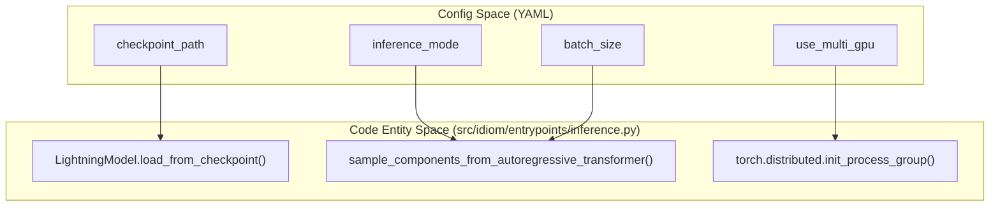
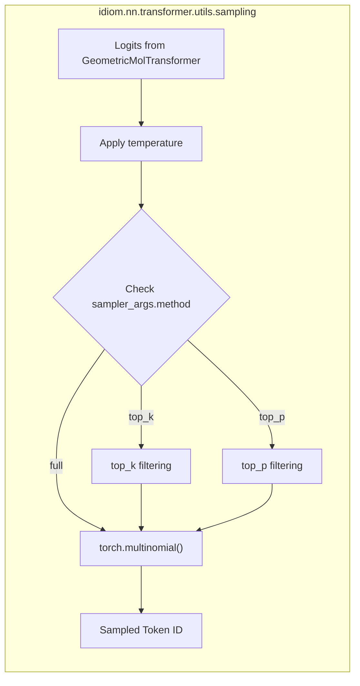

# Inference Configuration Reference

Relevant source files

The following files were used as context for generating this wiki page:

- [src/idiom/scripts/cfgs/inference.yaml](src/idiom/scripts/cfgs/inference.yaml)
- [src/idiom/scripts/cfgs/inference/transformer.yaml](src/idiom/scripts/cfgs/inference/transformer.yaml)

This page provides a technical reference for the configuration parameters used during the inference and sequence generation stage of the IDiom pipeline. The configuration is managed via **Hydra**, primarily through the `inference/transformer.yaml` sub-config and the `inference.yaml` main config.

The inference system supports both unprompted generation (e.g., generating new IDPs) and prompted/FIM-based generation (e.g., infilling IDRs within a structured context).

## 1. Primary Inference Parameters

These parameters define the high-level behavior of the generation process, including the model source, output destination, and computational scale.

| Parameter | Type | Description |
| :--- | :--- | :--- |
| `inference_mode` | `str` | The generation mode. Typically set to `'autoregressive'` for sequence generation [src/idiom/scripts/cfgs/inference/transformer.yaml:4-4](). |
| `checkpoint_path` | `str` | Path to the `.ckpt` file containing the trained `LightningModel` weights [src/idiom/scripts/cfgs/inference/transformer.yaml:1-1](). |
| `savedir` | `str` | Directory where generated sequences (`.fasta`), raw token arrays (`.pkl`), and the `inference_config.yaml` will be stored [src/idiom/scripts/cfgs/inference/transformer.yaml:2-2](). |
| `batch_size` | `int` | Number of sequences to generate per batch [src/idiom/scripts/cfgs/inference/transformer.yaml:5-5](). |
| `num_batches` | `int` | Total number of batches to run during the inference session [src/idiom/scripts/cfgs/inference/transformer.yaml:6-6](). |
| `use_multi_gpu` | `bool` | If `true`, the system uses `torch.distributed` to parallelize generation across available GPUs [src/idiom/scripts/cfgs/inference/transformer.yaml:7-7](). |

### Implementation Mapping: Configuration to Code
The following diagram illustrates how the YAML configuration maps to the execution flow in `inference.py`.

**Inference Execution Flow**

Sources: [src/idiom/scripts/cfgs/inference/transformer.yaml:1-7](), [src/idiom/scripts/cfgs/inference.yaml:1-19]()

---

## 2. Sampler Arguments (`sampler_args`)

The `sampler_args` dictionary controls the stochastic nature of the token selection process during the autoregressive loop in `src/idiom/nn/transformer/utils/sampling.py`.

| Parameter | Type | Description |
| :--- | :--- | :--- |
| `method` | `str` | The sampling strategy. Options include `'full'` (multinomial sampling from the entire distribution), `'top_k'`, or `'top_p'` [src/idiom/scripts/cfgs/inference/transformer.yaml:14-14](). |
| `temperature` | `float` | Scaling factor for logits. `T < 1.0` makes the distribution sharper (more deterministic); `T > 1.0` makes it more uniform [src/idiom/scripts/cfgs/inference/transformer.yaml:16-16](). |
| `sample_val` | `int` | The value associated with the sampling method (e.g., the `k` in top-k or the `p` probability threshold in top-p) [src/idiom/scripts/cfgs/inference/transformer.yaml:15-15](). |

### Data Flow: Logits to Tokens
This diagram shows how `sampler_args` are utilized by the `TokenSampler` class.

**Token Selection Pipeline**

Sources: [src/idiom/scripts/cfgs/inference/transformer.yaml:13-16]()

---

## 3. Additional Arguments (`addn_args`)

The `addn_args` dictionary provides context-specific parameters, particularly for prompted generation (FIM) or length-constrained generation.

| Parameter | Type | Description |
| :--- | :--- | :--- |
| `use_input_residues` | `bool` | If `true`, the inference engine expects a prompt (typically from a `.pkl` file) to guide generation. |
| `residues_path` | `str` | Path to the `.pkl` file containing pre-tokenized prompts generated by `make_infer_prompt.py`. |
| `dataset_filename` | `str` | Used to extract control tokens (sentinels) and alphabet metadata from a specific HDF5 dataset [src/idiom/scripts/cfgs/inference/transformer.yaml:11-11](). |
| `seq_length` | `int` | Fixed target length for generated sequences. |
| `seq_length_range` | `list` | A range `[min, max]` used for rejection sampling; sequences outside this range are discarded during the inference loop. |

Sources: [src/idiom/scripts/cfgs/inference/transformer.yaml:11-12]()

---

## 4. Global and Seed Configuration

General environment settings are defined in the top-level `inference.yaml` and the `seed_args` block.

*   **`global_args.ngpus`**: Number of GPUs to allocate for the inference task [src/idiom/scripts/cfgs/inference.yaml:15-15]().
*   **`global_args.dtype`**: Floating point precision (e.g., `float32`, `float16`, `bfloat16`) [src/idiom/scripts/cfgs/inference.yaml:16-16]().
*   **`seed_args.seed`**: Integer seed for reproducibility of the random number generators [src/idiom/scripts/cfgs/inference/transformer.yaml:9-9]().
*   **`seed_args.workers`**: Boolean to determine if the seed should be propagated to DataLoader workers [src/idiom/scripts/cfgs/inference/transformer.yaml:10-10]().

Sources: [src/idiom/scripts/cfgs/inference.yaml:14-19](), [src/idiom/scripts/cfgs/inference/transformer.yaml:8-10]()

---