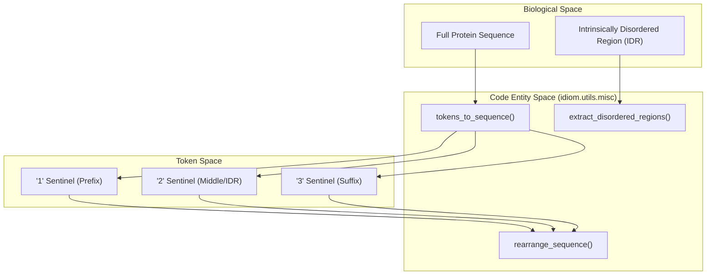
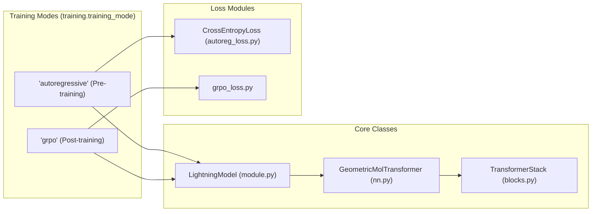

# Glossary

Relevant source files

The following files were used as context for generating this wiki page:

- [README.md](README.md)
- [entrypoints/train/post-train/train_rl_idp_protgps.bash](entrypoints/train/post-train/train_rl_idp_protgps.bash)
- [entrypoints/train/pre-train/pretrain.bash](entrypoints/train/pre-train/pretrain.bash)
- [rewards/custom_rewards/custom_rewards.py](rewards/custom_rewards/custom_rewards.py)
- [src/idiom/nn/transformer/losses/grpo_loss.py](src/idiom/nn/transformer/losses/grpo_loss.py)
- [src/idiom/nn/transformer/nn.py](src/idiom/nn/transformer/nn.py)
- [src/idiom/nn/transformer/scores.py](src/idiom/nn/transformer/scores.py)
- [src/idiom/utils/misc.py](src/idiom/utils/misc.py)
- [src/idiom/utils/sampler.py](src/idiom/utils/sampler.py)

This glossary defines the technical terms, abbreviations, and domain-specific concepts used throughout the IDiom codebase. It serves as a reference for onboarding engineers to understand how biological concepts (like intrinsically disordered regions) map to neural network implementations (like FIM sentinels and GRPO).

## Biological & Domain Concepts

| Term | Definition | Code Reference |
|:---|:---|:---|
| **IDP** | Intrinsically Disordered Protein. A protein that lacks a fixed or ordered three-dimensional structure. | [README.md:121-123]() |
| **IDR** | Intrinsically Disordered Region. A specific segment within a larger protein that is disordered. | [src/idiom/utils/misc.py:57-78]() |
| **FIM** | Fill-In-the-Middle. A training technique allowing the model to generate a sequence segment (IDR) conditioned on both N-terminal (prefix) and C-terminal (suffix) contexts. | [README.md:141-155]() |
| **Sentinels** | Special tokens ('1', '2', '3') used to delineate sequence parts: '1' for Prefix, '2' for IDR/Middle, and '3' for Suffix. | [src/idiom/nn/transformer/scores.py:191-215]() |
| **ProtGPS** | A reward model used to predict the localization of proteins into cellular condensates (e.g., stress granules). | [rewards/protgps/]() |

**Sources:** [README.md:1-155](), [src/idiom/nn/transformer/scores.py:191-215](), [src/idiom/utils/misc.py:57-78]()

---

## Architecture & Modeling

### GeometricMolTransformer
The primary model class defined in `src/idiom/nn/transformer/nn.py`. It integrates residue embeddings and structural embeddings (if available) before passing them through a `TransformerStack`.

*   **Implementation:** Inherits from `nn.Module`. It sums `res_token_embedding` and `structural_token_embedding` [src/idiom/nn/transformer/nn.py:78-88]().
*   **Output:** Uses a `RegressionHead` to project the transformer hidden state back to the vocabulary size (logits) [src/idiom/nn/transformer/nn.py:98-102]().

### UnifiedTransformerBlock
The fundamental layer in the `TransformerStack`. It supports multiple masking modes, specifically `causal` for autoregressive generation [entrypoints/train/pre-train/pretrain.bash:49]().

### TokenSampler
A utility class in `src/idiom/utils/sampler.py` that handles the conversion of model logits into discrete tokens using strategies like `top_k`, `top_p`, or `full` sampling [src/idiom/utils/sampler.py:9-36]().

**Sources:** [src/idiom/nn/transformer/nn.py:5-103](), [src/idiom/utils/sampler.py:9-145](), [entrypoints/train/pre-train/pretrain.bash:48-53]()

---

## Reinforcement Learning (GRPO)

### GRPO (Group Relative Policy Optimization)
A reinforcement learning algorithm used for post-training IDiom. Unlike standard PPO, it normalizes advantages across a group of sampled sequences generated from the same prompt.

*   **Group Size:** The number of sequences generated per prompt to calculate relative advantage [src/idiom/nn/transformer/losses/grpo_loss.py:17-19]().
*   **Beta KL:** A penalty coefficient for the Kullback–Leibler divergence between the current policy and the reference (base) model to prevent catastrophic forgetting [src/idiom/nn/transformer/losses/grpo_loss.py:28-30]().
*   **Reward Shaping:** The process of modifying raw reward values (e.g., ProtGPS scores) using quadratic scaling or adding length/entropy penalties [src/idiom/nn/transformer/losses/grpo_loss.py:33-39]().

### Reward Registry
A dynamic system for loading reward functions. Functions must start with `compute_` and accept `tokens`, `token_info`, and `device` [rewards/custom_rewards/custom_rewards.py:1-3]().

**Sources:** [src/idiom/nn/transformer/losses/grpo_loss.py:10-97](), [rewards/custom_rewards/custom_rewards.py:1-33](), [entrypoints/train/post-train/train_rl_idp_protgps.bash:129-148]()

---

## Technical Mapping Diagrams

### Sequence Data Flow: From Biology to Tokens
This diagram bridges the natural language biological concepts to the specific code entities used to process them.

**Sources:** [src/idiom/utils/misc.py:11-112](), [src/idiom/nn/transformer/scores.py:191-215]()

---

### Training Pipeline: Model Orchestration
This diagram maps the training stages to the specific Python classes and configuration keys in the codebase.

**Sources:** [src/idiom/nn/transformer/nn.py:5-60](), [entrypoints/train/pre-train/pretrain.bash:65](), [entrypoints/train/post-train/train_rl_idp_protgps.bash:104]()

---

## Key Abbreviations

| Abbreviation | Meaning |
|:---|:---|
| **AFDB** | AlphaFold Database |
| **MHA** | Multi-Head Attention |
| **RPE** | Relative Positional Encoding |
| **RoPE** | Rotary Positional Embedding |
| **DDP** | Distributed Data Parallel |
| **HDF5** | Hierarchical Data Format version 5 (used for sharded datasets) |
| **KL** | Kullback–Leibler Divergence |

**Sources:** [README.md:3](), [entrypoints/train/pre-train/pretrain.bash:29-53](), [src/idiom/nn/transformer/losses/grpo_loss.py:28-30]()