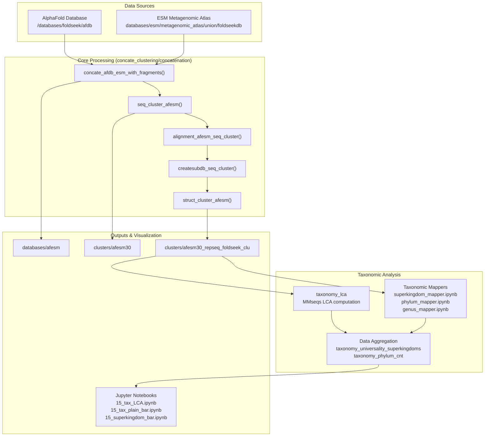
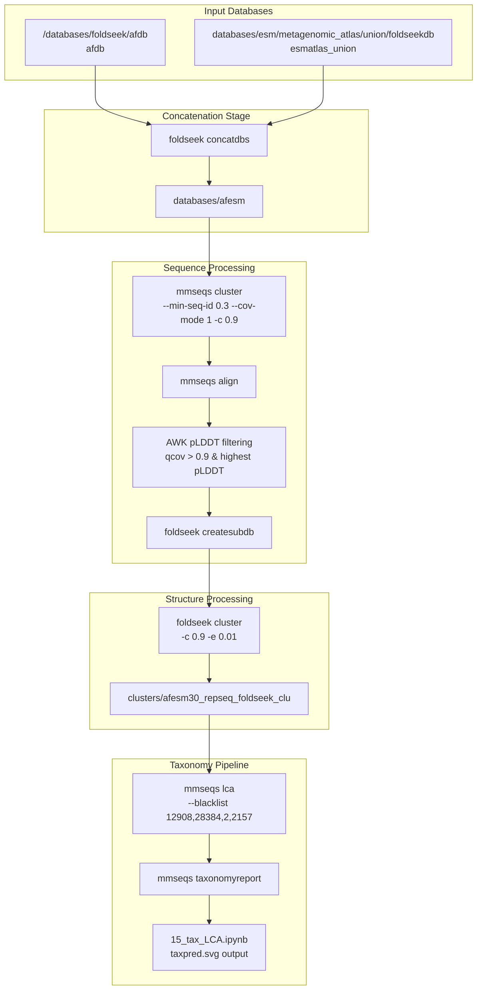

# Overview

Relevant source files

The following files were used as context for generating this wiki page:

- [concate_clustering/concatenation](concate_clustering/concatenation)
- [taxonomy/15_tax_LCA.ipynb](taxonomy/15_tax_LCA.ipynb)
- [taxonomy/taxonomy_lca](taxonomy/taxonomy_lca)

## Purpose and Scope

The **afesm-analysis** repository implements a comprehensive protein structure and sequence analysis pipeline that combines data from the AlphaFold Database (AFDB) and ESM Metagenomic Atlas. The system performs multi-stage clustering of protein sequences and structures, followed by sophisticated taxonomic classification and analysis.

This document provides a high-level overview of the entire system architecture and data flow. For detailed information about specific subsystems, see:
- Core data processing pipeline: [Core Data Processing Pipeline](#2)
- Taxonomic analysis components: [Taxonomy Analysis System](#3) 
- Visualization and reporting tools: [Visualization and Reporting](#4)
- Development setup: [Development Setup](#5)

## System Architecture

The afesm-analysis system consists of three primary layers that process protein data through concatenation, clustering, taxonomic classification, and visualization.

**Overall System Architecture**

Sources: [concate_clustering/concatenation:1-126](), [taxonomy/taxonomy_lca:1-18](), [taxonomy/15_tax_LCA.ipynb:1-331]()

## Core Components

### Data Processing Pipeline

The core data processing workflow is implemented in the `concate_clustering/concatenation` script, which orchestrates the entire protein analysis pipeline through five main functions:

| Function | Purpose | Output |
|----------|---------|---------|
| `concate_afdb_esm_with_fragments()` | Concatenates AFDB and ESM databases | `databases/afesm` |
| `seq_cluster_afesm()` | Clusters sequences at 30% identity | `clusters/afesm30` |
| `alignment_afesm_seq_cluster()` | Generates sequence alignments | `alignment/afesm30_aln*` |
| `createsubdb_seq_cluster()` | Creates representative sequence database | `databases/afesm30_repseq` |
| `struct_cluster_afesm()` | Clusters structures using Foldseek | `clusters/afesm30_repseq_foldseek_clu` |

### Taxonomic Classification System

The taxonomy analysis subsystem processes structure clusters through LCA (Lowest Common Ancestor) computation and hierarchical mapping:

- **LCA Analysis**: Implemented via `mmseqs lca` command in [taxonomy/taxonomy_lca:6]()
- **Taxonomic Mapping**: Collection of Jupyter notebooks for different taxonomic levels
- **Data Aggregation**: Scripts that count and aggregate taxonomic distributions

### Visualization and Reporting

The system generates visualizations through Jupyter notebooks that create SVG outputs:

- `15_tax_LCA.ipynb`: LCA prediction visualization with taxonomic level breakdowns
- `15_tax_plain_bar.ipynb`: Basic taxonomy distribution charts  
- `15_superkingdom_bar.ipynb`: Superkingdom-specific percentage plots

Sources: [concate_clustering/concatenation:4-125](), [taxonomy/taxonomy_lca:5-17](), [taxonomy/15_tax_LCA.ipynb:16-306]()

## Data Flow Architecture  

The system processes data through a linear pipeline with clear input/output dependencies between stages.

**End-to-End Data Flow**

Sources: [concate_clustering/concatenation:16-121](), [taxonomy/taxonomy_lca:6-8](), [taxonomy/15_tax_LCA.ipynb:224-225]()

## Technology Stack

The system leverages several bioinformatics tools and programming environments:

- **Foldseek**: Structure similarity search and clustering
- **MMseqs2**: Sequence clustering and LCA computation  
- **AWK**: Text processing and data filtering
- **Python/Jupyter**: Analysis notebooks with pandas, matplotlib
- **Shell Scripts**: Pipeline orchestration and job scheduling via `srun`

The pipeline is designed to handle large-scale protein datasets, utilizing high-performance computing resources with SLURM job scheduling for computationally intensive steps like clustering operations.

Sources: [concate_clustering/concatenation:38-120](), [taxonomy/15_tax_LCA.ipynb:16-17](), [taxonomy/taxonomy_lca:6-7]()

---