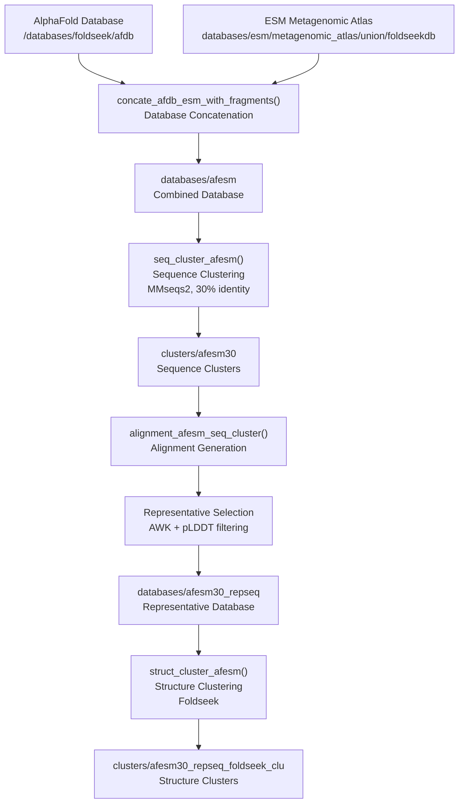
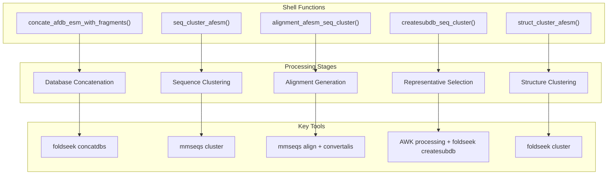

# Core Data Processing Pipeline

<details>
<summary>Relevant source files</summary>

The following files were used as context for generating this wiki page:

- [concate_clustering/concatenation](concate_clustering/concatenation)

</details>


## Purpose and Scope

The Core Data Processing Pipeline is the central data processing workflow that combines protein structure databases from AlphaFold (AFDB) and ESM Metagenomic Atlas, performs multi-stage clustering analysis, and generates representative datasets for downstream taxonomic analysis. This document covers the five main processing stages: database concatenation, sequence clustering, alignment generation, representative selection, and structure clustering.

For taxonomic classification of the processed clusters, see [Taxonomy Analysis System](#3). For visualization of results, see [Visualization and Reporting](#4).

## Pipeline Overview

The pipeline processes two major protein structure databases through a series of clustering and filtering steps, ultimately producing representative datasets suitable for taxonomic analysis.

### High-Level Data Flow



Sources: [concate_clustering/concatenation:1-125]()

### Function-to-Stage Mapping



Sources: [concate_clustering/concatenation:4-125]()

## Database Concatenation

The `concate_afdb_esm_with_fragments()` function combines the AlphaFold database and ESM Metagenomic Atlas into a unified database using Foldseek's `concatdbs` command.

### Input Sources

| Database | Path | Filename |
|----------|------|----------|
| AlphaFold DB | `/databases/foldseek/afdb` | `afdb` |
| ESM Metagenomic Atlas | `databases/esm/metagenomic_atlas/union/foldseekdb` | `esmatlas_union` |

### Concatenation Process

The function concatenates four types of database files:
- Base database files
- Header files (`_h` suffix)  
- Secondary structure files (`_ss` suffix)
- Coordinate files (`_ca` suffix)

### Output

The combined database is written to `databases/afesm` with all associated file types preserved.

Sources: [concate_clustering/concatenation:4-30]()

## Sequence Clustering and Alignment

### Sequence Clustering

The `seq_cluster_afesm()` function performs sequence-based clustering using MMseqs2 with the following parameters:

| Parameter | Value | Purpose |
|-----------|-------|---------|
| `--min-seq-id` | `0.3` | 30% minimum sequence identity |
| `--cov-mode` | `1` | Coverage mode |
| `-c` | `0.9` | 90% coverage requirement |

The clustering operation runs on the `databases/afesm` input and produces `clusters/afesm30` as output.

### Alignment Generation

The `alignment_afesm_seq_cluster()` function generates detailed alignments using MMseqs2's `align` and `convertalis` commands. The alignment output includes:

- Query and target identifiers
- Query coverage (`qcov`) and target coverage (`tcov`)
- Query length (`qlen`), target length (`tlen`), and alignment length (`alnlen`)

Sources: [concate_clustering/concatenation:35-58]()

## Representative Selection

The representative selection process uses AWK scripting to identify optimal representative sequences for each cluster based on protein quality metrics.

### pLDDT Integration

The pipeline integrates pLDDT (predicted Local Distance Difference Test) scores from `metadata/concat-entryId_plddt.tsv` with alignment data to enable quality-based selection.

### Selection Criteria

Two alternative selection strategies are implemented:

#### Strategy 1: Query Coverage + pLDDT
- Query coverage > 90% (`qcov > 0.9`)
- Highest pLDDT score within each cluster
- Output: `alignment/afesm30-pickedIds`

#### Strategy 2: Length Ratio + pLDDT  
- Target length to query length ratio ≥ 70% (`tlen/qlen >= 0.7`)
- pLDDT score ≥ 60
- Highest pLDDT score within each cluster
- Output: `alignment/afesm30_tlen70_plddt60-pickedIds`

### Subdatabase Creation

The `createsubdb_seq_cluster()` function creates representative subdatabases using the selected identifiers:

```bash
foldseek createsubdb $ids databases/afesm databases/afesm30_repseq --id-mode 1
```

Additional structure-related subdatabases (`_ss` and `_ca` files) are also generated.

Sources: [concate_clustering/concatenation:64-106]()

## Structure Clustering

The final stage performs structure-based clustering on the representative sequences using Foldseek.

### Structure Clustering Parameters

The `struct_cluster_afesm()` function uses the following Foldseek clustering parameters:

| Parameter | Value | Purpose |
|-----------|-------|---------|
| `-c` | `0.9` | 90% coverage requirement |
| `-e` | `0.01` | E-value threshold |

### Input and Output

- **Input**: `databases/afesm30_repseq` (representative sequence database)
- **Output**: `clusters/afesm30_repseq_foldseek_clu` (structure-based clusters)

The structure clustering runs with high computational requirements (128 cores, 60-day time limit) to handle the large representative dataset.

Sources: [concate_clustering/concatenation:111-125]()

## Outputs and Integration

The Core Data Processing Pipeline produces several key outputs that serve as inputs for downstream analysis:

### Primary Outputs

| Output | Path | Description |
|--------|------|-------------|
| Combined Database | `databases/afesm` | Unified AlphaFold + ESM database |
| Sequence Clusters | `clusters/afesm30` | 30% identity sequence clusters |
| Representative Database | `databases/afesm30_repseq` | Quality-filtered representatives |
| Structure Clusters | `clusters/afesm30_repseq_foldseek_clu` | Structure similarity clusters |

### Integration Points

The structure clusters (`afesm30_repseq_foldseek_clu`) serve as the primary input for the [Taxonomy Analysis System](#3), which performs taxonomic classification and generates the data used in [Visualization and Reporting](#4).

### Quality Metrics

The representative selection process tracks quality improvements:
- Approximately 3.83% of cluster representatives are altered based on pLDDT optimization
- Representative selection significantly improves average protein quality while maintaining cluster coverage

Sources: [concate_clustering/concatenation:80-83]()

---