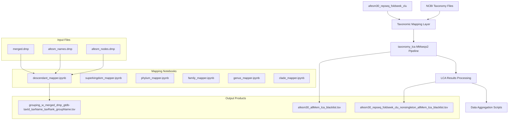
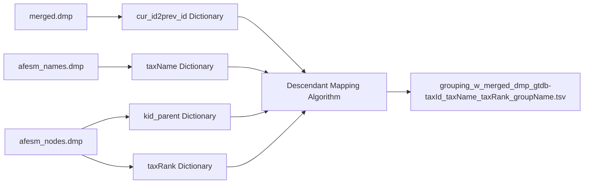
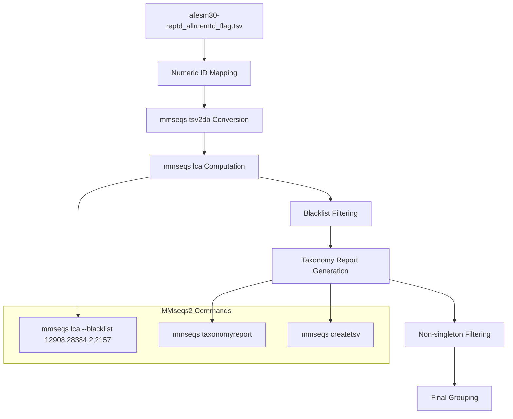
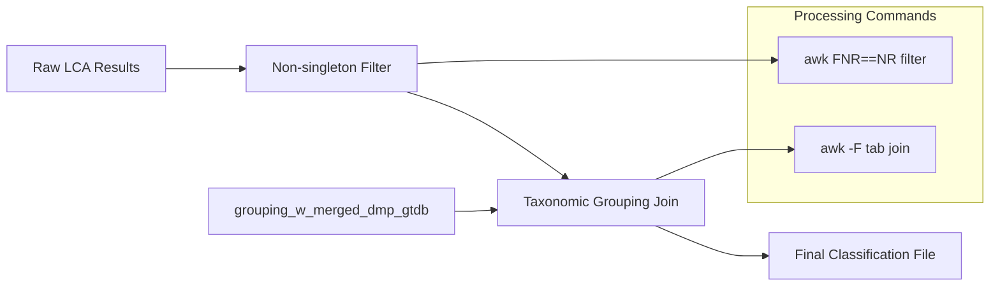

# Taxonomy Analysis System

Relevant source files

The following files were used as context for generating this wiki page:

- [taxonomy/descendant_mapper.ipynb](taxonomy/descendant_mapper.ipynb)
- [taxonomy/taxonomy_lca](taxonomy/taxonomy_lca)

## Purpose and Scope

The Taxonomy Analysis System provides comprehensive taxonomic classification and analysis capabilities for protein structure clusters generated by the core data processing pipeline. This system takes structure clusters as input and produces hierarchical taxonomic classifications, LCA (Lowest Common Ancestor) predictions, and aggregated taxonomic data suitable for downstream analysis and visualization.

For information about the core clustering pipeline that generates the input data, see [Core Data Processing Pipeline](#2). For visualization and reporting of taxonomic results, see [Visualization and Reporting](#4).

## System Overview

The taxonomy analysis system operates in three main phases: taxonomic mapping, LCA computation, and data aggregation. It processes structure clusters from the `afesm30_repseq_foldseek_clu` dataset and integrates with NCBI taxonomy databases to provide scientifically accurate taxonomic classifications.

### Architecture Overview

Sources: [taxonomy/taxonomy_lca:1-18](), [taxonomy/descendant_mapper.ipynb:1-2616]()

## Core Components

### Taxonomic Mapping Infrastructure

The system maintains hierarchical taxonomic mappings through a collection of specialized notebooks that handle different taxonomic levels. The central component is the `descendant_mapper.ipynb` notebook, which processes NCBI taxonomy dump files to create comprehensive taxonomic hierarchies.

#### Key Data Structures

The mapping system uses several core data dictionaries:

- `cur_id2prev_id`: Maps current taxonomy IDs to previous IDs from `merged.dmp`
- `taxName`: Maps taxonomy IDs to scientific names from `afesm_names.dmp`
- `kid_parent`: Maps child taxonomy IDs to parent IDs from `afesm_nodes.dmp`
- `taxRank`: Maps taxonomy IDs to their taxonomic rank

Sources: [taxonomy/descendant_mapper.ipynb:1388-1409](), [taxonomy/descendant_mapper.ipynb:2428-2446](), [taxonomy/descendant_mapper.ipynb:2455-2471]()

#### Taxonomic Hierarchy Algorithm

The descendant mapping algorithm implements a depth-first search to resolve taxonomic hierarchies. The core logic in `dfs()` function handles special cases for different taxonomic ranks:

- **Superkingdom level**: Direct assignment as group representative
- **Family level**: Grouped as "family and lower than family"
- **Species level**: Grouped as "species and lower than species"
- **Intermediate levels**: Recursively resolved to appropriate group level

Sources: [taxonomy/descendant_mapper.ipynb:2480-2522]()

### LCA Analysis Pipeline

The LCA (Lowest Common Ancestor) analysis uses MMseqs2 to compute taxonomic classifications for sequence clusters. This pipeline is implemented in the `taxonomy_lca` script.

#### Workflow Steps

Sources: [taxonomy/taxonomy_lca:1-18]()

#### Key Processing Steps

1. **ID Mapping**: Maps sequence identifiers to numeric format using `afesm.lookup`
2. **Database Conversion**: Converts TSV to MMseqs2 database format with `--output-dbtype 6`
3. **LCA Computation**: Runs `mmseqs lca` with taxonomic blacklist filtering
4. **Report Generation**: Creates taxonomy reports and TSV output files
5. **Non-singleton Filtering**: Filters results to include only clusters with multiple members

Sources: [taxonomy/taxonomy_lca:2-8](), [taxonomy/taxonomy_lca:13-16]()

### Data Integration and Output Generation

The system produces several key output files that integrate taxonomic classifications with cluster data:

#### Primary Output Files

| File | Description | Generated By |
|------|-------------|--------------|
| `grouping_w_merged_dmp_gtdb-taxId_taxName_taxRank_groupName.tsv` | Taxonomic grouping assignments | `descendant_mapper.ipynb` |
| `afesm30_allMem_lca_blacklist.tsv` | LCA results with blacklist filtering | `mmseqs lca` |
| `afesm30_repseq_foldseek_clu_nonsingleton_allMem_lca_blacklist.tsv` | Non-singleton LCA results | AWK processing |

#### File Format Specifications

The main output file format includes these columns:
- `taxId`: Taxonomy identifier
- `taxName`: Scientific name
- `taxRank`: Taxonomic rank
- `groupName`: Assigned taxonomic group

Sources: [taxonomy/taxonomy_lca:14-16]()

## Integration Points

The taxonomy analysis system integrates with other components of the larger analysis pipeline:

### Input Dependencies
- Structure clusters from [Core Data Processing Pipeline](#2)
- NCBI taxonomy database files
- Cluster membership data from foldseek clustering

### Output Consumers  
- [Visualization and Reporting](#4) notebooks for generating taxonomic plots
- Downstream analysis scripts requiring taxonomic classifications
- Statistical analysis workflows needing taxonomic groupings

The system serves as a critical bridge between raw protein structure clusters and biologically meaningful taxonomic classifications, enabling researchers to understand the evolutionary and taxonomic distribution of protein structures in the dataset.

Sources: [taxonomy/taxonomy_lca:1-18](), [taxonomy/descendant_mapper.ipynb:2531-2584]()

---