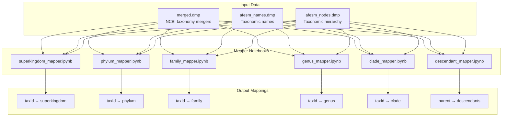
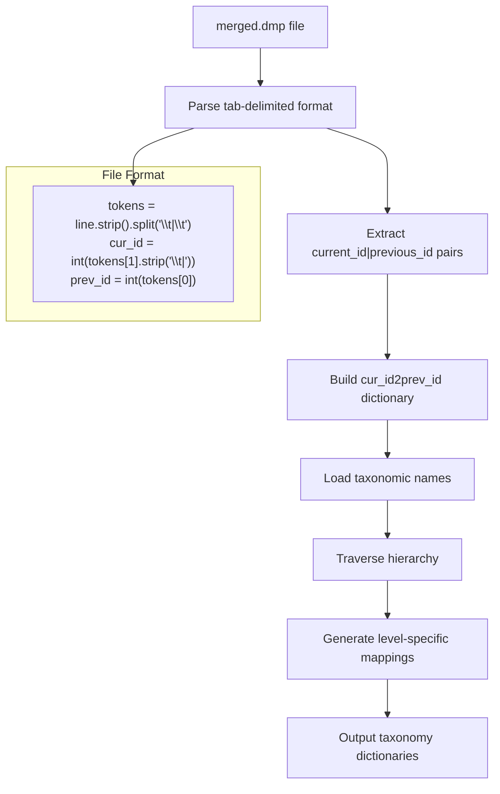
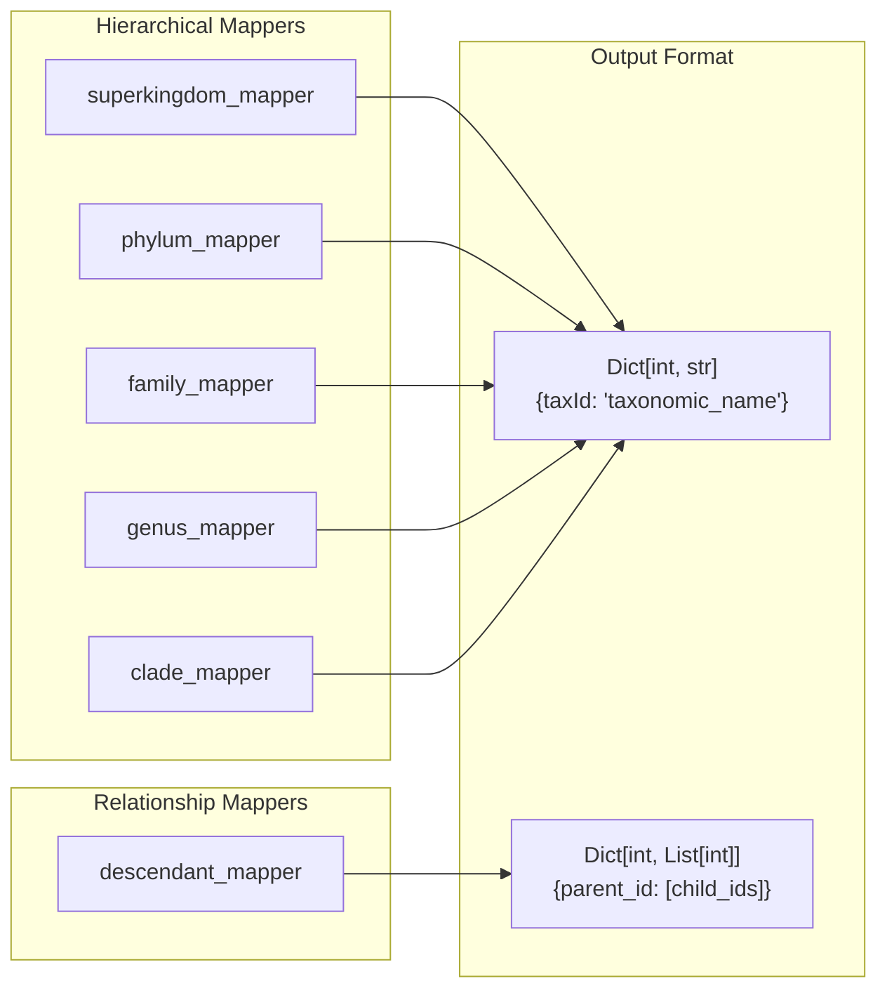
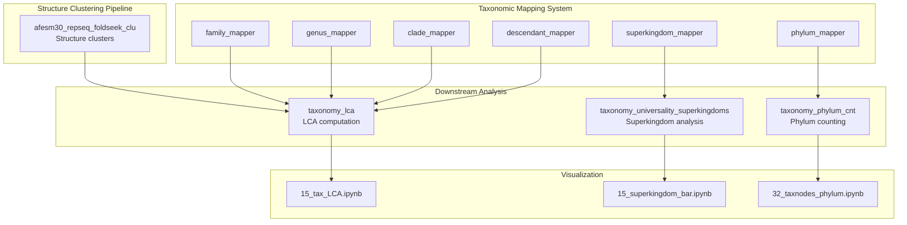

# Taxonomic Mapping

<details>
<summary>Relevant source files</summary>

The following files were used as context for generating this wiki page:

- [taxonomy/clade_mapper.ipynb](taxonomy/clade_mapper.ipynb)
- [taxonomy/descendant_mapper.ipynb](taxonomy/descendant_mapper.ipynb)
- [taxonomy/family_mapper.ipynb](taxonomy/family_mapper.ipynb)
- [taxonomy/genus_mapper.ipynb](taxonomy/genus_mapper.ipynb)
- [taxonomy/phylum_mapper.ipynb](taxonomy/phylum_mapper.ipynb)
- [taxonomy/superkingdom_mapper.ipynb](taxonomy/superkingdom_mapper.ipynb)

</details>


This document covers the taxonomic mapping subsystem that assigns hierarchical taxonomic classifications to protein structure data. The mapping system processes NCBI taxonomy dump files and creates lookup dictionaries for different taxonomic levels including superkingdom, phylum, family, genus, and clade classifications.

For information about LCA (Lowest Common Ancestor) analysis that uses these mappings, see [LCA Analysis](#3.2). For data aggregation workflows that consume these mappings, see [Data Aggregation and Processing](#3.3).

## System Overview

The taxonomic mapping system consists of individual Jupyter notebooks that each focus on a specific taxonomic hierarchy level. Each mapper reads NCBI taxonomy dump files and generates classification dictionaries that map taxonomic IDs to standardized taxonomic names.



Sources: [taxonomy/clade_mapper.ipynb:1-31](), [taxonomy/family_mapper.ipynb:1-31](), [taxonomy/genus_mapper.ipynb:1-31](), [taxonomy/phylum_mapper.ipynb:1-31](), [taxonomy/descendant_mapper.ipynb:1-10]()

## Data Processing Workflow

All mapper notebooks follow a consistent data processing pattern that parses NCBI taxonomy files and builds hierarchical lookup structures.



Sources: [taxonomy/clade_mapper.ipynb:9-31](), [taxonomy/family_mapper.ipynb:9-31](), [taxonomy/genus_mapper.ipynb:9-31](), [taxonomy/phylum_mapper.ipynb:9-31]()

## Individual Mapper Components

### Core Parsing Logic

Each mapper implements identical file parsing logic that processes the `merged.dmp` file format:

| Component | Implementation | Purpose |
|-----------|---------------|---------|
| File Reading | `merged_f = open("../../afesm5/taxonomy/taxdump/merged.dmp")` | Access NCBI taxonomy data |
| Line Parsing | `tokens = line.strip().split("\\t\|\\t")` | Extract tab-delimited fields |
| ID Extraction | `cur_id = int(tokens[1].strip('\\t\|'))` | Get current taxonomic ID |
| Mapping Build | `cur_id2prev_id[cur_id] = [prev_id]` | Build parent-child relationships |

Sources: [taxonomy/clade_mapper.ipynb:9-28](), [taxonomy/family_mapper.ipynb:9-28](), [taxonomy/genus_mapper.ipynb:9-28](), [taxonomy/phylum_mapper.ipynb:9-28]()

### Taxonomic Level Mappers



Sources: [taxonomy/descendant_mapper.ipynb:7-10]()

### Descendant Mapping

The `descendant_mapper.ipynb` creates parent-to-children relationships, generating output like:

```python
{74109: [12, 338050],
 29: [30],
 184914: [36],
 42: [37]
 # ... additional parent -> descendant mappings
}
```

This enables hierarchical traversal from higher-level taxonomic groups down to their constituent taxa.

Sources: [taxonomy/descendant_mapper.ipynb:7-80]()

## Integration Architecture

The taxonomic mappers integrate with the broader AFESM analysis pipeline by providing standardized taxonomic classifications for downstream analysis components.



Sources: [taxonomy/clade_mapper.ipynb:1-31](), [taxonomy/family_mapper.ipynb:1-31](), [taxonomy/genus_mapper.ipynb:1-31](), [taxonomy/phylum_mapper.ipynb:1-31](), [taxonomy/descendant_mapper.ipynb:1-10]()

## File System Organization

The mapper notebooks access taxonomy data through a standardized file structure:

| File Path | Content | Usage |
|-----------|---------|-------|
| `../../afesm5/taxonomy/taxdump/merged.dmp` | NCBI taxonomy ID mergers | Primary input for all mappers |
| `../../afesm5/taxonomy/taxdump/afesm_names.dmp` | Taxonomic name definitions | Name resolution |
| `../../afesm5/taxonomy/taxdump/afesm_nodes.dmp` | Hierarchical relationships | Tree structure |

Each mapper notebook is located in the `taxonomy/` directory and follows the naming pattern `{level}_mapper.ipynb`.

Sources: [taxonomy/clade_mapper.ipynb:9](), [taxonomy/family_mapper.ipynb:9](), [taxonomy/genus_mapper.ipynb:9](), [taxonomy/phylum_mapper.ipynb:9]()

---