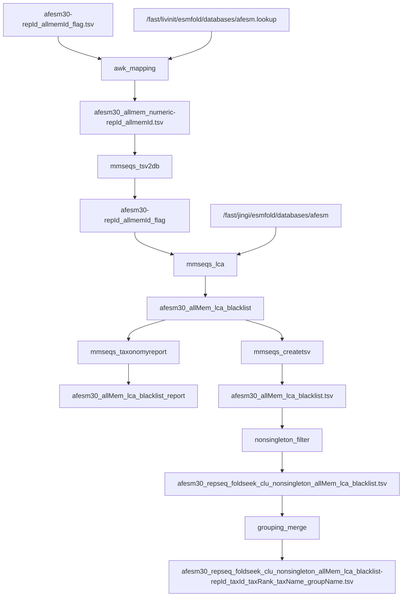
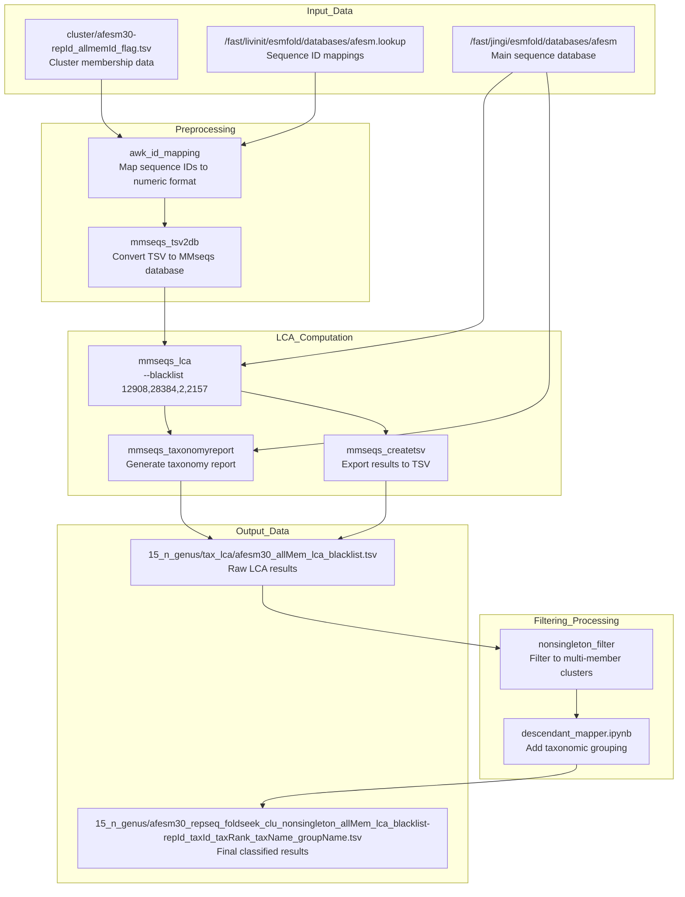

# LCA Analysis

<details>
<summary>Relevant source files</summary>

The following files were used as context for generating this wiki page:

- [taxonomy/taxonomy_lca](taxonomy/taxonomy_lca)

</details>


## Purpose and Scope

The LCA (Lowest Common Ancestor) Analysis system computes taxonomic classifications for protein sequence clusters using MMseqs2's LCA algorithm. This component processes structure clusters generated by the core data processing pipeline and assigns taxonomic identities based on the lowest common ancestor of cluster members.

The system filters results using taxonomic blacklists and focuses on non-singleton clusters to identify meaningful taxonomic groupings. For information about the broader taxonomic mapping framework, see [Taxonomic Mapping](#3.1). For data aggregation and processing of LCA results, see [Data Aggregation and Processing](#3.3).

## LCA Computation Workflow

### Overview Diagram



Sources: [taxonomy/taxonomy_lca:1-18]()

### Data Processing Pipeline

The LCA analysis follows a structured pipeline that transforms cluster membership data into taxonomic classifications:



Sources: [taxonomy/taxonomy_lca:1-16]()

## Process Components

### Sequence ID Mapping

The initial step converts cluster membership data to numeric format for MMseqs2 processing:

| Operation | Input | Output | Purpose |
|-----------|-------|--------|---------|
| `awk` mapping | `afesm30-repId_allmemId_flag.tsv` | `afesm30_allmem_numeric-repId_allmemId.tsv` | Convert sequence IDs to numeric format |
| `mmseqs tsv2db` | Numeric TSV file | `afesm30-repId_allmemId_flag` database | Create MMseqs2 database format |

Sources: [taxonomy/taxonomy_lca:2-3]()

### LCA Computation with Blacklist

The core LCA computation uses MMseqs2 with taxonomic blacklisting to exclude problematic taxa:

```bash
mmseqs lca /fast/jingi/esmfold/databases/afesm ../afesm5/cluster/afesm30-repId_allmemId_flag 15_n_genus/tax_lca/afesm30_allMem_lca_blacklist --blacklist 12908,28384,2,2157
```

**Blacklisted Taxa:**
- `12908`: Unclassified sequences
- `28384`: Other sequences  
- `2`: Bacteria (root level)
- `2157`: Archaea (root level)

Sources: [taxonomy/taxonomy_lca:6]()

### Report Generation

MMseqs2 generates both taxonomy reports and TSV exports:

| Command | Output | Description |
|---------|--------|-------------|
| `mmseqs taxonomyreport` | `afesm30_allMem_lca_blacklist_report` | Formatted taxonomy report |
| `mmseqs createtsv` | `afesm30_allMem_lca_blacklist.tsv` | Tab-separated values export |

Sources: [taxonomy/taxonomy_lca:7-8]()

### Non-singleton Filtering

The system filters results to focus on clusters with multiple members:

```bash
awk 'FNR==NR {id[$1]=1; next;} $1 in id {print $0}' ../afesm5/metadata/afesm30_repseq_foldseek_clu_nonsingleton-repId_nMem.tsv 15_n_genus/tax_lca/afesm30_allMem_lca_blacklist.tsv
```

This step uses `afesm30_repseq_foldseek_clu_nonsingleton-repId_nMem.tsv` as a filter to retain only clusters with multiple sequence members.

Sources: [taxonomy/taxonomy_lca:14]()

### Taxonomic Grouping Integration

The final step merges LCA results with taxonomic grouping data:

```bash
awk -F "\t" 'FNR==NR {id[$1]=$NF; next} {print $0"\t"id[$2]}' coreness/grouping_w_merged_dmp_gtdb-taxId_taxName_taxRank_groupName.tsv
```

This operation adds `groupName` classifications from the `descendant_mapper.ipynb` output to create the final dataset with columns:
- `repId`: Representative sequence ID
- `taxId`: Taxonomic ID
- `taxRank`: Taxonomic rank
- `taxName`: Taxonomic name  
- `groupName`: Taxonomic group classification

Sources: [taxonomy/taxonomy_lca:16](), [taxonomy/taxonomy_lca:10-11]()

## Input and Output Data

### Input Files

| File Path | Description | Format |
|-----------|-------------|--------|
| `cluster/afesm30-repId_allmemId_flag.tsv` | Cluster membership mapping | TSV |
| `/fast/livinit/esmfold/databases/afesm.lookup` | Sequence ID lookup table | Lookup format |
| `/fast/jingi/esmfold/databases/afesm` | Main sequence database | MMseqs2 database |
| `../afesm5/metadata/afesm30_repseq_foldseek_clu_nonsingleton-repId_nMem.tsv` | Non-singleton cluster metadata | TSV |
| `coreness/grouping_w_merged_dmp_gtdb-taxId_taxName_taxRank_groupName.tsv` | Taxonomic grouping data | TSV |

### Output Files

| File Path | Description | Usage |
|-----------|-------------|--------|
| `15_n_genus/tax_lca/afesm30_allMem_lca_blacklist.tsv` | Raw LCA classifications | Intermediate processing |
| `15_n_genus/tax_lca/afesm30_allMem_lca_blacklist_report` | Formatted taxonomy report | Analysis and review |
| `15_n_genus/afesm30_repseq_foldseek_clu_nonsingleton_allMem_lca_blacklist-repId_taxId_taxRank_taxName_groupName.tsv` | Final classified dataset | Visualization and downstream analysis |

Sources: [taxonomy/taxonomy_lca:1-16]()

## Integration with Visualization

The LCA analysis results feed directly into the visualization system through the `15_tax_LCA.ipynb` notebook, which generates taxonomic distribution plots and classification summaries.

Sources: [taxonomy/taxonomy_lca:18]()

---