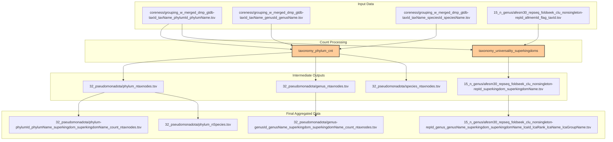
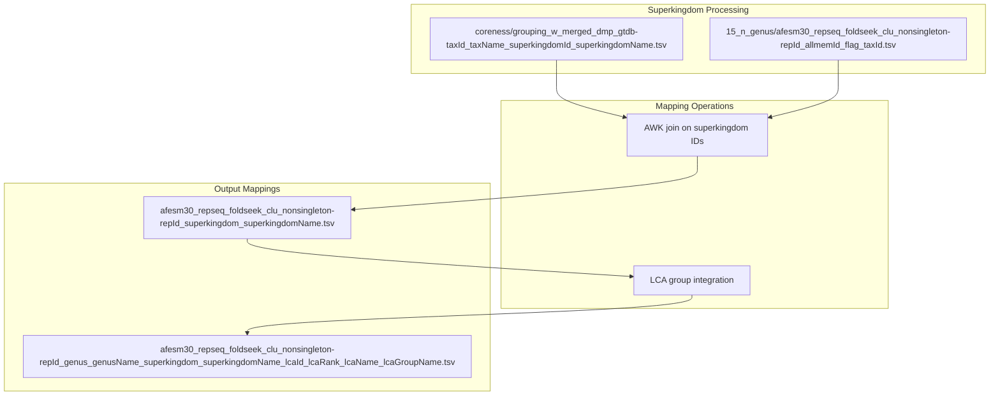
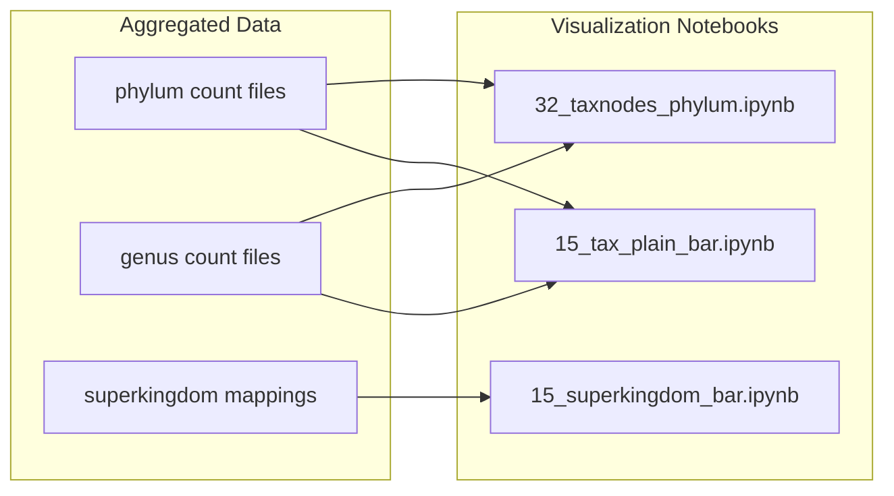

# Data Aggregation and Processing

<details>
<summary>Relevant source files</summary>

The following files were used as context for generating this wiki page:

- [taxonomy/32_taxnodes_phylum.ipynb](taxonomy/32_taxnodes_phylum.ipynb)
- [taxonomy/taxonomy_phylum_cnt](taxonomy/taxonomy_phylum_cnt)
- [taxonomy/taxonomy_universality_superkingdoms](taxonomy/taxonomy_universality_superkingdoms)

</details>


## Purpose and Scope

This section documents the data aggregation and processing workflows that transform raw taxonomic classifications into aggregated count data and summary statistics for downstream analysis and visualization. These scripts process the outputs from LCA analysis (see [3.2](#3.2)) and taxonomic mapping (see [3.1](#3.1)) to generate count distributions, universality metrics, and prepare data files for the visualization notebooks documented in [4](#4).

The primary functions include:
- Counting taxonomic nodes at different hierarchical levels (phylum, genus, species)
- Computing superkingdom universality and distribution metrics  
- Joining taxonomic assignments with cluster membership data
- Preparing aggregated datasets for visualization pipelines

## Data Aggregation Workflow

The aggregation process transforms individual taxonomic assignments into summary statistics and count distributions across multiple taxonomic ranks.



Sources: [taxonomy/taxonomy_phylum_cnt:1-7](), [taxonomy/taxonomy_universality_superkingdoms:1-18]()

## Taxonomic Count Processing

The `taxonomy_phylum_cnt` script performs hierarchical counting of taxonomic nodes across phylum, genus, and species levels using AWK-based data processing.

### Node Counting Operations

The script uses AWK to aggregate taxonomic identifiers and generate count distributions:

```mermaid
flowchart LR
    subgraph "Raw Taxonomic Data"
        A["grouping_w_merged_dmp_gtdb files"]
    end
    
    subgraph "AWK Processing"
        B["awk -F '\t' '{id[$3\"\t\"$4]++;}' "]
        C["END {for (key in id) print key\"\t\"id[key]}"]
    end
    
    subgraph "Count Files"
        D["phylum_ntaxnodes.tsv"]
        E["genus_ntaxnodes.tsv"] 
        F["species_ntaxnodes.tsv"]
    end
    
    A --> B
    B --> C
    C --> D
    C --> E
    C --> F
```

The counting operations extract taxonomic ID and name pairs (columns 3 and 4) and generate frequency counts:
- **Phylum level**: [taxonomy/taxonomy_phylum_cnt:1]() processes `phylumId_phylumName` pairs
- **Genus level**: [taxonomy/taxonomy_phylum_cnt:2]() processes `genusId_genusName` pairs  
- **Species level**: [taxonomy/taxonomy_phylum_cnt:3]() processes `speciesId_speciesName` pairs

### Data Enrichment and Joining

The script performs join operations to enrich count data with additional taxonomic hierarchy information:

| Operation | Input Files | Output File | Purpose |
|-----------|-------------|-------------|---------|
| Phylum enrichment | `phylum_ntaxnodes.tsv` + superkingdom counts | `phylum-phylumId_phylumName_superkingdom_superkingdomName_count_ntaxnodes.tsv` | Add node counts to phylum distributions |
| Genus enrichment | `genus_ntaxnodes.tsv` + genus counts | `genus-genusId_genusName_superkingdom_superkingdomName_count_ntaxnodes.tsv` | Add node counts to genus distributions |
| Species counting | Phylum + species mappings | `phylum_nSpecies.tsv` | Count species per phylum |

Sources: [taxonomy/taxonomy_phylum_cnt:4-7]()

## Superkingdom Universality Analysis

The `taxonomy_universality_superkingdoms` script processes superkingdom-level taxonomic distributions and computes universality metrics across major taxonomic domains.

### Superkingdom Mapping Pipeline



The superkingdom mapping extracts unique representative-superkingdom associations:
- **Primary mapping**: [taxonomy/taxonomy_universality_superkingdoms:3]() creates `repId_superkingdom_superkingdomName` mappings
- **LCA integration**: [taxonomy/taxonomy_universality_superkingdoms:5]() joins with LCA predictions to create comprehensive taxonomic profiles

### Representative Cluster Analysis

The final output integrates multiple taxonomic levels for each representative sequence:

| Field | Description | Source |
|-------|-------------|--------|
| `repId` | Representative sequence identifier | Cluster analysis |
| `genus_genusName` | Genus-level assignment | Taxonomic mapping |
| `superkingdom_superkingdomName` | Superkingdom classification | Superkingdom mapping |
| `lcaId_lcaRank_lcaName_lcaGroupName` | LCA prediction results | LCA analysis |

This comprehensive mapping enables analysis of taxonomic universality across superkingdoms and supports the visualization workflows in [4](#4).

Sources: [taxonomy/taxonomy_universality_superkingdoms:3-16]()

## Integration with Visualization Pipeline

The aggregated data files serve as direct inputs to the visualization notebooks documented in section [4](#4):



The phylum-level analysis notebook `32_taxnodes_phylum.ipynb` processes the aggregated count data to generate taxonomic distribution visualizations and statistical summaries.

Sources: [taxonomy/32_taxnodes_phylum.ipynb:1-10](), [taxonomy/taxonomy_universality_superkingdoms:19]()

---