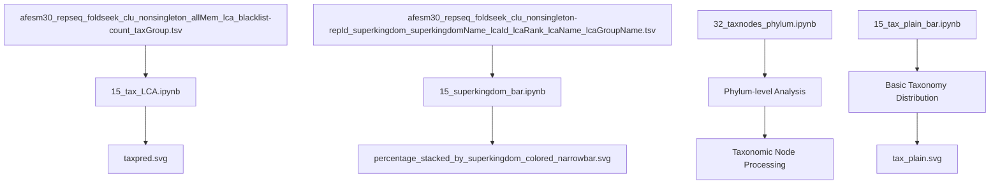
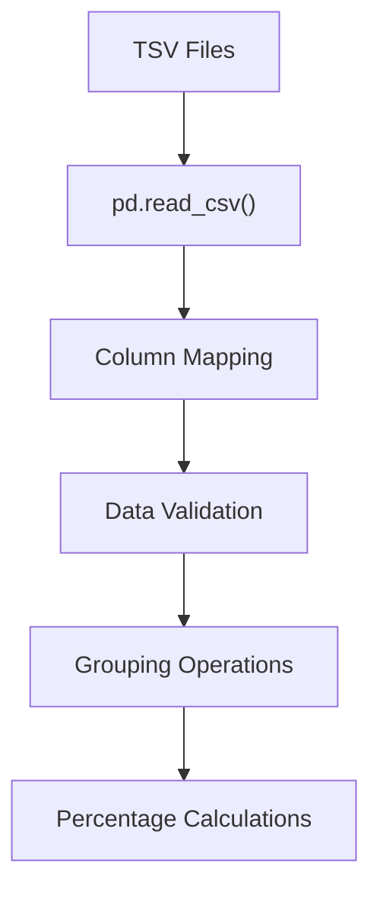
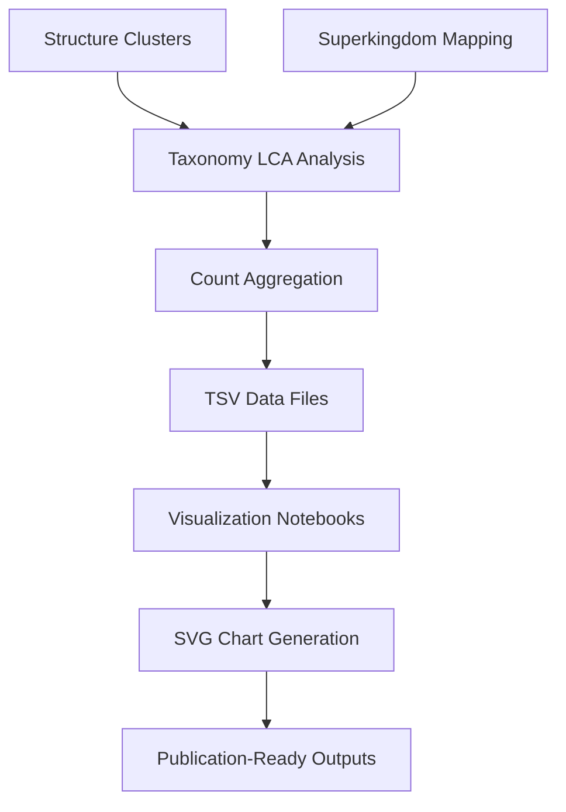

# Visualization and Reporting

Relevant source files

The following files were used as context for generating this wiki page:

- [taxonomy/15_superkingdom_bar.ipynb](taxonomy/15_superkingdom_bar.ipynb)
- [taxonomy/15_tax_LCA.ipynb](taxonomy/15_tax_LCA.ipynb)
- [taxonomy/15_tax_plain_bar.ipynb](taxonomy/15_tax_plain_bar.ipynb)

This document covers the visualization and reporting system that generates charts, plots, and visual summaries from the processed taxonomic classification data. This system transforms the taxonomic analysis outputs into publication-ready visualizations showing the distribution of protein clusters across different taxonomic levels and superkingdoms.

For information about the data processing that feeds into these visualizations, see [Taxonomy Analysis System](#3). For details about the underlying data aggregation processes, see [Data Aggregation and Processing](#3.3).

## Overview

The visualization and reporting system consists of Jupyter notebooks that read processed taxonomic data and generate SVG charts showing various aspects of the protein cluster classification results. The system focuses on two main types of visualizations:

1. **LCA Prediction Visualizations** - Show the distribution of clusters across different taxonomic prediction levels
2. **Superkingdom Distribution Charts** - Display the percentage breakdown of clusters across major biological domains

## Notebook-Based Visualization Pipeline

The visualization system is implemented through specialized Jupyter notebooks that handle data loading, processing, and chart generation:

**Sources:** [taxonomy/15_tax_LCA.ipynb:1-282](), [taxonomy/15_superkingdom_bar.ipynb:1-143]()

### LCA Prediction Visualization

The `15_tax_LCA.ipynb` notebook generates horizontal bar charts showing the distribution of protein clusters across different levels of taxonomic prediction confidence:

- **Input Data**: `afesm30_repseq_foldseek_clu_nonsingleton_allMem_lca_blacklist-count_taxGroup.tsv`
- **Taxonomic Levels**: 
  - `superkingdom` - highest confidence predictions
  - `lower than superkingdom` - intermediate confidence
  - `family and lower than family` - more specific classifications
  - `species and lower than species` - most specific predictions
  - `root` and `cellular organism` - broad classifications
  - `not predicted` - unclassified clusters

The notebook processes counts in thousands and applies a custom color scheme with blue bars for predicted categories and gray for unpredicted.

**Sources:** [taxonomy/15_tax_LCA.ipynb:19-21](), [taxonomy/15_tax_LCA.ipynb:182-225]()

### Superkingdom Distribution Analysis

The `15_superkingdom_bar.ipynb` notebook creates percentage stacked bar charts showing how clusters are distributed across the major biological domains:

The visualization uses a six-category classification system with custom colors:
- `root` - Gray (#9A9A9A)
- `cellular organism` - Dark (#27262F) 
- `superkingdom` - Blue (#0A87E7)
- `lower than superkingdom` - Green (#307D0A)
- `family and lower than family` - Orange (#D79429)
- `species and lower than species` - Red (#FB1634)

**Sources:** [taxonomy/15_superkingdom_bar.ipynb:59-67](), [taxonomy/15_superkingdom_bar.ipynb:86-118]()

## Data Processing and Aggregation

The notebooks implement several key data processing steps:

### Data Loading and Preparation

The system reads tab-separated files with specific column structures and applies consistent naming conventions for taxonomic categories.

### Percentage Calculation Logic

For superkingdom analysis, the system converts raw counts to percentages using `grouped.div(grouped.sum(axis=1), axis=0) * 100`, enabling comparison across different superkingdoms regardless of absolute cluster counts.

**Sources:** [taxonomy/15_superkingdom_bar.ipynb:81-83]()

## Output Artifacts

The visualization system generates publication-ready SVG files:

| Notebook | Output File | Description |
|----------|-------------|-------------|
| `15_tax_LCA.ipynb` | `taxpred.svg` | Horizontal bar chart of LCA prediction levels |
| `15_superkingdom_bar.ipynb` | `percentage_stacked_by_superkingdom_colored_narrowbar.svg` | Stacked percentage chart by superkingdom |
| `15_tax_plain_bar.ipynb` | `tax_plain.svg` | Basic taxonomy distribution visualization |
| `32_taxnodes_phylum.ipynb` | Phylum-level outputs | Detailed phylum-level taxonomic analysis |

### Chart Customization

The notebooks implement specific styling conventions:
- **Bar Width**: Controlled via `width=0.8` and `bar_width = 0.6` parameters
- **Color Schemes**: Custom hex color palettes for biological relevance
- **Label Formatting**: Custom y-axis labels with biological terminology (e.g., "≦ species", "< superkingdom")
- **Output Format**: Vector SVG format for scalable publication graphics

**Sources:** [taxonomy/15_superkingdom_bar.ipynb:90-105](), [taxonomy/15_tax_LCA.ipynb:220-225]()

## Integration with Analysis Pipeline

The visualization system integrates with the broader analysis pipeline by consuming outputs from the taxonomy analysis workflows:

The system expects specific input file formats and column structures, making it tightly coupled with the upstream taxonomy analysis processes while providing flexible visualization options for different aspects of the classification results.

**Sources:** [taxonomy/15_tax_LCA.ipynb:19-21](), [taxonomy/15_superkingdom_bar.ipynb:50-56]()

---