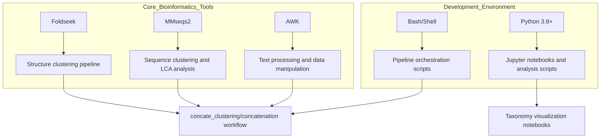
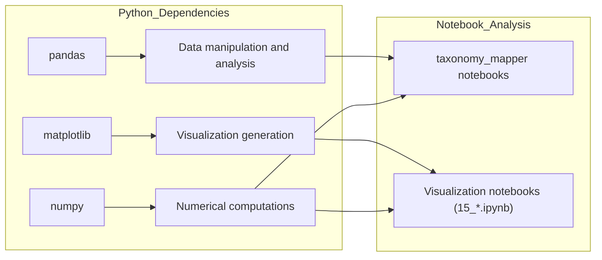
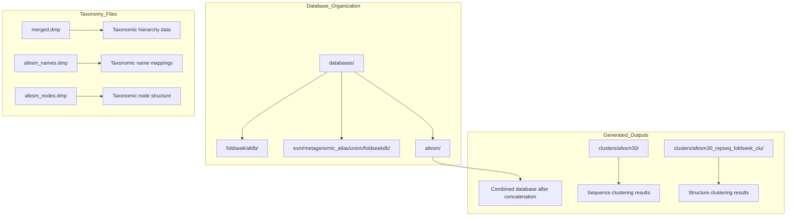
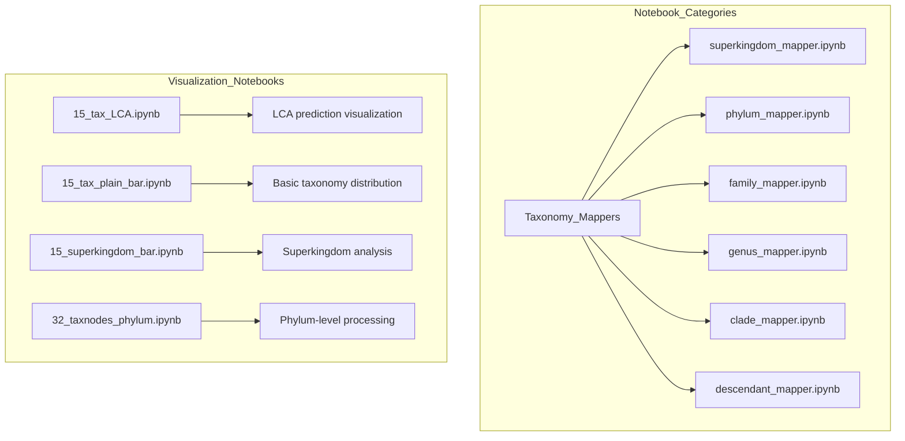
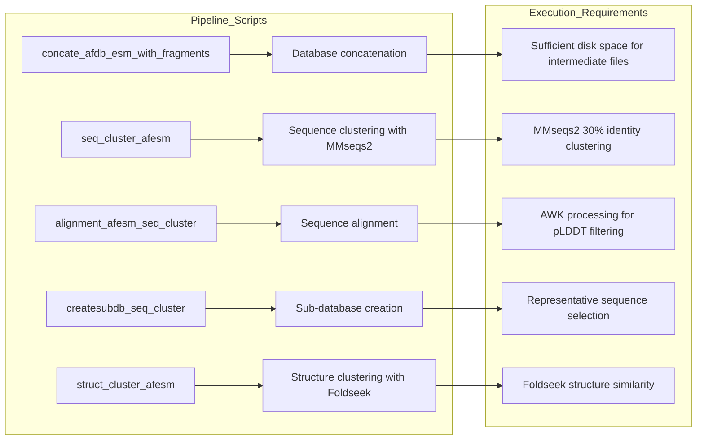

# Development Setup

<details>
<summary>Relevant source files</summary>

The following files were used as context for generating this wiki page:

- [.gitignore](.gitignore)

</details>


This document covers the development environment setup requirements for the afesm-analysis repository. This includes system dependencies, external tools, data requirements, and development workflow configurations needed to work with the protein structure and sequence analysis pipeline.

For information about the core data processing workflows, see [Core Data Processing Pipeline](#2). For details about the taxonomy analysis components, see [Taxonomy Analysis System](#3).

## Prerequisites and System Requirements

The afesm-analysis system requires a Unix-like environment with substantial computational resources due to the large-scale protein database processing involved.

### Hardware Requirements

| Component | Minimum | Recommended |
|-----------|---------|-------------|
| RAM | 32 GB | 64+ GB |
| Storage | 500 GB free | 1+ TB SSD |
| CPU | 8 cores | 16+ cores |
| OS | Linux/macOS | Linux (preferred) |

### External Tool Dependencies

The system relies on several bioinformatics tools that must be installed and available in the system PATH:



**Foldseek Installation:**
- Required for structure similarity searches and clustering
- Used in structure clustering workflows within the concatenation pipeline
- Must support database creation and search operations

**MMseqs2 Installation:**
- Required for sequence clustering at 30% identity threshold
- Used for LCA (Lowest Common Ancestor) taxonomic classification
- Must support clustering, alignment, and taxonomy modules

Sources: System architecture diagrams, pipeline workflow analysis

## Python Environment Setup

### Required Python Libraries

The analysis notebooks and scripts depend on standard scientific Python libraries:



**Installation via conda (recommended):**
```bash
conda create -n afesm-analysis python=3.8
conda activate afesm-analysis
conda install pandas matplotlib numpy jupyter
```

**Installation via pip:**
```bash
pip install pandas matplotlib numpy jupyter
```

Sources: Notebook dependencies inferred from system architecture

## Database and Data Setup

### Required Database Files

The system processes large protein databases that must be downloaded and configured:

| Database Type | Location Pattern | Purpose |
|---------------|------------------|---------|
| AlphaFold Database | `/databases/foldseek/afdb` | Protein structure source |
| ESM Metagenomic Atlas | `/databases/esm/metagenomic_atlas/union/foldseekdb` | Sequence data source |
| Taxonomy Files | `*.dmp` files | Taxonomic classification data |

### Database Directory Structure



**Database Setup Steps:**
1. Create the required directory structure under `databases/`
2. Download and extract AlphaFold database files to `databases/foldseek/afdb/`
3. Download ESM Metagenomic Atlas to `databases/esm/metagenomic_atlas/union/foldseekdb/`
4. Obtain taxonomy dump files (`merged.dmp`, `afesm_names.dmp`, `afesm_nodes.dmp`)

Sources: Pipeline architecture, database organization patterns

## Development Workflow Configuration

### Git Configuration

The repository includes a basic `.gitignore` configuration:

[.gitignore:1-1]()

This ignores the `ignore/` directory which likely contains temporary files and intermediate processing results.

### Jupyter Notebook Environment

The analysis workflows heavily utilize Jupyter notebooks for both data processing and visualization:



**Notebook Setup:**
1. Ensure Jupyter is installed in the Python environment
2. Configure notebook kernel to use the `afesm-analysis` environment
3. Verify access to the required data directories from notebook working directory

### Pipeline Execution Environment

The core data processing pipeline in `concate_clustering/concatenation/` consists of shell scripts that orchestrate the bioinformatics tools:



**Pipeline Configuration:**
- Ensure all shell scripts in `concate_clustering/concatenation/` are executable
- Verify PATH includes required bioinformatics tools
- Configure appropriate memory limits for large-scale clustering operations
- Set up logging and monitoring for long-running pipeline stages

Sources: [.gitignore:1-1](), Pipeline architecture analysis, Notebook workflow patterns

## Development Best Practices

### Data Management

Given the large-scale nature of protein databases:
- Use symbolic links for shared database files to avoid duplication
- Implement checkpointing for long-running pipeline stages
- Monitor disk usage during intermediate processing steps
- Consider using cluster computing resources for computationally intensive steps

### Code Organization

The codebase follows a clear separation between:
- Pipeline orchestration scripts (`concate_clustering/concatenation/`)
- Analysis notebooks (taxonomy mappers, visualization notebooks)
- Data aggregation scripts (`taxonomy_lca`, `taxonomy_universality_superkingdoms`, etc.)

### Testing and Validation

- Test pipeline components with small dataset subsets before full-scale runs
- Validate taxonomy mapping results against known classifications
- Verify visualization outputs for data consistency
- Monitor resource usage during development to optimize performance

Sources: System architecture patterns, Development workflow analysis