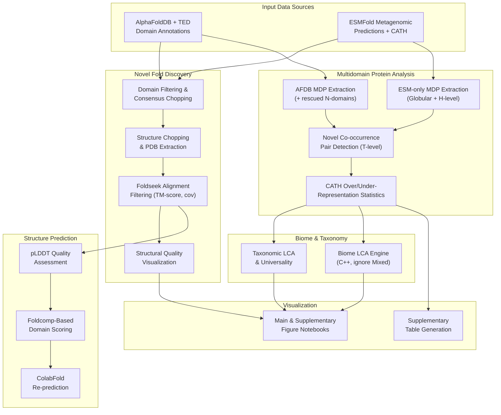

The **afesm-analysis** repository houses the complete computational pipeline developed by the Steinegger Lab for discovering **novel protein folds** and **novel domain combinations** hidden within metagenomic protein structure predictions. It interrogates the union of two massive structure databases — **AlphaFoldDB (AFDB)** and **ESMFold metagenomic predictions** — using CATH domain annotation, Foldseek structural alignment, and rigorous statistical testing to uncover protein architecture that has never been catalogued before.

This project sits at the intersection of metagenomics and structural biology. While AlphaFold and ESMFold have predicted hundreds of millions of protein structures, the vast majority of metagenomic entries remain unannotated. This repository provides the analysis machinery to systematically filter, validate, and characterize the structural novelties buried within those predictions — from single-domain novel folds to multidomain proteins exhibiting previously unseen combinations of known topologies.

Sources: [main.sh](multidomain_analysis/extract_novel_combination/main.sh), [parse_newfolds.py](novel_fold_analyses/parse_newfolds.py), [filter_domains_consensus.py](novel_fold_analyses/filter_domains_consensus.py), [chi-fisher_test.R](multidomain_analysis/novel_combination_CATH_over_underrepresentation/chi-fisher_test.R), [new_LCA_ignoreMixed.cpp](biome/new_LCA_ignoreMixed.cpp)

## High-Level Architecture

The pipeline follows a layered processing model. Raw domain annotations from AFDB (via TED) and ESMFold predictions flow through parallel extraction paths, converge for novelty detection, and fan out into downstream statistical and ecological analyses. The following diagram captures the major processing stages and the data flow between them:

At the top, two data sources feed the system in parallel. AFDB contributes curated TED domain assignments, while ESMFold predictions bring in raw metagenomic structures that have been annotated against CATH. Both streams feed into **novel fold discovery** (single-domain analysis) and **multidomain protein analysis** (multi-domain combinatorics). The novelty results are then enriched with biome origin and taxonomic context, scored for structural quality, and finally compiled into publication-ready figures and tables.

Sources: [main.sh](multidomain_analysis/extract_novel_combination/main.sh), [19_makefile_TED.sh](prediction/TED_novel_domains/19_makefile_TED.sh), [automated_krakenReportGen.sh](biome/automated_krakenReportGen.sh)

## Repository Layout

The codebase is organized into six thematic directories, each corresponding to a major analytical concern. The table below summarizes the purpose and primary technologies of each module:

| Directory | Purpose | Primary Languages | Key Outputs |
|-----------|---------|-------------------|-------------|
| `novel_fold_analyses/` | Domain filtering, consensus chopping, novel fold validation, visualization | Python, Snakemake | Filtered domain sets, novel fold lists, consensus chopping images |
| `multidomain_analysis/` | MDP extraction from AFDB/ESM, novel domain combination detection, CATH over/under-representation statistics | Bash, R, Python | Novel combination tables, statistical enrichment results |
| `prediction/` | pLDDT quality assessment, Foldseek domain processing, Foldcomp scoring | Python, Bash | Per-domain pLDDT scores, re-predicted structures |
| `biome/` | Biome origin LCA computation, Kraken-style report generation | C++, Bash, Perl | Superkingdom biome summaries, LCA assignments |
| `taxonomy/` | Taxonomic lineage mapping, LCA computation, universality analysis | Jupyter Notebooks (Python) | Superkingdom distribution, universality statistics |
| `analysis_10k_subset_sampling/` | Random subset sampling for targeted downstream analysis | Bash | 10K singleton and low-pLDDT subsets |

Supporting directories include `concate_clustering/` (clustering concatenation utilities) and `prediction/abandoned_domains/` (archived MSA generation and prediction attempts).

Sources: [10k_subset_sampling.sh](analysis_10k_subset_sampling/10k_subset_sampling.sh), [new_LCA_ignoreMixed.cpp](biome/new_LCA_ignoreMixed.cpp), [19_plddt.py](prediction/TED_novel_domains/19_plddt.py), [30_superkingdom_summary.ipynb](biome/30_superkingdom_summary.ipynb)

## Core Analytical Capabilities

### Novel Fold Discovery

The novel fold pipeline processes raw domain choppings from multiple boundary prediction methods (Merizo, Chainsaw, UniDoc, CRH) through a **three-tier consensus mechanism**. For each protein, domains are classified into high-confidence, medium-confidence, and low-confidence sets based on how many methods agree on each boundary. A domain must have at least 25 residues (`min_dom_size`) and each fragment at least 5 residues (`min_fragment_size`) to survive filtering. Once consensus choppings are established, candidate novel domains are validated against the CATH structural classification using Foldseek structural alignments, requiring a TM-score threshold above 0.56 and both query and target coverage above 0.6.

Sources: [filter_domains_consensus.py](novel_fold_analyses/filter_domains_consensus.py#L19-L56), [parse_newfolds.py](novel_fold_analyses/parse_newfolds.py#L46-L77), [compare_choppings.py](novel_fold_analyses/compare_choppings.py#L127-L145)

### Novel Domain Combination Detection

The multidomain protein analysis operates on a **set-difference strategy**. Domain topology co-occurrence pairs are extracted independently from AFDB (including N-terminal domains rescued by Foldseek search) and ESM-only predictions. After removing redundancy and sorting topologies within each protein, the pipeline identifies ESM-only co-occurrence pairs that never appear in the AFDB set. This yielded **~5,200 novel MDPs** and **~4,950 novel domain combinations** — multidomain architectures entirely absent from the structurally characterized proteome. The final compilation table per protein contains 13 fields including MDP flags, domain counts, raw/topology/H-level CATH combinations, and novelty status.

Sources: [main.sh](multidomain_analysis/extract_novel_combination/main.sh#L175-L218), [main.sh](multidomain_analysis/extract_novel_combination/main.sh#L376-L438)

### Statistical Enrichment Analysis

For CATH families appearing in novel versus non-novel MDPs, the repository performs **chi-square tests** (with automatic fallback to Fisher's exact tests when expected counts are low) followed by Benjamini-Hochberg multiple testing correction. The enrichment pipeline produces log₂ fold-change and −log₁₀(p-adjusted) values, enabling volcano-plot-style visualization of which CATH topologies are statistically over- or under-represented in novel multidomain proteins.

Sources: [chi-fisher_test.R](multidomain_analysis/novel_combination_CATH_over_underrepresentation/chi-fisher_test.R#L27-L51), [main.sh](multidomain_analysis/novel_combination_CATH_over_underrepresentation/main.sh#L1-L105)

### Structural Quality Scoring

Prediction quality is assessed through **per-domain pLDDT extraction** — reading the B-factor column (positions 60–66 of ATOM records in PDB files) and computing average confidence scores for each structural domain. The repository supports scoring from both raw PDB files and compressed Foldcomp databases, enabling quality assessment at the scale of millions of structures.

> [!TIP]
> **pLDDT as B-factor convention**: Throughout this codebase, AlphaFold and ESMFold prediction confidence (pLDDT) is stored in the PDB B-factor column rather than the occupancy column. Domain boundary information, in contrast, is written to the **occupancy** column by the chopping-to-PDB pipeline — preserving pLDDT data for downstream quality filtering.

Sources: [19_plddt.py](prediction/TED_novel_domains/19_plddt.py#L4-L18), [19_domain_plddt_foldcomp.py](prediction/TED_novel_domains/19_domain_plddt_foldcomp.py#L19-L44), [chopping_to_pdb.py](novel_fold_analyses/chopping_to_pdb.py#L14-L15)

### Biome and Taxonomic Context

The biome analysis uses a **C++-based LCA engine** that processes colon-delimited taxonomic lineage paths, intentionally skipping entries tagged as "Mixed" to avoid diluting the ecological signal. Taxonomic universality is computed across superkingdom levels through a series of dedicated mapper notebooks that aggregate lineage data from phylum to species level. Kraken-compatible reports are generated automatically for integration with standard metagenomic visualization tools.

> [!TIP]
> **Ignoring "Mixed" in LCA**: The C++ LCA engine explicitly filters out paths containing "root:Mixed", "root:Mixed:Null", and "root:Null" before computing the lowest common ancestor. This design choice prevents biome-ambiguous entries from collapsing otherwise meaningful LCA results — a critical consideration when working with metagenomic assemblies of variable completeness.

Sources: [new_LCA_ignoreMixed.cpp](biome/new_LCA_ignoreMixed.cpp#L42-L71), [automated_krakenReportGen.sh](biome/automated_krakenReportGen.sh#L1-L53)

## Where to Go Next

This Overview has mapped the repository's purpose, architecture, and analytical capabilities. To begin working with the code effectively, proceed through the following reading progression:

1. **[Quick Start](2-quick-start)** — Set up your environment and understand the data dependencies required to run any part of this pipeline.
2. **[Dataset and Output Formats](3-dataset-and-output-formats)** — Learn the expected input file schemas and output table structures before diving into individual modules.
3. **[Pipeline Architecture](4-pipeline-architecture)** — Understand the end-to-end data flow and how the six modules interconnect at the file level.

From there, navigate to the specific deep-dive pages that match your analytical interest — whether that is novel fold discovery, multidomain combination analysis, structural quality assessment, or biome annotation.