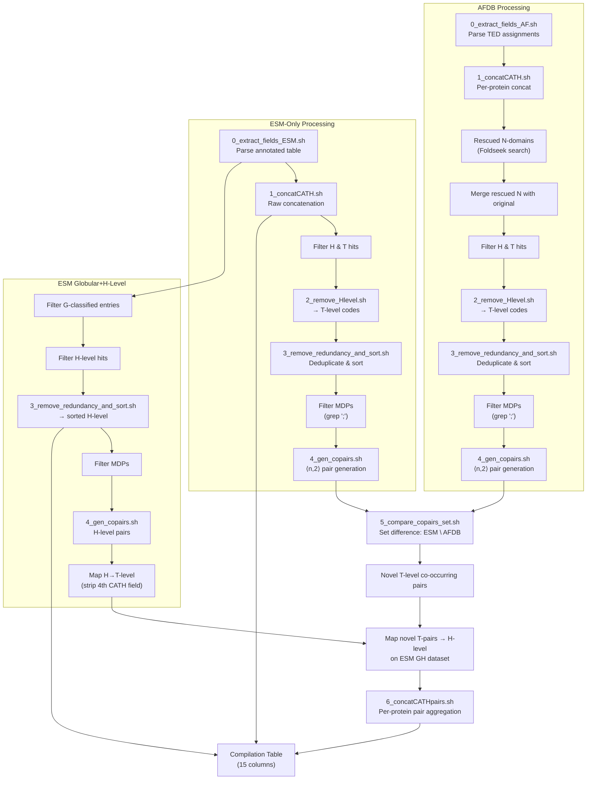

This page documents the computational pipeline that identifies **novel CATH domain combinations** in ESMFold-predicted metagenomic proteins — domain architectures that have no counterpart in the AlphaFoldDB (AFDB) reference corpus. The pipeline operates as a staged set-difference analysis across CATH topology levels (T-level), progressively refining from raw domain assignments through pair generation, set comparison, and final H-level annotation. The result is a **15-column compilation table** characterizing all 3.2M ESM-only nonsingleton cluster representatives by their domain architecture and novelty status.

## Pipeline Architecture Overview

The pipeline follows a parallel-then-merge pattern: AFDB and ESM datasets are processed independently through identical normalization stages, then intersected via co-occurring pair set difference to extract novel combinations.



Sources: [main.sh](multidomain_analysis/extract_novel_combination/main.sh#L1-L200)

## CATH Hierarchy and Resolution Strategy

A critical design decision underlies the entire pipeline: **novelty is assessed at the CATH Topology level (T-level, 3-field code like `1.10.10`) but reported at the Homologous Superfamily level (H-level, 4-field code like `1.10.10.10`)**. This avoids inflating novelty counts through trivial S35 (sequence family) subdivisions while still providing the most informative annotation possible.

| CATH Level | Code Depth | Example | Role in Pipeline |
|---|---|---|---|
| **C**lass | 1 field | `1` | Not used directly |
| **A**rchitecture | 2 fields | `1.10` | Not used directly |
| **T**opology | 3 fields | `1.10.10` | **Novelty detection** — set-difference basis |
| **H**omologous Superfamily | 4 fields | `1.10.10.10` | **Final reporting** — granularity for downstream analysis |
| **S35** Superfamily | 5 fields | `1.10.10.10_1` | Not used in this pipeline |

The script [2_remove_Hlevel.sh](multidomain_analysis/extract_novel_combination/2_remove_Hlevel.sh#L13-L28) strips the 4th CATH field by splitting on `.`, printing only the first three components, and rejoining with semicolons. This transforms an H-level combination like `1.10.10.10;2.20.20.20` into a T-level combination `1.10.10;2.20.20`.

> [!TIP]
> **T-level vs H-level boundary**: The pipeline deliberately sacrifices some resolution at the S35 boundary to ensure biological significance. Two proteins sharing `1.10.10.10` and `1.10.10.20` would be considered the *same* combination at T-level (`1.10.10` paired with itself), which is intentional — they belong to the same fold topology. Novelty is only claimed when the topology-level pairing is genuinely absent from AFDB.

## Stage 0 — Field Extraction

Two parallel entry points parse the structurally different input formats from AFDB and ESMFold into a **common 5-column schema**: `protein_ID  domain_number  pLDDT  CATH_code  CATH_level`.

### AFDB Extraction ([0_extract_fields_AF.sh](multidomain_analysis/extract_novel_combination/0_extract_fields_AF.sh#L10-L22))

The AFDB input (`ted_domain_assignments.tsv`) uses a composite ID format where the domain identifier is embedded within underscores (e.g., `MGYP0001_TED1_v1`). The script extracts columns 1 (ID), 4 (pLDDT), 6 (CATH), and 7 (CATH level), then splits on `_TED` to separate the protein ID from the domain number.

```bash
# Key transformation: composite ID → protein_ID + domain_number
awk '{gsub(/_TED/, "\t"); print}'
# Before: MGYP0001_TED1_v1  85.2  1.10.10.10  T
# After:  MGYP0001  1_v1    85.2  1.10.10.10  T
```

### ESM Extraction ([0_extract_fields_ESM.sh](multidomain_analysis/extract_novel_combination/0_extract_fields_ESM.sh#L11-L18))

The ESM input (`annotated_table_newclusters_provisional_nonewfoldsinfo.tsv`) uses a simpler underscore-based ID scheme. The same columns (1, 4, 6, 7) are extracted, and underscores are split into tabs to yield the same 5-column output.

Sources: [0_extract_fields_AF.sh](multidomain_analysis/extract_novel_combination/0_extract_fields_AF.sh#L1-L25), [0_extract_fields_ESM.sh](multidomain_analysis/extract_novel_combination/0_extract_fields_ESM.sh#L1-L19)

## Stage 1 — Per-Protein CATH Concatenation

Script [1_concatCATH.sh](multidomain_analysis/extract_novel_combination/1_concatCATH.sh#L19-L41) collapses the per-domain rows into per-protein rows by concatenating all CATH codes for a given protein ID with semicolons as delimiters.

The AWK logic uses an `order[]` array to preserve first-seen ordering and a `cath[]` associative array to accumulate CATH strings:

```
# Input (per domain):
MGYP0001    1    85.2    1.10.10.10    T
MGYP0001    2    78.5    2.20.20.20    T
MGYP0002    1    90.1    3.30.30.30    T

# Output (per protein):
MGYP0001    1.10.10.10;2.20.20.20
MGYP0002    3.30.30.30
```

The `uniq` post-processing at [line 41](multidomain_analysis/extract_novel_combination/1_concatCATH.sh#L41) removes any duplicates arising from the input data.

Sources: [1_concatCATH.sh](multidomain_analysis/extract_novel_combination/1_concatCATH.sh#L1-L53)

## Stage 2 — CATH Level Filtering and T-Level Extraction

After concatenation, the pipeline applies a **quality filter** to retain only confidently assigned domains (H and T levels), discarding lower-confidence N (no significant hit) and `-` (no assignment) entries. This is done inline via `awk -F'\t' '$5 == "T" || $5 == "H"'` at [main.sh line 25](multidomain_analysis/extract_novel_combination/main.sh#L25) for AFDB and [main.sh line 135](multidomain_analysis/extract_novel_combination/main.sh#L135) for ESM.

Script [2_remove_Hlevel.sh](multidomain_analysis/extract_novel_combination/2_remove_Hlevel.sh#L13-L28) then reduces the 4-field CATH codes to 3-field topology codes. It first normalizes commas to periods (handling input inconsistencies), then iterates over semicolon-delimited segments, splitting each on `.` and printing only the first three components.

## Stage 3 — Redundancy Removal and Canonical Sorting

Script [3_remove_redundancy_and_sort.sh](multidomain_analysis/extract_novel_combination/3_remove_redundancy_and_sort.sh#L6-L35) produces a **canonical representation** of each protein's domain combination. This is essential for correct set comparison: `1.10.10;2.20.20` and `2.20.20;1.10.10` must be recognized as the same combination.

The script uses GNU AWK's `PROCINFO["sorted_in"] = "@ind_str_asc"` for deterministic alphabetical sorting of the deduplicated domain set within each protein. The output is a semicolon-delimited, alphabetically sorted, deduplicated topology combination per protein.

> [!TIP]
> **Why canonical ordering matters**: The pair generation stage (Step 4) generates combinations in the order they appear in the sorted string. Without canonical ordering at Step 3, identical biological domain architectures would produce different pair orderings, causing the set-difference at Step 5 to yield false positives. This canonical form is the pipeline's normalization function.

## Stage 4 — Co-Occurring Pair Generation

Script [4_gen_copairs.sh](multidomain_analysis/extract_novel_combination/4_gen_copairs.sh#L14-L32) decomposes each protein's domain combination into all possible pairwise co-occurrences using the combinatorial formula ⟨n,2⟩ = n(n-1)/2.

For a protein with topology combination `A;B;C`, the script generates three rows:
```
protein_id    A;B;C    A;B
protein_id    A;B;C    A;C
protein_id    A;B;C    B;C
```

The pair itself (column 3) uses the canonical ordering inherited from Stage 3, ensuring that pair `A;B` is never produced as `B;A`. The full combination is retained in column 2 for traceability back to the source protein.

## Stage 5 — Novel Combination Detection via Set Difference

Script [5_compare_copairs_set.sh](multidomain_analysis/extract_novel_combination/5_compare_copairs_set.sh#L9-L21) implements the core novelty test as a **set difference**: all co-occurring topology pairs found in ESM-only proteins are filtered against the complete AFDB pair set. Any ESM pair absent from AFDB is flagged as **novel**.

```bash
# awk implements: ESM_pairs - AFDB_pairs
NR==FNR { data[$3] = 1; next }       # Load AFDB pairs into hash
{ if (!($3 in data)) { print $0 } }  # Keep only ESM pairs not in AFDB
```

The hash-keyed approach at [line 12](multidomain_analysis/extract_novel_combination/5_compare_copairs_set.sh#L12) ensures O(1) lookup per ESM pair, making this step efficient even for the ~65M AFDB multi-domain proteins and ~394K ESM MDPs involved. The pipeline identifies **11,941 unique ESM-only proteins** and **5,134 novel co-occurring topology pairs** absent from AFDB.

## Rescued N-Domain Integration (AFDB Enhancement)

A distinguishing feature of this pipeline is the **N-domain rescue** step at [main.sh lines 40–111](multidomain_analysis/extract_novel_combination/main.sh#L40-L111). A subset of 625K AFDB domains initially classified as "N" (no significant CATH hit) were re-examined via Foldseek search against the CATH structural database. The 495K domains that achieved confident structural matches were reclassified as "H" and merged back into the AFDB domain assignments.

This rescue operation:
1. Parses Foldseek result files to extract the domain ID and matched CATH code ([line 54–63](multidomain_analysis/extract_novel_combination/main.sh#L54-L63))
2. Concatenates rescued domains with the original TED assignments ([line 68–71](multidomain_analysis/extract_novel_combination/main.sh#L68-L71))
3. Sorts and deduplicates the merged set ([line 74–76](multidomain_analysis/extract_novel_combination/main.sh#L74-L76))
4. Re-runs the full normalization pipeline (Steps 1–3) on the merged data

A sanity check at [lines 101–111](multidomain_analysis/extract_novel_combination/main.sh#L101-L111) confirms that **252,516 proteins** gained entirely new multi-domain status from the rescue, and **77,439** had their domain compositions altered — validating that the rescue materially affects the novelty baseline.

## H-Level Mapping and Final Annotation

After novel T-level pairs are identified, the pipeline maps them back to **full H-level CATH codes** for reporting. This is necessary because downstream analyses (over/under-representation in [CATH Over- and Under-Representation Statistics](11-cath-over-and-under-representation-statistics)) require the more informative 4-field resolution.

The mapping procedure at [main.sh lines 206–277](multidomain_analysis/extract_novel_combination/main.sh#L206-L277) works by:
1. Starting from the ESM-only Globular+H dataset (G-classified proteins with H-level CATH assignments)
2. Generating H-level co-pairs from this dataset ([line 225–226](multidomain_analysis/extract_novel_combination/main.sh#L225-L226))
3. Mapping each H-level pair to its T-level counterpart by stripping the 4th CATH field ([line 229–248](multidomain_analysis/extract_novel_combination/main.sh#L229-L248))
4. Joining against the novel T-pair set to retain only those H-pairs whose T-level projection is novel ([line 260–263](multidomain_analysis/extract_novel_combination/main.sh#L260-L263))

Script [6_concatCATHpairs.sh](multidomain_analysis/extract_novel_combination/6_concatCATHpairs.sh#L15-L37) then aggregates all novel H-level pairs per protein using `&` as the pair delimiter (distinct from `;` which delimits domains within a pair).

## CATH Name Annotation

Script [7_mapping_CATHnames.sh](multidomain_analysis/extract_novel_combination/7_mapping_CATHnames.sh#L9-L38) performs the final human-readable annotation step. It loads a CATH metadata file (`cath-names.txt`) into an associative array keyed by CATH code, then maps each code in the novel pair set to its descriptive name.

The CATH names file undergoes pre-processing: whitespace is normalized to underscores, and double-underscore delimiters are converted to tabs to produce a two-column lookup table. Entries without names are assigned `"no_name"` as a fallback at [line 13](multidomain_analysis/extract_novel_combination/7_mapping_CATHnames.sh#L13).

## Compilation Table Schema

The pipeline's final output is a **15-column TSV** that serves as the definitive characterization of all 3,213,408 ESM-only nonsingleton cluster representatives. This table is the input for all downstream visualization and statistical analysis.

| Column | Name | Type | Description |
|---|---|---|---|
| $1 | `ID` | string | MGNIFY cluster representative ID |
| $2 | `isMDP` | int | 1 if protein has >1 domain; 0 otherwise |
| $3 | `hasTpair` | int | 1 if ≥2 T-level domains; 0 otherwise |
| $4 | `hasGHpair` | int | 1 if ≥2 H/G-level domains; 0 otherwise |
| $5 | `isNovel` | int | 1 if protein contains a novel T-level pair |
| $6 | `nDomain` | int | Total domain count (incl. N-hits) |
| $7 | `nTdomain` | int | T-level domain count |
| $8 | `nGHdomain` | int | H/G-level domain count |
| $9 | `nNovelGHPair` | int | Novel H-level pair count per protein |
| $10 | `rawCombi` | string | All CATH codes semicolon-delimited (incl. `-` and `N`) |
| $11 | `Tcombi` | string | Sorted, deduplicated T-level combination |
| $12 | `GHcombi` | string | Sorted, deduplicated H-level combination |
| $13 | `Concat_NovelGHpairs` | string | Novel H-level pairs, `&`-delimited |
| $14 | `nMem` | int | Cluster member count (Foldseek) |
| $15 | `nAllMem` | int | Total cluster members including sub-representatives |

The table construction at [main.sh lines 280–434](multidomain_analysis/extract_novel_combination/main.sh#L280-L434) proceeds in three phases: column mapping via chained `awk` joins, flag computation via conditional expressions, and metadata enrichment from the Foldseek clustering files.

## Pipeline Execution and Data Flow Summary

The entire pipeline is orchestrated by [main.sh](multidomain_analysis/extract_novel_combination/main.sh#L1-L438), which must be executed from the `extract_novel_combination/` directory. It expects the following input data to be pre-placed:

| Input File | Location | Source |
|---|---|---|
| `ted_domain_assignments.tsv` | `../data/AFDB-TED/given_data/` | AFDB-TED domain assignments from Nico |
| `TED-N-CATHmatch-id_num_CATuniq-concat-sorted.tsv` | `../data/AFDB-TED/625K_N_good_quality/` | Foldseek-rescued N-domain results |
| `annotated_table_newclusters_provisional_nonewfoldsinfo.tsv` | `../data/ESM-only/given_data/` | ESMFold annotated domain table |
| `cath-names.txt` | `../data/CATH_metadat/` | CATH code → name mapping |
| `afesm30_repseq_foldseek_clu.tsv` | External path | Foldseek clustering metadata |
| `afesm30_repseq_foldseek_clu_nonsingleton-repId_allmemId_flag.tsv` | External path | All-member mapping for cluster sizes |

The pipeline creates all intermediate directories automatically. Intermediate files are preserved in `tmp/` subdirectories for reproducibility and debugging.

## Key Quantitative Results

The pipeline produces these verified metrics at various sanity check points embedded in [main.sh](multidomain_analysis/extract_novel_combination/main.sh):

- **AFDB (with rescued N)**: 65M+ proteins with ≥2 CATH domains after concatenation
- **ESM-only MDPs**: 393,793 proteins with ≥2 distinct T-level domains
- **Novel proteins**: 11,941 unique ESM-only proteins containing at least one novel co-occurring T-level pair
- **Novel combinations**: 4,951 unique domain combinations (H-level) not found in AFDB
- **Novel pairs**: 5,134 unique co-occurring T-level pairs absent from AFDB
- **Compilation table**: 3,213,408 ESM-only nonsingleton cluster representatives fully characterized

## Next Steps

- **[CATH Over- and Under-Representation Statistics](11-cath-over-and-under-representation-statistics)** — The compilation table feeds directly into the statistical over/under-representation analysis that quantifies which CATH superfamilies are enriched or depleted among novel combinations.
- **[MDP Extraction from AFDB and ESM](9-mdp-extraction-from-afdb-and-esm)** — For the upstream data preparation details on how raw domain assignment files are generated and structured.
- **[Reproducible Visualization Notebooks](18-reproducible-visualization-notebooks)** — The `Main_fig6_c.ipynb`, `Main_fig6_d.ipynb`, and `Supple_fig_12.ipynb` notebooks in [visualization/](multidomain_analysis/visualization/) consume the pipeline's outputs to produce the manuscript figures.