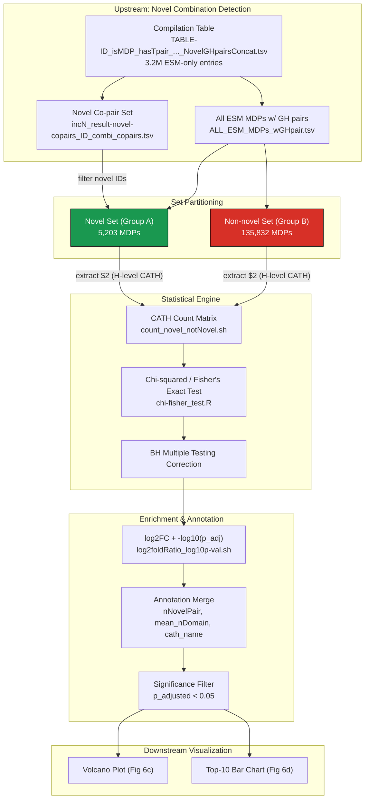

This module quantifies which CATH superfamily categories are statistically over- or under-represented among ESM-predicted multidomain proteins (MDPs) that carry novel domain combinations — combinations absent from AlphaFoldDB. It sits at the terminal stage of the multidomain analysis pipeline, transforming the binary novel/non-novel classification from [Novel Domain Combination Detection](10-novel-domain-combination-detection) into a ranked, significance-filtered atlas of CATH superfamily enrichment. The statistical output directly feeds the volcano plot in [Reproducible Visualization Notebooks](18-reproducible-visualization-notebooks).

## Statistical Problem Statement

The central question is whether specific CATH superfamilies (H-level, four-tier codes like `3.40.50.300`) appear at significantly different frequencies in the novel-combination MDP set versus the non-novel MDP set. The pipeline partitions the ESM-only globular MDPs into two groups — **Group A** (novel, n = 5,203 MDPs) and **Group B** (non-novel, n = 135,832 MDPs) — and performs a per-category enrichment test. These population sizes are hardcoded in both the R statistical engine and the AWK fold-change scripts, reflecting the final counts after the novel co-occurrence pair detection in the upstream [extraction pipeline](10-novel-domain-combination-detection) [main.sh](multidomain_analysis/novel_combination_CATH_over_underrepresentation/main.sh#L31-L36), [chi-fisher_test.R](multidomain_analysis/novel_combination_CATH_over_underrepresentation/chi-fisher_test.R#L13-L14).

## Pipeline Architecture



The pipeline is orchestrated by a single shell script ([main.sh](multidomain_analysis/novel_combination_CATH_over_underrepresentation/main.sh#L1-L105)) that chains set partitioning, counting, statistical testing, effect-size computation, annotation enrichment, and significance filtering into a linear workflow. Each stage operates on TSV files passed through stdin/stdout or intermediate files under `../data/`.

## Set Partitioning

The partitioning logic in [main.sh](multidomain_analysis/novel_combination_CATH_over_underrepresentation/main.sh#L7-L17) derives both sets from the same ESM-only globular MDP pool. First, all MDPs containing at least one globular–homologous-superfamily (GH) pair are extracted from the concatenation result. Then, the upstream compilation table is filtered with `grep -v "not_novel_or_no_GHcombi"` to obtain novel MDP IDs, and an `awk` set-difference operation isolates the non-novel complement. The H-level CATH superfamily column (field `$2`) is extracted from both sets independently via two `awk` field-selection passes, producing the two count input files. The use of `grep ";"` on the GH combination file ensures only true multidomain entries (those with semicolon-separated domain lists) are considered [main.sh](multidomain_analysis/novel_combination_CATH_over_underrepresentation/main.sh#L9-L23).

## CATH Superfamily Counting

[count_novel_notNovel.sh](multidomain_analysis/novel_combination_CATH_over_underrepresentation/count_novel_notNovel.sh#L1-L28) implements a two-pass AWK script that tokenizes each line on both tab and semicolon delimiters (`FS='[\t;]'`). On the first pass (file 1 = novel set), it populates an associative array `count1[]` incrementing per-token occurrence. On the second pass (file 2 = non-novel set), it does the same into `count2[]`. The `END` block performs a union of all keys from both arrays and emits a three-column TSV: `CATH_id  count_novel  count_nonnovel`, filling missing entries with zero. This design handles the asymmetric key spaces gracefully — a CATH superfamily present only in one set receives a count of zero for the other [count_novel_notNovel.sh](multidomain_analysis/novel_combination_CATH_over_underrepresentation/count_novel_notNovel.sh#L3-L27).

## Contingency Table Construction and Statistical Testing

The core statistical engine [chi-fisher_test.R](multidomain_analysis/novel_combination_CATH_over_underrepresentation/chi-fisher_test.R#L1-L63) reads the count matrix and iterates over every CATH superfamily row. For each category, it constructs a 2×2 contingency table:

| | Novel (Group A) | Non-novel (Group B) |
|---|---|---|
| **Has CATH x** | raw_count_A | raw_count_B |
| **Does not have CATH x** | 5203 − raw_count_A | 135832 − raw_count_B |

The script attempts a Pearson's Chi-squared test with Yates' continuity correction first (`chisq.test(contingency_table, correct = TRUE)`). If the test raises a warning — typically due to low expected cell counts violating the Chi-squared assumption — it catches the warning via `tryCatch`, switches to Fisher's exact test (`fisher.test(contingency_table)`), and records the test type as `"FISHER"` instead of `"CHI"`. This adaptive strategy ensures valid p-values across the full range of count magnitudes [chi-fisher_test.R](multidomain_analysis/novel_combination_CATH_over_underrepresentation/chi-fisher_test.R#L21-L44).

Directionality is extracted differently depending on the test type: for Chi-squared, the Pearson residual of cell `[1,1]` (the novel-has-category cell) is used, while for Fisher's exact test, the odds ratio estimate is used. Both indicators are signed: a positive value means the category is enriched in the novel set (over-represented), and a negative value means it is depleted (under-represented) [chi-fisher_test.R](multidomain_analysis/novel_combination_CATH_over_underrepresentation/chi-fisher_test.R#L36-L40).

All raw p-values are then corrected for multiple testing using the Benjamini–Hochberg (BH) procedure via R's `p.adjust(..., method = "BH")` [chi-fisher_test.R](multidomain_analysis/novel_combination_CATH_over_underrepresentation/chi-fisher_test.R#L47). The output is a seven-column TSV: `Category, raw_count_A, raw_count_B, test_type, p_value, p_adjusted, direction`.

## Log2 Fold Change and Effect Size Computation

[log2foldRatio_log10p-val.sh](multidomain_analysis/novel_combination_CATH_over_underrepresentation/log2foldRatio_log10p-val.sh#L1-L45) receives the statistical test output along with the two group sizes as positional arguments. It uses a pseudocount strategy (adding 1 to both the numerator count and the denominator group size) to avoid undefined values when a CATH superfamily has zero occurrences in one group. The log2 fold change formula is:

```
log2FC = log₂( (countA + 1) × (groupB + 1) / (countB + 1) × (groupA + 1) )
```

This differs from the naïve frequency ratio in that the pseudocount prevents `log(0)` and slightly shrinks extreme ratios. The script also computes `-log10(p_adjusted)` with a floor at `1e-320` to avoid `log(0)` on perfectly corrected p-values. Both values are appended as new columns `log2FC` and `-log10p_adj` [log2foldRatio_log10p-val.sh](multidomain_analysis/novel_combination_CATH_over_underrepresentation/log2foldRatio_log10p-val.sh#L26-L43).

A separate inline sanity check in the orchestrator ([main.sh](multidomain_analysis/novel_combination_CATH_over_underrepresentation/main.sh#L31-L44)) independently computes log2FC using a simpler formula without pseudocounts and cross-validates sign agreement between the direction from the statistical test and the sign of the computed log2FC. This catches any systematic inconsistencies between the test residuals and the fold-change calculation.

> [!TIP]
> The pseudocount-augmented fold change in `log2foldRatio_log10p-val.sh` adds 1 to both counts *and* both group sizes (four terms total). This is not the standard pseudocount approach (which typically adds only to the numerator counts). The asymmetry between the inline sanity check (no pseudocount) and the script (pseudocount) means exact numerical agreement is not expected — only sign agreement is validated in the orchestrator.

## Annotation Enrichment

The pipeline appends three additional annotation columns to each CATH superfamily row through a multi-file `awk` join in [main.sh](multidomain_analysis/novel_combination_CATH_over_underrepresentation/main.sh#L67-L99):

| Column | Source File | Description |
|---|---|---|
| `nNovelPair` | `components-novelMDP-GH-CATH_sumClu_sumNmem_sumNallMem_CATHname.tsv` | Number of novel co-occurring domain pairs this CATH superfamily participates in across all novel MDPs |
| `[mean_nDomain]` | `CATH_count_meanDomain.tsv` | Mean number of domains per MDP for entries containing this CATH superfamily |
| `cath_name` | `cath-names.tsv` | Human-readable functional description from the CATH v4.3.3 taxonomy |

The annotation merge uses three successive `NR==FNR` passes in a single `awk` invocation, storing each auxiliary file's key-value mapping before printing the joined output. The final concatenation step merges the annotation table with the statistical+fold-change table using an `awk` set-intersection filter (2,906 entries total) [main.sh](multidomain_analysis/novel_combination_CATH_over_underrepresentation/main.sh#L96-L99).

## CATH Name Preprocessing

[fix_cath-names.py](multidomain_analysis/novel_combination_CATH_over_underrepresentation/fix_cath-names.py#L1-L22) transforms the raw CATH names file (downloaded from the CATH FTP site, v4.3.3) into a clean three-column TSV. The raw format contains lines like `3.40.50.300 3.40.50.300 : Rossmann-like alpha/beta/alpha sandwich : some description`, where colons serve as field separators and extra colons may appear in descriptions. The script uses a regex pattern `^(\S+)\s+(\S+)\s*:(.*)$` to split on the first colon only, then strips remaining colons from the third field. Output is written with `quoting=3` (CSV_QUOTE_NONE) to prevent pandas from escaping tab characters [fix_cath-names.py](multidomain_analysis/novel_combination_CATH_over_underrepresentation/fix_cath-names.py#L13-L22).

## Significance Filtering

The final step applies a hard threshold of `p_adjusted < 0.05` to extract only statistically significant CATH superfamilies. The filtering is performed with a single `awk` condition that preserves the header row (`NR==1`) [main.sh](multidomain_analysis/novel_combination_CATH_over_underrepresentation/main.sh#L102-L103):

```bash
awk -F"\t" 'NR==1 || $6 < 0.05' input.tsv > output-significant.tsv
```

The resulting file (`...significant.tsv`) contains the full 12-column enrichment table restricted to entries surviving BH correction, ready for direct consumption by the visualization notebooks.

## Downstream Visualization

The statistical output is consumed by two visualization notebooks. **Main Fig 6c** ([Main_fig6_c.ipynb](multidomain_analysis/visualization/Main_fig6_c.ipynb#L1-L149)) renders a volcano plot where the x-axis is log2 fold change and the y-axis is `−log₁₀(p_adjusted)`. Point aesthetics are triple-encoded: **color** (viridis colormap) and **size** both encode `nNovelPair` (the number of novel pairs a CATH superfamily participates in), with `|log2FC| ≤ 1` points forced to grey. The top 10 most abundant novel CATH categories (by `nNovelPair`) receive thicker outlines (linewidth 1.2 vs 0.45) for emphasis [Main_fig6_c.ipynb](multidomain_analysis/visualization/Main_fig6_c.ipynb#L54-L72). A separate legend cell generates a discrete bubble legend with values `[1, 25, 50, 75, 100, 113]`.

**Main Fig 6d** ([Main_fig6_d.ipynb](multidomain_analysis/visualization/Main_fig6_d.ipynb#L1-L83)) produces a horizontal bar chart of the top 10 most abundant novel domain combinations (CATH superfamily pairs), reading from a pre-sorted TSV. The CATH names from the `cath_name` annotation column serve as bar labels. Both figures are exported as SVG for publication [Main_fig6_d.ipynb](multidomain_analysis/visualization/Main_fig6_d.ipynb#L36-L57).

## File Manifest and Intermediate Schema

| Script | Input | Output | Lines |
|---|---|---|---|
| `main.sh` | Compilation table, ESM GH pairs, novel copair set | Final enriched + annotated table (significant) | 105 |
| `count_novel_notNovel.sh` | `temp_Novel.tsv`, `temp_notNovel.tsv` | `CATHcount_Novel_notNovel.tsv` (CATH, countA, countB) | 28 |
| `chi-fisher_test.R` | Count TSV | 7-col TSV (Category through direction) | 63 |
| `log2foldRatio_log10p-val.sh` | Test output + group sizes | 9-col TSV (adds log2FC, -log10p_adj) | 45 |
| `fix_cath-names.py` | `cath-names.txt` (CATH FTP) | `cath-names.tsv` (3-col) | 22 |

## Key Parameters and Thresholds

| Parameter | Value | Location |
|---|---|---|
| Group A size (Novel) | 5,203 | [chi-fisher_test.R#L13](multidomain_analysis/novel_combination_CATH_over_underrepresentation/chi-fisher_test.R#L13), [main.sh#L31](multidomain_analysis/novel_combination_CATH_over_underrepresentation/main.sh#L31) |
| Group B size (Non-novel) | 135,832 | [chi-fisher_test.R#L14](multidomain_analysis/novel_combination_CATH_over_underrepresentation/chi-fisher_test.R#L14), [main.sh#L31](multidomain_analysis/novel_combination_CATH_over_underrepresentation/main.sh#L31) |
| Multiple testing correction | Benjamini–Hochberg | [chi-fisher_test.R#L47](multidomain_analysis/novel_combination_CATH_over_underrepresentation/chi-fisher_test.R#L47) |
| Chi-squared correction | Yates' continuity correction | [chi-fisher_test.R#L29](multidomain_analysis/novel_combination_CATH_over_underrepresentation/chi-fisher_test.R#L29) |
| Significance threshold | p_adjusted < 0.05 | [main.sh#L102](multidomain_analysis/novel_combination_CATH_over_underrepresentation/main.sh#L102) |
| Log2FC threshold (visualization) | \|log2FC\| > 1 | [Main_fig6_c.ipynb#L30](multidomain_analysis/visualization/Main_fig6_c.ipynb#L30) |
| Final enriched entries | 2,906 (pre-filter) | [main.sh#L99](multidomain_analysis/novel_combination_CATH_over_underrepresentation/main.sh#L99) |

> [!TIP]
> The group sizes (5,203 and 135,832) are hardcoded in three separate locations — the R script, the AWK sanity check, and the log2 fold change script. If the upstream novel combination detection is re-run with different parameters, all three must be updated in lockstep. A single parameter file or environment variable would eliminate this synchronization risk.

## Prerequisites and Navigation

This module requires the completed output from [Novel Domain Combination Detection](10-novel-domain-combination-detection), specifically the compilation table with novel GH pair annotations. The CATH names file must be downloaded separately from the CATH FTP site (v4.3.3) and preprocessed with `fix_cath-names.py` before the annotation merge step.

For the broader pipeline context, the upstream novel combination detection is documented in [Novel Domain Combination Detection](10-novel-domain-combination-detection), and the visualization of these results in the publication figures is covered in [Reproducible Visualization Notebooks](18-reproducible-visualization-notebooks). The biogeographic context for the novel MDPs is explored in [Biome LCA Computation Engine](12-biome-lca-computation-engine).