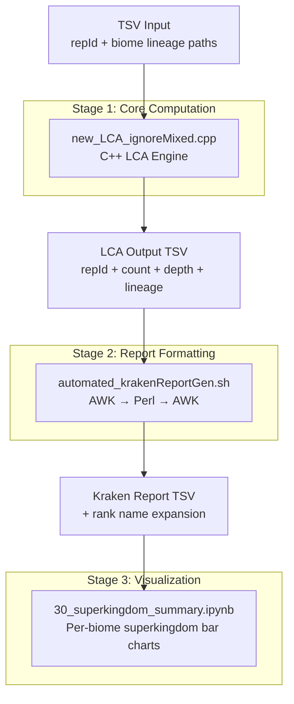
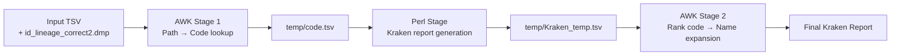

This page documents the computational pipeline that determines the taxonomic Lowest Common Ancestor (LCA) of protein domain clusters within specific biomes, then produces summary visualizations of superkingdom composition across environments. The engine is built around a high-performance C++ core that processes colon-delimited lineage paths and outputs Kraken-compatible reports, which are subsequently consumed by a Jupyter notebook for per-biome superkingdom bar chart generation.

## Pipeline Architecture Overview

The biome LCA pipeline follows a three-stage flow: lineage path accumulation → LCA computation → report generation and visualization. A C++ binary handles the computationally intensive LCA resolution, a Bash/Perl/AWK pipeline transforms the output into Kraken-format reports, and a Python notebook produces the final publication figures.



## Core LCA Engine: `new_LCA_ignoreMixed.cpp`

The heart of the pipeline is a 169-line C++ program that reads a tab-separated input file, groups biome lineage paths by representative cluster ID, and computes the Lowest Common Ancestor across all member paths for each cluster. The engine implements a deliberate "ignore mixed" strategy that prevents ambiguous biome annotations from corrupting the LCA result.

### Command-Line Interface

The binary requires exactly four positional arguments [new_LCA_ignoreMixed.cpp#L90-L93](biome/new_LCA_ignoreMixed.cpp#L90-L93):

```
./new_LCA_ignoreMixed <input_file> <rep_idx> <mem_idx> <output_file>
```

| Parameter | Type | Description |
|-----------|------|-------------|
| `input_file` | string (path) | Tab-separated file containing at minimum two columns: a representative ID column and a biome lineage column |
| `rep_idx` | int (0-based) | Column index for the representative/cluster identifier used as the grouping key |
| `mem_idx` | int (0-based) | Column index containing the colon-delimited biome lineage path for each member |
| `output_file` | string (path) | Destination path for the LCA result TSV |

### Data Flow and Grouping Strategy

The engine operates in two distinct phases. In the **accumulation phase**, it reads every line of the input TSV, splits on tabs, trims whitespace from the biome lineage column, and populates a `std::map<string, vector<string>>` that maps each representative ID to all of its member biome paths [new_LCA_ignoreMixed.cpp#L111-L134](biome/new_LCA_ignoreMixed.cpp#L111-L134). This in-memory grouping is critical because cluster sizes vary — some clusters have a single member while others contain many — and the LCA algorithm must handle both cases differently.

In the **resolution phase**, the engine iterates over each entry in the map. For clusters with exactly one member, it emits a passthrough record with a count of `1`, the depth computed from the number of colons, and the original path [new_LCA_ignoreMixed.cpp#L144-L151](biome/new_LCA_ignoreMixed.cpp#L144-L151). For multi-member clusters, it invokes the `find_lca` function to determine the shared lineage prefix.

### The `find_lca` Algorithm

The LCA function [new_LCA_ignoreMixed.cpp#L31-L83](biome/new_LCA_ignoreMixed.cpp#L31-L83) implements a prefix-matching algorithm on colon-delimited lineage paths. It proceeds as follows:

1. **Initialization**: The first path in the vector is split on `:` into a `common_ancestor` vector, establishing the initial candidate LCA.
2. **Iterative refinement**: For each subsequent path, the function checks whether it matches any of four sentinel values — `"root:Mixed"`, `"root"`, `"root:Mixed:Null"`, or `"root:Null"` — and **skips** them entirely [new_LCA_ignoreMixed.cpp#L49-L51](biome/new_LCA_ignoreMixed.cpp#L49-L51). This is the "ignore mixed" behavior: biome-unclassified or mixed-environment members are excluded from LCA computation rather than forcing the result to a trivially high-level ancestor.
3. **Prefix contraction**: For non-sentinel paths, the function splits the path on `:`, then walks both the current `common_ancestor` and the new `path_parts` simultaneously, truncating `common_ancestor` at the first mismatch [new_LCA_ignoreMixed.cpp#L59-L69](biome/new_LCA_ignoreMixed.cpp#L59-L69).
4. **Output formatting**: The result is a tab-delimited string containing three fields: the total number of contributing paths, the depth of the LCA (number of components), and the colon-joined LCA path [new_LCA_ignoreMixed.cpp#L73-L82](biome/new_LCA_ignoreMixed.cpp#L73-L82).

> [!TIP]
> The "ignore mixed" sentinel check operates on string literals, not configurable values. If your biome annotation uses different sentinel strings (e.g., `"unclassified"` or `"unknown"` instead of `"root:Mixed"`), you must modify the condition at [line 49](biome/new_LCA_ignoreMixed.cpp#L49) to include your sentinel values. The current four hardcoded sentinels are: `root:Mixed`, `root`, `root:Mixed:Null`, and `root:Null`.

### Output Format

Each line of the output file follows this tab-separated schema:

| Field | Content | Example |
|-------|---------|---------|
| Column 1 | Representative cluster ID | `AF-C3NEY6-F1-model_v4` |
| Column 2 | Number of paths used in LCA | `5` |
| Column 3 | Depth of the LCA (node count) | `4` |
| Column 4 | Colon-joined LCA path | `root:Environmental:Aquatic:Thermal` |

For single-member clusters, column 2 is always `1` and the path is emitted unchanged.

## Kraken Report Generation: `automated_krakenReportGen.sh`

The LCA engine's output is a compact lineage-path TSV, but downstream analysis and visualization require an expanded format with rank names. The shell script [automated_krakenReportGen.sh](biome/automated_krakenReportGen.sh) bridges this gap by converting lineage codes into a **Kraken-style report** — a format widely used in metagenomic taxonomic profiling that includes hierarchical counts and human-readable rank labels.

### Script Interface and Dependencies

The script accepts a single argument: the input TSV file whose first column contains lineage paths and whose second column (via an intermediate AWK lookup) contains taxonomic codes [automated_krakenReportGen.sh#L4-L7](biome/automated_krakenReportGen.sh#L4-L7). It depends on two external resources:

- **`id_lineage_correct2.dmp`**: A lookup table mapping lineage paths to numeric taxonomic codes (expected in the working directory).
- **`y_gen_krakenreport4.pl`**: A Perl script that generates the Kraken report structure from the code list.

The output filename is derived from the input by appending `Kraken.tsv` (stripping any existing `.tsv` extension) [automated_krakenReportGen.sh#L12](biome/automated_krakenReportGen.sh#L12).

### Three-Stage Processing Pipeline



**Stage 1 — Code Lookup (AWK)**: An associative array maps lineage paths from `id_lineage_correct2.dmp` (keyed on column 3) to numeric codes (column 1). For each row in the input file, if the first column matches a path in the lookup table, the corresponding code is printed [automated_krakenReportGen.sh#L18-L32](biome/automated_krakenReportGen.sh#L18-L32). Only rows starting with `root` and present in the lookup table are emitted.

**Stage 2 — Report Generation (Perl)**: The intermediate `temp/code.tsv` is piped to `y_gen_krakenreport4.pl`, which produces a structured report with Kraken's standard format of counts, rank codes, and taxonomic identifiers [automated_krakenReportGen.sh#L35](biome/automated_krakenReportGen.sh#L35).

**Stage 3 — Rank Name Expansion (AWK)**: Single-letter rank codes are replaced with their full names using global substitutions [automated_krakenReportGen.sh#L38-L50](biome/automated_krakenReportGen.sh#L38-L50):

| Code | Expanded Name | Code | Expanded Name |
|------|--------------|------|--------------|
| `D` | superkingdom | `O` | order |
| `K` | kingdom | `F` | family |
| `P` | phylum | `G` | genus |
| `C` | class | `S` | species |
| `U` | no rank | | |

The AWK pipeline also performs a special substitution to replace the `-  1  root` pattern with `no rank  1  root` for the root node [automated_krakenReportGen.sh#L48](biome/automated_krakenReportGen.sh#L48).

> [!TIP]
> The script creates a `temp/` directory for intermediate files. If run in parallel for multiple biomes, each invocation will read/write the same `temp/code.tsv` and `temp/Kraken_temp.tsv` files, creating race conditions. Run each biome sequentially or modify the script to use biome-specific temp directories.

## Biome Superkingdom Visualization: `30_superkingdom_summary.ipynb`

The notebook [30_superkingdom_summary.ipynb](biome/30_superkingdom_summary.ipynb) consumes the Kraken-expanded LCA results to produce per-biome superkingdom composition bar charts. It processes three biomes — **Thermal Springs**, **Saline-rich environments**, and **Glacier-rich environments** — each following an identical analytical pattern.

### Input Data Contract

Each biome's LCA output is read as a four-column TSV with columns `repId`, `lcaId`, `lcaRank`, and `lcaName` [30_superkingdom_summary.ipynb#L111-L114](biome/30_superkingdom_summary.ipynb#L111-L114). The notebook references two taxonomy mapper files from a shared `coreness/` directory:

| Mapper File | Columns | Purpose |
|-------------|---------|---------|
| `grouping_w_merged_dmp_gtdb-taxId_taxName_phylumId_phylumName.tsv` | taxId, taxName, phylumId, phylumName | Maps any taxId to its phylum assignment |
| `grouping_w_merged_dmp_gtdb-taxId_taxName_superkingdomId_superkingdomName.tsv` | taxId, taxName, superkingdomId, superkingdomName | Maps any taxId to its superkingdom assignment |

### Per-Biome Processing Pattern

Each biome section follows a five-step sequence:

1. **Load LCA data** — Read the biome-specific TSV into a DataFrame with columns `repId`, `lcaId`, `lcaRank`, `lcaName`.
2. **Load mappers** — Read both phylum and superkingdom mapper TSVs.
3. **Phylum mapping** — Apply a `phylum_mapping` function to the `lcaId` column. The function checks if the LCA taxId exists in the phylum mapper; for Thermal Springs it highlights `Thermoproteota` specifically, for Saline-rich it highlights `Halobacteriota`, and for Glacier-rich it highlights `Cyanobacteriota` [30_superkingdom_summary.ipynb#L405-L422](biome/30_superkingdom_summary.ipynb#L405-L422). All other recognized phyla are grouped as `"others"`, with special handling for `taxId == 0` (unclassified) and `taxId == 1` (root).
4. **Superkingdom mapping** — Apply a `superkingdom_mapping` function that resolves each `lcaId` to its superkingdom name (Bacteria, Archaea, Eukaryota, Viruses, or others) [30_superkingdom_summary.ipynb#L531-L545](biome/30_superkingdom_summary.ipynb#L531-L545).
5. **Visualization** — Count superkingdom occurrences, reorder to a canonical sequence (`unclassified`, `root`, `Bacteria`, `Eukaryota`, `Archaea`, `Viruses`), fill missing categories with zero, and render a bar chart [30_superkingdom_summary.ipynb#L601-L631](biome/30_superkingdom_summary.ipynb#L601-L631).

### Biome-Specific Highlighting Strategy

The notebook uses a targeted highlighting approach rather than showing all phyla individually. Each biome has a **signature phylum** that is displayed by name while all other phyla collapse into `"others"`:

| Biome | Signature Phylum | LCA Results Sample (superkingdom counts) |
|-------|-----------------|----------------------------------------|
| Thermal Springs | Thermoproteota | Archaea: 456, root: 126, unclassified: 102, Bacteria: 43, Viruses: 17 |
| Saline-rich | Halobacteriota | Archaea: 39, root: 22, Bacteria: 17, unclassified: 4, Eukaryota: 1 |
| Glacier-rich | Cyanobacteriota | (processed with identical pattern) |

This design choice keeps the visualization focused on the biome-defining taxonomic signal. Each biome section also uses a distinct color for its bars — `#C93A59` (red) for Thermal, `#DCD2C4` (sand) for Saline — while unclassified always renders in gray [30_superkingdom_summary.ipynb#L625](biome/30_superkingdom_summary.ipynb#L625).

### Data Sources Referenced

The notebook accesses LCA results from two different directory structures, indicating the pipeline evolved over time:
- Thermal Springs data from `../30_biome_specific/Thermal_afesm30_nBiomeGe10_lca.tsv` (filtered to clusters appearing in ≥10 biomes)
- Saline and Glacier data from `../../afesm5/taxonomy/gtdb_lca/` (unfiltered, all-member LCA)

The notebook header includes a note that "all of these codes should be rerun after the taxonomy assignment issue is resolved" [30_superkingdom_summary.ipynb#L13-L15](biome/30_superkingdom_summary.ipynb#L13-L15), indicating that the taxonomy mapper files are subject to revision as GTDB annotations are updated.

## Component Interaction Summary

| Component | Language | Role | Input | Output |
|-----------|----------|------|-------|--------|
| `new_LCA_ignoreMixed.cpp` | C++ | LCA computation | TSV with repId + biome paths | TSV with repId + count + depth + LCA path |
| `automated_krakenReportGen.sh` | Bash/AWK/Perl | Report formatting | LCA path TSV + `id_lineage_correct2.dmp` | Kraken-format report TSV |
| `30_superkingdom_summary.ipynb` | Python (pandas/matplotlib) | Visualization | Kraken report + taxonomy mappers | Per-biome SVG bar charts |

## Next Steps

For the complementary taxonomy-focused LCA analysis (which operates on NCBI taxonomy nodes rather than biome lineage paths), see [Taxonomic LCA and Universality Analysis](13-taxonomic-lca-and-universality-analysis). To understand how the protein domain clusters themselves are generated before being fed into this biome annotation pipeline, refer to [Novel Fold Discovery](5-domain-filtering-and-consensus) and [Clustering Concatenation Strategy](17-clustering-concatenation-strategy).