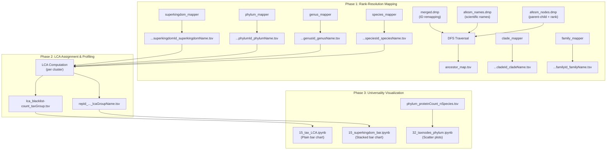

This module encompasses the complete taxonomic annotation pipeline for AFDB–ESM protein clusters, from raw NCBI taxonomy traversal to Lowest Common Ancestor (LCA) computation and cross-superkingdom universality profiling. It answers a central question: *at what taxonomic resolution can we confidently place each protein cluster, and how broadly are novel folds distributed across the tree of life?*

## Architecture Overview

The taxonomy subsystem operates in three clearly delineated phases: **rank-resolution mapping**, **LCA assignment and profiling**, and **universality visualization**. All mapper notebooks share a common pattern—parsing the NCBI taxonomy dump files, walking the tree via DFS to a target rank, and writing annotated TSV outputs with merged-ID handling.

## Rank-Resolution Mapper Pattern

Every mapper notebook in this directory follows an identical four-cell architecture, differing only in the target taxonomy rank and output filename. This patterned approach ensures consistency across all annotation levels while keeping each notebook independently executable.

### Phase 1 — NCBI Taxonomy Parsing

Each notebook begins by loading the same three data structures from the taxonomy dump files located under `/fast/livinit/esmfold/databases/`. First, `merged.dmp` is parsed to build a `cur_id2prev_id` dictionary mapping current taxonomic IDs to their deprecated predecessors—critical for handling NCBI taxonomy revisions where IDs are merged or reassigned [superkingdom_mapper.ipynb](taxonomy/superkingdom_mapper.ipynb#L1-L22). Second, `afesm_names.dmp` provides the `taxName` mapping from integer tax IDs to scientific name strings, filtered to include only entries tagged as `scientific name` [superkingdom_mapper.ipynb](taxonomy/superkingdom_mapper.ipynb#L1060-L1080). Third, `afesm_nodes.dmp` supplies both the `kid_parent` adjacency map (child → parent) and the `taxRank` map (tax ID → rank string) for tree traversal [superkingdom_mapper.ipynb](taxonomy/superkingdom_mapper.ipynb#L1083-L1099).

### Phase 2 — DFS Ancestor Resolution

The core algorithm is a memoized depth-first search that walks each taxonomic node upward through the `kid_parent` tree until reaching a node whose `taxRank` matches the target rank. The function terminates with `False` for nodes at or above root level (nodes that are their own parent), and caches results in the `dp` dictionary to avoid redundant traversals—a significant optimization given the millions of nodes in the NCBI taxonomy. For example, in [superkingdom_mapper.ipynb](taxonomy/superkingdom_mapper.ipynb#L1101-L1117), the DFS terminates when `taxRank[cur] == 'superkingdom'`, while [phylum_mapper.ipynb](taxonomy/phylum_mapper.ipynb#L1101-L1117) targets `'phylum'`, [genus_mapper.ipynb](taxonomy/genus_mapper.ipynb#L1101-L1117) targets `'genus'`, and [clade_mapper.ipynb](taxonomy/clade_mapper.ipynb#L1101-L1117) targets `'clade'`.

### Phase 3 — Output with Merged-ID Expansion

The final cell writes a four-column TSV file to `../coreness/` containing `taxId`, `taxName`, `ancestorId`, and `ancestorName`. Crucially, for each valid mapping it also writes additional rows for any deprecated IDs stored in `cur_id2prev_id`, ensuring that older taxonomic identifiers used in upstream AFDB/ESM metadata are correctly resolved to the same ancestor [superkingdom_mapper.ipynb](taxonomy/superkingdom_mapper.ipynb#L1125-L1137).

> [!TIP]
> The merged-ID expansion in Phase 3 is essential for reproducibility: without it, protein entries annotated with deprecated NCBI taxonomy IDs (common in older metagenomic assemblies) would silently drop out of the rank-mapped output. Every mapper notebook inherits this behavior from the shared `cur_id2prev_id` dictionary populated in cell 1.

### Mapper Notebook Summary

| Notebook | Target Rank | Output File Suffix | DFS Stop Condition |
|---|---|---|---|
| [superkingdom_mapper.ipynb](taxonomy/superkingdom_mapper.ipynb) | superkingdom | `superkingdomId_superkingdomName.tsv` | `taxRank[cur] == 'superkingdom'` |
| [phylum_mapper.ipynb](taxonomy/phylum_mapper.ipynb) | phylum | `phylumId_phylumName.tsv` | `taxRank[cur] == 'phylum'` |
| [genus_mapper.ipynb](taxonomy/genus_mapper.ipynb) | genus | `genusId_genusName.tsv` | `taxRank[cur] == 'genus'` |
| [family_mapper.ipynb](taxonomy/family_mapper.ipynb) | family | `familyId_familyName.tsv` | `taxRank[cur] == 'family'` |
| [species_mapper.ipynb](taxonomy/species_mapper.ipynb) | species | `speciesId_speciesName.tsv` | `taxRank[cur] == 'species'` |
| [clade_mapper.ipynb](taxonomy/clade_mapper.ipynb) | clade | `cladeId_cladeName.tsv` | `taxRank[cur] == 'clade'` |

The [descendant_mapper.ipynb](taxonomy/descendant_mapper.ipynb) notebook serves a complementary role: rather than mapping ancestors upward, it builds a **child-to-descendants** dictionary that records all downstream taxonomic nodes for each parent, enabling descendant-count queries used in later universality metrics [descendant_mapper.ipynb](taxonomy/descendant_mapper.ipynb#L1-L60).

## LCA Resolution Profiling

Once rank mappings are established, the LCA computation assigns each protein cluster its taxonomic lowest common ancestor based on the member proteins' taxonomic annotations. Two visualization notebooks profile the resolution quality of these LCA assignments.

### Plain Bar Chart — Global LCA Resolution

The [15_tax_LCA.ipynb](taxonomy/15_tax_LCA.ipynb) notebook reads the precomputed LCA grouping counts from `15_n_genus/afesm30_repseq_foldseek_clu_nonsingleton_allMem_lca_blacklist-count_taxGroup.tsv` and renders a horizontal bar chart showing how many protein clusters resolved at each LCA resolution level [15_tax_LCA.ipynb](taxonomy/15_tax_LCA.ipynb#L10-L20). The seven resolution categories reveal a telling distribution:

| LCA Resolution Group | Cluster Count | Interpretation |
|---|---|---|
| **superkingdom** | 2,283,970 | LCA resolved to Bacteria/Archaea/Eukaryota/Viruses |
| **root** | 1,198,802 | Members span multiple superkingdoms — unresolved |
| **lower than superkingdom** | 529,253 | Between superkingdom and phylum |
| **cellular organism** | 515,945 | LCA at cellular organisms node (below root) |
| **species and lower than species** | 216,786 | Finest-grained resolution |
| **not predicted** | 199,879 | No taxonomy annotation available |
| **family and lower than family** | 181,564 | Mid-resolution (family/genus) |

The dominant "superkingdom" bucket (2.28M clusters) indicates that the majority of clusters contain members from a single domain of life, providing a strong signal for superkingdom-level universality analysis.

### Stacked Bar Chart — Superkingdom-Resolved LCA

The [15_superkingdom_bar.ipynb](taxonomy/15_superkingdom_bar.ipynb) notebook provides a more granular view by cross-tabulating superkingdom identity against LCA resolution level. It reads per-cluster annotations from a TSV containing `repId`, `superkingdom`, `superkingdomName`, `lcaId`, `lcaRank`, `lcaName`, and `lcaGroupName` [15_superkingdom_bar.ipynb](taxonomy/15_superkingdom_bar.ipynb#L15-L30). The notebook produces a percentage-stacked bar chart with six manually ordered resolution categories using a custom color palette: gray for root, dark navy for cellular organism, blue for superkingdom, green for lower-than-superkingdom, amber for family-and-below, and red for species-and-below [15_superkingdom_bar.ipynb](taxonomy/15_superkingdom_bar.ipynb#L32-L55).

Key findings from the pivot table output: **Bacteria** dominates the dataset with 1,992,146 clusters resolving to superkingdom level, while **Eukaryota** shows a notably different distribution pattern with substantial representation in the "cellular organism" (299,823) and "root" (293,881) categories, reflecting the higher taxonomic diversity within eukaryotes [15_superkingdom_bar.ipynb](taxonomy/15_superkingdom_bar.ipynb#L1-L35). **Viruses** have the weakest LCA resolution—618,819 clusters hit root and only 179 resolve to superkingdom—consistent with their highly divergent taxonomy and limited representation in reference databases.

## Phylum-Level Universality Analysis

The [32_taxnodes_phylum.ipynb](taxonomy/32_taxnodes_phylum.ipynb) notebook shifts focus from LCA resolution quality to **taxonomic breadth analysis**: it visualizes the relationship between the number of species represented by a phylum and the number of protein clusters associated with it, faceted by superkingdom.

### Phylum Scatter Plot

The notebook reads a TSV with columns `phylumId`, `phylumName`, `superkingdom`, `superkingdomName`, `count` (cluster count), and `nSpecies` (species diversity), then generates a multi-panel log-log scatter plot with one subplot per superkingdom [32_taxnodes_phylum.ipynb](taxonomy/32_taxnodes_phylum.ipynb#L1-L40). Each point represents a single phylum, with x-axis showing species count and y-axis showing protein cluster count. This visualization reveals whether clusters are concentrated in species-rich phyla (suggesting annotation bias) or broadly distributed across diverse phyla (suggesting true structural universality).

### Genus-Level Taxnode Plot

A second panel applies the same visualization at genus level, reading `genus-genusId_genusName_superkingdom_superkingdomName_count_ntaxnodes.tsv` where `ntaxnodes` represents the number of taxonomic nodes (a proxy for phylogenetic diversity) [32_taxnodes_phylum.ipynb](taxonomy/32_taxnodes_phylum.ipynb#L50-L90). Both plots use log-scale axes and save output as SVG to `output/phylum_proteinCount_nSpecies.svg`.

## Data Flow and Integration Context

The taxonomy module feeds into downstream analyses across the repository. The rank-resolved mapping files written to `../coreness/` serve as join keys for the biome LCA computation described in [Biome LCA Computation Engine](12-biome-lca-computation-engine), while the per-cluster LCA annotations provide the taxonomic stratification used in multidomain protein analysis on [Novel Domain Combination Detection](10-novel-domain-combination-detection) and the reproducible visualization notebooks in [Reproducible Visualization Notebooks](18-reproducible-visualization-notebooks).

> [!TIP]
> The entire mapper subsystem depends on a shared taxonomy database path (`/fast/livinit/esmfold/databases/`) containing `afesm_names.dmp`, `afesm_nodes.dmp`, and NCBI's `merged.dmp`. If replicating this pipeline, ensure these files are from the same taxonomy release—mismatched dump files can produce inconsistent ancestor mappings that silently corrupt downstream LCA computations.

## Next Steps

To continue exploring the annotation pipeline:
- **Upstream**: See [Biome LCA Computation Engine](12-biome-lca-computation-engine) for how these taxonomic mappings are used in biome-level LCA analysis
- **Downstream**: Consult [Reproducible Visualization Notebooks](18-reproducible-visualization-notebooks) for the publication figures derived from these taxonomic profiles
- **Pipeline Context**: Review [Pipeline Architecture](4-pipeline-architecture) for the full end-to-end data flow from structure prediction through taxonomic annotation