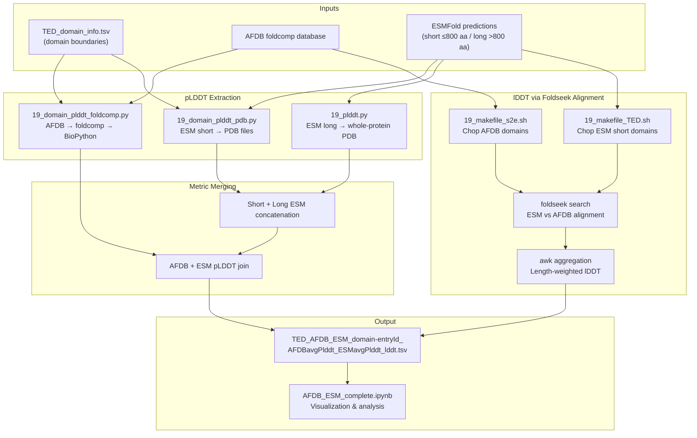
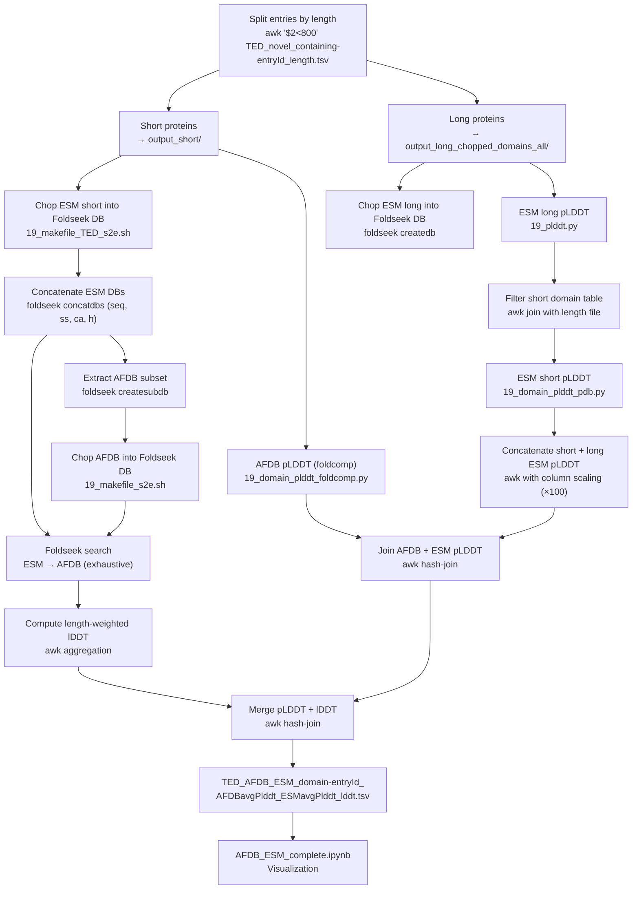

This pipeline evaluates the structural confidence of predicted protein domains by computing **pLDDT** (predicted Local Distance Difference Test) at both whole-protein and domain-level granularity, then cross-referencing those scores against **lDDT** (experimental Local Distance Difference Test) structural alignment metrics between AlphaFoldDB and ESMFold predictions. The result is a unified quality table—`TED_AFDB_ESM_domain-entryId_AFDBavgPlddt_ESMavgPlddt_lddt.tsv`—that serves as the foundation for downstream filtering and visualization.

## Pipeline Architecture Overview

The pipeline is orchestrated through shell command files that chain Python scoring scripts with Foldseek utilities. It processes ~7,400 TED novel domain entries across two structure sources (AFDB via foldcomp, ESMFold via PDB), splits proteins by length, computes per-domain pLDDT, performs structural alignment to derive lDDT, and merges all metrics into a single evaluation table.



## Core Scoring Scripts

The pipeline relies on three Python scripts that form the computational backbone for pLDDT extraction. Each operates at a different granularity and reads from a different storage format, but they all produce the same output schema: a two-column TSV of `entry` and a pLDDT score.

### Whole-Protein pLDDT from PDB Files

The simplest scorer in the pipeline, `19_plddt.py`, iterates over all `.pdb` files in a directory and computes a single average pLDDT per structure. It reads the B-factor column (columns 60–66) from every `ATOM` record in standard PDB format. This script is used exclusively for long ESM-predicted domains that were pre-chopped into individual PDB files, where no domain boundary information is needed because each file already represents a single domain.

```python
# Simplified extraction from 19_plddt.py
def compute_avg_plddt(pdb_file):
    plddt_values = []
    with open(pdb_file, 'r') as f:
        for line in f:
            if line.startswith("ATOM"):
                plddt = float(line[60:66].strip())  # B-factor column
                plddt_values.append(plddt)
    return sum(plddt_values) / len(plddt_values) if plddt_values else None
```

Sources: [19_plddt.py](prediction/TED_novel_domains/19_plddt.py#L4-L17)

### Domain-Level pLDDT from PDB Files

`19_domain_plddt_pdb.py` introduces domain-aware scoring. Rather than averaging over the entire protein, it reads domain boundary definitions from a tab-separated table and computes a **length-weighted average pLDDT** confined to domain regions. Each domain is defined as a triplet of `(start, end, label)`, and proteins may contain multiple domain segments. The script delegates actual B-factor extraction to an external module, `avg_bfactor.calculate_avg_bfactor`, which reads PDB files and returns the mean B-factor for a specified chain and residue range.

The domain table follows a two-column format (`entry`, `domain`) where the `domain` column contains comma-separated boundary triplets. For example, `300,341,AF-A0A368Y0L3-F1-model_v4_TED04` defines a single domain spanning residues 300–341, while `5,121,...,496,529,...` defines two separate segments on the same entry.

Sources: [19_domain_plddt_pdb.py](prediction/TED_novel_domains/19_domain_plddt_pdb.py#L7-L35), [TED_domain_info.tsv](prediction/TED_novel_domains/TED_domain_info.tsv#L1-L8)

### Domain-Level pLDDT from Foldcomp Databases

`19_domain_plddt_foldcomp.py` performs the same domain-aware calculation but reads structures from a **foldcomp compressed database** rather than PDB files. This is critical for AFDB structures, which are stored in foldcomp format. The script opens the database via the `foldcomp` Python API, decompresses each entry into an in-memory PDB string, parses it with BioPython's `PDBParser`, and then applies the same length-weighted averaging logic using `avg_bfactor.calculate_avg_bfactor_from_parser`. Entries are matched by stripping the foldcomp name suffix (e.g., `AF-A0A1Q6QXA8-F1-model_v4` from `AF-A0A1Q6QXA8-F1-model_v4.pdb`).

Sources: [19_domain_plddt_foldcomp.py](prediction/TED_novel_domains/19_domain_plddt_foldcomp.py#L7-L77)

## Script Comparison Matrix

| Script | Input Format | Granularity | pLDDT Source | Domain-Aware | External Dependency |
|---|---|---|---|---|---|
| `19_plddt.py` | PDB directory | Whole protein | ATOM B-factor (cols 60–66) | No | None |
| `19_domain_plddt_pdb.py` | PDB directory + domain TSV | Per-domain regions | `avg_bfactor.calculate_avg_bfactor` | Yes | `avg_bfactor` module |
| `19_domain_plddt_foldcomp.py` | Foldcomp DB + domain TSV | Per-domain regions | `avg_bfactor.calculate_avg_bfactor_from_parser` | Yes | `foldcomp`, `avg_bfactor`, BioPython |

> [!TIP]
> All three scripts output a two-column TSV (`entry`, score). The foldcomp variant stores pLDDT in the B-factor field just like PDB files, so the downstream merging logic treats them identically despite the different storage backends.

## Domain Boundary Encoding

The domain boundary table, `TED_domain_info.tsv`, is the shared input for all domain-aware scoring scripts. It contains 7,416 entries, each mapping an AFDB entry ID to one or more domain regions encoded as comma-separated triplets.

```
# Format: entry<TAB>start,end,label[,start,end,label,...]
AF-A0A1Q6QXA8-F1-model_v4    5,121,AF-A0A1Q6QXA8-F1-model_v4_TED01
AF-A0A537WUW0-F1-model_v4    150,291,AF-A0A537WUW0-F1-model_v4_TED03
AF-C5NV13-F1-model_v4        404,460,AF-C5NV13-F1-model_v4_TED02,496,529,AF-C5NV13-F1-model_v4_TED02
```

The parsing logic in `19_domain_plddt_pdb.py` and `19_domain_plddt_foldcomp.py` iterates over this comma-separated list in steps of 3: positions `[i]` and `[i+1]` provide the residue range (inclusive), while `[i+2]` is the domain label. The pLDDT contribution of each segment is weighted by its residue count (`e - s + 1`), producing a final average that reflects the relative size of each domain segment.

Sources: [19_domain_plddt_pdb.py](prediction/TED_novel_domains/19_domain_plddt_pdb.py#L18-L30), [19_domain_plddt_foldcomp.py](prediction/TED_novel_domains/19_domain_plddt_foldcomp.py#L25-L43), [TED_domain_info.tsv](prediction/TED_novel_domains/TED_domain_info.tsv#L1-L10)

## ESMFold Prediction Layer

The pLDDT values for ESMFold predictions originate from `esmfold_bulk_argv_size_constraint.py`, which runs ESMFold inference on GPU and writes PDB files with pLDDT scores embedded in the B-factor column. This script is configured through eight command-line arguments that control the prediction window, batching, and sequence length constraints.

| Parameter | Position | Description |
|---|---|---|
| `<fasta file>` | `$1` | Input FASTA with sequences to predict |
| `<output dir>` | `$2` | Directory for `.pdb` output files |
| `<start index>` | `$3` | Starting row index in the sequence DataFrame |
| `<end index>` | `$4` | Ending row index (exclusive) |
| `<batch size>` | `$5` | Number of sequences per GPU batch |
| `<chunk size>` | `$6` | ESMFold trunk chunk size (reduce for ≤16 GB VRAM) |
| `<min_len>` | `$7` | Minimum sequence length filter |
| `<max_len>` | `$8` | Maximum sequence length filter |

The script loads `facebook/esmfold_v1` with `low_cpu_mem_usage=True`, optionally switches the ESM stem to float16 precision, sets `allow_tf32` for faster matrix operations, and uses the OpenFold utility `to_pdb()` to convert model outputs—where `outputs["plddt"]` is explicitly passed as the B-factor field—to PDB format. Sequences are processed in batches via `torch.no_grad()` inference, and results are written as `{identifier}.pdb` files.

Sources: [esmfold_bulk_argv_size_constraint.py](prediction/TED_novel_domains/esmfold_bulk_argv_size_constraint.py#L2-L17), [esmfold_bulk_argv_size_constraint.py](prediction/TED_novel_domains/esmfold_bulk_argv_size_constraint.py#L34-L109), [prediction_command](prediction/TED_novel_domains/prediction_command#L11-L16)

> [!TIP]
> Long proteins (>800 residues) cannot be predicted end-to-end by ESMFold within typical GPU memory constraints. The pipeline handles this by pre-chopping them into domain-level fragments using a sequence chopping script (`23_sequence_chopping_s2e.py` referenced in [prediction_command](prediction/TED_novel_domains/prediction_command#L22-L28)), predicting each fragment independently, then scoring the resulting PDB files with `19_plddt.py`.

## lDDT Computation via Foldseek Structural Alignment

Beyond self-reported pLDDT, the pipeline computes an **orthogonal quality metric**—lDDT—by structurally aligning ESMFold predictions against AFDB structures using Foldseek. This requires both prediction sets to be formatted as Foldseek databases and chopped into domain-level representations.

### Domain Chopping Makefiles

Three shell scripts handle the conversion from structure sources into Foldseek-compatible, domain-chopped databases. They share a common structure: convert the source database to FASTA and C-alpha representations, invoke a domain-chopping Python script, then convert the chopped TSV output back into Foldseek database format.

| Makefile | Source DB | Chopping Script | Purpose |
|---|---|---|---|
| `19_makefile_TED.sh` | ESM short | `19_chop_domain_TED.py` | Chop ESM short domains at TED boundaries |
| `19_makefile_TED_s2e.sh` | ESM short | `19_chop_domain_TED_s2e.py` | Chop ESM short domains (s2e variant) |
| `19_makefile_s2e.sh` | AFDB subset | `19_chop_domain_s2e.py` | Chop AFDB structures at domain boundaries |

Each script accepts five arguments: `BASE_PATH`, `FASTA_PATH`, `OUTPUT_PATH`, `TMP_PATH`, and `DOMAIN_FILE`. Internally, they use Foldseek's `convert2fasta`, `compressca`, `tsv2db`, and `mvdb` commands to manage the database lifecycle, with timing instrumentation around each phase.

Sources: [19_makefile_TED.sh](prediction/TED_novel_domains/19_makefile_TED.sh#L1-L88), [19_makefile_s2e.sh](prediction/TED_novel_domains/19_makefile_s2e.sh#L1-L88)

### Alignment and Length-Weighted Aggregation

After domain chopping, Foldseek performs an exhaustive structural search (`--exhaustive-search 1`) of the ESM domain database against the AFDB domain database. The resulting alignment file is then processed with an awk one-liner that computes a **length-weighted lDDT** per entry:

```bash
awk '$1!=$2 {next} {N=split($1, arr, "_"); entry=arr[1]"_"arr[2];}
     {nDomain[entry]++; slddt[entry]+=$4*$8; slen[entry]+=$8;}
     END {for (key in slen) print key"\t"slddt[key]/slen[key]"\t"slen[key]"\t"nDomain[key]}'
```

This filters for self-alignments (`$1==$2`), accumulates the product of per-alignment lDDT (`$4`) and alignment length (`$8`), then divides by total aligned length to produce the final score. The output includes the entry identifier, weighted lDDT, total aligned length, and number of domain segments.

Sources: [comparison_command](prediction/TED_novel_domains/comparison_command#L36-L41)

## End-to-End Orchestration Flow

The `comparison_command` file serves as the master orchestration script, documenting the complete sequence of operations from raw data to the final merged quality table. The following flowchart captures the exact execution order as encoded in that file.



Sources: [comparison_command](prediction/TED_novel_domains/comparison_command#L1-L44)

## Output Schema and Visualization

The final merged output table contains four columns per entry:

| Column | Type | Source | Scale |
|---|---|---|---|
| `entryId` | string | AFDB entry identifier (e.g., `AF-A0A1Q6QXA8-F1-model_v4`) | — |
| `AFDBavgPlddt` | float | `19_domain_plddt_foldcomp.py` output | 0–100 |
| `ESMavgPlddt` | float | `19_domain_plddt_pdb.py` + `19_plddt.py` output | 0–100 |
| `lddt` | float | Foldseek alignment aggregation | 0.0–1.0 |

Note that AFDB pLDDT values originate from the foldcomp scoring script (already on 0–100 scale), while ESM pLDDT values from `19_plddt.py` are scaled by ×100 during concatenation to normalize them to the same range. Entries with no ESMFold prediction receive a default lDDT of 0.

Sources: [comparison_command](prediction/TED_novel_domains/comparison_command#L17-L19), [comparison_command](prediction/TED_novel_domains/comparison_command#L43-L44), [AFDB_ESM_complete.ipynb](prediction/TED_novel_domains/AFDB_ESM_complete.ipynb#L90-L96)

### Diagnostic Visualizations

The `AFDB_ESM_complete.ipynb` notebook loads the merged table and produces four diagnostic plots:

1. **ESMavgPlddt vs AFDBavgPlddt scatter with marginal histograms** — a GridSpec layout (3×3) with the scatter plot in the lower-left 2×2 quadrant, a histogram of ESM scores along the top, and a histogram of AFDB scores along the right margin. Alpha is set to 0.1 for density visualization across ~7,400 points.

2. **ESMavgPlddt vs lDDT scatter** — filters to entries where lDDT > 0 before plotting, with axes bounded to [-5, 105].

3. **AFDBavgPlddt vs lDDT scatter** — same filtering and axis bounds as above, revealing the correlation between AFDB self-confidence and structural agreement with ESM.

4. **KDE density contour plots** — seaborn `kdeplot` with 10 contour levels and a viridis colormap, providing smooth density estimates for the ESMavgPlddt vs AFDBavgPlddt and ESMavgPlddt vs lDDT relationships.

Sources: [AFDB_ESM_complete.ipynb](prediction/TED_novel_domains/AFDB_ESM_complete.ipynb#L114-L146), [AFDB_ESM_complete.ipynb](prediction/TED_novel_domains/AFDB_ESM_complete.ipynb#L174-L181), [AFDB_ESM_complete.ipynb](prediction/TED_novel_domains/AFDB_ESM_complete.ipynb#L244-L269), [AFDB_ESM_complete.ipynb](prediction/TED_novel_domains/AFDB_ESM_complete.ipynb#L296-L322)

## Relationship to Novel Fold Quality Assessment

A complementary but architecturally distinct scoring approach exists in `calculate_top80_mean_plddt.py`, used in the novel fold discovery pipeline. While the TED pipeline computes a simple arithmetic mean over domain regions, the novel fold scorer calculates a **trimmed mean over C-alpha atoms only**, sorting all residue-level pLDDT values and averaging only the top 80% (discarding the lowest 20%). This trimmed metric is less sensitive to localized low-confidence loops and is controlled by a configurable `--plddt_threshold` parameter (default 0.9).

| Aspect | TED Pipeline (this page) | Novel Fold Pipeline |
|---|---|---|
| Atom selection | All ATOM records | CA atoms only (`line[12:16] == ' CA '`) |
| Column offset | 60:66 | 61:66 |
| Aggregation | Arithmetic mean (or length-weighted domain mean) | Trimmed mean (top 80%) |
| Output | 2-column TSV | 3-column TSV (mean, mean_80) |

Sources: [calculate_top80_mean_plddt.py](novel_fold_analyses/calculate_top80_mean_plddt.py#L8-L21)

## File Reference Summary

| File | Role |
|---|---|
| `prediction/TED_novel_domains/19_plddt.py` | Whole-protein pLDDT from PDB directory |
| `prediction/TED_novel_domains/19_domain_plddt_pdb.py` | Domain-level pLDDT from PDB files |
| `prediction/TED_novel_domains/19_domain_plddt_foldcomp.py` | Domain-level pLDDT from foldcomp DB |
| `prediction/TED_novel_domains/esmfold_bulk_argv_size_constraint.py` | ESMFold batch prediction with pLDDT in B-factor |
| `prediction/TED_novel_domains/comparison_command` | Master orchestration commands for pLDDT + lDDT |
| `prediction/TED_novel_domains/prediction_command` | ESMFold prediction invocation records |
| `prediction/TED_novel_domains/TED_domain_info.tsv` | Domain boundary definitions (7,416 entries) |
| `prediction/TED_novel_domains/TED_novel_containing-entryId_length.tsv` | Entry-to-length mapping for short/long splitting |
| `prediction/TED_novel_domains/19_makefile_TED.sh` | Foldseek domain chopping for ESM (TED boundaries) |
| `prediction/TED_novel_domains/19_makefile_TED_s2e.sh` | Foldseek domain chopping for ESM (s2e variant) |
| `prediction/TED_novel_domains/19_makefile_s2e.sh` | Foldseek domain chopping for AFDB |
| `prediction/TED_novel_domains/AFDB_ESM_complete.ipynb` | Visualization of merged quality metrics |
| `novel_fold_analyses/calculate_top80_mean_plddt.py` | Trimmed-mean pLDDT scorer (novel fold pipeline) |

## Next Steps

- **[Structure Chopping and PDB Extraction](6-structure-chopping-and-pdb-extraction)** — Understand how domain boundaries are determined and how structures are decomposed before pLDDT scoring.
- **[Foldcomp-Based Domain Scoring](16-foldcomp-based-domain-scoring)** — Dive deeper into the foldcomp extraction and B-factor reading workflow used by `19_domain_plddt_foldcomp.py`.
- **[Novel Fold Validation via Alignment Filtering](7-novel-fold-validation-via-alignment-filtering)** — See how the trimmed-mean pLDDT from `calculate_top80_mean_plddt.py` feeds into novel fold quality gates.
- **[Reproducible Visualization Notebooks](18-reproducible-visualization-notebooks)** — Explore the notebook infrastructure behind the AFDB vs ESM diagnostic plots.