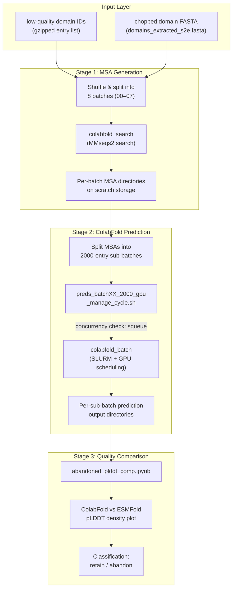
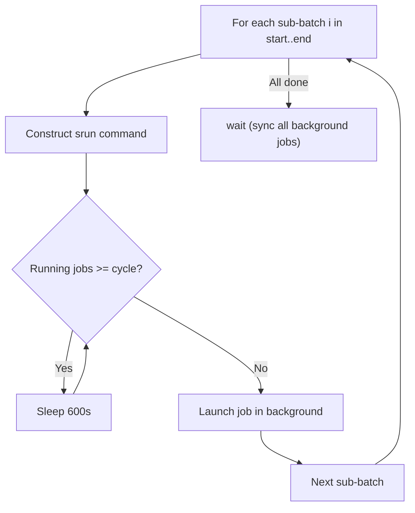

This page documents the infrastructure and orchestration logic behind re-predicting low-quality ESMFold structures using ColabFold (AlphaFold2 with MMseqs2-generated MSAs). The workflow addresses a critical quality gap in the AFESM analysis pipeline: when ESMFold produces low-confidence predictions, ColabFold can provide an MSA-informed alternative, and the two predictions are then compared to determine whether a domain should be retained or abandoned. The implementation lives entirely under `prediction/abandoned_domains/` and is organized into three functional layers—MSA generation, GPU-managed batch prediction, and comparative quality analysis.

## Architectural Overview

The re-prediction pipeline follows a three-stage architecture: first, MMseqs2 searches build MSAs for each candidate domain sequence; second, ColabFold batch consumes those MSAs under SLURM-managed GPU scheduling; third, per-domain pLDDT scores from both predictors are compared in a Jupyter notebook to classify each structure. The entire flow is orchestrated through shell scripts with concurrency-aware job submission, distributing work across 8 shuffled batches on two GPU nodes.

## Project Structure

The workflow is partitioned into three subdirectories within `prediction/abandoned_domains/`, each encapsulating a distinct phase of the re-prediction lifecycle. The `MSA/` directory holds the search and batching logic, `prediction/` manages GPU-scheduled ColabFold execution, and `analysis/` contains the post-hoc comparative notebook.

| Directory | Purpose | Key Files |
|-----------|---------|-----------|
| `prediction/abandoned_domains/MSA/` | MMseqs2 MSA generation for candidate domains | `colabfold_search_pty_argv.sh`, `colabfold_predict_pty_arvg.sh`, `msa_command` |
| `prediction/abandoned_domains/prediction/` | GPU-managed ColabFold batch prediction | `preds_batch00_2000_gpu_manage_cycle.sh`, `mv_batch00_2000.sh`, `prediction_command` |
| `prediction/abandoned_domains/analysis/` | Post-prediction quality comparison | `abandoned_plddt_comp.ipynb` |

Sources: [colabfold_search_pty_argv.sh](prediction/abandoned_domains/MSA/colabfold_search_pty_argv.sh#L1-L12), [prediction_command](prediction/abandoned_domains/prediction/prediction_command#L1-L53), [abandoned_plddt_comp.ipynb](prediction/abandoned_domains/analysis/abandoned_plddt_comp.ipynb#L84-L89)

## Stage 1: MSA Generation

The MSA generation phase prepares the input that distinguishes ColabFold from ESMFold—multiple sequence alignments. The process begins by decompressing the full list of low-quality domain identifiers, shuffling them randomly to distribute sequence difficulty across batches, and splitting them into 8 equal partitions. For each batch, an `awk`-based filter extracts matching FASTA entries from the pre-chopped domain sequence file using a composite key of entry ID and domain index.

The search itself invokes `colabfold_search` with three database tiers: **UniRef30** (`--db1`) provides the primary evolutionary signal, while the **ColabFold environmental database** (`--db3`, `--use-env 1`) adds metagenomic context critical for novel proteins. Template search is explicitly disabled (`--use-templates 0`), filtering is enabled, and 64 threads are allocated per search job. Database loading uses mode 1 (memory-mapped) for performance at scale.

Sources: [msa_command](prediction/abandoned_domains/MSA/msa_command#L1-L11), [colabfold_search_pty_argv.sh](prediction/abandoned_domains/MSA/colabfold_search_pty_argv.sh#L9-L12)

### MSA Search Configuration

| Parameter | Value | Purpose |
|-----------|-------|---------|
| `--db1` | `/storage/databases/colabfold_db_all/uniref30_2202_db` | UniRef30 2022_02 sequence database |
| `--db3` | `/storage/databases/colabfold_db_all/colabfold_envdb_202108_db` | Metagenomic environmental sequences |
| `--use-env` | `1` | Enable environmental database search |
| `--use-templates` | `0` | Disable PDB template search |
| `--filter` | `1` | Enable sequence diversity filtering |
| `-s` | `7` | Sensitivity parameter for MMseqs2 search |
| `--threads` | `64` | Per-job thread allocation |
| `--db-load-mode` | `1` | Memory-mapped database loading |

The search script accepts the FASTA input path and output MSA directory as positional arguments (`$1`, `$2`), making it reusable across all 8 batches. MSAs are written to scratch storage (`$SCRATCH`) to avoid disk contention on shared filesystems.

Sources: [colabfold_search_pty_argv.sh](prediction/abandoned_domains/MSA/colabfold_search_pty_argv.sh#L4-L12)

## Stage 2: GPU-Managed ColabFold Prediction

The prediction layer introduces a two-tier batching strategy designed to maximize GPU utilization while respecting SLURM scheduling constraints. MSAs are first partitioned into sub-batches of 2,000 entries each, and then a concurrency-aware job manager submits ColabFold batch jobs across multiple GPU nodes with dynamic throttling.

### Sub-Batch Preparation

Each batch's MSA files are discovered with `find`, the resulting file list is split into 2,000-entry chunks, and a helper script (`mv_batch00_2000.sh`) physically moves each chunk into its own directory. This directory-per-sub-batch organization allows ColabFold to process each group independently and enables granular resumption of failed predictions.

Sources: [prediction_command](prediction/abandoned_domains/prediction/prediction_command#L1-L5), [mv_batch00_2000.sh](prediction/abandoned_domains/prediction/mv_batch00_2000.sh#L1-L26)

### ColabFold Batch Invocation

The `colabfold_batch` command is wrapped inside `srun` calls that specify a GPU partition, target node, and a 15-day time limit. A critical optimization is `--stop-at-score 85`, which instructs ColabFold to halt recycles early once the predicted TM-score (pTM) reaches 85, significantly reducing compute time for well-behaved targets. The number of recycles is not explicitly capped, allowing the early-stopping mechanism to govern convergence.

Sources: [colabfold_predict_pty_arvg.sh](prediction/abandoned_domains/MSA/colabfold_predict_pty_arvg.sh#L10-L17), [preds_batch00_2000_gpu_manage_cycle.sh](prediction/abandoned_domains/prediction/preds_batch00_2000_gpu_manage_cycle.sh#L11-L11)

### Concurrency Management with GPU Cycling

The core orchestration script `preds_batch00_2000_gpu_manage_cycle.sh` implements a polling-based concurrency limiter. For each sub-batch in the range `[start, end]`, it constructs an `srun` command and then enters a `while` loop that checks the SLURM queue (`squeue -h -o "%j" | grep -c "^batch${devbox}"`) to count currently running jobs on the target node. If the count meets or exceeds the `cycle` parameter (the concurrency ceiling), the script sleeps for 600 seconds before rechecking. Once a slot opens, the job is launched in the background with `eval $command &`. This pattern ensures that no node is oversubmitted while keeping GPUs continuously fed with work.

The four positional parameters—devbox node name, start index, end index, and concurrency limit—give operators fine-grained control over workload distribution. In production, batches were distributed across two nodes (`devbox001`, `devbox002`) with concurrency limits of 7–8 GPU jobs per node, covering sub-batch ranges that extended from index 0 to over 9,000.

> [!TIP]
> The 600-second sleep interval in the concurrency loop ([preds_batch00_2000_gpu_manage_cycle.sh](prediction/abandoned_domains/prediction/preds_batch00_2000_gpu_manage_cycle.sh#L16)) is intentionally conservative—it balances SLURM scheduler responsiveness against unnecessary polling overhead. Adjust this value based on your cluster's average job duration; shorter intervals are appropriate when individual predictions complete in minutes rather than hours.

Sources: [preds_batch00_2000_gpu_manage_cycle.sh](prediction/abandoned_domains/prediction/preds_batch00_2000_gpu_manage_cycle.sh#L1-L27), [prediction_command](prediction/abandoned_domains/prediction/prediction_command#L8-L52)

### Prediction Distribution Across Nodes

The `prediction_command` record file documents the actual production execution plan, showing how 8 MSA batches were allocated across two GPU nodes with careful index management to cover all sub-batches including edge cases.

| Batch | Primary Node | Sub-batch Range | Concurrency | Notes |
|-------|-------------|-----------------|-------------|-------|
| 00 | devbox001 | 1–89 | 8 | Initial launch, followed by managed cycle |
| 00 | devbox001 | 9–89 | 8 | Managed cycle for remaining |
| 01 | devbox002 | 1–89 | 8 | Primary node for batch 01 |
| 01 | devbox002 | 9000–9043 | 7 | Tail-end sub-batches |
| 02 | devbox002 | 1–89, 9000–9027 | 7 | Standard + tail |
| 03 | devbox001 | 1–89, 9000–9054 | 7 | Standard + tail |
| 04 | devbox002 / devbox001 | 1–89, 9000–9054 | 8 / 7 | Split across nodes |
| 05 | devbox002 | 0–89, 25–89, 9000–9054 | 7 / 7 / 4 | Parallelized |
| 06 | devbox001 | 0–89, 9000–9054 | 7 | Full range |
| 07 | devbox002 | 0–89, 9000–9054 | 3 | Reduced concurrency |

Sources: [prediction_command](prediction/abandoned_domains/prediction/prediction_command#L1-L53)

## Stage 3: Quality Comparison Analysis

After all ColabFold predictions complete, the `abandoned_plddt_comp.ipynb` notebook performs the definitive quality comparison between ColabFold and ESMFold. The notebook reads a pre-compiled TSV file containing domain IDs paired with both pLDDT scores (over 2.3 million data points), then generates a joint hexbin density plot with marginal histograms and reference lines at pLDDT = 70—the conventional confidence threshold for reliable AlphaFold predictions.

The resulting visualization reveals the correlation (and divergence) between the two prediction methods. Domains where ColabFold's pLDDT substantially exceeds ESMFold's are candidates for "rescue"—the MSA-informed prediction provides structural confidence that the single-sequence method could not. Conversely, domains that remain low-confidence under both methods are classified as genuinely abandoned.

Sources: [abandoned_plddt_comp.ipynb](prediction/abandoned_domains/analysis/abandoned_plddt_comp.ipynb#L84-L177)

### Comparison Data Schema

The input TSV follows a three-column format with underscore-delimited column names that are split during parsing.

| Column | Internal Name | Type | Description |
|--------|--------------|------|-------------|
| 1 | `domainId` | string | MGYP entry ID with domain suffix (e.g., `MGYP000000014868_01`) |
| 2 | `ColabFoldplddt` | float | Per-domain average pLDDT from ColabFold prediction |
| 3 | `esmPlddt` | float | Per-domain average pLDDT from original ESMFold prediction |

The notebook's sample output illustrates the kind of divergence the pipeline captures: entry `MGYP000000024651_05` shows ColabFold pLDDT of 44.38 versus ESMFold pLDDT of 95.80—a dramatic reversal—while `MGYP000000021186_01` shows the opposite pattern (ColabFold: 92.01, ESMFold: 67.34). These asymmetries are the biological signal the workflow is designed to detect.

> [!TIP]
> The pLDDT = 70 reference line in the comparison plot is a widely-used heuristic (introduced in the AlphaFold2 paper) where scores above 70 indicate generally correct backbone predictions, and scores above 90 indicate high confidence. When adapting this workflow for your own pipeline, consider adjusting this threshold based on your downstream structural analysis requirements.

Sources: [abandoned_plddt_comp.ipynb](prediction/abandoned_domains/analysis/abandoned_plddt_comp.ipynb#L84-L89), [abandoned_plddt_comp.ipynb](prediction/abandoned_domains/analysis/abandoned_plddt_comp.ipynb#L169-L170)

## Relationship to the Broader Prediction Infrastructure

This abandoned-domain re-prediction workflow operates in parallel with the TED novel domain prediction pipeline (documented in [Foldcomp-Based Domain Scoring](16-foldcomp-based-domain-scoring)) and the pLDDT quality assessment pipeline ([pLDDT Quality Assessment Pipeline](14-plddt-quality-assessment-pipeline)). While the TED pipeline uses **ESMFold** for its re-predictions and focuses on known novel domains from the AlphaFoldDB, the abandoned-domain workflow specifically targets **ColabFold** for its MSA-based advantage on low-confidence ESMFold outputs. Both pipelines converge on the same downstream quality comparison pattern: per-domain pLDDT extraction, AFDB-vs-ESM scoring, and Foldseek-based lDDT structural alignment. The comparison notebook in `AFDB_ESM_complete.ipynb` at the TED level and `abandoned_plddt_comp.ipynb` at the abandoned-domain level share the same analytical paradigm—hexbin density plots with marginal histograms—confirming a unified quality assessment methodology across the project.

For the complete prediction lifecycle including ESMFold bulk prediction, domain chopping for long sequences, and Foldseek structural alignment, see [Foldcomp-Based Domain Scoring](16-foldcomp-based-domain-scoring).
