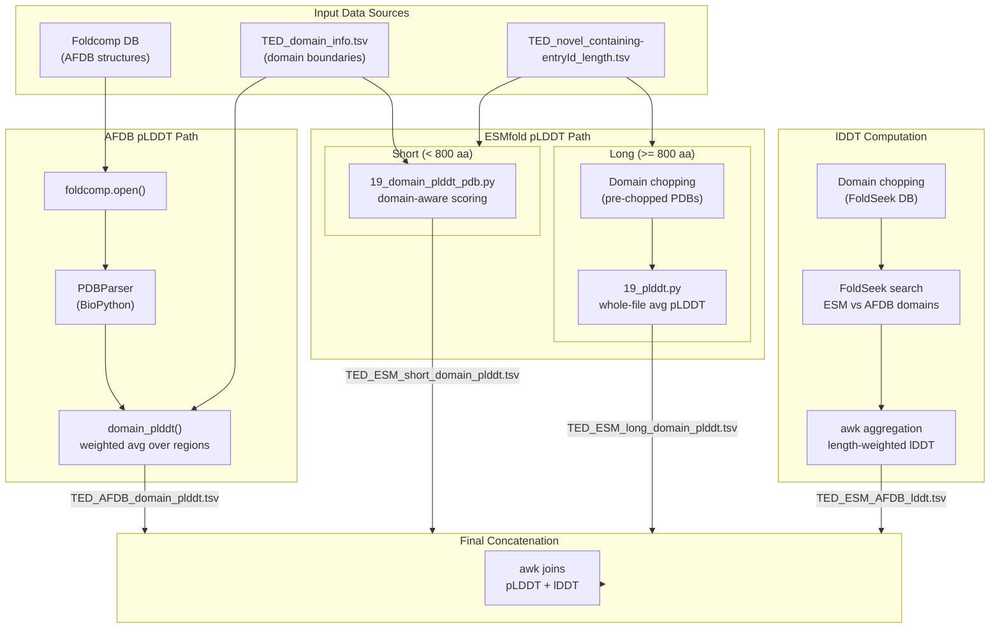

This page documents the scoring subsystem that evaluates structural confidence of TED-annotated novel domains by computing per-domain **pLDDT** (predicted local distance difference test) from both AlphaFoldDB (via foldcomp) and ESMfold predictions, followed by cross-model **lDDT** validation through FoldSeek structural alignment. The pipeline distinguishes between short (< 800 residues) and long proteins, applying different extraction and scoring strategies to each category, ultimately producing a unified table of per-domain quality metrics used for downstream novel fold validation.

Sources: [comparison_command](prediction/TED_novel_domains/comparison_command#L1-L44), [prediction_command](prediction/TED_novel_domains/prediction_command#L1-L30)

## Pipeline Architecture Overview

The foldcomp-based domain scoring system operates across three orthogonal quality dimensions — AFDB pLDDT, ESMfold pLDDT, and structural lDDT — each computed through a dedicated data path that converges on a single per-domain output table. The architecture enforces a clear separation between structure retrieval (foldcomp or PDB), domain-region extraction (boundary-aware slicing), and metric aggregation (length-weighted averaging).

Sources: [19_domain_plddt_foldcomp.py](prediction/TED_novel_domains/19_domain_plddt_foldcomp.py#L1-L77), [19_domain_plddt_pdb.py](prediction/TED_novel_domains/19_domain_plddt_pdb.py#L1-L35), [19_plddt.py](prediction/TED_novel_domains/19_plddt.py#L1-L48), [comparison_command](prediction/TED_novel_domains/comparison_command#L1-L44)

## Input Data and Domain Boundary Format

The scoring pipeline consumes two primary input files. The **domain boundary table** (`TED_domain_info.tsv`) contains 7,416 entries, each mapping an AFDB entry identifier to one or more comma-delimited domain region specifications. Each region is encoded as a triple: `start, end, domainID`, where start and end are 1-indexed residue positions. A single entry may contain multiple domain regions, for example `AF-C5NV13-F1-model_v4` carries two TED02 domains at residues 404–460 and 496–529.

The **length index** (`TED_novel_containing-entryId_length.tsv`) pairs each entry with its full protein length, establishing the short/long classification boundary at 800 residues. This threshold drives the branching logic: short proteins are scored via domain-aware pLDDT extraction, while long proteins are pre-chopped into individual domain sequences before prediction and scored with whole-file pLDDT averaging.

Sources: [TED_domain_info.tsv](prediction/TED_novel_domains/TED_domain_info.tsv#L1-L20), [TED_novel_containing-entryId_length.tsv](prediction/TED_novel_domains/TED_novel_containing-entryId_length.tsv#L1-L20)

## AFDB Domain pLDDT via Foldcomp

The foldcomp-based scorer (`19_domain_plddt_foldcomp.py`) avoids filesystem-level PDB extraction by streaming structures directly from the compressed foldcomp database. This approach eliminates disk I/O overhead when scoring thousands of AFDB structures, making it the preferred method for the reference model's confidence assessment.

The script accepts three positional arguments: the foldcomp database path, the domain boundary table, and the output file path. On execution, it opens the foldcomp database via the Python foldcomp API (`foldcomp.open()`), iterates through each entry, decompresses the structure into a PDB string, and feeds it into BioPython's `PDBParser` through an in-memory `StringIO` buffer. The `domain_plddt()` function then parses the comma-delimited boundary string, iterates over regions in steps of three (start, end, domainID), and computes a **length-weighted average** pLDDT by multiplying each region's average B-factor (which encodes pLDDT in AlphaFold PDB files) by its residue count, then dividing the sum by the total domain length.

The B-factor extraction is delegated to an external module `avg_bfactor` (imported as `calculate_avg_bfactor_from_parser`), which reads per-atom B-factors from the parsed structure object for a given chain and residue range. The final output is a two-column TSV containing `entry` and `domain_plddt`, rounded to two decimal places.

> [!TIP]
> The foldcomp scorer uses a **right join** (`how="right"`) when merging the pLDDT results back with the domain table, meaning only entries with successfully computed pLDDT values appear in the output. Entries that exist in the domain table but not in the foldcomp DB are silently dropped — a design choice that assumes complete AFDB coverage for the TED novel domain set.

Sources: [19_domain_plddt_foldcomp.py](prediction/TED_novel_domains/19_domain_plddt_foldcomp.py#L1-L77)

## ESMfold Domain pLDDT (File-Based)

For ESMfold-predicted structures stored as individual PDB files on disk, a complementary scorer (`19_domain_plddt_pdb.py`) applies the same length-weighted averaging logic but reads structures directly from the filesystem. This script is used exclusively for **short proteins** (< 800 residues) where ESMfold predictions are stored as whole-protein PDB files.

The scoring function `domain_plddt()` is applied as a row-wise operation via `pandas.DataFrame.apply()`. For each row, it constructs the PDB file path by concatenating the directory argument with the entry identifier and `.pdb` extension, then delegates B-factor computation to `calculate_avg_bfactor()` from the `avg_bfactor` module. The function signature differs slightly from the foldcomp variant — it accepts a directory path rather than a foldcomp DB handle — but the mathematical aggregation is identical: sum of (region_avg_plddt × region_length) divided by total domain length.

For **long proteins** (≥ 800 residues), the pipeline takes a fundamentally different approach. Long proteins are pre-chopped into individual domain-level FASTA sequences (using a separate chopping script referenced in `prediction_command`), predicted independently by ESMfold, and scored using `19_plddt.py` — a simpler script that computes the average pLDDT across all ATOM records in a PDB file without any domain boundary awareness, since each PDB file already represents a single domain.

| Script | Input Format | Domain Awareness | Use Case |
|--------|-------------|-----------------|----------|
| `19_domain_plddt_foldcomp.py` | foldcomp DB | ✓ (boundary table) | AFDB reference structures |
| `19_domain_plddt_pdb.py` | PDB directory | ✓ (boundary table) | ESMfold short proteins (< 800 aa) |
| `19_plddt.py` | PDB directory | ✗ (whole file) | ESMfold long pre-chopped domains |

Sources: [19_domain_plddt_pdb.py](prediction/TED_novel_domains/19_domain_plddt_pdb.py#L1-L35), [19_plddt.py](prediction/TED_novel_domains/19_plddt.py#L1-L48), [comparison_command](prediction/TED_novel_domains/comparison_command#L11-L17)

## ESMfold Prediction and Length-Aware Batching

The ESMfold prediction step ([`esmfold_bulk_argv_size_constraint.py`](prediction/TED_novel_domains/esmfold_bulk_argv_size_constraint.py)) uses Facebook's ESMFold v1 model to generate structure predictions with per-residue pLDDT confidence scores encoded as B-factors in the output PDB files. The script implements length-constrained batching to manage GPU memory, accepting `min_len` and `max_len` parameters that filter sequences before prediction.

The prediction workflow is executed in multiple SLURM jobs with overlapping index ranges to handle retries and incomplete batches. Short sequences (0–800 residues) are predicted with a chunk size of 32, while long sequences (801–4000 residues) use chunk size 8 and are processed in smaller batches. The `convert_outputs_to_pdb()` function converts ESMFold's tensor outputs into PDB format using the `openfold_utils` protein module, explicitly mapping the `plddt` output tensor to the B-factor field — this is the mechanism by which pLDDT scores become accessible to downstream scoring scripts.

> [!TIP]
> The ESM prediction command file reveals a critical length threshold at 800 residues that splits the entire pipeline: short proteins are predicted whole and scored with domain-aware extraction, while long proteins are domain-chopped *before* prediction and scored with whole-file averaging. This design avoids GPU memory overflow on long sequences while ensuring that domain-level pLDDT is still captured accurately.

Sources: [esmfold_bulk_argv_size_constraint.py](prediction/TED_novel_domains/esmfold_bulk_argv_size_constraint.py#L1-L111), [prediction_command](prediction/TED_novel_domains/prediction_command#L1-L30)

## pLDDT Result Concatenation and Merging

The comparison orchestration script ([`comparison_command`](prediction/TED_novel_domains/comparison_command)) defines the complete data-flow for merging pLDDT scores from all sources into a unified table. The process follows four stages executed through `awk`-based transformations.

First, the ESM short-domain results are filtered from the full domain table using an awk join that matches entries with length < 800 from the length index file. Second, the ESM long-domain results are reformatted to normalize entry identifiers — long domain PDB filenames follow a different naming convention (entry plus domain suffix), so an awk `split()` operation extracts the base entry identifier. Third, the short and long ESM results are concatenated. Finally, the AFDB pLDDT table is joined with the ESM pLDDT table on the entry identifier to produce `TED_AFDB_ESM_domain_plddt-entryId_AFDBavgPlddt_ESMavgPlddt.tsv`, a three-column table containing entry ID, AFDB average pLDDT, and ESM average pLDDT.

An important normalization occurs during the ESM long-domain concatenation: the pLDDT values are multiplied by 100 (line 17 of `comparison_command`), suggesting that `19_plddt.py` outputs pLDDT on a 0–1 scale while the domain-aware scripts output on a 0–100 scale. This scale alignment is essential before the AFDB–ESM join.

Sources: [comparison_command](prediction/TED_novel_domains/comparison_command#L1-L19)

## lDDT Computation via FoldSeek Structural Search

Beyond per-model pLDDT, the pipeline computes **local Distance Difference Test (lDDT)** scores between ESMfold-predicted domains and AFDB domain structures using FoldSeek's structural alignment engine. This cross-model comparison provides an orthogonal quality metric that captures how well ESMfold reproduces the domain-level structure observed in AlphaFold's predictions.

The lDDT computation requires both ESM and AFDB domain structures in FoldSeek database format. The makefile scripts handle domain chopping at the database level: `19_makefile_TED.sh` processes AFDB-format structures, `19_makefile_TED_s2e.sh` processes ESM short proteins with AFDB-style naming, and `19_makefile_s2e.sh` processes ESM structures with their native naming convention. All three scripts follow an identical pattern — they convert the input FoldSeek/foldcomp database to FASTA (amino acid sequence, 3Di sequence, and C-alpha coordinates), call a Python domain-chopping script to slice FASTA records according to domain boundaries, then convert the chopped TSV files back into FoldSeek databases using `tsv2db` and `compressca`.

After database construction, the pipeline concatenates ESM short and long domain databases into a unified ESM domain database, creates a subset of the AFDB foldseek database containing only TED novel domain entries using `createsubdb`, and runs an exhaustive FoldSeek search (`--alignment-type 1 --exhaustive-search 1`) of ESM domains against AFDB domains. The resulting alignment scores are converted to TSV format, and an awk aggregation computes per-entry length-weighted lDDT by summing `lddt × alignment_length` across all domain-level alignments and dividing by total aligned length.

Sources: [19_makefile_TED.sh](prediction/TED_novel_domains/19_makefile_TED.sh#L1-L88), [19_makefile_TED_s2e.sh](prediction/TED_novel_domains/19_makefile_TED_s2e.sh#L1-L89), [19_makefile_s2e.sh](prediction/TED_novel_domains/19_makefile_s2e.sh#L1-L89), [comparison_command](prediction/TED_novel_domains/comparison_command#L21-L44)

## FoldSeek Makefile Pipeline Details

The three makefile scripts implement a five-phase database transformation pipeline, each phase timed with wall-clock measurement. Despite operating on different input sources and chopping scripts, the core structure is invariant across all three variants.

**Phase 1 — Sequence extraction** (`convert2fasta`): The amino acid sequence is extracted from the input FoldSeek database. For 3Di sequence extraction, a soft link (`lndb`) is first created from the header database to the 3Di header, enabling `convert2fasta` to access the 3Di data stored in the `_ss` suffix database.

**Phase 2 — C-alpha coordinate handling** (`compressca`): C-alpha coordinates require special treatment because they are stored in compressed format. The pipeline first decompresses them to float64 precision (`--coord-store-mode 3`), creates a temporary header link, converts to FASTA, then cleans up the temporary databases. The final output C-alpha database is recompressed with `--coord-store-mode 2` (float16) for storage efficiency.

**Phase 3 — Domain chopping** (Python script): A domain-chopping Python script (referenced as `19_chop_domain_TED.py`, `19_chop_domain_TED_s2e.py`, or `19_chop_domain_s2e.py` depending on the variant) slices the FASTA records into domain-level entries. This script is not present in the current repository — it was likely maintained in a separate `jupyter/` directory on the execution environment.

**Phase 4 — TSV-to-database conversion** (`tsv2db`): The chopped TSV files are converted back into FoldSeek databases with appropriate type codes — `--output-dbtype 0` for sequence data, `--output-dbtype 12` for coordinate data. Four database components are generated: the base sequence DB, the 3Di sequence DB (`_ss`), the header DB (`_h`), and the C-alpha coordinate DB (`_ca`).

**Phase 5 — C-alpha recompression**: The C-alpha database is recompressed from float64 to float16 to reduce storage footprint while maintaining sufficient coordinate precision for structural search.

| Phase | FoldSeek Operation | Input | Output |
|-------|-------------------|-------|--------|
| Sequence extraction | `convert2fasta` | `{base}` | `{prefix}.fasta` |
| 3Di extraction | `lndb` + `convert2fasta` | `{base}_ss` | `{prefix}_ss.fasta` |
| C-alpha extraction | `compressca` (mode 3) + `convert2fasta` | `{base}` | `{prefix}_ca.fasta` |
| Domain chopping | Python script | FASTA files | TSV files |
| DB reconstruction | `tsv2db` | TSV files | FoldSeek DB set |
| C-alpha compression | `compressca` (mode 2) | `{output}_ca` | `{output}_ca` (f16) |

Sources: [19_makefile_TED.sh](prediction/TED_novel_domains/19_makefile_TED.sh#L30-L87), [19_makefile_TED_s2e.sh](prediction/TED_novel_domains/19_makefile_TED_s2e.sh#L30-L87), [19_makefile_s2e.sh](prediction/TED_novel_domains/19_makefile_s2e.sh#L30-L87)

## Final Output and Visualization

The final concatenation step in `comparison_command` (line 44) joins the lDDT scores with the pLDDT table, producing `TED_AFDB_ESM_domain-entryId_AFDBavgPlddt_ESMavgPlddt_lddt.tsv` — a four-column table with columns `entryId`, `AFDBavgPlddt`, `ESMavgPlddt`, and `lddt`. This table serves as the primary input for quality assessment and is visualized in the [`AFDB_ESM_complete.ipynb`](prediction/TED_novel_domains/AFDB_ESM_complete.ipynb) notebook.

The visualization notebook produces three key diagnostic plots. First, a joint scatter plot with marginal histograms compares AFDB pLDDT against ESM pLDDT across all domains, revealing the correlation (or lack thereof) between the two predictors' confidence estimates. Second, a scatter plot of ESM pLDDT versus lDDT isolates cases where ESMfold's self-assessed confidence disagrees with the actual structural agreement against AFDB. Third, a parallel scatter plot of AFDB pLDDT versus lDDT identifies cases where the AlphaFold reference itself may be uncertain. The notebook also uses KDE (kernel density estimation) contour plots to highlight density concentrations in these metric spaces, with entries having lDDT > 0 filtered for the ESM-vs-lDDT analysis to focus on structurally resolved domains.

The underlying data pattern visible in the notebook's sample output is telling: many entries show high AFDB pLDDT (> 84) alongside low ESM pLDDT (24–49) and zero lDDT, suggesting that ESMfold fails to recapitulate a substantial fraction of the novel domain structures that AlphaFold predicts with high confidence.

Sources: [AFDB_ESM_complete.ipynb](prediction/TED_novel_domains/AFDB_ESM_complete.ipynb#L89-L96), [comparison_command](prediction/TED_novel_domains/comparison_command#L44)

## Next Steps

Having understood how domain-level quality metrics are computed and aggregated, the following pages provide complementary context on the broader analysis framework:

- **[pLDDT Quality Assessment Pipeline](14-plddt-quality-assessment-pipeline)** — documents the upstream pLDDT filtering and threshold logic that determines which domains are considered reliable before novel fold validation
- **[ColabFold Re-prediction Workflow](15-colabfold-re-prediction-workflow)** — covers the ColabFold-based re-prediction path for domains where both AFDB and ESMfold show low confidence
- **[Structure Chopping and PDB Extraction](6-structure-chopping-and-pdb-extraction)** — explains the domain boundary extraction methodology that produces the `TED_domain_info.tsv` input consumed by this scoring pipeline