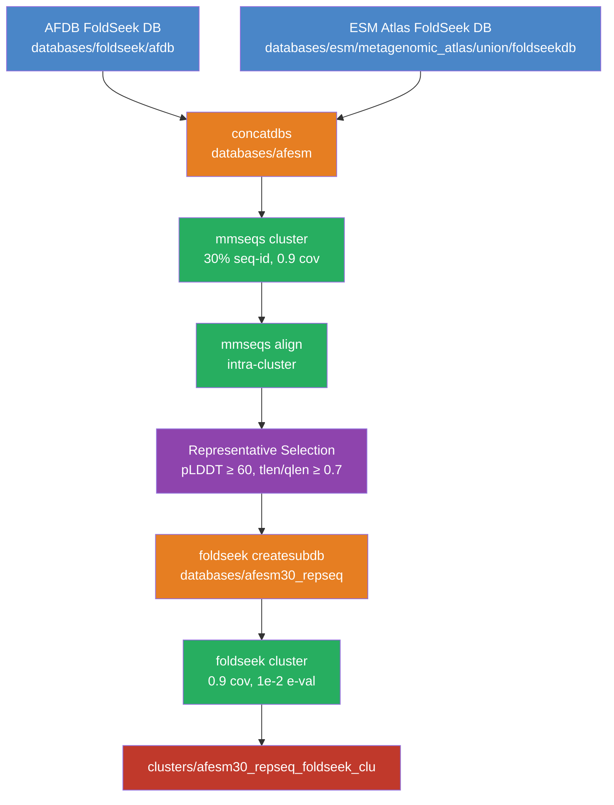
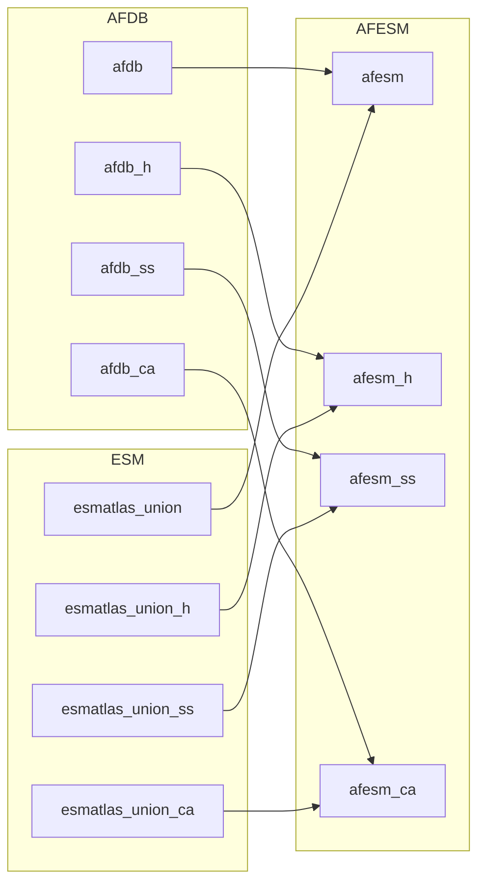

This page documents the two-stage clustering pipeline that underpins the AFESM (AlphaFold DB + ESMFold) metagenomic structure analysis. The strategy concatenates two massive protein structure databases, reduces redundancy through sequence-level clustering, selects quality-aware representatives, and finally clusters by 3D structure. This hierarchical approach is essential for making the combined ~215 million protein dataset tractable for downstream novel fold discovery and multidomain protein analysis.

## Pipeline Architecture Overview

The clustering concatenation pipeline is defined entirely within a single bash script at [concate_clustering/concatenation](concate_clustering/concatenation) and executes as a sequence of five interconnected stages. Each stage feeds its output directly into the next, forming a linear dependency chain from raw database merger to structure-level cluster assignments.

The pipeline operates on a deliberate **sequence-then-structure** hierarchy: redundancy is first collapsed at the sequence level using MMseqs2, quality-filtered representatives are extracted, and only then are those representatives clustered by 3D structural similarity via FoldSeek. This design choice dramatically reduces the computational cost of the expensive structure comparison step.

Sources: [concatenation](concate_clustering/concatenation#L1-L126)

## Stage 1: Database Concatenation

The first function, `concate_afdb_esm_with_fragments`, merges the AlphaFold DB and ESM Atlas into a unified FoldSeek-compatible database called `afesm`. This is not a simple file join — FoldSeek databases consist of multiple companion files (index, structural summaries, and torsion-angle encodings), and each must be concatenated independently to maintain database integrity.

The function concatenates four distinct file suffix types, each encoding different structural representations required by FoldSeek downstream:

| Suffix | Content | Purpose |
|--------|---------|---------|
| (none) | Sequence data + lookup index | Primary database for sequence operations |
| `_h` | Header/index mapping | Maps sequence identifiers to internal keys |
| `_ss` | Secondary structure | 3Di/structural alphabet encoding |
| `_ca` | C-alpha coordinates | Backbone structural information |

The source paths reveal that the ESM database was pre-assembled from the metagenomic atlas union (`databases/esm/metagenomic_atlas/union/foldseekdb/esmatlas_union`), while the AFDB comes from the standard FoldSeek pre-formatted release at `/databases/foldseek/afdb`. Both are concatenated using `foldseek concatdbs`, which handles internal index remapping automatically.

Sources: [concatenation](concate_clustering/concatenation#L4-L23)

## Stage 2: Sequence-Level Clustering

Once the unified `afesm` database exists, the `seq_cluster_afesm` function performs greedy set cover clustering at 30% sequence identity using MMseqs2. This stage reduces the ~215 million protein dataset into a manageable number of representative clusters (~186.6 million clusters were produced, based on the downstream statistics).

The clustering parameters are carefully chosen for the novel fold discovery use case:

| Parameter | Value | Rationale |
|-----------|-------|-----------|
| `--min-seq-id` | 0.3 | Retains sequences that share at most 30% identity — preserves structural diversity while collapsing near-identical redundancy |
| `--cov-mode` | 1 | Query coverage mode — ensures the representative covers at least the specified fraction of the query |
| `-c` | 0.9 | 90% bidirectional coverage requirement — prevents partial domain matches from collapsing distinct proteins |

The job is submitted via SLURM with 64 cores and a 14-day time limit on a specific compute node (`super001`), reflecting the massive scale of the input. The scratch directory is mounted at `/mnt/scratch/` for temporary file storage during the memory-intensive clustering process.

Sources: [concatenation](concate_clustering/concatenation#L30-L39)

## Stage 3: Intra-Cluster Alignment

The `alignment_afesm_seq_cluster` function computes all-vs-all alignments *within* each sequence cluster (not across clusters). This produces the data needed for intelligent representative selection — rather than relying on MMseqs2's default representative (which picks the longest sequence), the pipeline re-ranks cluster members by structural prediction quality.

The alignment uses `mmseqs align` with `-e inf` (no e-value filtering) and `-a` (output all alignments), then converts results to a human-readable tabular format containing seven columns: `query`, `target`, `qcov`, `tcov`, `qlen`, `tlen`, `alnlen`. This conversion via `mmseqs convertalis` is critical — the raw binary alignment output cannot be processed by the downstream `awk`-based selection logic.

A separate job is launched on `super003` with 128 cores, reflecting that intra-cluster alignment across ~186 million clusters is itself a substantial computation even though each cluster is small.

Sources: [concatenation](concate_clustering/concatenation#L44-L53)

## Stage 4: Quality-Aware Representative Selection

This is the most nuanced stage of the pipeline and is implemented as inline `awk` scripts rather than a function — it represents the core intellectual contribution of the concatenation strategy. The default MMseqs2 cluster representative is simply the longest sequence, but for structure prediction databases, **prediction confidence** matters more than length. The pipeline therefore re-selects representatives using pLDDT scores (AlphaFold/ESMFold per-residue confidence) as the primary criterion.

The selection process operates in three steps. First, pLDDT scores from a pre-computed metadata file (`metadata/concat-entryId_plddt.tsv`) are joined into the alignment table by matching the target sequence identifier. Second, within each cluster, the member with the highest pLDDT among those meeting coverage thresholds is selected. Third, the alteration rate is computed to quantify how often the pLDDT-based selection differs from MMseqs2's default:

| Selection Criterion | Threshold | Output File |
|---------------------|-----------|-------------|
| Query coverage ≥ 0.9, max pLDDT | qcov ≥ 0.9 | `afesm30-repid_picked_qcov_plddt.tsv` |
| Length ratio ≥ 0.7, pLDDT ≥ 60 | tlen/qlen ≥ 0.7 AND plddt ≥ 60 | `afesm30_tlen70-repid_picked_tlen2qlen_plddt.tsv` |

The final representative set uses the stricter criterion (length ratio ≥ 0.7 AND pLDDT ≥ 60), which guards against selecting short, high-confidence fragments that do not represent the full protein. The reported alteration rate from the qcov-only strategy was **3.83%** (7,143,059 out of 186,567,771 clusters changed representative), demonstrating that MMseqs2's longest-sequence heuristic is reasonable in most cases — but the 3.83% that are altered disproportionately affect downstream novel fold analysis, as those are precisely the cases where a shorter but higher-confidence structure exists.

> [!TIP]
> The two-stage filtering (first qcov ≥ 0.9 for the alteration audit, then tlen/qlen ≥ 0.7 + pLDDT ≥ 60 for the final set) serves different purposes. The first measures *how much* the quality-based strategy diverges from default behavior. The second is the *production* filter applied before the expensive structure clustering step. Never skip the length-ratio check — without it, you risk promoting N-terminal or C-terminal fragments with artificially inflated local pLDDT scores.

Sources: [concatenation](concate_clustering/concatenation#L58-L100)

## Stage 5: Structure-Level Clustering of Representatives

The final function, `struct_cluster_afesm`, takes the quality-filtered representative subset and clusters it by 3D structural similarity using FoldSeek. This is where the hierarchical strategy pays off: instead of clustering ~215 million full-length structures (computationally infeasible), only the reduced representative set is subjected to the expensive 3Di/torsion-angle comparison.

The FoldSeek structure clustering parameters are notably stricter than the sequence-level stage:

| Parameter | Value | Sequence Cluster (Stage 2) | Significance |
|-----------|-------|---------------------------|--------------|
| `-c` (coverage) | 0.9 | 0.9 | Same coverage threshold ensures structural domain-level matching |
| `-e` (e-value) | 0.01 | (not used) | Statistical significance filter specific to structural alignment scores |

The job runs on `super003` with 128 cores and a 60-day time limit — the extended walltime reflects the structural comparison cost even on the reduced dataset. The output `clusters/afesm30_repseq_foldseek_clu` becomes the definitive cluster assignment file consumed by all downstream analyses.

Sources: [concatenation](concate_clustering/concatenation#L113-L126)

## Downstream Consumption

The cluster assignments produced by this pipeline feed into two major analysis tracks within the repository. Understanding these consumers clarifies why the pipeline's quality-aware representative selection matters.

### Novel Fold Discovery

The structure-level clusters are consumed by scripts in [novel_fold_analyses/](novel_fold_analyses/) that identify clusters with no match to known CATH/TED domains. The key scripts include [parse_final_search.py](novel_fold_analyses/parse_final_search.py#L1-L76), which filters structural alignments using TM-score > 0.5 or RMSD < 3.0 combined with CIGAR-based query coverage ≥ 0.6, and [parse_final_clusters_MGY_only.py](novel_fold_analyses/parse_final_clusters_MGY_only.py#L1-L47), which filters clusters to retain only those whose entire membership consists of metagenomic entries (prefixed `MGYP`). The quality-aware representative selection directly impacts these analyses: a cluster represented by a low-confidence structure might be falsely classified as a novel fold simply because the representative could not be confidently aligned to any known domain.

### Multidomain Protein Analysis

The [multidomain_analysis/extract_novel_combination/](multidomain_analysis/extract_novel_combination/) pipeline processes domain annotation data from both AFDB and ESM sources. Scripts like [0_extract_fields_AF.sh](multidomain_analysis/extract_novel_combination/0_extract_fields_AF.sh#L1-L25) and [0_extract_fields_ESM.sh](multidomain_analysis/extract_novel_combination/0_extract_fields_ESM.sh#L1-L19) extract CATH domain assignments and pLDDT scores, which are then concatenated per protein by [1_concatCATH.sh](multidomain_analysis/extract_novel_combination/1_concatCATH.sh#L1-L53). The clustering strategy ensures that when novel domain combinations are identified, redundant copies from the same sequence cluster are not double-counted.

Sources: [parse_final_search.py](novel_fold_analyses/parse_final_search.py#L1-L76), [parse_final_clusters_MGY_only.py](novel_fold_analyses/parse_final_clusters_MGY_only.py#L1-L47), [0_extract_fields_AF.sh](multidomain_analysis/extract_novel_combination/0_extract_fields_AF.sh#L1-L25), [0_extract_fields_ESM.sh](multidomain_analysis/extract_novel_combination/0_extract_fields_ESM.sh#L1-L19), [1_concatCATH.sh](multidomain_analysis/extract_novel_combination/1_concatCATH.sh#L1-L53)

## Key Design Decisions Summary

| Decision | Alternative | Why This Choice |
|----------|-------------|-----------------|
| Hierarchical seq→struct clustering | Single-pass structure clustering | Reduces 215M → representative set before expensive 3D comparison |
| 30% sequence identity threshold | 20% or 40% | Balances redundancy removal with structural diversity preservation |
| pLDDT-based representative selection | Longest-sequence default | Prediction confidence is more informative than length for structure analysis |
| Dual coverage criteria (qcov + tlen/qlen) | Single coverage metric | Guards against fragment-promotion artifacts |
| MMseqs2 for sequences, FoldSeek for structures | Single tool for both | Each tool is optimized for its respective modality |

> [!TIP]
> The entire pipeline is defined as bash functions within a single sourced file rather than a Makefile or workflow manager. To execute it, you must source the file first (`source concatenation`) and then call individual functions by name. The functions are designed to be run sequentially and depend on each other's outputs — do not skip stages or run them in parallel.

Sources: [concatenation](concate_clustering/concatenation#L1-L126)

## Next Steps

- Continue to [Reproducible Visualization Notebooks](18-reproducible-visualization-notebooks) to see how the clustering results are visualized in the paper's figures.
- Return to [Pipeline Architecture](4-pipeline-architecture) for the full end-to-end pipeline context.
- Explore [Domain Filtering and Consensus](5-domain-filtering-and-consensus) to understand how domain-level quality filtering refines the clustered representatives further.
- See [Novel Fold Validation via Alignment Filtering](7-novel-fold-validation-via-alignment-filtering) for the alignment filtering logic that determines which clusters represent truly novel folds.